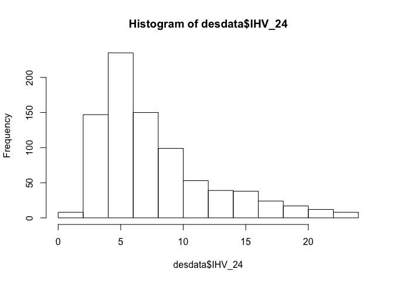
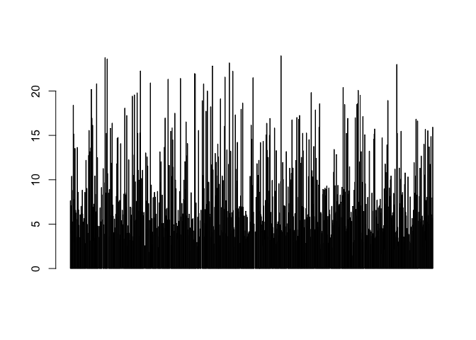
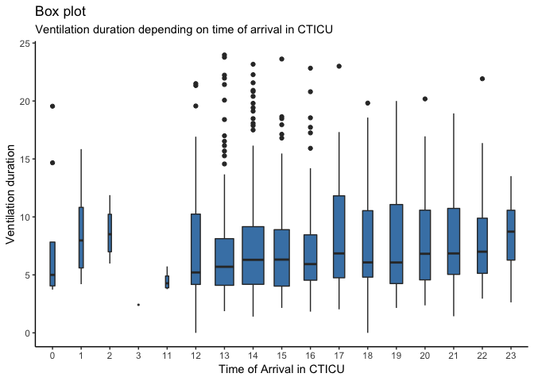
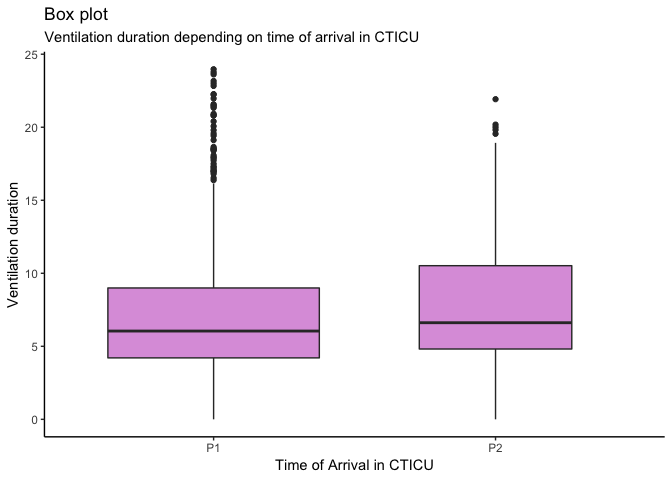
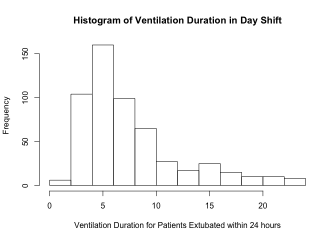
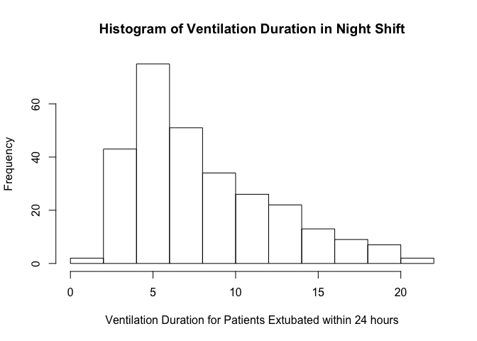
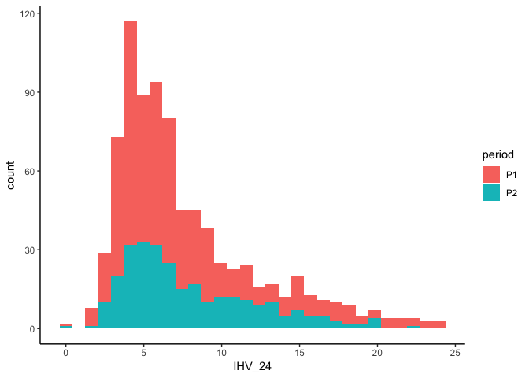
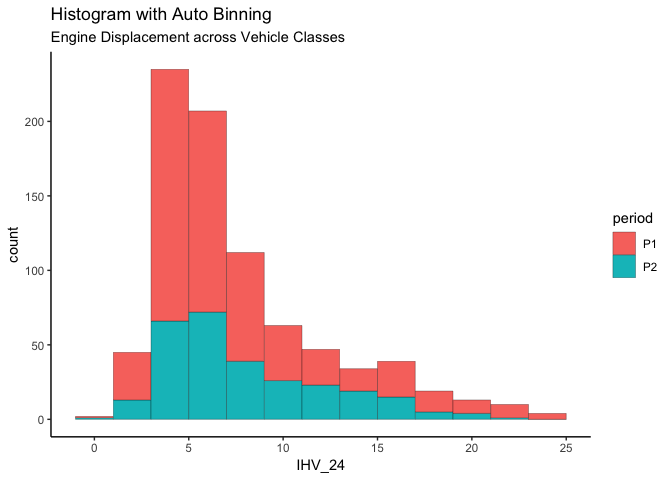
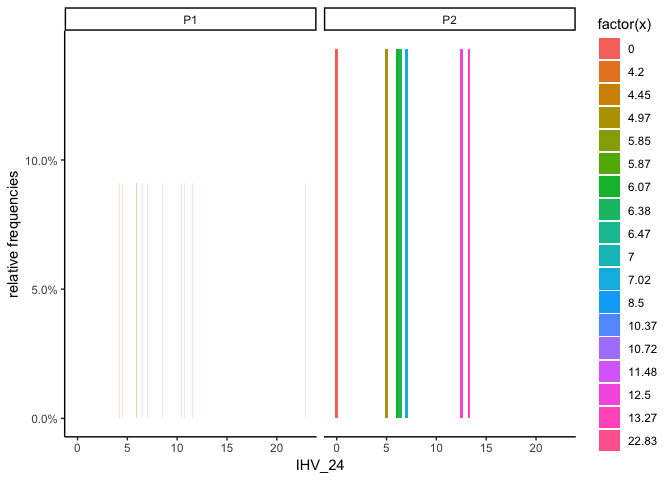

Descriptive
================
Mingxu Shan
3/10/2019

``` r
library(tidyverse)
```

    ## ── Attaching packages ─────────────────────────────────────── tidyverse 1.2.1 ──

    ## ✔ ggplot2 3.0.0     ✔ purrr   0.2.5
    ## ✔ tibble  1.4.2     ✔ dplyr   0.7.6
    ## ✔ tidyr   0.8.1     ✔ stringr 1.3.1
    ## ✔ readr   1.1.1     ✔ forcats 0.3.0

    ## ── Conflicts ────────────────────────────────────────── tidyverse_conflicts() ──
    ## ✖ dplyr::filter() masks stats::filter()
    ## ✖ dplyr::lag()    masks stats::lag()

``` r
library(readxl)
```

``` r
olddata <- read_excel("data/Master worksheet CTICU extubation times .xls", 
    sheet = "Master data", col_types = c("numeric", 
        "numeric", "text", "date", "date", 
        "date", "date", "text", "text", "numeric", 
        "numeric", "numeric", "numeric", 
        "text", "text", "text", "text", "text", 
        "text", "text", "text", "numeric", 
        "numeric", "numeric", "text", "text", 
        "text", "text", "text", "text", "text", 
        "text", "text", "text", "text", "text", 
        "numeric", "text", "numeric", "text", 
        "numeric", "numeric", "text", "text", 
        "text", "text", "date", "date", 
        "date", "date", "date", 
        "text", "numeric", "text", "numeric", 
        "numeric", "text", "numeric", "text", 
        "text", "numeric", "numeric", "text", 
        "text", "text", "text", "text", "numeric", 
        "numeric", "numeric", "numeric", 
        "numeric", "numeric", "numeric"))
```

    ## Warning in read_fun(path = path, sheet_i = sheet, limits = limits, shim =
    ## shim, : Coercing text to numeric in A2 / R2C1: '2.81'

    ## Warning in read_fun(path = path, sheet_i = sheet, limits = limits, shim =
    ## shim, : Coercing text to numeric in B2 / R2C2: '6284777'

    ## Warning in read_fun(path = path, sheet_i = sheet, limits = limits, shim =
    ## shim, : Coercing text to numeric in A3 / R3C1: '2.81'

    ## Warning in read_fun(path = path, sheet_i = sheet, limits = limits, shim =
    ## shim, : Coercing text to numeric in B3 / R3C2: '7886792'

    ## Warning in read_fun(path = path, sheet_i = sheet, limits = limits, shim =
    ## shim, : Coercing text to numeric in A4 / R4C1: '2.81'

    ## Warning in read_fun(path = path, sheet_i = sheet, limits = limits, shim =
    ## shim, : Coercing text to numeric in B4 / R4C2: '3597233'

    ## Warning in read_fun(path = path, sheet_i = sheet, limits = limits, shim =
    ## shim, : Coercing text to numeric in A5 / R5C1: '2.81'

    ## Warning in read_fun(path = path, sheet_i = sheet, limits = limits, shim =
    ## shim, : Coercing text to numeric in B5 / R5C2: '7942887'

    ## Warning in read_fun(path = path, sheet_i = sheet, limits = limits, shim =
    ## shim, : Coercing text to numeric in A6 / R6C1: '2.81'

    ## Warning in read_fun(path = path, sheet_i = sheet, limits = limits, shim =
    ## shim, : Coercing text to numeric in B6 / R6C2: '7860432'

    ## Warning in read_fun(path = path, sheet_i = sheet, limits = limits, shim =
    ## shim, : Coercing text to numeric in A7 / R7C1: '2.9'

    ## Warning in read_fun(path = path, sheet_i = sheet, limits = limits, shim =
    ## shim, : Coercing text to numeric in B7 / R7C2: '8033418'

    ## Warning in read_fun(path = path, sheet_i = sheet, limits = limits, shim =
    ## shim, : Coercing text to numeric in A8 / R8C1: '2.81'

    ## Warning in read_fun(path = path, sheet_i = sheet, limits = limits, shim =
    ## shim, : Coercing text to numeric in B8 / R8C2: '5216161'

    ## Warning in read_fun(path = path, sheet_i = sheet, limits = limits, shim =
    ## shim, : Coercing text to numeric in A9 / R9C1: '2.9'

    ## Warning in read_fun(path = path, sheet_i = sheet, limits = limits, shim =
    ## shim, : Coercing text to numeric in B9 / R9C2: '8403973'

    ## Warning in read_fun(path = path, sheet_i = sheet, limits = limits, shim =
    ## shim, : Coercing text to numeric in A10 / R10C1: '2.81'

    ## Warning in read_fun(path = path, sheet_i = sheet, limits = limits, shim =
    ## shim, : Coercing text to numeric in B10 / R10C2: '3644377'

    ## Warning in read_fun(path = path, sheet_i = sheet, limits = limits, shim =
    ## shim, : Coercing text to numeric in A11 / R11C1: '2.81'

    ## Warning in read_fun(path = path, sheet_i = sheet, limits = limits, shim =
    ## shim, : Coercing text to numeric in B11 / R11C2: '6950443'

    ## Warning in read_fun(path = path, sheet_i = sheet, limits = limits, shim =
    ## shim, : Coercing text to numeric in A12 / R12C1: '2.9'

    ## Warning in read_fun(path = path, sheet_i = sheet, limits = limits, shim =
    ## shim, : Coercing text to numeric in B12 / R12C2: '8308691'

    ## Warning in read_fun(path = path, sheet_i = sheet, limits = limits, shim =
    ## shim, : Coercing text to numeric in A13 / R13C1: '2.9'

    ## Warning in read_fun(path = path, sheet_i = sheet, limits = limits, shim =
    ## shim, : Coercing text to numeric in B13 / R13C2: '8289708'

    ## Warning in read_fun(path = path, sheet_i = sheet, limits = limits, shim =
    ## shim, : Coercing text to numeric in A14 / R14C1: '2.81'

    ## Warning in read_fun(path = path, sheet_i = sheet, limits = limits, shim =
    ## shim, : Coercing text to numeric in B14 / R14C2: '7839675'

    ## Warning in read_fun(path = path, sheet_i = sheet, limits = limits, shim =
    ## shim, : Coercing text to numeric in A15 / R15C1: '2.81'

    ## Warning in read_fun(path = path, sheet_i = sheet, limits = limits, shim =
    ## shim, : Coercing text to numeric in B15 / R15C2: '6554948'

    ## Warning in read_fun(path = path, sheet_i = sheet, limits = limits, shim =
    ## shim, : Coercing text to numeric in A16 / R16C1: '2.81'

    ## Warning in read_fun(path = path, sheet_i = sheet, limits = limits, shim =
    ## shim, : Coercing text to numeric in B16 / R16C2: '7937686'

    ## Warning in read_fun(path = path, sheet_i = sheet, limits = limits, shim =
    ## shim, : Coercing text to numeric in A17 / R17C1: '2.81'

    ## Warning in read_fun(path = path, sheet_i = sheet, limits = limits, shim =
    ## shim, : Coercing text to numeric in B17 / R17C2: '7942493'

    ## Warning in read_fun(path = path, sheet_i = sheet, limits = limits, shim =
    ## shim, : Coercing text to numeric in A18 / R18C1: '2.81'

    ## Warning in read_fun(path = path, sheet_i = sheet, limits = limits, shim =
    ## shim, : Coercing text to numeric in B18 / R18C2: '7026425'

    ## Warning in read_fun(path = path, sheet_i = sheet, limits = limits, shim =
    ## shim, : Coercing text to numeric in A19 / R19C1: '2.9'

    ## Warning in read_fun(path = path, sheet_i = sheet, limits = limits, shim =
    ## shim, : Coercing text to numeric in B19 / R19C2: '8116948'

    ## Warning in read_fun(path = path, sheet_i = sheet, limits = limits, shim =
    ## shim, : Coercing text to numeric in A20 / R20C1: '2.9'

    ## Warning in read_fun(path = path, sheet_i = sheet, limits = limits, shim =
    ## shim, : Coercing text to numeric in B20 / R20C2: '8263006'

    ## Warning in read_fun(path = path, sheet_i = sheet, limits = limits, shim =
    ## shim, : Coercing text to numeric in A21 / R21C1: '2.9'

    ## Warning in read_fun(path = path, sheet_i = sheet, limits = limits, shim =
    ## shim, : Coercing text to numeric in B21 / R21C2: '8218449'

    ## Warning in read_fun(path = path, sheet_i = sheet, limits = limits, shim =
    ## shim, : Coercing text to numeric in A22 / R22C1: '2.9'

    ## Warning in read_fun(path = path, sheet_i = sheet, limits = limits, shim =
    ## shim, : Coercing text to numeric in B22 / R22C2: '8349079'

    ## Warning in read_fun(path = path, sheet_i = sheet, limits = limits, shim =
    ## shim, : Coercing text to numeric in A23 / R23C1: '2.81'

    ## Warning in read_fun(path = path, sheet_i = sheet, limits = limits, shim =
    ## shim, : Coercing text to numeric in B23 / R23C2: '7699214'

    ## Warning in read_fun(path = path, sheet_i = sheet, limits = limits, shim =
    ## shim, : Coercing text to numeric in A24 / R24C1: '2.81'

    ## Warning in read_fun(path = path, sheet_i = sheet, limits = limits, shim =
    ## shim, : Coercing text to numeric in B24 / R24C2: '7024280'

    ## Warning in read_fun(path = path, sheet_i = sheet, limits = limits, shim =
    ## shim, : Coercing text to numeric in A25 / R25C1: '2.81'

    ## Warning in read_fun(path = path, sheet_i = sheet, limits = limits, shim =
    ## shim, : Coercing text to numeric in B25 / R25C2: '7964155'

    ## Warning in read_fun(path = path, sheet_i = sheet, limits = limits, shim =
    ## shim, : Coercing text to numeric in A26 / R26C1: '2.81'

    ## Warning in read_fun(path = path, sheet_i = sheet, limits = limits, shim =
    ## shim, : Coercing text to numeric in B26 / R26C2: '6329770'

    ## Warning in read_fun(path = path, sheet_i = sheet, limits = limits, shim =
    ## shim, : Coercing text to numeric in A27 / R27C1: '2.9'

    ## Warning in read_fun(path = path, sheet_i = sheet, limits = limits, shim =
    ## shim, : Coercing text to numeric in B27 / R27C2: '8109248'

    ## Warning in read_fun(path = path, sheet_i = sheet, limits = limits, shim =
    ## shim, : Coercing text to numeric in A28 / R28C1: '2.9'

    ## Warning in read_fun(path = path, sheet_i = sheet, limits = limits, shim =
    ## shim, : Coercing text to numeric in B28 / R28C2: '4945163'

    ## Warning in read_fun(path = path, sheet_i = sheet, limits = limits, shim =
    ## shim, : Coercing text to numeric in A29 / R29C1: '2.9'

    ## Warning in read_fun(path = path, sheet_i = sheet, limits = limits, shim =
    ## shim, : Coercing text to numeric in B29 / R29C2: '5820155'

    ## Warning in read_fun(path = path, sheet_i = sheet, limits = limits, shim =
    ## shim, : Coercing text to numeric in A30 / R30C1: '2.9'

    ## Warning in read_fun(path = path, sheet_i = sheet, limits = limits, shim =
    ## shim, : Coercing text to numeric in B30 / R30C2: '8156914'

    ## Warning in read_fun(path = path, sheet_i = sheet, limits = limits, shim =
    ## shim, : Coercing text to numeric in A31 / R31C1: '2.9'

    ## Warning in read_fun(path = path, sheet_i = sheet, limits = limits, shim =
    ## shim, : Coercing text to numeric in B31 / R31C2: '6919216'

    ## Warning in read_fun(path = path, sheet_i = sheet, limits = limits, shim =
    ## shim, : Coercing text to numeric in A32 / R32C1: '2.81'

    ## Warning in read_fun(path = path, sheet_i = sheet, limits = limits, shim =
    ## shim, : Coercing text to numeric in B32 / R32C2: '3144923'

    ## Warning in read_fun(path = path, sheet_i = sheet, limits = limits, shim =
    ## shim, : Coercing text to numeric in A33 / R33C1: '2.81'

    ## Warning in read_fun(path = path, sheet_i = sheet, limits = limits, shim =
    ## shim, : Coercing text to numeric in B33 / R33C2: '5121604'

    ## Warning in read_fun(path = path, sheet_i = sheet, limits = limits, shim =
    ## shim, : Coercing text to numeric in A34 / R34C1: '2.81'

    ## Warning in read_fun(path = path, sheet_i = sheet, limits = limits, shim =
    ## shim, : Coercing text to numeric in B34 / R34C2: '8035806'

    ## Warning in read_fun(path = path, sheet_i = sheet, limits = limits, shim =
    ## shim, : Coercing text to numeric in A35 / R35C1: '2.9'

    ## Warning in read_fun(path = path, sheet_i = sheet, limits = limits, shim =
    ## shim, : Coercing text to numeric in B35 / R35C2: '7091189'

    ## Warning in read_fun(path = path, sheet_i = sheet, limits = limits, shim =
    ## shim, : Coercing text to numeric in A36 / R36C1: '2.9'

    ## Warning in read_fun(path = path, sheet_i = sheet, limits = limits, shim =
    ## shim, : Coercing text to numeric in B36 / R36C2: '4823697'

    ## Warning in read_fun(path = path, sheet_i = sheet, limits = limits, shim =
    ## shim, : Coercing text to numeric in A37 / R37C1: '2.9'

    ## Warning in read_fun(path = path, sheet_i = sheet, limits = limits, shim =
    ## shim, : Coercing text to numeric in B37 / R37C2: '8119856'

    ## Warning in read_fun(path = path, sheet_i = sheet, limits = limits, shim =
    ## shim, : Coercing text to numeric in A38 / R38C1: '2.9'

    ## Warning in read_fun(path = path, sheet_i = sheet, limits = limits, shim =
    ## shim, : Coercing text to numeric in B38 / R38C2: '5727778'

    ## Warning in read_fun(path = path, sheet_i = sheet, limits = limits, shim =
    ## shim, : Coercing text to numeric in A39 / R39C1: '2.9'

    ## Warning in read_fun(path = path, sheet_i = sheet, limits = limits, shim =
    ## shim, : Coercing text to numeric in B39 / R39C2: '2258536'

    ## Warning in read_fun(path = path, sheet_i = sheet, limits = limits, shim =
    ## shim, : Coercing text to numeric in A40 / R40C1: '2.81'

    ## Warning in read_fun(path = path, sheet_i = sheet, limits = limits, shim =
    ## shim, : Coercing text to numeric in B40 / R40C2: '7852534'

    ## Warning in read_fun(path = path, sheet_i = sheet, limits = limits, shim =
    ## shim, : Coercing text to numeric in A41 / R41C1: '2.9'

    ## Warning in read_fun(path = path, sheet_i = sheet, limits = limits, shim =
    ## shim, : Coercing text to numeric in B41 / R41C2: '6029716'

    ## Warning in read_fun(path = path, sheet_i = sheet, limits = limits, shim =
    ## shim, : Coercing text to numeric in A42 / R42C1: '2.81'

    ## Warning in read_fun(path = path, sheet_i = sheet, limits = limits, shim =
    ## shim, : Coercing text to numeric in B42 / R42C2: '7853798'

    ## Warning in read_fun(path = path, sheet_i = sheet, limits = limits, shim =
    ## shim, : Coercing text to numeric in A43 / R43C1: '2.81'

    ## Warning in read_fun(path = path, sheet_i = sheet, limits = limits, shim =
    ## shim, : Coercing text to numeric in B43 / R43C2: '7884906'

    ## Warning in read_fun(path = path, sheet_i = sheet, limits = limits, shim =
    ## shim, : Coercing text to numeric in A44 / R44C1: '2.81'

    ## Warning in read_fun(path = path, sheet_i = sheet, limits = limits, shim =
    ## shim, : Coercing text to numeric in B44 / R44C2: '8017206'

    ## Warning in read_fun(path = path, sheet_i = sheet, limits = limits, shim =
    ## shim, : Coercing text to numeric in A45 / R45C1: '2.9'

    ## Warning in read_fun(path = path, sheet_i = sheet, limits = limits, shim =
    ## shim, : Coercing text to numeric in B45 / R45C2: '7385488'

    ## Warning in read_fun(path = path, sheet_i = sheet, limits = limits, shim =
    ## shim, : Coercing text to numeric in A46 / R46C1: '2.81'

    ## Warning in read_fun(path = path, sheet_i = sheet, limits = limits, shim =
    ## shim, : Coercing text to numeric in B46 / R46C2: '6807160'

    ## Warning in read_fun(path = path, sheet_i = sheet, limits = limits, shim =
    ## shim, : Coercing text to numeric in A47 / R47C1: '2.81'

    ## Warning in read_fun(path = path, sheet_i = sheet, limits = limits, shim =
    ## shim, : Coercing text to numeric in B47 / R47C2: '5181502'

    ## Warning in read_fun(path = path, sheet_i = sheet, limits = limits, shim =
    ## shim, : Coercing text to numeric in A48 / R48C1: '2.81'

    ## Warning in read_fun(path = path, sheet_i = sheet, limits = limits, shim =
    ## shim, : Coercing text to numeric in B48 / R48C2: '7258848'

    ## Warning in read_fun(path = path, sheet_i = sheet, limits = limits, shim =
    ## shim, : Coercing text to numeric in A49 / R49C1: '2.81'

    ## Warning in read_fun(path = path, sheet_i = sheet, limits = limits, shim =
    ## shim, : Coercing text to numeric in B49 / R49C2: '7749909'

    ## Warning in read_fun(path = path, sheet_i = sheet, limits = limits, shim =
    ## shim, : Coercing text to numeric in A50 / R50C1: '2.9'

    ## Warning in read_fun(path = path, sheet_i = sheet, limits = limits, shim =
    ## shim, : Coercing text to numeric in B50 / R50C2: '4150411'

    ## Warning in read_fun(path = path, sheet_i = sheet, limits = limits, shim =
    ## shim, : Coercing text to numeric in A51 / R51C1: '2.9'

    ## Warning in read_fun(path = path, sheet_i = sheet, limits = limits, shim =
    ## shim, : Coercing text to numeric in B51 / R51C2: '8380223'

    ## Warning in read_fun(path = path, sheet_i = sheet, limits = limits, shim =
    ## shim, : Coercing text to numeric in A52 / R52C1: '2.81'

    ## Warning in read_fun(path = path, sheet_i = sheet, limits = limits, shim =
    ## shim, : Coercing text to numeric in B52 / R52C2: '7841337'

    ## Warning in read_fun(path = path, sheet_i = sheet, limits = limits, shim =
    ## shim, : Coercing text to numeric in A53 / R53C1: '2.81'

    ## Warning in read_fun(path = path, sheet_i = sheet, limits = limits, shim =
    ## shim, : Coercing text to numeric in B53 / R53C2: '7859729'

    ## Warning in read_fun(path = path, sheet_i = sheet, limits = limits, shim =
    ## shim, : Coercing text to numeric in A54 / R54C1: '2.81'

    ## Warning in read_fun(path = path, sheet_i = sheet, limits = limits, shim =
    ## shim, : Coercing text to numeric in B54 / R54C2: '7897960'

    ## Warning in read_fun(path = path, sheet_i = sheet, limits = limits, shim =
    ## shim, : Coercing text to numeric in A55 / R55C1: '2.9'

    ## Warning in read_fun(path = path, sheet_i = sheet, limits = limits, shim =
    ## shim, : Coercing text to numeric in B55 / R55C2: '8137543'

    ## Warning in read_fun(path = path, sheet_i = sheet, limits = limits, shim =
    ## shim, : Coercing text to numeric in A56 / R56C1: '2.9'

    ## Warning in read_fun(path = path, sheet_i = sheet, limits = limits, shim =
    ## shim, : Coercing text to numeric in B56 / R56C2: '8249511'

    ## Warning in read_fun(path = path, sheet_i = sheet, limits = limits, shim =
    ## shim, : Coercing text to numeric in A57 / R57C1: '2.9'

    ## Warning in read_fun(path = path, sheet_i = sheet, limits = limits, shim =
    ## shim, : Coercing text to numeric in B57 / R57C2: '5509886'

    ## Warning in read_fun(path = path, sheet_i = sheet, limits = limits, shim =
    ## shim, : Coercing text to numeric in A58 / R58C1: '2.81'

    ## Warning in read_fun(path = path, sheet_i = sheet, limits = limits, shim =
    ## shim, : Coercing text to numeric in B58 / R58C2: '6435782'

    ## Warning in read_fun(path = path, sheet_i = sheet, limits = limits, shim =
    ## shim, : Coercing text to numeric in A59 / R59C1: '2.81'

    ## Warning in read_fun(path = path, sheet_i = sheet, limits = limits, shim =
    ## shim, : Coercing text to numeric in B59 / R59C2: '7981216'

    ## Warning in read_fun(path = path, sheet_i = sheet, limits = limits, shim =
    ## shim, : Coercing text to numeric in A60 / R60C1: '2.9'

    ## Warning in read_fun(path = path, sheet_i = sheet, limits = limits, shim =
    ## shim, : Coercing text to numeric in B60 / R60C2: '7946516'

    ## Warning in read_fun(path = path, sheet_i = sheet, limits = limits, shim =
    ## shim, : Coercing text to numeric in A61 / R61C1: '2.9'

    ## Warning in read_fun(path = path, sheet_i = sheet, limits = limits, shim =
    ## shim, : Coercing text to numeric in B61 / R61C2: '6267916'

    ## Warning in read_fun(path = path, sheet_i = sheet, limits = limits, shim =
    ## shim, : Coercing text to numeric in A62 / R62C1: '2.81'

    ## Warning in read_fun(path = path, sheet_i = sheet, limits = limits, shim =
    ## shim, : Coercing text to numeric in B62 / R62C2: '7784244'

    ## Warning in read_fun(path = path, sheet_i = sheet, limits = limits, shim =
    ## shim, : Coercing text to numeric in A63 / R63C1: '2.81'

    ## Warning in read_fun(path = path, sheet_i = sheet, limits = limits, shim =
    ## shim, : Coercing text to numeric in B63 / R63C2: '7867312'

    ## Warning in read_fun(path = path, sheet_i = sheet, limits = limits, shim =
    ## shim, : Coercing text to numeric in A64 / R64C1: '2.9'

    ## Warning in read_fun(path = path, sheet_i = sheet, limits = limits, shim =
    ## shim, : Coercing text to numeric in B64 / R64C2: '7963641'

    ## Warning in read_fun(path = path, sheet_i = sheet, limits = limits, shim =
    ## shim, : Coercing text to numeric in A65 / R65C1: '2.9'

    ## Warning in read_fun(path = path, sheet_i = sheet, limits = limits, shim =
    ## shim, : Coercing text to numeric in B65 / R65C2: '4112177'

    ## Warning in read_fun(path = path, sheet_i = sheet, limits = limits, shim =
    ## shim, : Coercing text to numeric in A66 / R66C1: '2.81'

    ## Warning in read_fun(path = path, sheet_i = sheet, limits = limits, shim =
    ## shim, : Coercing text to numeric in B66 / R66C2: '6597407'

    ## Warning in read_fun(path = path, sheet_i = sheet, limits = limits, shim =
    ## shim, : Coercing text to numeric in A67 / R67C1: '2.81'

    ## Warning in read_fun(path = path, sheet_i = sheet, limits = limits, shim =
    ## shim, : Coercing text to numeric in B67 / R67C2: '7958172'

    ## Warning in read_fun(path = path, sheet_i = sheet, limits = limits, shim =
    ## shim, : Coercing text to numeric in A68 / R68C1: '2.81'

    ## Warning in read_fun(path = path, sheet_i = sheet, limits = limits, shim =
    ## shim, : Coercing text to numeric in B68 / R68C2: '7166882'

    ## Warning in read_fun(path = path, sheet_i = sheet, limits = limits, shim =
    ## shim, : Coercing text to numeric in A69 / R69C1: '2.81'

    ## Warning in read_fun(path = path, sheet_i = sheet, limits = limits, shim =
    ## shim, : Coercing text to numeric in B69 / R69C2: '8034357'

    ## Warning in read_fun(path = path, sheet_i = sheet, limits = limits, shim =
    ## shim, : Coercing text to numeric in A70 / R70C1: '2.9'

    ## Warning in read_fun(path = path, sheet_i = sheet, limits = limits, shim =
    ## shim, : Coercing text to numeric in B70 / R70C2: '6034083'

    ## Warning in read_fun(path = path, sheet_i = sheet, limits = limits, shim =
    ## shim, : Coercing text to numeric in A71 / R71C1: '2.9'

    ## Warning in read_fun(path = path, sheet_i = sheet, limits = limits, shim =
    ## shim, : Coercing text to numeric in B71 / R71C2: '7620427'

    ## Warning in read_fun(path = path, sheet_i = sheet, limits = limits, shim =
    ## shim, : Coercing text to numeric in A72 / R72C1: '2.9'

    ## Warning in read_fun(path = path, sheet_i = sheet, limits = limits, shim =
    ## shim, : Coercing text to numeric in B72 / R72C2: '5109150'

    ## Warning in read_fun(path = path, sheet_i = sheet, limits = limits, shim =
    ## shim, : Coercing text to numeric in A73 / R73C1: '2.9'

    ## Warning in read_fun(path = path, sheet_i = sheet, limits = limits, shim =
    ## shim, : Coercing text to numeric in B73 / R73C2: '1907666'

    ## Warning in read_fun(path = path, sheet_i = sheet, limits = limits, shim =
    ## shim, : Coercing text to numeric in A74 / R74C1: '2.9'

    ## Warning in read_fun(path = path, sheet_i = sheet, limits = limits, shim =
    ## shim, : Coercing text to numeric in B74 / R74C2: '7231025'

    ## Warning in read_fun(path = path, sheet_i = sheet, limits = limits, shim =
    ## shim, : Coercing text to numeric in A75 / R75C1: '2.9'

    ## Warning in read_fun(path = path, sheet_i = sheet, limits = limits, shim =
    ## shim, : Coercing text to numeric in B75 / R75C2: '3375564'

    ## Warning in read_fun(path = path, sheet_i = sheet, limits = limits, shim =
    ## shim, : Coercing text to numeric in A76 / R76C1: '2.81'

    ## Warning in read_fun(path = path, sheet_i = sheet, limits = limits, shim =
    ## shim, : Coercing text to numeric in B76 / R76C2: '7795295'

    ## Warning in read_fun(path = path, sheet_i = sheet, limits = limits, shim =
    ## shim, : Coercing text to numeric in A77 / R77C1: '2.9'

    ## Warning in read_fun(path = path, sheet_i = sheet, limits = limits, shim =
    ## shim, : Coercing text to numeric in B77 / R77C2: '8062346'

    ## Warning in read_fun(path = path, sheet_i = sheet, limits = limits, shim =
    ## shim, : Coercing text to numeric in A78 / R78C1: '2.81'

    ## Warning in read_fun(path = path, sheet_i = sheet, limits = limits, shim =
    ## shim, : Coercing text to numeric in B78 / R78C2: '8001193'

    ## Warning in read_fun(path = path, sheet_i = sheet, limits = limits, shim =
    ## shim, : Coercing text to numeric in A79 / R79C1: '2.81'

    ## Warning in read_fun(path = path, sheet_i = sheet, limits = limits, shim =
    ## shim, : Coercing text to numeric in B79 / R79C2: '7994327'

    ## Warning in read_fun(path = path, sheet_i = sheet, limits = limits, shim =
    ## shim, : Coercing text to numeric in A80 / R80C1: '2.81'

    ## Warning in read_fun(path = path, sheet_i = sheet, limits = limits, shim =
    ## shim, : Coercing text to numeric in B80 / R80C2: '8022859'

    ## Warning in read_fun(path = path, sheet_i = sheet, limits = limits, shim =
    ## shim, : Coercing text to numeric in A81 / R81C1: '2.9'

    ## Warning in read_fun(path = path, sheet_i = sheet, limits = limits, shim =
    ## shim, : Coercing text to numeric in B81 / R81C2: '6023091'

    ## Warning in read_fun(path = path, sheet_i = sheet, limits = limits, shim =
    ## shim, : Coercing text to numeric in A82 / R82C1: '2.9'

    ## Warning in read_fun(path = path, sheet_i = sheet, limits = limits, shim =
    ## shim, : Coercing text to numeric in B82 / R82C2: '5508384'

    ## Warning in read_fun(path = path, sheet_i = sheet, limits = limits, shim =
    ## shim, : Coercing text to numeric in A83 / R83C1: '2.9'

    ## Warning in read_fun(path = path, sheet_i = sheet, limits = limits, shim =
    ## shim, : Coercing text to numeric in B83 / R83C2: '8117546'

    ## Warning in read_fun(path = path, sheet_i = sheet, limits = limits, shim =
    ## shim, : Coercing text to numeric in A84 / R84C1: '2.9'

    ## Warning in read_fun(path = path, sheet_i = sheet, limits = limits, shim =
    ## shim, : Coercing text to numeric in B84 / R84C2: '4454863'

    ## Warning in read_fun(path = path, sheet_i = sheet, limits = limits, shim =
    ## shim, : Coercing text to numeric in A85 / R85C1: '2.9'

    ## Warning in read_fun(path = path, sheet_i = sheet, limits = limits, shim =
    ## shim, : Coercing text to numeric in B85 / R85C2: '8346636'

    ## Warning in read_fun(path = path, sheet_i = sheet, limits = limits, shim =
    ## shim, : Coercing text to numeric in A86 / R86C1: '2.81'

    ## Warning in read_fun(path = path, sheet_i = sheet, limits = limits, shim =
    ## shim, : Coercing text to numeric in B86 / R86C2: '8037880'

    ## Warning in read_fun(path = path, sheet_i = sheet, limits = limits, shim =
    ## shim, : Coercing text to numeric in A87 / R87C1: '2.81'

    ## Warning in read_fun(path = path, sheet_i = sheet, limits = limits, shim =
    ## shim, : Coercing text to numeric in B87 / R87C2: '6283282'

    ## Warning in read_fun(path = path, sheet_i = sheet, limits = limits, shim =
    ## shim, : Coercing text to numeric in A88 / R88C1: '2.9'

    ## Warning in read_fun(path = path, sheet_i = sheet, limits = limits, shim =
    ## shim, : Coercing text to numeric in B88 / R88C2: '8073817'

    ## Warning in read_fun(path = path, sheet_i = sheet, limits = limits, shim =
    ## shim, : Coercing text to numeric in A89 / R89C1: '2.9'

    ## Warning in read_fun(path = path, sheet_i = sheet, limits = limits, shim =
    ## shim, : Coercing text to numeric in B89 / R89C2: '8089301'

    ## Warning in read_fun(path = path, sheet_i = sheet, limits = limits, shim =
    ## shim, : Coercing text to numeric in A90 / R90C1: '2.9'

    ## Warning in read_fun(path = path, sheet_i = sheet, limits = limits, shim =
    ## shim, : Coercing text to numeric in B90 / R90C2: '6449895'

    ## Warning in read_fun(path = path, sheet_i = sheet, limits = limits, shim =
    ## shim, : Coercing text to numeric in A91 / R91C1: '2.9'

    ## Warning in read_fun(path = path, sheet_i = sheet, limits = limits, shim =
    ## shim, : Coercing text to numeric in B91 / R91C2: '8196377'

    ## Warning in read_fun(path = path, sheet_i = sheet, limits = limits, shim =
    ## shim, : Coercing text to numeric in A92 / R92C1: '2.81'

    ## Warning in read_fun(path = path, sheet_i = sheet, limits = limits, shim =
    ## shim, : Coercing text to numeric in B92 / R92C2: '7731418'

    ## Warning in read_fun(path = path, sheet_i = sheet, limits = limits, shim =
    ## shim, : Coercing text to numeric in A93 / R93C1: '2.81'

    ## Warning in read_fun(path = path, sheet_i = sheet, limits = limits, shim =
    ## shim, : Coercing text to numeric in B93 / R93C2: '7832923'

    ## Warning in read_fun(path = path, sheet_i = sheet, limits = limits, shim =
    ## shim, : Coercing text to numeric in A94 / R94C1: '2.81'

    ## Warning in read_fun(path = path, sheet_i = sheet, limits = limits, shim =
    ## shim, : Coercing text to numeric in B94 / R94C2: '7871105'

    ## Warning in read_fun(path = path, sheet_i = sheet, limits = limits, shim =
    ## shim, : Coercing text to numeric in A95 / R95C1: '2.81'

    ## Warning in read_fun(path = path, sheet_i = sheet, limits = limits, shim =
    ## shim, : Coercing text to numeric in B95 / R95C2: '7752771'

    ## Warning in read_fun(path = path, sheet_i = sheet, limits = limits, shim =
    ## shim, : Coercing text to numeric in A96 / R96C1: '2.81'

    ## Warning in read_fun(path = path, sheet_i = sheet, limits = limits, shim =
    ## shim, : Coercing text to numeric in B96 / R96C2: '6954280'

    ## Warning in read_fun(path = path, sheet_i = sheet, limits = limits, shim =
    ## shim, : Coercing text to numeric in A97 / R97C1: '2.9'

    ## Warning in read_fun(path = path, sheet_i = sheet, limits = limits, shim =
    ## shim, : Coercing text to numeric in B97 / R97C2: '6648873'

    ## Warning in read_fun(path = path, sheet_i = sheet, limits = limits, shim =
    ## shim, : Coercing text to numeric in A98 / R98C1: '2.9'

    ## Warning in read_fun(path = path, sheet_i = sheet, limits = limits, shim =
    ## shim, : Coercing text to numeric in B98 / R98C2: '8152044'

    ## Warning in read_fun(path = path, sheet_i = sheet, limits = limits, shim =
    ## shim, : Coercing text to numeric in A99 / R99C1: '2.9'

    ## Warning in read_fun(path = path, sheet_i = sheet, limits = limits, shim =
    ## shim, : Coercing text to numeric in B99 / R99C2: '7623795'

    ## Warning in read_fun(path = path, sheet_i = sheet, limits = limits, shim =
    ## shim, : Coercing text to numeric in A100 / R100C1: '2.9'

    ## Warning in read_fun(path = path, sheet_i = sheet, limits = limits, shim =
    ## shim, : Coercing text to numeric in B100 / R100C2: '6118059'

    ## Warning in read_fun(path = path, sheet_i = sheet, limits = limits, shim =
    ## shim, : Coercing text to numeric in A101 / R101C1: '2.9'

    ## Warning in read_fun(path = path, sheet_i = sheet, limits = limits, shim =
    ## shim, : Coercing text to numeric in B101 / R101C2: '6078143'

    ## Warning in read_fun(path = path, sheet_i = sheet, limits = limits, shim =
    ## shim, : Coercing text to numeric in A102 / R102C1: '2.9'

    ## Warning in read_fun(path = path, sheet_i = sheet, limits = limits, shim =
    ## shim, : Coercing text to numeric in B102 / R102C2: '7151979'

    ## Warning in read_fun(path = path, sheet_i = sheet, limits = limits, shim =
    ## shim, : Coercing text to numeric in A103 / R103C1: '2.9'

    ## Warning in read_fun(path = path, sheet_i = sheet, limits = limits, shim =
    ## shim, : Coercing text to numeric in B103 / R103C2: '8227048'

    ## Warning in read_fun(path = path, sheet_i = sheet, limits = limits, shim =
    ## shim, : Coercing text to numeric in A104 / R104C1: '2.9'

    ## Warning in read_fun(path = path, sheet_i = sheet, limits = limits, shim =
    ## shim, : Coercing text to numeric in B104 / R104C2: '8327314'

    ## Warning in read_fun(path = path, sheet_i = sheet, limits = limits, shim =
    ## shim, : Coercing text to numeric in A105 / R105C1: '2.9'

    ## Warning in read_fun(path = path, sheet_i = sheet, limits = limits, shim =
    ## shim, : Coercing text to numeric in B105 / R105C2: '6402527'

    ## Warning in read_fun(path = path, sheet_i = sheet, limits = limits, shim =
    ## shim, : Coercing text to numeric in A106 / R106C1: '2.81'

    ## Warning in read_fun(path = path, sheet_i = sheet, limits = limits, shim =
    ## shim, : Coercing text to numeric in B106 / R106C2: '7249385'

    ## Warning in read_fun(path = path, sheet_i = sheet, limits = limits, shim =
    ## shim, : Coercing text to numeric in A107 / R107C1: '2.81'

    ## Warning in read_fun(path = path, sheet_i = sheet, limits = limits, shim =
    ## shim, : Coercing text to numeric in B107 / R107C2: '7841097'

    ## Warning in read_fun(path = path, sheet_i = sheet, limits = limits, shim =
    ## shim, : Coercing text to numeric in A108 / R108C1: '2.81'

    ## Warning in read_fun(path = path, sheet_i = sheet, limits = limits, shim =
    ## shim, : Coercing text to numeric in B108 / R108C2: '7888018'

    ## Warning in read_fun(path = path, sheet_i = sheet, limits = limits, shim =
    ## shim, : Coercing text to numeric in A109 / R109C1: '2.81'

    ## Warning in read_fun(path = path, sheet_i = sheet, limits = limits, shim =
    ## shim, : Coercing text to numeric in B109 / R109C2: '4577445'

    ## Warning in read_fun(path = path, sheet_i = sheet, limits = limits, shim =
    ## shim, : Coercing text to numeric in A110 / R110C1: '2.81'

    ## Warning in read_fun(path = path, sheet_i = sheet, limits = limits, shim =
    ## shim, : Coercing text to numeric in B110 / R110C2: '8016300'

    ## Warning in read_fun(path = path, sheet_i = sheet, limits = limits, shim =
    ## shim, : Coercing text to numeric in A111 / R111C1: '2.9'

    ## Warning in read_fun(path = path, sheet_i = sheet, limits = limits, shim =
    ## shim, : Coercing text to numeric in B111 / R111C2: '3208614'

    ## Warning in read_fun(path = path, sheet_i = sheet, limits = limits, shim =
    ## shim, : Coercing text to numeric in A112 / R112C1: '2.9'

    ## Warning in read_fun(path = path, sheet_i = sheet, limits = limits, shim =
    ## shim, : Coercing text to numeric in B112 / R112C2: '3778231'

    ## Warning in read_fun(path = path, sheet_i = sheet, limits = limits, shim =
    ## shim, : Coercing text to numeric in A113 / R113C1: '2.9'

    ## Warning in read_fun(path = path, sheet_i = sheet, limits = limits, shim =
    ## shim, : Coercing text to numeric in B113 / R113C2: '7637669'

    ## Warning in read_fun(path = path, sheet_i = sheet, limits = limits, shim =
    ## shim, : Coercing text to numeric in A114 / R114C1: '2.9'

    ## Warning in read_fun(path = path, sheet_i = sheet, limits = limits, shim =
    ## shim, : Coercing text to numeric in B114 / R114C2: '8314544'

    ## Warning in read_fun(path = path, sheet_i = sheet, limits = limits, shim =
    ## shim, : Coercing text to numeric in A115 / R115C1: '2.9'

    ## Warning in read_fun(path = path, sheet_i = sheet, limits = limits, shim =
    ## shim, : Coercing text to numeric in B115 / R115C2: '4687730'

    ## Warning in read_fun(path = path, sheet_i = sheet, limits = limits, shim =
    ## shim, : Coercing text to numeric in A116 / R116C1: '2.9'

    ## Warning in read_fun(path = path, sheet_i = sheet, limits = limits, shim =
    ## shim, : Coercing text to numeric in B116 / R116C2: '6293175'

    ## Warning in read_fun(path = path, sheet_i = sheet, limits = limits, shim =
    ## shim, : Coercing text to numeric in A117 / R117C1: '2.9'

    ## Warning in read_fun(path = path, sheet_i = sheet, limits = limits, shim =
    ## shim, : Coercing text to numeric in B117 / R117C2: '3432241'

    ## Warning in read_fun(path = path, sheet_i = sheet, limits = limits, shim =
    ## shim, : Coercing text to numeric in A118 / R118C1: '2.81'

    ## Warning in read_fun(path = path, sheet_i = sheet, limits = limits, shim =
    ## shim, : Coercing text to numeric in B118 / R118C2: '7665893'

    ## Warning in read_fun(path = path, sheet_i = sheet, limits = limits, shim =
    ## shim, : Coercing text to numeric in A119 / R119C1: '2.9'

    ## Warning in read_fun(path = path, sheet_i = sheet, limits = limits, shim =
    ## shim, : Coercing text to numeric in B119 / R119C2: '6016448'

    ## Warning in read_fun(path = path, sheet_i = sheet, limits = limits, shim =
    ## shim, : Coercing text to numeric in A120 / R120C1: '2.9'

    ## Warning in read_fun(path = path, sheet_i = sheet, limits = limits, shim =
    ## shim, : Coercing text to numeric in B120 / R120C2: '2879136'

    ## Warning in read_fun(path = path, sheet_i = sheet, limits = limits, shim =
    ## shim, : Coercing text to numeric in A121 / R121C1: '2.9'

    ## Warning in read_fun(path = path, sheet_i = sheet, limits = limits, shim =
    ## shim, : Coercing text to numeric in B121 / R121C2: '8048922'

    ## Warning in read_fun(path = path, sheet_i = sheet, limits = limits, shim =
    ## shim, : Coercing text to numeric in A122 / R122C1: '2.9'

    ## Warning in read_fun(path = path, sheet_i = sheet, limits = limits, shim =
    ## shim, : Coercing text to numeric in B122 / R122C2: '8082634'

    ## Warning in read_fun(path = path, sheet_i = sheet, limits = limits, shim =
    ## shim, : Coercing text to numeric in A123 / R123C1: '2.9'

    ## Warning in read_fun(path = path, sheet_i = sheet, limits = limits, shim =
    ## shim, : Coercing text to numeric in B123 / R123C2: '8212712'

    ## Warning in read_fun(path = path, sheet_i = sheet, limits = limits, shim =
    ## shim, : Coercing text to numeric in A124 / R124C1: '2.9'

    ## Warning in read_fun(path = path, sheet_i = sheet, limits = limits, shim =
    ## shim, : Coercing text to numeric in B124 / R124C2: '7018740'

    ## Warning in read_fun(path = path, sheet_i = sheet, limits = limits, shim =
    ## shim, : Coercing text to numeric in A125 / R125C1: '2.9'

    ## Warning in read_fun(path = path, sheet_i = sheet, limits = limits, shim =
    ## shim, : Coercing text to numeric in B125 / R125C2: '8390159'

    ## Warning in read_fun(path = path, sheet_i = sheet, limits = limits, shim =
    ## shim, : Coercing text to numeric in A126 / R126C1: '2.81'

    ## Warning in read_fun(path = path, sheet_i = sheet, limits = limits, shim =
    ## shim, : Coercing text to numeric in B126 / R126C2: '2938261'

    ## Warning in read_fun(path = path, sheet_i = sheet, limits = limits, shim =
    ## shim, : Coercing text to numeric in A127 / R127C1: '2.81'

    ## Warning in read_fun(path = path, sheet_i = sheet, limits = limits, shim =
    ## shim, : Coercing text to numeric in B127 / R127C2: '6493932'

    ## Warning in read_fun(path = path, sheet_i = sheet, limits = limits, shim =
    ## shim, : Coercing text to numeric in A128 / R128C1: '2.81'

    ## Warning in read_fun(path = path, sheet_i = sheet, limits = limits, shim =
    ## shim, : Coercing text to numeric in B128 / R128C2: '6013951'

    ## Warning in read_fun(path = path, sheet_i = sheet, limits = limits, shim =
    ## shim, : Coercing text to numeric in A129 / R129C1: '2.81'

    ## Warning in read_fun(path = path, sheet_i = sheet, limits = limits, shim =
    ## shim, : Coercing text to numeric in B129 / R129C2: '1998509'

    ## Warning in read_fun(path = path, sheet_i = sheet, limits = limits, shim =
    ## shim, : Coercing text to numeric in A130 / R130C1: '2.81'

    ## Warning in read_fun(path = path, sheet_i = sheet, limits = limits, shim =
    ## shim, : Coercing text to numeric in B130 / R130C2: '4241071'

    ## Warning in read_fun(path = path, sheet_i = sheet, limits = limits, shim =
    ## shim, : Coercing text to numeric in A131 / R131C1: '2.81'

    ## Warning in read_fun(path = path, sheet_i = sheet, limits = limits, shim =
    ## shim, : Coercing text to numeric in B131 / R131C2: '7962678'

    ## Warning in read_fun(path = path, sheet_i = sheet, limits = limits, shim =
    ## shim, : Coercing text to numeric in A132 / R132C1: '2.81'

    ## Warning in read_fun(path = path, sheet_i = sheet, limits = limits, shim =
    ## shim, : Coercing text to numeric in B132 / R132C2: '8020146'

    ## Warning in read_fun(path = path, sheet_i = sheet, limits = limits, shim =
    ## shim, : Coercing text to numeric in A133 / R133C1: '2.81'

    ## Warning in read_fun(path = path, sheet_i = sheet, limits = limits, shim =
    ## shim, : Coercing text to numeric in B133 / R133C2: '8041177'

    ## Warning in read_fun(path = path, sheet_i = sheet, limits = limits, shim =
    ## shim, : Coercing text to numeric in A134 / R134C1: '2.9'

    ## Warning in read_fun(path = path, sheet_i = sheet, limits = limits, shim =
    ## shim, : Coercing text to numeric in B134 / R134C2: '8057022'

    ## Warning in read_fun(path = path, sheet_i = sheet, limits = limits, shim =
    ## shim, : Coercing text to numeric in A135 / R135C1: '2.9'

    ## Warning in read_fun(path = path, sheet_i = sheet, limits = limits, shim =
    ## shim, : Coercing text to numeric in B135 / R135C2: '6120831'

    ## Warning in read_fun(path = path, sheet_i = sheet, limits = limits, shim =
    ## shim, : Coercing text to numeric in A136 / R136C1: '2.9'

    ## Warning in read_fun(path = path, sheet_i = sheet, limits = limits, shim =
    ## shim, : Coercing text to numeric in B136 / R136C2: '8217949'

    ## Warning in read_fun(path = path, sheet_i = sheet, limits = limits, shim =
    ## shim, : Coercing text to numeric in A137 / R137C1: '2.9'

    ## Warning in read_fun(path = path, sheet_i = sheet, limits = limits, shim =
    ## shim, : Coercing text to numeric in B137 / R137C2: '8342151'

    ## Warning in read_fun(path = path, sheet_i = sheet, limits = limits, shim =
    ## shim, : Coercing text to numeric in A138 / R138C1: '2.81'

    ## Warning in read_fun(path = path, sheet_i = sheet, limits = limits, shim =
    ## shim, : Coercing text to numeric in B138 / R138C2: '6343337'

    ## Warning in read_fun(path = path, sheet_i = sheet, limits = limits, shim =
    ## shim, : Coercing text to numeric in A139 / R139C1: '2.81'

    ## Warning in read_fun(path = path, sheet_i = sheet, limits = limits, shim =
    ## shim, : Coercing text to numeric in B139 / R139C2: '7972248'

    ## Warning in read_fun(path = path, sheet_i = sheet, limits = limits, shim =
    ## shim, : Coercing text to numeric in A140 / R140C1: '2.81'

    ## Warning in read_fun(path = path, sheet_i = sheet, limits = limits, shim =
    ## shim, : Coercing text to numeric in B140 / R140C2: '8031331'

    ## Warning in read_fun(path = path, sheet_i = sheet, limits = limits, shim =
    ## shim, : Coercing text to numeric in A141 / R141C1: '2.9'

    ## Warning in read_fun(path = path, sheet_i = sheet, limits = limits, shim =
    ## shim, : Coercing text to numeric in B141 / R141C2: '8217593'

    ## Warning in read_fun(path = path, sheet_i = sheet, limits = limits, shim =
    ## shim, : Coercing text to numeric in A142 / R142C1: '2.9'

    ## Warning in read_fun(path = path, sheet_i = sheet, limits = limits, shim =
    ## shim, : Coercing text to numeric in B142 / R142C2: '8195371'

    ## Warning in read_fun(path = path, sheet_i = sheet, limits = limits, shim =
    ## shim, : Coercing text to numeric in A143 / R143C1: '2.9'

    ## Warning in read_fun(path = path, sheet_i = sheet, limits = limits, shim =
    ## shim, : Coercing text to numeric in B143 / R143C2: '8296184'

    ## Warning in read_fun(path = path, sheet_i = sheet, limits = limits, shim =
    ## shim, : Coercing text to numeric in A144 / R144C1: '2.9'

    ## Warning in read_fun(path = path, sheet_i = sheet, limits = limits, shim =
    ## shim, : Coercing text to numeric in B144 / R144C2: '6015757'

    ## Warning in read_fun(path = path, sheet_i = sheet, limits = limits, shim =
    ## shim, : Coercing text to numeric in A145 / R145C1: '2.9'

    ## Warning in read_fun(path = path, sheet_i = sheet, limits = limits, shim =
    ## shim, : Coercing text to numeric in B145 / R145C2: '8409405'

    ## Warning in read_fun(path = path, sheet_i = sheet, limits = limits, shim =
    ## shim, : Coercing text to numeric in A146 / R146C1: '2.81'

    ## Warning in read_fun(path = path, sheet_i = sheet, limits = limits, shim =
    ## shim, : Coercing text to numeric in B146 / R146C2: '7916993'

    ## Warning in read_fun(path = path, sheet_i = sheet, limits = limits, shim =
    ## shim, : Coercing text to numeric in A147 / R147C1: '2.81'

    ## Warning in read_fun(path = path, sheet_i = sheet, limits = limits, shim =
    ## shim, : Coercing text to numeric in B147 / R147C2: '7957072'

    ## Warning in read_fun(path = path, sheet_i = sheet, limits = limits, shim =
    ## shim, : Coercing text to numeric in A148 / R148C1: '2.81'

    ## Warning in read_fun(path = path, sheet_i = sheet, limits = limits, shim =
    ## shim, : Coercing text to numeric in B148 / R148C2: '8015241'

    ## Warning in read_fun(path = path, sheet_i = sheet, limits = limits, shim =
    ## shim, : Coercing text to numeric in A149 / R149C1: '2.9'

    ## Warning in read_fun(path = path, sheet_i = sheet, limits = limits, shim =
    ## shim, : Coercing text to numeric in B149 / R149C2: '8079042'

    ## Warning in read_fun(path = path, sheet_i = sheet, limits = limits, shim =
    ## shim, : Coercing text to numeric in A150 / R150C1: '2.9'

    ## Warning in read_fun(path = path, sheet_i = sheet, limits = limits, shim =
    ## shim, : Coercing text to numeric in B150 / R150C2: '8086418'

    ## Warning in read_fun(path = path, sheet_i = sheet, limits = limits, shim =
    ## shim, : Coercing text to numeric in A151 / R151C1: '2.9'

    ## Warning in read_fun(path = path, sheet_i = sheet, limits = limits, shim =
    ## shim, : Coercing text to numeric in B151 / R151C2: '5649769'

    ## Warning in read_fun(path = path, sheet_i = sheet, limits = limits, shim =
    ## shim, : Coercing text to numeric in A152 / R152C1: '2.9'

    ## Warning in read_fun(path = path, sheet_i = sheet, limits = limits, shim =
    ## shim, : Coercing text to numeric in B152 / R152C2: '6629568'

    ## Warning in read_fun(path = path, sheet_i = sheet, limits = limits, shim =
    ## shim, : Coercing text to numeric in A153 / R153C1: '2.9'

    ## Warning in read_fun(path = path, sheet_i = sheet, limits = limits, shim =
    ## shim, : Coercing text to numeric in B153 / R153C2: '5937225'

    ## Warning in read_fun(path = path, sheet_i = sheet, limits = limits, shim =
    ## shim, : Coercing text to numeric in A154 / R154C1: '2.81'

    ## Warning in read_fun(path = path, sheet_i = sheet, limits = limits, shim =
    ## shim, : Coercing text to numeric in B154 / R154C2: '3649367'

    ## Warning in read_fun(path = path, sheet_i = sheet, limits = limits, shim =
    ## shim, : Coercing text to numeric in A155 / R155C1: '2.81'

    ## Warning in read_fun(path = path, sheet_i = sheet, limits = limits, shim =
    ## shim, : Coercing text to numeric in B155 / R155C2: '5995884'

    ## Warning in read_fun(path = path, sheet_i = sheet, limits = limits, shim =
    ## shim, : Coercing text to numeric in A156 / R156C1: '2.81'

    ## Warning in read_fun(path = path, sheet_i = sheet, limits = limits, shim =
    ## shim, : Coercing text to numeric in B156 / R156C2: '6028608'

    ## Warning in read_fun(path = path, sheet_i = sheet, limits = limits, shim =
    ## shim, : Coercing text to numeric in A157 / R157C1: '2.81'

    ## Warning in read_fun(path = path, sheet_i = sheet, limits = limits, shim =
    ## shim, : Coercing text to numeric in B157 / R157C2: '7989559'

    ## Warning in read_fun(path = path, sheet_i = sheet, limits = limits, shim =
    ## shim, : Coercing text to numeric in A158 / R158C1: '2.9'

    ## Warning in read_fun(path = path, sheet_i = sheet, limits = limits, shim =
    ## shim, : Coercing text to numeric in B158 / R158C2: '8059774'

    ## Warning in read_fun(path = path, sheet_i = sheet, limits = limits, shim =
    ## shim, : Coercing text to numeric in A159 / R159C1: '2.9'

    ## Warning in read_fun(path = path, sheet_i = sheet, limits = limits, shim =
    ## shim, : Coercing text to numeric in B159 / R159C2: '5993083'

    ## Warning in read_fun(path = path, sheet_i = sheet, limits = limits, shim =
    ## shim, : Coercing text to numeric in A160 / R160C1: '2.9'

    ## Warning in read_fun(path = path, sheet_i = sheet, limits = limits, shim =
    ## shim, : Coercing text to numeric in B160 / R160C2: '8137356'

    ## Warning in read_fun(path = path, sheet_i = sheet, limits = limits, shim =
    ## shim, : Coercing text to numeric in A161 / R161C1: '2.9'

    ## Warning in read_fun(path = path, sheet_i = sheet, limits = limits, shim =
    ## shim, : Coercing text to numeric in B161 / R161C2: '7213511'

    ## Warning in read_fun(path = path, sheet_i = sheet, limits = limits, shim =
    ## shim, : Coercing text to numeric in A162 / R162C1: '2.9'

    ## Warning in read_fun(path = path, sheet_i = sheet, limits = limits, shim =
    ## shim, : Coercing text to numeric in B162 / R162C2: '8169129'

    ## Warning in read_fun(path = path, sheet_i = sheet, limits = limits, shim =
    ## shim, : Coercing text to numeric in A163 / R163C1: '2.9'

    ## Warning in read_fun(path = path, sheet_i = sheet, limits = limits, shim =
    ## shim, : Coercing text to numeric in B163 / R163C2: '8192720'

    ## Warning in read_fun(path = path, sheet_i = sheet, limits = limits, shim =
    ## shim, : Coercing text to numeric in A164 / R164C1: '2.9'

    ## Warning in read_fun(path = path, sheet_i = sheet, limits = limits, shim =
    ## shim, : Coercing text to numeric in B164 / R164C2: '6112177'

    ## Warning in read_fun(path = path, sheet_i = sheet, limits = limits, shim =
    ## shim, : Coercing text to numeric in A165 / R165C1: '2.9'

    ## Warning in read_fun(path = path, sheet_i = sheet, limits = limits, shim =
    ## shim, : Coercing text to numeric in B165 / R165C2: '5000927'

    ## Warning in read_fun(path = path, sheet_i = sheet, limits = limits, shim =
    ## shim, : Coercing text to numeric in A166 / R166C1: '2.81'

    ## Warning in read_fun(path = path, sheet_i = sheet, limits = limits, shim =
    ## shim, : Coercing text to numeric in B166 / R166C2: '6992230'

    ## Warning in read_fun(path = path, sheet_i = sheet, limits = limits, shim =
    ## shim, : Coercing text to numeric in A167 / R167C1: '2.81'

    ## Warning in read_fun(path = path, sheet_i = sheet, limits = limits, shim =
    ## shim, : Coercing text to numeric in B167 / R167C2: '5442123'

    ## Warning in read_fun(path = path, sheet_i = sheet, limits = limits, shim =
    ## shim, : Coercing text to numeric in A168 / R168C1: '2.81'

    ## Warning in read_fun(path = path, sheet_i = sheet, limits = limits, shim =
    ## shim, : Coercing text to numeric in B168 / R168C2: '7903891'

    ## Warning in read_fun(path = path, sheet_i = sheet, limits = limits, shim =
    ## shim, : Coercing text to numeric in A169 / R169C1: '2.81'

    ## Warning in read_fun(path = path, sheet_i = sheet, limits = limits, shim =
    ## shim, : Coercing text to numeric in B169 / R169C2: '6899006'

    ## Warning in read_fun(path = path, sheet_i = sheet, limits = limits, shim =
    ## shim, : Coercing text to numeric in A170 / R170C1: '2.81'

    ## Warning in read_fun(path = path, sheet_i = sheet, limits = limits, shim =
    ## shim, : Coercing text to numeric in B170 / R170C2: '7346395'

    ## Warning in read_fun(path = path, sheet_i = sheet, limits = limits, shim =
    ## shim, : Coercing text to numeric in A171 / R171C1: '2.81'

    ## Warning in read_fun(path = path, sheet_i = sheet, limits = limits, shim =
    ## shim, : Coercing text to numeric in B171 / R171C2: '7984022'

    ## Warning in read_fun(path = path, sheet_i = sheet, limits = limits, shim =
    ## shim, : Coercing text to numeric in A172 / R172C1: '2.81'

    ## Warning in read_fun(path = path, sheet_i = sheet, limits = limits, shim =
    ## shim, : Coercing text to numeric in B172 / R172C2: '8018679'

    ## Warning in read_fun(path = path, sheet_i = sheet, limits = limits, shim =
    ## shim, : Coercing text to numeric in A173 / R173C1: '2.9'

    ## Warning in read_fun(path = path, sheet_i = sheet, limits = limits, shim =
    ## shim, : Coercing text to numeric in B173 / R173C2: '2634419'

    ## Warning in read_fun(path = path, sheet_i = sheet, limits = limits, shim =
    ## shim, : Coercing text to numeric in A174 / R174C1: '2.9'

    ## Warning in read_fun(path = path, sheet_i = sheet, limits = limits, shim =
    ## shim, : Coercing text to numeric in B174 / R174C2: '2675377'

    ## Warning in read_fun(path = path, sheet_i = sheet, limits = limits, shim =
    ## shim, : Coercing text to numeric in A175 / R175C1: '2.9'

    ## Warning in read_fun(path = path, sheet_i = sheet, limits = limits, shim =
    ## shim, : Coercing text to numeric in B175 / R175C2: '6988799'

    ## Warning in read_fun(path = path, sheet_i = sheet, limits = limits, shim =
    ## shim, : Coercing text to numeric in A176 / R176C1: '2.9'

    ## Warning in read_fun(path = path, sheet_i = sheet, limits = limits, shim =
    ## shim, : Coercing text to numeric in B176 / R176C2: '4303844'

    ## Warning in read_fun(path = path, sheet_i = sheet, limits = limits, shim =
    ## shim, : Coercing text to numeric in A177 / R177C1: '2.81'

    ## Warning in read_fun(path = path, sheet_i = sheet, limits = limits, shim =
    ## shim, : Coercing text to numeric in B177 / R177C2: '7926905'

    ## Warning in read_fun(path = path, sheet_i = sheet, limits = limits, shim =
    ## shim, : Coercing text to numeric in A178 / R178C1: '2.81'

    ## Warning in read_fun(path = path, sheet_i = sheet, limits = limits, shim =
    ## shim, : Coercing text to numeric in B178 / R178C2: '7018716'

    ## Warning in read_fun(path = path, sheet_i = sheet, limits = limits, shim =
    ## shim, : Coercing text to numeric in A179 / R179C1: '2.81'

    ## Warning in read_fun(path = path, sheet_i = sheet, limits = limits, shim =
    ## shim, : Coercing text to numeric in B179 / R179C2: '6543656'

    ## Warning in read_fun(path = path, sheet_i = sheet, limits = limits, shim =
    ## shim, : Coercing text to numeric in A180 / R180C1: '2.9'

    ## Warning in read_fun(path = path, sheet_i = sheet, limits = limits, shim =
    ## shim, : Coercing text to numeric in B180 / R180C2: '8196355'

    ## Warning in read_fun(path = path, sheet_i = sheet, limits = limits, shim =
    ## shim, : Coercing text to numeric in A181 / R181C1: '2.9'

    ## Warning in read_fun(path = path, sheet_i = sheet, limits = limits, shim =
    ## shim, : Coercing text to numeric in B181 / R181C2: '8244633'

    ## Warning in read_fun(path = path, sheet_i = sheet, limits = limits, shim =
    ## shim, : Coercing text to numeric in A182 / R182C1: '2.9'

    ## Warning in read_fun(path = path, sheet_i = sheet, limits = limits, shim =
    ## shim, : Coercing text to numeric in B182 / R182C2: '3071940'

    ## Warning in read_fun(path = path, sheet_i = sheet, limits = limits, shim =
    ## shim, : Coercing text to numeric in A183 / R183C1: '2.9'

    ## Warning in read_fun(path = path, sheet_i = sheet, limits = limits, shim =
    ## shim, : Coercing text to numeric in B183 / R183C2: '6951761'

    ## Warning in read_fun(path = path, sheet_i = sheet, limits = limits, shim =
    ## shim, : Coercing text to numeric in A184 / R184C1: '2.81'

    ## Warning in read_fun(path = path, sheet_i = sheet, limits = limits, shim =
    ## shim, : Coercing text to numeric in B184 / R184C2: '7902120'

    ## Warning in read_fun(path = path, sheet_i = sheet, limits = limits, shim =
    ## shim, : Coercing text to numeric in A185 / R185C1: '2.81'

    ## Warning in read_fun(path = path, sheet_i = sheet, limits = limits, shim =
    ## shim, : Coercing text to numeric in B185 / R185C2: '7660620'

    ## Warning in read_fun(path = path, sheet_i = sheet, limits = limits, shim =
    ## shim, : Coercing text to numeric in A186 / R186C1: '2.81'

    ## Warning in read_fun(path = path, sheet_i = sheet, limits = limits, shim =
    ## shim, : Coercing text to numeric in B186 / R186C2: '7927515'

    ## Warning in read_fun(path = path, sheet_i = sheet, limits = limits, shim =
    ## shim, : Coercing text to numeric in A187 / R187C1: '2.81'

    ## Warning in read_fun(path = path, sheet_i = sheet, limits = limits, shim =
    ## shim, : Coercing text to numeric in B187 / R187C2: '8000215'

    ## Warning in read_fun(path = path, sheet_i = sheet, limits = limits, shim =
    ## shim, : Coercing text to numeric in A188 / R188C1: '2.81'

    ## Warning in read_fun(path = path, sheet_i = sheet, limits = limits, shim =
    ## shim, : Coercing text to numeric in B188 / R188C2: '7935972'

    ## Warning in read_fun(path = path, sheet_i = sheet, limits = limits, shim =
    ## shim, : Coercing text to numeric in A189 / R189C1: '2.81'

    ## Warning in read_fun(path = path, sheet_i = sheet, limits = limits, shim =
    ## shim, : Coercing text to numeric in B189 / R189C2: '8026802'

    ## Warning in read_fun(path = path, sheet_i = sheet, limits = limits, shim =
    ## shim, : Coercing text to numeric in A190 / R190C1: '2.81'

    ## Warning in read_fun(path = path, sheet_i = sheet, limits = limits, shim =
    ## shim, : Coercing text to numeric in B190 / R190C2: '2758414'

    ## Warning in read_fun(path = path, sheet_i = sheet, limits = limits, shim =
    ## shim, : Coercing text to numeric in A191 / R191C1: '2.81'

    ## Warning in read_fun(path = path, sheet_i = sheet, limits = limits, shim =
    ## shim, : Coercing text to numeric in B191 / R191C2: '4482843'

    ## Warning in read_fun(path = path, sheet_i = sheet, limits = limits, shim =
    ## shim, : Coercing text to numeric in A192 / R192C1: '2.9'

    ## Warning in read_fun(path = path, sheet_i = sheet, limits = limits, shim =
    ## shim, : Coercing text to numeric in B192 / R192C2: '6058443'

    ## Warning in read_fun(path = path, sheet_i = sheet, limits = limits, shim =
    ## shim, : Coercing text to numeric in A193 / R193C1: '2.9'

    ## Warning in read_fun(path = path, sheet_i = sheet, limits = limits, shim =
    ## shim, : Coercing text to numeric in B193 / R193C2: '5904028'

    ## Warning in read_fun(path = path, sheet_i = sheet, limits = limits, shim =
    ## shim, : Coercing text to numeric in A194 / R194C1: '2.9'

    ## Warning in read_fun(path = path, sheet_i = sheet, limits = limits, shim =
    ## shim, : Coercing text to numeric in B194 / R194C2: '6552398'

    ## Warning in read_fun(path = path, sheet_i = sheet, limits = limits, shim =
    ## shim, : Coercing text to numeric in A195 / R195C1: '2.9'

    ## Warning in read_fun(path = path, sheet_i = sheet, limits = limits, shim =
    ## shim, : Coercing text to numeric in B195 / R195C2: '8178064'

    ## Warning in read_fun(path = path, sheet_i = sheet, limits = limits, shim =
    ## shim, : Coercing text to numeric in A196 / R196C1: '2.9'

    ## Warning in read_fun(path = path, sheet_i = sheet, limits = limits, shim =
    ## shim, : Coercing text to numeric in B196 / R196C2: '8216543'

    ## Warning in read_fun(path = path, sheet_i = sheet, limits = limits, shim =
    ## shim, : Coercing text to numeric in A197 / R197C1: '2.9'

    ## Warning in read_fun(path = path, sheet_i = sheet, limits = limits, shim =
    ## shim, : Coercing text to numeric in B197 / R197C2: '8208086'

    ## Warning in read_fun(path = path, sheet_i = sheet, limits = limits, shim =
    ## shim, : Coercing text to numeric in A198 / R198C1: '2.81'

    ## Warning in read_fun(path = path, sheet_i = sheet, limits = limits, shim =
    ## shim, : Coercing text to numeric in B198 / R198C2: '7033288'

    ## Warning in read_fun(path = path, sheet_i = sheet, limits = limits, shim =
    ## shim, : Coercing text to numeric in A199 / R199C1: '2.81'

    ## Warning in read_fun(path = path, sheet_i = sheet, limits = limits, shim =
    ## shim, : Coercing text to numeric in B199 / R199C2: '2755192'

    ## Warning in read_fun(path = path, sheet_i = sheet, limits = limits, shim =
    ## shim, : Coercing text to numeric in A200 / R200C1: '2.81'

    ## Warning in read_fun(path = path, sheet_i = sheet, limits = limits, shim =
    ## shim, : Coercing text to numeric in B200 / R200C2: '5910628'

    ## Warning in read_fun(path = path, sheet_i = sheet, limits = limits, shim =
    ## shim, : Coercing text to numeric in A201 / R201C1: '2.81'

    ## Warning in read_fun(path = path, sheet_i = sheet, limits = limits, shim =
    ## shim, : Coercing text to numeric in B201 / R201C2: '6903204'

    ## Warning in read_fun(path = path, sheet_i = sheet, limits = limits, shim =
    ## shim, : Coercing text to numeric in A202 / R202C1: '2.81'

    ## Warning in read_fun(path = path, sheet_i = sheet, limits = limits, shim =
    ## shim, : Coercing text to numeric in B202 / R202C2: '5929530'

    ## Warning in read_fun(path = path, sheet_i = sheet, limits = limits, shim =
    ## shim, : Coercing text to numeric in A203 / R203C1: '2.81'

    ## Warning in read_fun(path = path, sheet_i = sheet, limits = limits, shim =
    ## shim, : Coercing text to numeric in B203 / R203C2: '8027602'

    ## Warning in read_fun(path = path, sheet_i = sheet, limits = limits, shim =
    ## shim, : Coercing text to numeric in A204 / R204C1: '2.9'

    ## Warning in read_fun(path = path, sheet_i = sheet, limits = limits, shim =
    ## shim, : Coercing text to numeric in B204 / R204C2: '7887003'

    ## Warning in read_fun(path = path, sheet_i = sheet, limits = limits, shim =
    ## shim, : Coercing text to numeric in A205 / R205C1: '2.9'

    ## Warning in read_fun(path = path, sheet_i = sheet, limits = limits, shim =
    ## shim, : Coercing text to numeric in B205 / R205C2: '8246817'

    ## Warning in read_fun(path = path, sheet_i = sheet, limits = limits, shim =
    ## shim, : Coercing text to numeric in A206 / R206C1: '2.9'

    ## Warning in read_fun(path = path, sheet_i = sheet, limits = limits, shim =
    ## shim, : Coercing text to numeric in B206 / R206C2: '4441936'

    ## Warning in read_fun(path = path, sheet_i = sheet, limits = limits, shim =
    ## shim, : Coercing text to numeric in A207 / R207C1: '2.9'

    ## Warning in read_fun(path = path, sheet_i = sheet, limits = limits, shim =
    ## shim, : Coercing text to numeric in B207 / R207C2: '5261619'

    ## Warning in read_fun(path = path, sheet_i = sheet, limits = limits, shim =
    ## shim, : Coercing text to numeric in A208 / R208C1: '2.9'

    ## Warning in read_fun(path = path, sheet_i = sheet, limits = limits, shim =
    ## shim, : Coercing text to numeric in B208 / R208C2: '6096826'

    ## Warning in read_fun(path = path, sheet_i = sheet, limits = limits, shim =
    ## shim, : Coercing text to numeric in A209 / R209C1: '2.9'

    ## Warning in read_fun(path = path, sheet_i = sheet, limits = limits, shim =
    ## shim, : Coercing text to numeric in B209 / R209C2: '8315827'

    ## Warning in read_fun(path = path, sheet_i = sheet, limits = limits, shim =
    ## shim, : Coercing text to numeric in A210 / R210C1: '2.81'

    ## Warning in read_fun(path = path, sheet_i = sheet, limits = limits, shim =
    ## shim, : Coercing text to numeric in B210 / R210C2: '3195276'

    ## Warning in read_fun(path = path, sheet_i = sheet, limits = limits, shim =
    ## shim, : Coercing text to numeric in A211 / R211C1: '2.81'

    ## Warning in read_fun(path = path, sheet_i = sheet, limits = limits, shim =
    ## shim, : Coercing text to numeric in B211 / R211C2: '3856361'

    ## Warning in read_fun(path = path, sheet_i = sheet, limits = limits, shim =
    ## shim, : Coercing text to numeric in A212 / R212C1: '2.81'

    ## Warning in read_fun(path = path, sheet_i = sheet, limits = limits, shim =
    ## shim, : Coercing text to numeric in B212 / R212C2: '8011595'

    ## Warning in read_fun(path = path, sheet_i = sheet, limits = limits, shim =
    ## shim, : Coercing text to numeric in A213 / R213C1: '2.81'

    ## Warning in read_fun(path = path, sheet_i = sheet, limits = limits, shim =
    ## shim, : Coercing text to numeric in B213 / R213C2: '6263665'

    ## Warning in read_fun(path = path, sheet_i = sheet, limits = limits, shim =
    ## shim, : Coercing text to numeric in A214 / R214C1: '2.9'

    ## Warning in read_fun(path = path, sheet_i = sheet, limits = limits, shim =
    ## shim, : Coercing text to numeric in B214 / R214C2: '5085223'

    ## Warning in read_fun(path = path, sheet_i = sheet, limits = limits, shim =
    ## shim, : Coercing text to numeric in A215 / R215C1: '2.9'

    ## Warning in read_fun(path = path, sheet_i = sheet, limits = limits, shim =
    ## shim, : Coercing text to numeric in B215 / R215C2: '8118618'

    ## Warning in read_fun(path = path, sheet_i = sheet, limits = limits, shim =
    ## shim, : Coercing text to numeric in A216 / R216C1: '2.9'

    ## Warning in read_fun(path = path, sheet_i = sheet, limits = limits, shim =
    ## shim, : Coercing text to numeric in B216 / R216C2: '5223348'

    ## Warning in read_fun(path = path, sheet_i = sheet, limits = limits, shim =
    ## shim, : Coercing text to numeric in A217 / R217C1: '2.9'

    ## Warning in read_fun(path = path, sheet_i = sheet, limits = limits, shim =
    ## shim, : Coercing text to numeric in B217 / R217C2: '8176282'

    ## Warning in read_fun(path = path, sheet_i = sheet, limits = limits, shim =
    ## shim, : Coercing text to numeric in A218 / R218C1: '2.9'

    ## Warning in read_fun(path = path, sheet_i = sheet, limits = limits, shim =
    ## shim, : Coercing text to numeric in B218 / R218C2: '5194722'

    ## Warning in read_fun(path = path, sheet_i = sheet, limits = limits, shim =
    ## shim, : Coercing text to numeric in A219 / R219C1: '2.9'

    ## Warning in read_fun(path = path, sheet_i = sheet, limits = limits, shim =
    ## shim, : Coercing text to numeric in B219 / R219C2: '8038541'

    ## Warning in read_fun(path = path, sheet_i = sheet, limits = limits, shim =
    ## shim, : Coercing text to numeric in A220 / R220C1: '2.9'

    ## Warning in read_fun(path = path, sheet_i = sheet, limits = limits, shim =
    ## shim, : Coercing text to numeric in B220 / R220C2: '4422316'

    ## Warning in read_fun(path = path, sheet_i = sheet, limits = limits, shim =
    ## shim, : Coercing text to numeric in A221 / R221C1: '2.9'

    ## Warning in read_fun(path = path, sheet_i = sheet, limits = limits, shim =
    ## shim, : Coercing text to numeric in B221 / R221C2: '7735450'

    ## Warning in read_fun(path = path, sheet_i = sheet, limits = limits, shim =
    ## shim, : Coercing text to numeric in A222 / R222C1: '2.9'

    ## Warning in read_fun(path = path, sheet_i = sheet, limits = limits, shim =
    ## shim, : Coercing text to numeric in B222 / R222C2: '8295027'

    ## Warning in read_fun(path = path, sheet_i = sheet, limits = limits, shim =
    ## shim, : Coercing text to numeric in A223 / R223C1: '2.9'

    ## Warning in read_fun(path = path, sheet_i = sheet, limits = limits, shim =
    ## shim, : Coercing text to numeric in B223 / R223C2: '6122286'

    ## Warning in read_fun(path = path, sheet_i = sheet, limits = limits, shim =
    ## shim, : Coercing text to numeric in A224 / R224C1: '2.9'

    ## Warning in read_fun(path = path, sheet_i = sheet, limits = limits, shim =
    ## shim, : Coercing text to numeric in B224 / R224C2: '7713990'

    ## Warning in read_fun(path = path, sheet_i = sheet, limits = limits, shim =
    ## shim, : Coercing text to numeric in A225 / R225C1: '2.9'

    ## Warning in read_fun(path = path, sheet_i = sheet, limits = limits, shim =
    ## shim, : Coercing text to numeric in B225 / R225C2: '8400703'

    ## Warning in read_fun(path = path, sheet_i = sheet, limits = limits, shim =
    ## shim, : Coercing text to numeric in A226 / R226C1: '2.81'

    ## Warning in read_fun(path = path, sheet_i = sheet, limits = limits, shim =
    ## shim, : Coercing text to numeric in B226 / R226C2: '3704952'

    ## Warning in read_fun(path = path, sheet_i = sheet, limits = limits, shim =
    ## shim, : Coercing text to numeric in A227 / R227C1: '2.81'

    ## Warning in read_fun(path = path, sheet_i = sheet, limits = limits, shim =
    ## shim, : Coercing text to numeric in B227 / R227C2: '6972691'

    ## Warning in read_fun(path = path, sheet_i = sheet, limits = limits, shim =
    ## shim, : Coercing text to numeric in A228 / R228C1: '2.9'

    ## Warning in read_fun(path = path, sheet_i = sheet, limits = limits, shim =
    ## shim, : Coercing text to numeric in B228 / R228C2: '8113436'

    ## Warning in read_fun(path = path, sheet_i = sheet, limits = limits, shim =
    ## shim, : Coercing text to numeric in A229 / R229C1: '2.9'

    ## Warning in read_fun(path = path, sheet_i = sheet, limits = limits, shim =
    ## shim, : Coercing text to numeric in B229 / R229C2: '4723495'

    ## Warning in read_fun(path = path, sheet_i = sheet, limits = limits, shim =
    ## shim, : Coercing text to numeric in A230 / R230C1: '2.9'

    ## Warning in read_fun(path = path, sheet_i = sheet, limits = limits, shim =
    ## shim, : Coercing text to numeric in B230 / R230C2: '8080571'

    ## Warning in read_fun(path = path, sheet_i = sheet, limits = limits, shim =
    ## shim, : Coercing text to numeric in A231 / R231C1: '2.9'

    ## Warning in read_fun(path = path, sheet_i = sheet, limits = limits, shim =
    ## shim, : Coercing text to numeric in B231 / R231C2: '7072752'

    ## Warning in read_fun(path = path, sheet_i = sheet, limits = limits, shim =
    ## shim, : Coercing text to numeric in A232 / R232C1: '2.9'

    ## Warning in read_fun(path = path, sheet_i = sheet, limits = limits, shim =
    ## shim, : Coercing text to numeric in B232 / R232C2: '7599278'

    ## Warning in read_fun(path = path, sheet_i = sheet, limits = limits, shim =
    ## shim, : Coercing text to numeric in A233 / R233C1: '2.9'

    ## Warning in read_fun(path = path, sheet_i = sheet, limits = limits, shim =
    ## shim, : Coercing text to numeric in B233 / R233C2: '6648296'

    ## Warning in read_fun(path = path, sheet_i = sheet, limits = limits, shim =
    ## shim, : Coercing text to numeric in A234 / R234C1: '2.9'

    ## Warning in read_fun(path = path, sheet_i = sheet, limits = limits, shim =
    ## shim, : Coercing text to numeric in B234 / R234C2: '8316287'

    ## Warning in read_fun(path = path, sheet_i = sheet, limits = limits, shim =
    ## shim, : Coercing text to numeric in A235 / R235C1: '2.9'

    ## Warning in read_fun(path = path, sheet_i = sheet, limits = limits, shim =
    ## shim, : Coercing text to numeric in B235 / R235C2: '8380922'

    ## Warning in read_fun(path = path, sheet_i = sheet, limits = limits, shim =
    ## shim, : Coercing text to numeric in A236 / R236C1: '2.9'

    ## Warning in read_fun(path = path, sheet_i = sheet, limits = limits, shim =
    ## shim, : Coercing text to numeric in B236 / R236C2: '8386582'

    ## Warning in read_fun(path = path, sheet_i = sheet, limits = limits, shim =
    ## shim, : Coercing text to numeric in A237 / R237C1: '2.81'

    ## Warning in read_fun(path = path, sheet_i = sheet, limits = limits, shim =
    ## shim, : Coercing text to numeric in B237 / R237C2: '6977705'

    ## Warning in read_fun(path = path, sheet_i = sheet, limits = limits, shim =
    ## shim, : Coercing text to numeric in A238 / R238C1: '2.81'

    ## Warning in read_fun(path = path, sheet_i = sheet, limits = limits, shim =
    ## shim, : Coercing text to numeric in B238 / R238C2: '7855030'

    ## Warning in read_fun(path = path, sheet_i = sheet, limits = limits, shim =
    ## shim, : Coercing text to numeric in A239 / R239C1: '2.81'

    ## Warning in read_fun(path = path, sheet_i = sheet, limits = limits, shim =
    ## shim, : Coercing text to numeric in B239 / R239C2: '7881765'

    ## Warning in read_fun(path = path, sheet_i = sheet, limits = limits, shim =
    ## shim, : Coercing text to numeric in A240 / R240C1: '2.81'

    ## Warning in read_fun(path = path, sheet_i = sheet, limits = limits, shim =
    ## shim, : Coercing text to numeric in B240 / R240C2: '7911519'

    ## Warning in read_fun(path = path, sheet_i = sheet, limits = limits, shim =
    ## shim, : Coercing text to numeric in A241 / R241C1: '2.81'

    ## Warning in read_fun(path = path, sheet_i = sheet, limits = limits, shim =
    ## shim, : Coercing text to numeric in B241 / R241C2: '7859925'

    ## Warning in read_fun(path = path, sheet_i = sheet, limits = limits, shim =
    ## shim, : Coercing text to numeric in A242 / R242C1: '2.81'

    ## Warning in read_fun(path = path, sheet_i = sheet, limits = limits, shim =
    ## shim, : Coercing text to numeric in B242 / R242C2: '3882396'

    ## Warning in read_fun(path = path, sheet_i = sheet, limits = limits, shim =
    ## shim, : Coercing text to numeric in A243 / R243C1: '2.81'

    ## Warning in read_fun(path = path, sheet_i = sheet, limits = limits, shim =
    ## shim, : Coercing text to numeric in B243 / R243C2: '2634508'

    ## Warning in read_fun(path = path, sheet_i = sheet, limits = limits, shim =
    ## shim, : Coercing text to numeric in A244 / R244C1: '2.81'

    ## Warning in read_fun(path = path, sheet_i = sheet, limits = limits, shim =
    ## shim, : Coercing text to numeric in B244 / R244C2: '7931918'

    ## Warning in read_fun(path = path, sheet_i = sheet, limits = limits, shim =
    ## shim, : Coercing text to numeric in A245 / R245C1: '2.81'

    ## Warning in read_fun(path = path, sheet_i = sheet, limits = limits, shim =
    ## shim, : Coercing text to numeric in B245 / R245C2: '2815952'

    ## Warning in read_fun(path = path, sheet_i = sheet, limits = limits, shim =
    ## shim, : Coercing text to numeric in A246 / R246C1: '2.81'

    ## Warning in read_fun(path = path, sheet_i = sheet, limits = limits, shim =
    ## shim, : Coercing text to numeric in B246 / R246C2: '7974475'

    ## Warning in read_fun(path = path, sheet_i = sheet, limits = limits, shim =
    ## shim, : Coercing text to numeric in A247 / R247C1: '2.81'

    ## Warning in read_fun(path = path, sheet_i = sheet, limits = limits, shim =
    ## shim, : Coercing text to numeric in B247 / R247C2: '7991253'

    ## Warning in read_fun(path = path, sheet_i = sheet, limits = limits, shim =
    ## shim, : Coercing text to numeric in A248 / R248C1: '2.81'

    ## Warning in read_fun(path = path, sheet_i = sheet, limits = limits, shim =
    ## shim, : Coercing text to numeric in B248 / R248C2: '3397050'

    ## Warning in read_fun(path = path, sheet_i = sheet, limits = limits, shim =
    ## shim, : Coercing text to numeric in A249 / R249C1: '2.81'

    ## Warning in read_fun(path = path, sheet_i = sheet, limits = limits, shim =
    ## shim, : Coercing text to numeric in B249 / R249C2: '8032422'

    ## Warning in read_fun(path = path, sheet_i = sheet, limits = limits, shim =
    ## shim, : Coercing text to numeric in A250 / R250C1: '2.81'

    ## Warning in read_fun(path = path, sheet_i = sheet, limits = limits, shim =
    ## shim, : Coercing text to numeric in B250 / R250C2: '8039936'

    ## Warning in read_fun(path = path, sheet_i = sheet, limits = limits, shim =
    ## shim, : Coercing text to numeric in A251 / R251C1: '2.81'

    ## Warning in read_fun(path = path, sheet_i = sheet, limits = limits, shim =
    ## shim, : Coercing text to numeric in B251 / R251C2: '8038998'

    ## Warning in read_fun(path = path, sheet_i = sheet, limits = limits, shim =
    ## shim, : Coercing text to numeric in A252 / R252C1: '2.9'

    ## Warning in read_fun(path = path, sheet_i = sheet, limits = limits, shim =
    ## shim, : Coercing text to numeric in B252 / R252C2: '6987536'

    ## Warning in read_fun(path = path, sheet_i = sheet, limits = limits, shim =
    ## shim, : Coercing text to numeric in A253 / R253C1: '2.9'

    ## Warning in read_fun(path = path, sheet_i = sheet, limits = limits, shim =
    ## shim, : Coercing text to numeric in B253 / R253C2: '8069550'

    ## Warning in read_fun(path = path, sheet_i = sheet, limits = limits, shim =
    ## shim, : Coercing text to numeric in A254 / R254C1: '2.9'

    ## Warning in read_fun(path = path, sheet_i = sheet, limits = limits, shim =
    ## shim, : Coercing text to numeric in B254 / R254C2: '2010535'

    ## Warning in read_fun(path = path, sheet_i = sheet, limits = limits, shim =
    ## shim, : Coercing text to numeric in A255 / R255C1: '2.9'

    ## Warning in read_fun(path = path, sheet_i = sheet, limits = limits, shim =
    ## shim, : Coercing text to numeric in B255 / R255C2: '5360577'

    ## Warning in read_fun(path = path, sheet_i = sheet, limits = limits, shim =
    ## shim, : Coercing text to numeric in A256 / R256C1: '2.9'

    ## Warning in read_fun(path = path, sheet_i = sheet, limits = limits, shim =
    ## shim, : Coercing text to numeric in B256 / R256C2: '8195422'

    ## Warning in read_fun(path = path, sheet_i = sheet, limits = limits, shim =
    ## shim, : Coercing text to numeric in A257 / R257C1: '2.9'

    ## Warning in read_fun(path = path, sheet_i = sheet, limits = limits, shim =
    ## shim, : Coercing text to numeric in B257 / R257C2: '7852725'

    ## Warning in read_fun(path = path, sheet_i = sheet, limits = limits, shim =
    ## shim, : Coercing text to numeric in A258 / R258C1: '2.9'

    ## Warning in read_fun(path = path, sheet_i = sheet, limits = limits, shim =
    ## shim, : Coercing text to numeric in B258 / R258C2: '7775820'

    ## Warning in read_fun(path = path, sheet_i = sheet, limits = limits, shim =
    ## shim, : Coercing text to numeric in A259 / R259C1: '2.9'

    ## Warning in read_fun(path = path, sheet_i = sheet, limits = limits, shim =
    ## shim, : Coercing text to numeric in B259 / R259C2: '8382191'

    ## Warning in read_fun(path = path, sheet_i = sheet, limits = limits, shim =
    ## shim, : Coercing text to numeric in A260 / R260C1: '2.9'

    ## Warning in read_fun(path = path, sheet_i = sheet, limits = limits, shim =
    ## shim, : Coercing text to numeric in B260 / R260C2: '2700083'

    ## Warning in read_fun(path = path, sheet_i = sheet, limits = limits, shim =
    ## shim, : Coercing text to numeric in A261 / R261C1: '2.9'

    ## Warning in read_fun(path = path, sheet_i = sheet, limits = limits, shim =
    ## shim, : Coercing text to numeric in B261 / R261C2: '8425873'

    ## Warning in read_fun(path = path, sheet_i = sheet, limits = limits, shim =
    ## shim, : Coercing text to numeric in A262 / R262C1: '2.81'

    ## Warning in read_fun(path = path, sheet_i = sheet, limits = limits, shim =
    ## shim, : Coercing text to numeric in B262 / R262C2: '3704638'

    ## Warning in read_fun(path = path, sheet_i = sheet, limits = limits, shim =
    ## shim, : Coercing text to numeric in A263 / R263C1: '2.9'

    ## Warning in read_fun(path = path, sheet_i = sheet, limits = limits, shim =
    ## shim, : Coercing text to numeric in B263 / R263C2: '2775555'

    ## Warning in read_fun(path = path, sheet_i = sheet, limits = limits, shim =
    ## shim, : Coercing text to numeric in A264 / R264C1: '2.9'

    ## Warning in read_fun(path = path, sheet_i = sheet, limits = limits, shim =
    ## shim, : Coercing text to numeric in B264 / R264C2: '8163186'

    ## Warning in read_fun(path = path, sheet_i = sheet, limits = limits, shim =
    ## shim, : Coercing text to numeric in A265 / R265C1: '2.9'

    ## Warning in read_fun(path = path, sheet_i = sheet, limits = limits, shim =
    ## shim, : Coercing text to numeric in B265 / R265C2: '8182287'

    ## Warning in read_fun(path = path, sheet_i = sheet, limits = limits, shim =
    ## shim, : Coercing text to numeric in A266 / R266C1: '2.9'

    ## Warning in read_fun(path = path, sheet_i = sheet, limits = limits, shim =
    ## shim, : Coercing text to numeric in B266 / R266C2: '8247756'

    ## Warning in read_fun(path = path, sheet_i = sheet, limits = limits, shim =
    ## shim, : Coercing text to numeric in A267 / R267C1: '2.9'

    ## Warning in read_fun(path = path, sheet_i = sheet, limits = limits, shim =
    ## shim, : Coercing text to numeric in B267 / R267C2: '4039073'

    ## Warning in read_fun(path = path, sheet_i = sheet, limits = limits, shim =
    ## shim, : Coercing text to numeric in A268 / R268C1: '2.9'

    ## Warning in read_fun(path = path, sheet_i = sheet, limits = limits, shim =
    ## shim, : Coercing text to numeric in B268 / R268C2: '8390350'

    ## Warning in read_fun(path = path, sheet_i = sheet, limits = limits, shim =
    ## shim, : Coercing text to numeric in A269 / R269C1: '2.81'

    ## Warning in read_fun(path = path, sheet_i = sheet, limits = limits, shim =
    ## shim, : Coercing text to numeric in B269 / R269C2: '7843332'

    ## Warning in read_fun(path = path, sheet_i = sheet, limits = limits, shim =
    ## shim, : Coercing text to numeric in A270 / R270C1: '2.81'

    ## Warning in read_fun(path = path, sheet_i = sheet, limits = limits, shim =
    ## shim, : Coercing text to numeric in B270 / R270C2: '5603073'

    ## Warning in read_fun(path = path, sheet_i = sheet, limits = limits, shim =
    ## shim, : Coercing text to numeric in A271 / R271C1: '2.81'

    ## Warning in read_fun(path = path, sheet_i = sheet, limits = limits, shim =
    ## shim, : Coercing text to numeric in B271 / R271C2: '7935324'

    ## Warning in read_fun(path = path, sheet_i = sheet, limits = limits, shim =
    ## shim, : Coercing text to numeric in A272 / R272C1: '2.81'

    ## Warning in read_fun(path = path, sheet_i = sheet, limits = limits, shim =
    ## shim, : Coercing text to numeric in B272 / R272C2: '6751254'

    ## Warning in read_fun(path = path, sheet_i = sheet, limits = limits, shim =
    ## shim, : Coercing text to numeric in A273 / R273C1: '2.81'

    ## Warning in read_fun(path = path, sheet_i = sheet, limits = limits, shim =
    ## shim, : Coercing text to numeric in B273 / R273C2: '5355209'

    ## Warning in read_fun(path = path, sheet_i = sheet, limits = limits, shim =
    ## shim, : Coercing text to numeric in A274 / R274C1: '2.9'

    ## Warning in read_fun(path = path, sheet_i = sheet, limits = limits, shim =
    ## shim, : Coercing text to numeric in B274 / R274C2: '7899673'

    ## Warning in read_fun(path = path, sheet_i = sheet, limits = limits, shim =
    ## shim, : Coercing text to numeric in A275 / R275C1: '2.9'

    ## Warning in read_fun(path = path, sheet_i = sheet, limits = limits, shim =
    ## shim, : Coercing text to numeric in B275 / R275C2: '6382387'

    ## Warning in read_fun(path = path, sheet_i = sheet, limits = limits, shim =
    ## shim, : Coercing text to numeric in A276 / R276C1: '2.9'

    ## Warning in read_fun(path = path, sheet_i = sheet, limits = limits, shim =
    ## shim, : Coercing text to numeric in B276 / R276C2: '4568789'

    ## Warning in read_fun(path = path, sheet_i = sheet, limits = limits, shim =
    ## shim, : Coercing text to numeric in A277 / R277C1: '2.9'

    ## Warning in read_fun(path = path, sheet_i = sheet, limits = limits, shim =
    ## shim, : Coercing text to numeric in B277 / R277C2: '3669606'

    ## Warning in read_fun(path = path, sheet_i = sheet, limits = limits, shim =
    ## shim, : Coercing text to numeric in A278 / R278C1: '2.9'

    ## Warning in read_fun(path = path, sheet_i = sheet, limits = limits, shim =
    ## shim, : Coercing text to numeric in B278 / R278C2: '8193297'

    ## Warning in read_fun(path = path, sheet_i = sheet, limits = limits, shim =
    ## shim, : Coercing text to numeric in A279 / R279C1: '2.9'

    ## Warning in read_fun(path = path, sheet_i = sheet, limits = limits, shim =
    ## shim, : Coercing text to numeric in B279 / R279C2: '8260492'

    ## Warning in read_fun(path = path, sheet_i = sheet, limits = limits, shim =
    ## shim, : Coercing text to numeric in A280 / R280C1: '2.9'

    ## Warning in read_fun(path = path, sheet_i = sheet, limits = limits, shim =
    ## shim, : Coercing text to numeric in B280 / R280C2: '6961855'

    ## Warning in read_fun(path = path, sheet_i = sheet, limits = limits, shim =
    ## shim, : Coercing text to numeric in A281 / R281C1: '2.9'

    ## Warning in read_fun(path = path, sheet_i = sheet, limits = limits, shim =
    ## shim, : Coercing text to numeric in B281 / R281C2: '7154255'

    ## Warning in read_fun(path = path, sheet_i = sheet, limits = limits, shim =
    ## shim, : Coercing text to numeric in A282 / R282C1: '2.9'

    ## Warning in read_fun(path = path, sheet_i = sheet, limits = limits, shim =
    ## shim, : Coercing text to numeric in B282 / R282C2: '7208030'

    ## Warning in read_fun(path = path, sheet_i = sheet, limits = limits, shim =
    ## shim, : Coercing text to numeric in A283 / R283C1: '2.81'

    ## Warning in read_fun(path = path, sheet_i = sheet, limits = limits, shim =
    ## shim, : Coercing text to numeric in B283 / R283C2: '2822482'

    ## Warning in read_fun(path = path, sheet_i = sheet, limits = limits, shim =
    ## shim, : Coercing text to numeric in A284 / R284C1: '2.81'

    ## Warning in read_fun(path = path, sheet_i = sheet, limits = limits, shim =
    ## shim, : Coercing text to numeric in B284 / R284C2: '7934809'

    ## Warning in read_fun(path = path, sheet_i = sheet, limits = limits, shim =
    ## shim, : Coercing text to numeric in A285 / R285C1: '2.81'

    ## Warning in read_fun(path = path, sheet_i = sheet, limits = limits, shim =
    ## shim, : Coercing text to numeric in B285 / R285C2: '6638918'

    ## Warning in read_fun(path = path, sheet_i = sheet, limits = limits, shim =
    ## shim, : Coercing text to numeric in A286 / R286C1: '2.81'

    ## Warning in read_fun(path = path, sheet_i = sheet, limits = limits, shim =
    ## shim, : Coercing text to numeric in B286 / R286C2: '8040042'

    ## Warning in read_fun(path = path, sheet_i = sheet, limits = limits, shim =
    ## shim, : Coercing text to numeric in A287 / R287C1: '2.9'

    ## Warning in read_fun(path = path, sheet_i = sheet, limits = limits, shim =
    ## shim, : Coercing text to numeric in B287 / R287C2: '6851741'

    ## Warning in read_fun(path = path, sheet_i = sheet, limits = limits, shim =
    ## shim, : Coercing text to numeric in A288 / R288C1: '2.9'

    ## Warning in read_fun(path = path, sheet_i = sheet, limits = limits, shim =
    ## shim, : Coercing text to numeric in B288 / R288C2: '8139354'

    ## Warning in read_fun(path = path, sheet_i = sheet, limits = limits, shim =
    ## shim, : Coercing text to numeric in A289 / R289C1: '2.9'

    ## Warning in read_fun(path = path, sheet_i = sheet, limits = limits, shim =
    ## shim, : Coercing text to numeric in B289 / R289C2: '1185179'

    ## Warning in read_fun(path = path, sheet_i = sheet, limits = limits, shim =
    ## shim, : Coercing text to numeric in A290 / R290C1: '2.9'

    ## Warning in read_fun(path = path, sheet_i = sheet, limits = limits, shim =
    ## shim, : Coercing text to numeric in B290 / R290C2: '6722889'

    ## Warning in read_fun(path = path, sheet_i = sheet, limits = limits, shim =
    ## shim, : Coercing text to numeric in A291 / R291C1: '2.9'

    ## Warning in read_fun(path = path, sheet_i = sheet, limits = limits, shim =
    ## shim, : Coercing text to numeric in B291 / R291C2: '4046364'

    ## Warning in read_fun(path = path, sheet_i = sheet, limits = limits, shim =
    ## shim, : Coercing text to numeric in A292 / R292C1: '2.9'

    ## Warning in read_fun(path = path, sheet_i = sheet, limits = limits, shim =
    ## shim, : Coercing text to numeric in B292 / R292C2: '8159288'

    ## Warning in read_fun(path = path, sheet_i = sheet, limits = limits, shim =
    ## shim, : Coercing text to numeric in A293 / R293C1: '2.9'

    ## Warning in read_fun(path = path, sheet_i = sheet, limits = limits, shim =
    ## shim, : Coercing text to numeric in B293 / R293C2: '8420792'

    ## Warning in read_fun(path = path, sheet_i = sheet, limits = limits, shim =
    ## shim, : Coercing text to numeric in A294 / R294C1: '2.81'

    ## Warning in read_fun(path = path, sheet_i = sheet, limits = limits, shim =
    ## shim, : Coercing text to numeric in B294 / R294C2: '6450262'

    ## Warning in read_fun(path = path, sheet_i = sheet, limits = limits, shim =
    ## shim, : Coercing text to numeric in A295 / R295C1: '2.81'

    ## Warning in read_fun(path = path, sheet_i = sheet, limits = limits, shim =
    ## shim, : Coercing text to numeric in B295 / R295C2: '6554408'

    ## Warning in read_fun(path = path, sheet_i = sheet, limits = limits, shim =
    ## shim, : Coercing text to numeric in A296 / R296C1: '2.81'

    ## Warning in read_fun(path = path, sheet_i = sheet, limits = limits, shim =
    ## shim, : Coercing text to numeric in B296 / R296C2: '7066271'

    ## Warning in read_fun(path = path, sheet_i = sheet, limits = limits, shim =
    ## shim, : Coercing text to numeric in A297 / R297C1: '2.81'

    ## Warning in read_fun(path = path, sheet_i = sheet, limits = limits, shim =
    ## shim, : Coercing text to numeric in B297 / R297C2: '7893347'

    ## Warning in read_fun(path = path, sheet_i = sheet, limits = limits, shim =
    ## shim, : Coercing text to numeric in A298 / R298C1: '2.81'

    ## Warning in read_fun(path = path, sheet_i = sheet, limits = limits, shim =
    ## shim, : Coercing text to numeric in B298 / R298C2: '2542914'

    ## Warning in read_fun(path = path, sheet_i = sheet, limits = limits, shim =
    ## shim, : Coercing text to numeric in A299 / R299C1: '2.81'

    ## Warning in read_fun(path = path, sheet_i = sheet, limits = limits, shim =
    ## shim, : Coercing text to numeric in B299 / R299C2: '7939470'

    ## Warning in read_fun(path = path, sheet_i = sheet, limits = limits, shim =
    ## shim, : Coercing text to numeric in A300 / R300C1: '2.81'

    ## Warning in read_fun(path = path, sheet_i = sheet, limits = limits, shim =
    ## shim, : Coercing text to numeric in B300 / R300C2: '7972609'

    ## Warning in read_fun(path = path, sheet_i = sheet, limits = limits, shim =
    ## shim, : Coercing text to numeric in A301 / R301C1: '2.81'

    ## Warning in read_fun(path = path, sheet_i = sheet, limits = limits, shim =
    ## shim, : Coercing text to numeric in B301 / R301C2: '3136078'

    ## Warning in read_fun(path = path, sheet_i = sheet, limits = limits, shim =
    ## shim, : Coercing text to numeric in A302 / R302C1: '2.81'

    ## Warning in read_fun(path = path, sheet_i = sheet, limits = limits, shim =
    ## shim, : Coercing text to numeric in B302 / R302C2: '7679070'

    ## Warning in read_fun(path = path, sheet_i = sheet, limits = limits, shim =
    ## shim, : Coercing text to numeric in A303 / R303C1: '2.81'

    ## Warning in read_fun(path = path, sheet_i = sheet, limits = limits, shim =
    ## shim, : Coercing text to numeric in B303 / R303C2: '6030668'

    ## Warning in read_fun(path = path, sheet_i = sheet, limits = limits, shim =
    ## shim, : Coercing text to numeric in A304 / R304C1: '2.81'

    ## Warning in read_fun(path = path, sheet_i = sheet, limits = limits, shim =
    ## shim, : Coercing text to numeric in B304 / R304C2: '5022110'

    ## Warning in read_fun(path = path, sheet_i = sheet, limits = limits, shim =
    ## shim, : Coercing text to numeric in A305 / R305C1: '2.9'

    ## Warning in read_fun(path = path, sheet_i = sheet, limits = limits, shim =
    ## shim, : Coercing text to numeric in B305 / R305C2: '8076263'

    ## Warning in read_fun(path = path, sheet_i = sheet, limits = limits, shim =
    ## shim, : Coercing text to numeric in A306 / R306C1: '2.9'

    ## Warning in read_fun(path = path, sheet_i = sheet, limits = limits, shim =
    ## shim, : Coercing text to numeric in B306 / R306C2: '8162635'

    ## Warning in read_fun(path = path, sheet_i = sheet, limits = limits, shim =
    ## shim, : Coercing text to numeric in A307 / R307C1: '2.9'

    ## Warning in read_fun(path = path, sheet_i = sheet, limits = limits, shim =
    ## shim, : Coercing text to numeric in B307 / R307C2: '4950694'

    ## Warning in read_fun(path = path, sheet_i = sheet, limits = limits, shim =
    ## shim, : Coercing text to numeric in A308 / R308C1: '2.9'

    ## Warning in read_fun(path = path, sheet_i = sheet, limits = limits, shim =
    ## shim, : Coercing text to numeric in B308 / R308C2: '5417770'

    ## Warning in read_fun(path = path, sheet_i = sheet, limits = limits, shim =
    ## shim, : Coercing text to numeric in A309 / R309C1: '2.9'

    ## Warning in read_fun(path = path, sheet_i = sheet, limits = limits, shim =
    ## shim, : Coercing text to numeric in B309 / R309C2: '8281026'

    ## Warning in read_fun(path = path, sheet_i = sheet, limits = limits, shim =
    ## shim, : Coercing text to numeric in A310 / R310C1: '2.9'

    ## Warning in read_fun(path = path, sheet_i = sheet, limits = limits, shim =
    ## shim, : Coercing text to numeric in B310 / R310C2: '6342971'

    ## Warning in read_fun(path = path, sheet_i = sheet, limits = limits, shim =
    ## shim, : Coercing text to numeric in A311 / R311C1: '2.9'

    ## Warning in read_fun(path = path, sheet_i = sheet, limits = limits, shim =
    ## shim, : Coercing text to numeric in B311 / R311C2: '8289963'

    ## Warning in read_fun(path = path, sheet_i = sheet, limits = limits, shim =
    ## shim, : Coercing text to numeric in A312 / R312C1: '2.9'

    ## Warning in read_fun(path = path, sheet_i = sheet, limits = limits, shim =
    ## shim, : Coercing text to numeric in B312 / R312C2: '8318495'

    ## Warning in read_fun(path = path, sheet_i = sheet, limits = limits, shim =
    ## shim, : Coercing text to numeric in A313 / R313C1: '2.9'

    ## Warning in read_fun(path = path, sheet_i = sheet, limits = limits, shim =
    ## shim, : Coercing text to numeric in B313 / R313C2: '6978725'

    ## Warning in read_fun(path = path, sheet_i = sheet, limits = limits, shim =
    ## shim, : Coercing text to numeric in A314 / R314C1: '2.9'

    ## Warning in read_fun(path = path, sheet_i = sheet, limits = limits, shim =
    ## shim, : Coercing text to numeric in B314 / R314C2: '8388094'

    ## Warning in read_fun(path = path, sheet_i = sheet, limits = limits, shim =
    ## shim, : Coercing text to numeric in A315 / R315C1: '2.9'

    ## Warning in read_fun(path = path, sheet_i = sheet, limits = limits, shim =
    ## shim, : Coercing text to numeric in B315 / R315C2: '5243516'

    ## Warning in read_fun(path = path, sheet_i = sheet, limits = limits, shim =
    ## shim, : Coercing text to numeric in A316 / R316C1: '2.81'

    ## Warning in read_fun(path = path, sheet_i = sheet, limits = limits, shim =
    ## shim, : Coercing text to numeric in B316 / R316C2: '1857383'

    ## Warning in read_fun(path = path, sheet_i = sheet, limits = limits, shim =
    ## shim, : Coercing text to numeric in A317 / R317C1: '2.81'

    ## Warning in read_fun(path = path, sheet_i = sheet, limits = limits, shim =
    ## shim, : Coercing text to numeric in B317 / R317C2: '4219329'

    ## Warning in read_fun(path = path, sheet_i = sheet, limits = limits, shim =
    ## shim, : Coercing text to numeric in A318 / R318C1: '2.81'

    ## Warning in read_fun(path = path, sheet_i = sheet, limits = limits, shim =
    ## shim, : Coercing text to numeric in B318 / R318C2: '4292111'

    ## Warning in read_fun(path = path, sheet_i = sheet, limits = limits, shim =
    ## shim, : Coercing text to numeric in A319 / R319C1: '2.9'

    ## Warning in read_fun(path = path, sheet_i = sheet, limits = limits, shim =
    ## shim, : Coercing text to numeric in B319 / R319C2: '5235672'

    ## Warning in read_fun(path = path, sheet_i = sheet, limits = limits, shim =
    ## shim, : Coercing text to numeric in A320 / R320C1: '2.9'

    ## Warning in read_fun(path = path, sheet_i = sheet, limits = limits, shim =
    ## shim, : Coercing text to numeric in B320 / R320C2: '8115945'

    ## Warning in read_fun(path = path, sheet_i = sheet, limits = limits, shim =
    ## shim, : Coercing text to numeric in A321 / R321C1: '2.9'

    ## Warning in read_fun(path = path, sheet_i = sheet, limits = limits, shim =
    ## shim, : Coercing text to numeric in B321 / R321C2: '8223940'

    ## Warning in read_fun(path = path, sheet_i = sheet, limits = limits, shim =
    ## shim, : Coercing text to numeric in A322 / R322C1: '2.9'

    ## Warning in read_fun(path = path, sheet_i = sheet, limits = limits, shim =
    ## shim, : Coercing text to numeric in B322 / R322C2: '8226409'

    ## Warning in read_fun(path = path, sheet_i = sheet, limits = limits, shim =
    ## shim, : Coercing text to numeric in A323 / R323C1: '2.9'

    ## Warning in read_fun(path = path, sheet_i = sheet, limits = limits, shim =
    ## shim, : Coercing text to numeric in B323 / R323C2: '5914246'

    ## Warning in read_fun(path = path, sheet_i = sheet, limits = limits, shim =
    ## shim, : Coercing text to numeric in A324 / R324C1: '2.9'

    ## Warning in read_fun(path = path, sheet_i = sheet, limits = limits, shim =
    ## shim, : Coercing text to numeric in B324 / R324C2: '8246540'

    ## Warning in read_fun(path = path, sheet_i = sheet, limits = limits, shim =
    ## shim, : Coercing text to numeric in A325 / R325C1: '2.9'

    ## Warning in read_fun(path = path, sheet_i = sheet, limits = limits, shim =
    ## shim, : Coercing text to numeric in B325 / R325C2: '6996598'

    ## Warning in read_fun(path = path, sheet_i = sheet, limits = limits, shim =
    ## shim, : Coercing text to numeric in A326 / R326C1: '2.81'

    ## Warning in read_fun(path = path, sheet_i = sheet, limits = limits, shim =
    ## shim, : Coercing text to numeric in B326 / R326C2: '7846222'

    ## Warning in read_fun(path = path, sheet_i = sheet, limits = limits, shim =
    ## shim, : Coercing text to numeric in A327 / R327C1: '2.81'

    ## Warning in read_fun(path = path, sheet_i = sheet, limits = limits, shim =
    ## shim, : Coercing text to numeric in B327 / R327C2: '4209608'

    ## Warning in read_fun(path = path, sheet_i = sheet, limits = limits, shim =
    ## shim, : Coercing text to numeric in A328 / R328C1: '2.81'

    ## Warning in read_fun(path = path, sheet_i = sheet, limits = limits, shim =
    ## shim, : Coercing text to numeric in B328 / R328C2: '7145763'

    ## Warning in read_fun(path = path, sheet_i = sheet, limits = limits, shim =
    ## shim, : Coercing text to numeric in A329 / R329C1: '2.81'

    ## Warning in read_fun(path = path, sheet_i = sheet, limits = limits, shim =
    ## shim, : Coercing text to numeric in B329 / R329C2: '6021981'

    ## Warning in read_fun(path = path, sheet_i = sheet, limits = limits, shim =
    ## shim, : Coercing text to numeric in A330 / R330C1: '2.81'

    ## Warning in read_fun(path = path, sheet_i = sheet, limits = limits, shim =
    ## shim, : Coercing text to numeric in B330 / R330C2: '2964218'

    ## Warning in read_fun(path = path, sheet_i = sheet, limits = limits, shim =
    ## shim, : Coercing text to numeric in A331 / R331C1: '2.81'

    ## Warning in read_fun(path = path, sheet_i = sheet, limits = limits, shim =
    ## shim, : Coercing text to numeric in B331 / R331C2: '4063355'

    ## Warning in read_fun(path = path, sheet_i = sheet, limits = limits, shim =
    ## shim, : Coercing text to numeric in A332 / R332C1: '2.81'

    ## Warning in read_fun(path = path, sheet_i = sheet, limits = limits, shim =
    ## shim, : Coercing text to numeric in B332 / R332C2: '7978411'

    ## Warning in read_fun(path = path, sheet_i = sheet, limits = limits, shim =
    ## shim, : Coercing text to numeric in A333 / R333C1: '2.81'

    ## Warning in read_fun(path = path, sheet_i = sheet, limits = limits, shim =
    ## shim, : Coercing text to numeric in B333 / R333C2: '6017366'

    ## Warning in read_fun(path = path, sheet_i = sheet, limits = limits, shim =
    ## shim, : Coercing text to numeric in A334 / R334C1: '2.9'

    ## Warning in read_fun(path = path, sheet_i = sheet, limits = limits, shim =
    ## shim, : Coercing text to numeric in B334 / R334C2: '4400678'

    ## Warning in read_fun(path = path, sheet_i = sheet, limits = limits, shim =
    ## shim, : Coercing text to numeric in A335 / R335C1: '2.9'

    ## Warning in read_fun(path = path, sheet_i = sheet, limits = limits, shim =
    ## shim, : Coercing text to numeric in B335 / R335C2: '3824496'

    ## Warning in read_fun(path = path, sheet_i = sheet, limits = limits, shim =
    ## shim, : Coercing text to numeric in A336 / R336C1: '2.9'

    ## Warning in read_fun(path = path, sheet_i = sheet, limits = limits, shim =
    ## shim, : Coercing text to numeric in B336 / R336C2: '5928176'

    ## Warning in read_fun(path = path, sheet_i = sheet, limits = limits, shim =
    ## shim, : Coercing text to numeric in A337 / R337C1: '2.9'

    ## Warning in read_fun(path = path, sheet_i = sheet, limits = limits, shim =
    ## shim, : Coercing text to numeric in B337 / R337C2: '4038615'

    ## Warning in read_fun(path = path, sheet_i = sheet, limits = limits, shim =
    ## shim, : Coercing text to numeric in A338 / R338C1: '2.9'

    ## Warning in read_fun(path = path, sheet_i = sheet, limits = limits, shim =
    ## shim, : Coercing text to numeric in B338 / R338C2: '5235875'

    ## Warning in read_fun(path = path, sheet_i = sheet, limits = limits, shim =
    ## shim, : Coercing text to numeric in A339 / R339C1: '2.9'

    ## Warning in read_fun(path = path, sheet_i = sheet, limits = limits, shim =
    ## shim, : Coercing text to numeric in B339 / R339C2: '3168751'

    ## Warning in read_fun(path = path, sheet_i = sheet, limits = limits, shim =
    ## shim, : Coercing text to numeric in A340 / R340C1: '2.9'

    ## Warning in read_fun(path = path, sheet_i = sheet, limits = limits, shim =
    ## shim, : Coercing text to numeric in B340 / R340C2: '8243414'

    ## Warning in read_fun(path = path, sheet_i = sheet, limits = limits, shim =
    ## shim, : Coercing text to numeric in A341 / R341C1: '2.9'

    ## Warning in read_fun(path = path, sheet_i = sheet, limits = limits, shim =
    ## shim, : Coercing text to numeric in B341 / R341C2: '3892064'

    ## Warning in read_fun(path = path, sheet_i = sheet, limits = limits, shim =
    ## shim, : Coercing text to numeric in A342 / R342C1: '2.9'

    ## Warning in read_fun(path = path, sheet_i = sheet, limits = limits, shim =
    ## shim, : Coercing text to numeric in B342 / R342C2: '8420513'

    ## Warning in read_fun(path = path, sheet_i = sheet, limits = limits, shim =
    ## shim, : Coercing text to numeric in A343 / R343C1: '2.81'

    ## Warning in read_fun(path = path, sheet_i = sheet, limits = limits, shim =
    ## shim, : Coercing text to numeric in B343 / R343C2: '7828526'

    ## Warning in read_fun(path = path, sheet_i = sheet, limits = limits, shim =
    ## shim, : Coercing text to numeric in A344 / R344C1: '2.81'

    ## Warning in read_fun(path = path, sheet_i = sheet, limits = limits, shim =
    ## shim, : Coercing text to numeric in B344 / R344C2: '7658145'

    ## Warning in read_fun(path = path, sheet_i = sheet, limits = limits, shim =
    ## shim, : Coercing text to numeric in A345 / R345C1: '2.81'

    ## Warning in read_fun(path = path, sheet_i = sheet, limits = limits, shim =
    ## shim, : Coercing text to numeric in B345 / R345C2: '6443774'

    ## Warning in read_fun(path = path, sheet_i = sheet, limits = limits, shim =
    ## shim, : Coercing text to numeric in A346 / R346C1: '2.81'

    ## Warning in read_fun(path = path, sheet_i = sheet, limits = limits, shim =
    ## shim, : Coercing text to numeric in B346 / R346C2: '5479581'

    ## Warning in read_fun(path = path, sheet_i = sheet, limits = limits, shim =
    ## shim, : Coercing text to numeric in A347 / R347C1: '2.9'

    ## Warning in read_fun(path = path, sheet_i = sheet, limits = limits, shim =
    ## shim, : Coercing text to numeric in B347 / R347C2: '6263918'

    ## Warning in read_fun(path = path, sheet_i = sheet, limits = limits, shim =
    ## shim, : Coercing text to numeric in A348 / R348C1: '2.9'

    ## Warning in read_fun(path = path, sheet_i = sheet, limits = limits, shim =
    ## shim, : Coercing text to numeric in B348 / R348C2: '5064038'

    ## Warning in read_fun(path = path, sheet_i = sheet, limits = limits, shim =
    ## shim, : Coercing text to numeric in A349 / R349C1: '2.9'

    ## Warning in read_fun(path = path, sheet_i = sheet, limits = limits, shim =
    ## shim, : Coercing text to numeric in B349 / R349C2: '8129677'

    ## Warning in read_fun(path = path, sheet_i = sheet, limits = limits, shim =
    ## shim, : Coercing text to numeric in A350 / R350C1: '2.9'

    ## Warning in read_fun(path = path, sheet_i = sheet, limits = limits, shim =
    ## shim, : Coercing text to numeric in B350 / R350C2: '6281898'

    ## Warning in read_fun(path = path, sheet_i = sheet, limits = limits, shim =
    ## shim, : Coercing text to numeric in A351 / R351C1: '2.9'

    ## Warning in read_fun(path = path, sheet_i = sheet, limits = limits, shim =
    ## shim, : Coercing text to numeric in B351 / R351C2: '4475369'

    ## Warning in read_fun(path = path, sheet_i = sheet, limits = limits, shim =
    ## shim, : Coercing text to numeric in A352 / R352C1: '2.9'

    ## Warning in read_fun(path = path, sheet_i = sheet, limits = limits, shim =
    ## shim, : Coercing text to numeric in B352 / R352C2: '6915777'

    ## Warning in read_fun(path = path, sheet_i = sheet, limits = limits, shim =
    ## shim, : Coercing text to numeric in A353 / R353C1: '2.9'

    ## Warning in read_fun(path = path, sheet_i = sheet, limits = limits, shim =
    ## shim, : Coercing text to numeric in B353 / R353C2: '8103104'

    ## Warning in read_fun(path = path, sheet_i = sheet, limits = limits, shim =
    ## shim, : Coercing text to numeric in A354 / R354C1: '2.9'

    ## Warning in read_fun(path = path, sheet_i = sheet, limits = limits, shim =
    ## shim, : Coercing text to numeric in B354 / R354C2: '5624197'

    ## Warning in read_fun(path = path, sheet_i = sheet, limits = limits, shim =
    ## shim, : Coercing text to numeric in A355 / R355C1: '2.9'

    ## Warning in read_fun(path = path, sheet_i = sheet, limits = limits, shim =
    ## shim, : Coercing text to numeric in B355 / R355C2: '6573211'

    ## Warning in read_fun(path = path, sheet_i = sheet, limits = limits, shim =
    ## shim, : Coercing text to numeric in A356 / R356C1: '2.9'

    ## Warning in read_fun(path = path, sheet_i = sheet, limits = limits, shim =
    ## shim, : Coercing text to numeric in B356 / R356C2: '8346332'

    ## Warning in read_fun(path = path, sheet_i = sheet, limits = limits, shim =
    ## shim, : Coercing text to numeric in A357 / R357C1: '2.9'

    ## Warning in read_fun(path = path, sheet_i = sheet, limits = limits, shim =
    ## shim, : Coercing text to numeric in B357 / R357C2: '8398105'

    ## Warning in read_fun(path = path, sheet_i = sheet, limits = limits, shim =
    ## shim, : Coercing text to numeric in A358 / R358C1: '2.81'

    ## Warning in read_fun(path = path, sheet_i = sheet, limits = limits, shim =
    ## shim, : Coercing text to numeric in B358 / R358C2: '7858796'

    ## Warning in read_fun(path = path, sheet_i = sheet, limits = limits, shim =
    ## shim, : Coercing text to numeric in A359 / R359C1: '2.81'

    ## Warning in read_fun(path = path, sheet_i = sheet, limits = limits, shim =
    ## shim, : Coercing text to numeric in B359 / R359C2: '2526659'

    ## Warning in read_fun(path = path, sheet_i = sheet, limits = limits, shim =
    ## shim, : Coercing text to numeric in A360 / R360C1: '2.81'

    ## Warning in read_fun(path = path, sheet_i = sheet, limits = limits, shim =
    ## shim, : Coercing text to numeric in B360 / R360C2: '2099200'

    ## Warning in read_fun(path = path, sheet_i = sheet, limits = limits, shim =
    ## shim, : Coercing text to numeric in A361 / R361C1: '2.81'

    ## Warning in read_fun(path = path, sheet_i = sheet, limits = limits, shim =
    ## shim, : Coercing text to numeric in B361 / R361C2: '7904297'

    ## Warning in read_fun(path = path, sheet_i = sheet, limits = limits, shim =
    ## shim, : Coercing text to numeric in A362 / R362C1: '2.81'

    ## Warning in read_fun(path = path, sheet_i = sheet, limits = limits, shim =
    ## shim, : Coercing text to numeric in B362 / R362C2: '7943466'

    ## Warning in read_fun(path = path, sheet_i = sheet, limits = limits, shim =
    ## shim, : Coercing text to numeric in A363 / R363C1: '2.81'

    ## Warning in read_fun(path = path, sheet_i = sheet, limits = limits, shim =
    ## shim, : Coercing text to numeric in B363 / R363C2: '8010175'

    ## Warning in read_fun(path = path, sheet_i = sheet, limits = limits, shim =
    ## shim, : Coercing text to numeric in A364 / R364C1: '2.81'

    ## Warning in read_fun(path = path, sheet_i = sheet, limits = limits, shim =
    ## shim, : Coercing text to numeric in B364 / R364C2: '6269414'

    ## Warning in read_fun(path = path, sheet_i = sheet, limits = limits, shim =
    ## shim, : Coercing text to numeric in A365 / R365C1: '2.81'

    ## Warning in read_fun(path = path, sheet_i = sheet, limits = limits, shim =
    ## shim, : Coercing text to numeric in B365 / R365C2: '5602345'

    ## Warning in read_fun(path = path, sheet_i = sheet, limits = limits, shim =
    ## shim, : Coercing text to numeric in A366 / R366C1: '2.9'

    ## Warning in read_fun(path = path, sheet_i = sheet, limits = limits, shim =
    ## shim, : Coercing text to numeric in B366 / R366C2: '8079234'

    ## Warning in read_fun(path = path, sheet_i = sheet, limits = limits, shim =
    ## shim, : Coercing text to numeric in A367 / R367C1: '2.9'

    ## Warning in read_fun(path = path, sheet_i = sheet, limits = limits, shim =
    ## shim, : Coercing text to numeric in B367 / R367C2: '8035701'

    ## Warning in read_fun(path = path, sheet_i = sheet, limits = limits, shim =
    ## shim, : Coercing text to numeric in A368 / R368C1: '2.9'

    ## Warning in read_fun(path = path, sheet_i = sheet, limits = limits, shim =
    ## shim, : Coercing text to numeric in B368 / R368C2: '6039860'

    ## Warning in read_fun(path = path, sheet_i = sheet, limits = limits, shim =
    ## shim, : Coercing text to numeric in A369 / R369C1: '2.9'

    ## Warning in read_fun(path = path, sheet_i = sheet, limits = limits, shim =
    ## shim, : Coercing text to numeric in B369 / R369C2: '4800447'

    ## Warning in read_fun(path = path, sheet_i = sheet, limits = limits, shim =
    ## shim, : Coercing text to numeric in A370 / R370C1: '2.9'

    ## Warning in read_fun(path = path, sheet_i = sheet, limits = limits, shim =
    ## shim, : Coercing text to numeric in B370 / R370C2: '7677788'

    ## Warning in read_fun(path = path, sheet_i = sheet, limits = limits, shim =
    ## shim, : Coercing text to numeric in A371 / R371C1: '2.9'

    ## Warning in read_fun(path = path, sheet_i = sheet, limits = limits, shim =
    ## shim, : Coercing text to numeric in B371 / R371C2: '8179572'

    ## Warning in read_fun(path = path, sheet_i = sheet, limits = limits, shim =
    ## shim, : Coercing text to numeric in A372 / R372C1: '2.9'

    ## Warning in read_fun(path = path, sheet_i = sheet, limits = limits, shim =
    ## shim, : Coercing text to numeric in B372 / R372C2: '5252758'

    ## Warning in read_fun(path = path, sheet_i = sheet, limits = limits, shim =
    ## shim, : Coercing text to numeric in A373 / R373C1: '2.9'

    ## Warning in read_fun(path = path, sheet_i = sheet, limits = limits, shim =
    ## shim, : Coercing text to numeric in B373 / R373C2: '7921438'

    ## Warning in read_fun(path = path, sheet_i = sheet, limits = limits, shim =
    ## shim, : Coercing text to numeric in A374 / R374C1: '2.9'

    ## Warning in read_fun(path = path, sheet_i = sheet, limits = limits, shim =
    ## shim, : Coercing text to numeric in B374 / R374C2: '6751993'

    ## Warning in read_fun(path = path, sheet_i = sheet, limits = limits, shim =
    ## shim, : Coercing text to numeric in A375 / R375C1: '2.9'

    ## Warning in read_fun(path = path, sheet_i = sheet, limits = limits, shim =
    ## shim, : Coercing text to numeric in B375 / R375C2: '2560213'

    ## Warning in read_fun(path = path, sheet_i = sheet, limits = limits, shim =
    ## shim, : Coercing text to numeric in A376 / R376C1: '2.9'

    ## Warning in read_fun(path = path, sheet_i = sheet, limits = limits, shim =
    ## shim, : Coercing text to numeric in B376 / R376C2: '8270414'

    ## Warning in read_fun(path = path, sheet_i = sheet, limits = limits, shim =
    ## shim, : Coercing text to numeric in A377 / R377C1: '2.9'

    ## Warning in read_fun(path = path, sheet_i = sheet, limits = limits, shim =
    ## shim, : Coercing text to numeric in B377 / R377C2: '8324364'

    ## Warning in read_fun(path = path, sheet_i = sheet, limits = limits, shim =
    ## shim, : Coercing text to numeric in A378 / R378C1: '2.9'

    ## Warning in read_fun(path = path, sheet_i = sheet, limits = limits, shim =
    ## shim, : Coercing text to numeric in B378 / R378C2: '7053602'

    ## Warning in read_fun(path = path, sheet_i = sheet, limits = limits, shim =
    ## shim, : Coercing text to numeric in A379 / R379C1: '2.81'

    ## Warning in read_fun(path = path, sheet_i = sheet, limits = limits, shim =
    ## shim, : Coercing text to numeric in B379 / R379C2: '7873406'

    ## Warning in read_fun(path = path, sheet_i = sheet, limits = limits, shim =
    ## shim, : Coercing text to numeric in A380 / R380C1: '2.81'

    ## Warning in read_fun(path = path, sheet_i = sheet, limits = limits, shim =
    ## shim, : Coercing text to numeric in B380 / R380C2: '6789143'

    ## Warning in read_fun(path = path, sheet_i = sheet, limits = limits, shim =
    ## shim, : Coercing text to numeric in A381 / R381C1: '2.81'

    ## Warning in read_fun(path = path, sheet_i = sheet, limits = limits, shim =
    ## shim, : Coercing text to numeric in B381 / R381C2: '6365682'

    ## Warning in read_fun(path = path, sheet_i = sheet, limits = limits, shim =
    ## shim, : Coercing text to numeric in A382 / R382C1: '2.81'

    ## Warning in read_fun(path = path, sheet_i = sheet, limits = limits, shim =
    ## shim, : Coercing text to numeric in B382 / R382C2: '7959930'

    ## Warning in read_fun(path = path, sheet_i = sheet, limits = limits, shim =
    ## shim, : Coercing text to numeric in A383 / R383C1: '2.81'

    ## Warning in read_fun(path = path, sheet_i = sheet, limits = limits, shim =
    ## shim, : Coercing text to numeric in B383 / R383C2: '8039844'

    ## Warning in read_fun(path = path, sheet_i = sheet, limits = limits, shim =
    ## shim, : Coercing text to numeric in A384 / R384C1: '2.9'

    ## Warning in read_fun(path = path, sheet_i = sheet, limits = limits, shim =
    ## shim, : Coercing text to numeric in B384 / R384C2: '8074688'

    ## Warning in read_fun(path = path, sheet_i = sheet, limits = limits, shim =
    ## shim, : Coercing text to numeric in A385 / R385C1: '2.9'

    ## Warning in read_fun(path = path, sheet_i = sheet, limits = limits, shim =
    ## shim, : Coercing text to numeric in B385 / R385C2: '6197890'

    ## Warning in read_fun(path = path, sheet_i = sheet, limits = limits, shim =
    ## shim, : Coercing text to numeric in A386 / R386C1: '2.9'

    ## Warning in read_fun(path = path, sheet_i = sheet, limits = limits, shim =
    ## shim, : Coercing text to numeric in B386 / R386C2: '6284810'

    ## Warning in read_fun(path = path, sheet_i = sheet, limits = limits, shim =
    ## shim, : Coercing text to numeric in A387 / R387C1: '2.9'

    ## Warning in read_fun(path = path, sheet_i = sheet, limits = limits, shim =
    ## shim, : Coercing text to numeric in B387 / R387C2: '6665405'

    ## Warning in read_fun(path = path, sheet_i = sheet, limits = limits, shim =
    ## shim, : Coercing text to numeric in A388 / R388C1: '2.9'

    ## Warning in read_fun(path = path, sheet_i = sheet, limits = limits, shim =
    ## shim, : Coercing text to numeric in B388 / R388C2: '4596787'

    ## Warning in read_fun(path = path, sheet_i = sheet, limits = limits, shim =
    ## shim, : Coercing text to numeric in A389 / R389C1: '2.9'

    ## Warning in read_fun(path = path, sheet_i = sheet, limits = limits, shim =
    ## shim, : Coercing text to numeric in B389 / R389C2: '6611929'

    ## Warning in read_fun(path = path, sheet_i = sheet, limits = limits, shim =
    ## shim, : Coercing text to numeric in A390 / R390C1: '2.81'

    ## Warning in read_fun(path = path, sheet_i = sheet, limits = limits, shim =
    ## shim, : Coercing text to numeric in B390 / R390C2: '6592089'

    ## Warning in read_fun(path = path, sheet_i = sheet, limits = limits, shim =
    ## shim, : Coercing text to numeric in A391 / R391C1: '2.81'

    ## Warning in read_fun(path = path, sheet_i = sheet, limits = limits, shim =
    ## shim, : Coercing text to numeric in B391 / R391C2: '7879930'

    ## Warning in read_fun(path = path, sheet_i = sheet, limits = limits, shim =
    ## shim, : Coercing text to numeric in A392 / R392C1: '2.81'

    ## Warning in read_fun(path = path, sheet_i = sheet, limits = limits, shim =
    ## shim, : Coercing text to numeric in B392 / R392C2: '5043219'

    ## Warning in read_fun(path = path, sheet_i = sheet, limits = limits, shim =
    ## shim, : Coercing text to numeric in A393 / R393C1: '2.81'

    ## Warning in read_fun(path = path, sheet_i = sheet, limits = limits, shim =
    ## shim, : Coercing text to numeric in B393 / R393C2: '7901496'

    ## Warning in read_fun(path = path, sheet_i = sheet, limits = limits, shim =
    ## shim, : Coercing text to numeric in A394 / R394C1: '2.81'

    ## Warning in read_fun(path = path, sheet_i = sheet, limits = limits, shim =
    ## shim, : Coercing text to numeric in B394 / R394C2: '3784781'

    ## Warning in read_fun(path = path, sheet_i = sheet, limits = limits, shim =
    ## shim, : Coercing text to numeric in A395 / R395C1: '2.81'

    ## Warning in read_fun(path = path, sheet_i = sheet, limits = limits, shim =
    ## shim, : Coercing text to numeric in B395 / R395C2: '5620881'

    ## Warning in read_fun(path = path, sheet_i = sheet, limits = limits, shim =
    ## shim, : Coercing text to numeric in A396 / R396C1: '2.9'

    ## Warning in read_fun(path = path, sheet_i = sheet, limits = limits, shim =
    ## shim, : Coercing text to numeric in B396 / R396C2: '6335684'

    ## Warning in read_fun(path = path, sheet_i = sheet, limits = limits, shim =
    ## shim, : Coercing text to numeric in A397 / R397C1: '2.9'

    ## Warning in read_fun(path = path, sheet_i = sheet, limits = limits, shim =
    ## shim, : Coercing text to numeric in B397 / R397C2: '8006355'

    ## Warning in read_fun(path = path, sheet_i = sheet, limits = limits, shim =
    ## shim, : Coercing text to numeric in A398 / R398C1: '2.9'

    ## Warning in read_fun(path = path, sheet_i = sheet, limits = limits, shim =
    ## shim, : Coercing text to numeric in B398 / R398C2: '6844778'

    ## Warning in read_fun(path = path, sheet_i = sheet, limits = limits, shim =
    ## shim, : Coercing text to numeric in A399 / R399C1: '2.9'

    ## Warning in read_fun(path = path, sheet_i = sheet, limits = limits, shim =
    ## shim, : Coercing text to numeric in B399 / R399C2: '8131092'

    ## Warning in read_fun(path = path, sheet_i = sheet, limits = limits, shim =
    ## shim, : Coercing text to numeric in A400 / R400C1: '2.9'

    ## Warning in read_fun(path = path, sheet_i = sheet, limits = limits, shim =
    ## shim, : Coercing text to numeric in B400 / R400C2: '6498202'

    ## Warning in read_fun(path = path, sheet_i = sheet, limits = limits, shim =
    ## shim, : Coercing text to numeric in A401 / R401C1: '2.9'

    ## Warning in read_fun(path = path, sheet_i = sheet, limits = limits, shim =
    ## shim, : Coercing text to numeric in B401 / R401C2: '8163294'

    ## Warning in read_fun(path = path, sheet_i = sheet, limits = limits, shim =
    ## shim, : Coercing text to numeric in A402 / R402C1: '2.9'

    ## Warning in read_fun(path = path, sheet_i = sheet, limits = limits, shim =
    ## shim, : Coercing text to numeric in B402 / R402C2: '8135858'

    ## Warning in read_fun(path = path, sheet_i = sheet, limits = limits, shim =
    ## shim, : Coercing text to numeric in A403 / R403C1: '2.9'

    ## Warning in read_fun(path = path, sheet_i = sheet, limits = limits, shim =
    ## shim, : Coercing text to numeric in B403 / R403C2: '8176272'

    ## Warning in read_fun(path = path, sheet_i = sheet, limits = limits, shim =
    ## shim, : Coercing text to numeric in A404 / R404C1: '2.9'

    ## Warning in read_fun(path = path, sheet_i = sheet, limits = limits, shim =
    ## shim, : Coercing text to numeric in B404 / R404C2: '6264688'

    ## Warning in read_fun(path = path, sheet_i = sheet, limits = limits, shim =
    ## shim, : Coercing text to numeric in A405 / R405C1: '2.9'

    ## Warning in read_fun(path = path, sheet_i = sheet, limits = limits, shim =
    ## shim, : Coercing text to numeric in B405 / R405C2: '8356939'

    ## Warning in read_fun(path = path, sheet_i = sheet, limits = limits, shim =
    ## shim, : Coercing text to numeric in A406 / R406C1: '2.9'

    ## Warning in read_fun(path = path, sheet_i = sheet, limits = limits, shim =
    ## shim, : Coercing text to numeric in B406 / R406C2: '8393672'

    ## Warning in read_fun(path = path, sheet_i = sheet, limits = limits, shim =
    ## shim, : Coercing text to numeric in A407 / R407C1: '2.9'

    ## Warning in read_fun(path = path, sheet_i = sheet, limits = limits, shim =
    ## shim, : Coercing text to numeric in B407 / R407C2: '8424981'

    ## Warning in read_fun(path = path, sheet_i = sheet, limits = limits, shim =
    ## shim, : Coercing text to numeric in A408 / R408C1: '2.81'

    ## Warning in read_fun(path = path, sheet_i = sheet, limits = limits, shim =
    ## shim, : Coercing text to numeric in B408 / R408C2: '5377027'

    ## Warning in read_fun(path = path, sheet_i = sheet, limits = limits, shim =
    ## shim, : Coercing text to numeric in A409 / R409C1: '2.81'

    ## Warning in read_fun(path = path, sheet_i = sheet, limits = limits, shim =
    ## shim, : Coercing text to numeric in B409 / R409C2: '8004856'

    ## Warning in read_fun(path = path, sheet_i = sheet, limits = limits, shim =
    ## shim, : Coercing text to numeric in A410 / R410C1: '2.81'

    ## Warning in read_fun(path = path, sheet_i = sheet, limits = limits, shim =
    ## shim, : Coercing text to numeric in B410 / R410C2: '3150203'

    ## Warning in read_fun(path = path, sheet_i = sheet, limits = limits, shim =
    ## shim, : Coercing text to numeric in A411 / R411C1: '2.9'

    ## Warning in read_fun(path = path, sheet_i = sheet, limits = limits, shim =
    ## shim, : Coercing text to numeric in B411 / R411C2: '8062678'

    ## Warning in read_fun(path = path, sheet_i = sheet, limits = limits, shim =
    ## shim, : Coercing text to numeric in A412 / R412C1: '2.9'

    ## Warning in read_fun(path = path, sheet_i = sheet, limits = limits, shim =
    ## shim, : Coercing text to numeric in B412 / R412C2: '4350901'

    ## Warning in read_fun(path = path, sheet_i = sheet, limits = limits, shim =
    ## shim, : Coercing text to numeric in A413 / R413C1: '2.9'

    ## Warning in read_fun(path = path, sheet_i = sheet, limits = limits, shim =
    ## shim, : Coercing text to numeric in B413 / R413C2: '8189175'

    ## Warning in read_fun(path = path, sheet_i = sheet, limits = limits, shim =
    ## shim, : Coercing text to numeric in A414 / R414C1: '2.9'

    ## Warning in read_fun(path = path, sheet_i = sheet, limits = limits, shim =
    ## shim, : Coercing text to numeric in B414 / R414C2: '6437503'

    ## Warning in read_fun(path = path, sheet_i = sheet, limits = limits, shim =
    ## shim, : Coercing text to numeric in A415 / R415C1: '2.9'

    ## Warning in read_fun(path = path, sheet_i = sheet, limits = limits, shim =
    ## shim, : Coercing text to numeric in B415 / R415C2: '7853506'

    ## Warning in read_fun(path = path, sheet_i = sheet, limits = limits, shim =
    ## shim, : Coercing text to numeric in A416 / R416C1: '2.9'

    ## Warning in read_fun(path = path, sheet_i = sheet, limits = limits, shim =
    ## shim, : Coercing text to numeric in B416 / R416C2: '6562018'

    ## Warning in read_fun(path = path, sheet_i = sheet, limits = limits, shim =
    ## shim, : Coercing text to numeric in A417 / R417C1: '2.9'

    ## Warning in read_fun(path = path, sheet_i = sheet, limits = limits, shim =
    ## shim, : Coercing text to numeric in B417 / R417C2: '8287775'

    ## Warning in read_fun(path = path, sheet_i = sheet, limits = limits, shim =
    ## shim, : Coercing text to numeric in A418 / R418C1: '2.81'

    ## Warning in read_fun(path = path, sheet_i = sheet, limits = limits, shim =
    ## shim, : Coercing text to numeric in B418 / R418C2: '5507879'

    ## Warning in read_fun(path = path, sheet_i = sheet, limits = limits, shim =
    ## shim, : Coercing text to numeric in A419 / R419C1: '2.81'

    ## Warning in read_fun(path = path, sheet_i = sheet, limits = limits, shim =
    ## shim, : Coercing text to numeric in B419 / R419C2: '7863717'

    ## Warning in read_fun(path = path, sheet_i = sheet, limits = limits, shim =
    ## shim, : Coercing text to numeric in A420 / R420C1: '2.81'

    ## Warning in read_fun(path = path, sheet_i = sheet, limits = limits, shim =
    ## shim, : Coercing text to numeric in B420 / R420C2: '6846533'

    ## Warning in read_fun(path = path, sheet_i = sheet, limits = limits, shim =
    ## shim, : Coercing text to numeric in A421 / R421C1: '2.81'

    ## Warning in read_fun(path = path, sheet_i = sheet, limits = limits, shim =
    ## shim, : Coercing text to numeric in B421 / R421C2: '4819241'

    ## Warning in read_fun(path = path, sheet_i = sheet, limits = limits, shim =
    ## shim, : Coercing text to numeric in A422 / R422C1: '2.81'

    ## Warning in read_fun(path = path, sheet_i = sheet, limits = limits, shim =
    ## shim, : Coercing text to numeric in B422 / R422C2: '8059539'

    ## Warning in read_fun(path = path, sheet_i = sheet, limits = limits, shim =
    ## shim, : Coercing text to numeric in A423 / R423C1: '2.9'

    ## Warning in read_fun(path = path, sheet_i = sheet, limits = limits, shim =
    ## shim, : Coercing text to numeric in B423 / R423C2: '2874726'

    ## Warning in read_fun(path = path, sheet_i = sheet, limits = limits, shim =
    ## shim, : Coercing text to numeric in A424 / R424C1: '2.9'

    ## Warning in read_fun(path = path, sheet_i = sheet, limits = limits, shim =
    ## shim, : Coercing text to numeric in B424 / R424C2: '1979959'

    ## Warning in read_fun(path = path, sheet_i = sheet, limits = limits, shim =
    ## shim, : Coercing text to numeric in A425 / R425C1: '2.9'

    ## Warning in read_fun(path = path, sheet_i = sheet, limits = limits, shim =
    ## shim, : Coercing text to numeric in B425 / R425C2: '7960980'

    ## Warning in read_fun(path = path, sheet_i = sheet, limits = limits, shim =
    ## shim, : Coercing text to numeric in A426 / R426C1: '2.9'

    ## Warning in read_fun(path = path, sheet_i = sheet, limits = limits, shim =
    ## shim, : Coercing text to numeric in B426 / R426C2: '6028017'

    ## Warning in read_fun(path = path, sheet_i = sheet, limits = limits, shim =
    ## shim, : Coercing text to numeric in A427 / R427C1: '2.9'

    ## Warning in read_fun(path = path, sheet_i = sheet, limits = limits, shim =
    ## shim, : Coercing text to numeric in B427 / R427C2: '8115478'

    ## Warning in read_fun(path = path, sheet_i = sheet, limits = limits, shim =
    ## shim, : Coercing text to numeric in A428 / R428C1: '2.9'

    ## Warning in read_fun(path = path, sheet_i = sheet, limits = limits, shim =
    ## shim, : Coercing text to numeric in B428 / R428C2: '8187069'

    ## Warning in read_fun(path = path, sheet_i = sheet, limits = limits, shim =
    ## shim, : Coercing text to numeric in A429 / R429C1: '2.9'

    ## Warning in read_fun(path = path, sheet_i = sheet, limits = limits, shim =
    ## shim, : Coercing text to numeric in B429 / R429C2: '8197762'

    ## Warning in read_fun(path = path, sheet_i = sheet, limits = limits, shim =
    ## shim, : Coercing text to numeric in A430 / R430C1: '2.9'

    ## Warning in read_fun(path = path, sheet_i = sheet, limits = limits, shim =
    ## shim, : Coercing text to numeric in B430 / R430C2: '7977117'

    ## Warning in read_fun(path = path, sheet_i = sheet, limits = limits, shim =
    ## shim, : Coercing text to numeric in A431 / R431C1: '2.9'

    ## Warning in read_fun(path = path, sheet_i = sheet, limits = limits, shim =
    ## shim, : Coercing text to numeric in B431 / R431C2: '6028512'

    ## Warning in read_fun(path = path, sheet_i = sheet, limits = limits, shim =
    ## shim, : Coercing text to numeric in A432 / R432C1: '2.9'

    ## Warning in read_fun(path = path, sheet_i = sheet, limits = limits, shim =
    ## shim, : Coercing text to numeric in B432 / R432C2: '8248359'

    ## Warning in read_fun(path = path, sheet_i = sheet, limits = limits, shim =
    ## shim, : Coercing text to numeric in A433 / R433C1: '2.9'

    ## Warning in read_fun(path = path, sheet_i = sheet, limits = limits, shim =
    ## shim, : Coercing text to numeric in B433 / R433C2: '2415116'

    ## Warning in read_fun(path = path, sheet_i = sheet, limits = limits, shim =
    ## shim, : Coercing text to numeric in A434 / R434C1: '2.9'

    ## Warning in read_fun(path = path, sheet_i = sheet, limits = limits, shim =
    ## shim, : Coercing text to numeric in B434 / R434C2: '8278259'

    ## Warning in read_fun(path = path, sheet_i = sheet, limits = limits, shim =
    ## shim, : Coercing text to numeric in A435 / R435C1: '2.9'

    ## Warning in read_fun(path = path, sheet_i = sheet, limits = limits, shim =
    ## shim, : Coercing text to numeric in B435 / R435C2: '6306230'

    ## Warning in read_fun(path = path, sheet_i = sheet, limits = limits, shim =
    ## shim, : Coercing text to numeric in A436 / R436C1: '2.9'

    ## Warning in read_fun(path = path, sheet_i = sheet, limits = limits, shim =
    ## shim, : Coercing text to numeric in B436 / R436C2: '6959061'

    ## Warning in read_fun(path = path, sheet_i = sheet, limits = limits, shim =
    ## shim, : Coercing text to numeric in A437 / R437C1: '2.9'

    ## Warning in read_fun(path = path, sheet_i = sheet, limits = limits, shim =
    ## shim, : Coercing text to numeric in B437 / R437C2: '8393445'

    ## Warning in read_fun(path = path, sheet_i = sheet, limits = limits, shim =
    ## shim, : Coercing text to numeric in A438 / R438C1: '2.9'

    ## Warning in read_fun(path = path, sheet_i = sheet, limits = limits, shim =
    ## shim, : Coercing text to numeric in B438 / R438C2: '8391368'

    ## Warning in read_fun(path = path, sheet_i = sheet, limits = limits, shim =
    ## shim, : Coercing text to numeric in A439 / R439C1: '2.9'

    ## Warning in read_fun(path = path, sheet_i = sheet, limits = limits, shim =
    ## shim, : Coercing text to numeric in B439 / R439C2: '7127454'

    ## Warning in read_fun(path = path, sheet_i = sheet, limits = limits, shim =
    ## shim, : Coercing text to numeric in A440 / R440C1: '2.81'

    ## Warning in read_fun(path = path, sheet_i = sheet, limits = limits, shim =
    ## shim, : Coercing text to numeric in B440 / R440C2: '7855891'

    ## Warning in read_fun(path = path, sheet_i = sheet, limits = limits, shim =
    ## shim, : Coercing text to numeric in A441 / R441C1: '2.81'

    ## Warning in read_fun(path = path, sheet_i = sheet, limits = limits, shim =
    ## shim, : Coercing text to numeric in B441 / R441C2: '7425480'

    ## Warning in read_fun(path = path, sheet_i = sheet, limits = limits, shim =
    ## shim, : Coercing text to numeric in A442 / R442C1: '2.81'

    ## Warning in read_fun(path = path, sheet_i = sheet, limits = limits, shim =
    ## shim, : Coercing text to numeric in B442 / R442C2: '4449863'

    ## Warning in read_fun(path = path, sheet_i = sheet, limits = limits, shim =
    ## shim, : Coercing text to numeric in A443 / R443C1: '2.81'

    ## Warning in read_fun(path = path, sheet_i = sheet, limits = limits, shim =
    ## shim, : Coercing text to numeric in B443 / R443C2: '8022252'

    ## Warning in read_fun(path = path, sheet_i = sheet, limits = limits, shim =
    ## shim, : Coercing text to numeric in A444 / R444C1: '2.9'

    ## Warning in read_fun(path = path, sheet_i = sheet, limits = limits, shim =
    ## shim, : Coercing text to numeric in B444 / R444C2: '5101245'

    ## Warning in read_fun(path = path, sheet_i = sheet, limits = limits, shim =
    ## shim, : Coercing text to numeric in A445 / R445C1: '2.9'

    ## Warning in read_fun(path = path, sheet_i = sheet, limits = limits, shim =
    ## shim, : Coercing text to numeric in B445 / R445C2: '8217458'

    ## Warning in read_fun(path = path, sheet_i = sheet, limits = limits, shim =
    ## shim, : Coercing text to numeric in A446 / R446C1: '2.9'

    ## Warning in read_fun(path = path, sheet_i = sheet, limits = limits, shim =
    ## shim, : Coercing text to numeric in B446 / R446C2: '5246297'

    ## Warning in read_fun(path = path, sheet_i = sheet, limits = limits, shim =
    ## shim, : Coercing text to numeric in A447 / R447C1: '2.9'

    ## Warning in read_fun(path = path, sheet_i = sheet, limits = limits, shim =
    ## shim, : Coercing text to numeric in B447 / R447C2: '4547136'

    ## Warning in read_fun(path = path, sheet_i = sheet, limits = limits, shim =
    ## shim, : Coercing text to numeric in A448 / R448C1: '2.9'

    ## Warning in read_fun(path = path, sheet_i = sheet, limits = limits, shim =
    ## shim, : Coercing text to numeric in B448 / R448C2: '8244276'

    ## Warning in read_fun(path = path, sheet_i = sheet, limits = limits, shim =
    ## shim, : Coercing text to numeric in A449 / R449C1: '2.9'

    ## Warning in read_fun(path = path, sheet_i = sheet, limits = limits, shim =
    ## shim, : Coercing text to numeric in B449 / R449C2: '1315655'

    ## Warning in read_fun(path = path, sheet_i = sheet, limits = limits, shim =
    ## shim, : Coercing text to numeric in A450 / R450C1: '2.9'

    ## Warning in read_fun(path = path, sheet_i = sheet, limits = limits, shim =
    ## shim, : Coercing text to numeric in B450 / R450C2: '8303642'

    ## Warning in read_fun(path = path, sheet_i = sheet, limits = limits, shim =
    ## shim, : Coercing text to numeric in A451 / R451C1: '2.81'

    ## Warning in read_fun(path = path, sheet_i = sheet, limits = limits, shim =
    ## shim, : Coercing text to numeric in B451 / R451C2: '7866283'

    ## Warning in read_fun(path = path, sheet_i = sheet, limits = limits, shim =
    ## shim, : Coercing text to numeric in A452 / R452C1: '2.81'

    ## Warning in read_fun(path = path, sheet_i = sheet, limits = limits, shim =
    ## shim, : Coercing text to numeric in B452 / R452C2: '7879864'

    ## Warning in read_fun(path = path, sheet_i = sheet, limits = limits, shim =
    ## shim, : Coercing text to numeric in A453 / R453C1: '2.81'

    ## Warning in read_fun(path = path, sheet_i = sheet, limits = limits, shim =
    ## shim, : Coercing text to numeric in B453 / R453C2: '5854144'

    ## Warning in read_fun(path = path, sheet_i = sheet, limits = limits, shim =
    ## shim, : Coercing text to numeric in A454 / R454C1: '2.81'

    ## Warning in read_fun(path = path, sheet_i = sheet, limits = limits, shim =
    ## shim, : Coercing text to numeric in B454 / R454C2: '6682338'

    ## Warning in read_fun(path = path, sheet_i = sheet, limits = limits, shim =
    ## shim, : Coercing text to numeric in A455 / R455C1: '2.81'

    ## Warning in read_fun(path = path, sheet_i = sheet, limits = limits, shim =
    ## shim, : Coercing text to numeric in B455 / R455C2: '7671218'

    ## Warning in read_fun(path = path, sheet_i = sheet, limits = limits, shim =
    ## shim, : Coercing text to numeric in A456 / R456C1: '2.81'

    ## Warning in read_fun(path = path, sheet_i = sheet, limits = limits, shim =
    ## shim, : Coercing text to numeric in B456 / R456C2: '7543067'

    ## Warning in read_fun(path = path, sheet_i = sheet, limits = limits, shim =
    ## shim, : Coercing text to numeric in A457 / R457C1: '2.9'

    ## Warning in read_fun(path = path, sheet_i = sheet, limits = limits, shim =
    ## shim, : Coercing text to numeric in B457 / R457C2: '8076704'

    ## Warning in read_fun(path = path, sheet_i = sheet, limits = limits, shim =
    ## shim, : Coercing text to numeric in A458 / R458C1: '2.9'

    ## Warning in read_fun(path = path, sheet_i = sheet, limits = limits, shim =
    ## shim, : Coercing text to numeric in B458 / R458C2: '4168616'

    ## Warning in read_fun(path = path, sheet_i = sheet, limits = limits, shim =
    ## shim, : Coercing text to numeric in A459 / R459C1: '2.9'

    ## Warning in read_fun(path = path, sheet_i = sheet, limits = limits, shim =
    ## shim, : Coercing text to numeric in B459 / R459C2: '7226111'

    ## Warning in read_fun(path = path, sheet_i = sheet, limits = limits, shim =
    ## shim, : Coercing text to numeric in A460 / R460C1: '2.9'

    ## Warning in read_fun(path = path, sheet_i = sheet, limits = limits, shim =
    ## shim, : Coercing text to numeric in B460 / R460C2: '6022936'

    ## Warning in read_fun(path = path, sheet_i = sheet, limits = limits, shim =
    ## shim, : Coercing text to numeric in A461 / R461C1: '2.9'

    ## Warning in read_fun(path = path, sheet_i = sheet, limits = limits, shim =
    ## shim, : Coercing text to numeric in B461 / R461C2: '3676033'

    ## Warning in read_fun(path = path, sheet_i = sheet, limits = limits, shim =
    ## shim, : Coercing text to numeric in A462 / R462C1: '2.9'

    ## Warning in read_fun(path = path, sheet_i = sheet, limits = limits, shim =
    ## shim, : Coercing text to numeric in B462 / R462C2: '6166495'

    ## Warning in read_fun(path = path, sheet_i = sheet, limits = limits, shim =
    ## shim, : Coercing text to numeric in A463 / R463C1: '2.9'

    ## Warning in read_fun(path = path, sheet_i = sheet, limits = limits, shim =
    ## shim, : Coercing text to numeric in B463 / R463C2: '5374019'

    ## Warning in read_fun(path = path, sheet_i = sheet, limits = limits, shim =
    ## shim, : Coercing text to numeric in A464 / R464C1: '2.9'

    ## Warning in read_fun(path = path, sheet_i = sheet, limits = limits, shim =
    ## shim, : Coercing text to numeric in B464 / R464C2: '5021480'

    ## Warning in read_fun(path = path, sheet_i = sheet, limits = limits, shim =
    ## shim, : Coercing text to numeric in A465 / R465C1: '2.9'

    ## Warning in read_fun(path = path, sheet_i = sheet, limits = limits, shim =
    ## shim, : Coercing text to numeric in B465 / R465C2: '8314086'

    ## Warning in read_fun(path = path, sheet_i = sheet, limits = limits, shim =
    ## shim, : Coercing text to numeric in A466 / R466C1: '2.9'

    ## Warning in read_fun(path = path, sheet_i = sheet, limits = limits, shim =
    ## shim, : Coercing text to numeric in B466 / R466C2: '4267600'

    ## Warning in read_fun(path = path, sheet_i = sheet, limits = limits, shim =
    ## shim, : Coercing text to numeric in A467 / R467C1: '2.9'

    ## Warning in read_fun(path = path, sheet_i = sheet, limits = limits, shim =
    ## shim, : Coercing text to numeric in B467 / R467C2: '6022025'

    ## Warning in read_fun(path = path, sheet_i = sheet, limits = limits, shim =
    ## shim, : Coercing text to numeric in A468 / R468C1: '2.9'

    ## Warning in read_fun(path = path, sheet_i = sheet, limits = limits, shim =
    ## shim, : Coercing text to numeric in B468 / R468C2: '6805624'

    ## Warning in read_fun(path = path, sheet_i = sheet, limits = limits, shim =
    ## shim, : Coercing text to numeric in A469 / R469C1: '2.81'

    ## Warning in read_fun(path = path, sheet_i = sheet, limits = limits, shim =
    ## shim, : Coercing text to numeric in B469 / R469C2: '4951277'

    ## Warning in read_fun(path = path, sheet_i = sheet, limits = limits, shim =
    ## shim, : Coercing text to numeric in A470 / R470C1: '2.81'

    ## Warning in read_fun(path = path, sheet_i = sheet, limits = limits, shim =
    ## shim, : Coercing text to numeric in B470 / R470C2: '7863323'

    ## Warning in read_fun(path = path, sheet_i = sheet, limits = limits, shim =
    ## shim, : Coercing text to numeric in A471 / R471C1: '2.81'

    ## Warning in read_fun(path = path, sheet_i = sheet, limits = limits, shim =
    ## shim, : Coercing text to numeric in B471 / R471C2: '4192351'

    ## Warning in read_fun(path = path, sheet_i = sheet, limits = limits, shim =
    ## shim, : Coercing text to numeric in A472 / R472C1: '2.81'

    ## Warning in read_fun(path = path, sheet_i = sheet, limits = limits, shim =
    ## shim, : Coercing text to numeric in B472 / R472C2: '7982773'

    ## Warning in read_fun(path = path, sheet_i = sheet, limits = limits, shim =
    ## shim, : Coercing text to numeric in A473 / R473C1: '2.9'

    ## Warning in read_fun(path = path, sheet_i = sheet, limits = limits, shim =
    ## shim, : Coercing text to numeric in B473 / R473C2: '8059771'

    ## Warning in read_fun(path = path, sheet_i = sheet, limits = limits, shim =
    ## shim, : Coercing text to numeric in A474 / R474C1: '2.9'

    ## Warning in read_fun(path = path, sheet_i = sheet, limits = limits, shim =
    ## shim, : Coercing text to numeric in B474 / R474C2: '5240989'

    ## Warning in read_fun(path = path, sheet_i = sheet, limits = limits, shim =
    ## shim, : Coercing text to numeric in A475 / R475C1: '2.9'

    ## Warning in read_fun(path = path, sheet_i = sheet, limits = limits, shim =
    ## shim, : Coercing text to numeric in B475 / R475C2: '5224913'

    ## Warning in read_fun(path = path, sheet_i = sheet, limits = limits, shim =
    ## shim, : Coercing text to numeric in A476 / R476C1: '2.9'

    ## Warning in read_fun(path = path, sheet_i = sheet, limits = limits, shim =
    ## shim, : Coercing text to numeric in B476 / R476C2: '8150459'

    ## Warning in read_fun(path = path, sheet_i = sheet, limits = limits, shim =
    ## shim, : Coercing text to numeric in A477 / R477C1: '2.9'

    ## Warning in read_fun(path = path, sheet_i = sheet, limits = limits, shim =
    ## shim, : Coercing text to numeric in B477 / R477C2: '6299913'

    ## Warning in read_fun(path = path, sheet_i = sheet, limits = limits, shim =
    ## shim, : Coercing text to numeric in A478 / R478C1: '2.9'

    ## Warning in read_fun(path = path, sheet_i = sheet, limits = limits, shim =
    ## shim, : Coercing text to numeric in B478 / R478C2: '2562999'

    ## Warning in read_fun(path = path, sheet_i = sheet, limits = limits, shim =
    ## shim, : Coercing text to numeric in A479 / R479C1: '2.9'

    ## Warning in read_fun(path = path, sheet_i = sheet, limits = limits, shim =
    ## shim, : Coercing text to numeric in B479 / R479C2: '8227091'

    ## Warning in read_fun(path = path, sheet_i = sheet, limits = limits, shim =
    ## shim, : Coercing text to numeric in A480 / R480C1: '2.9'

    ## Warning in read_fun(path = path, sheet_i = sheet, limits = limits, shim =
    ## shim, : Coercing text to numeric in B480 / R480C2: '8006734'

    ## Warning in read_fun(path = path, sheet_i = sheet, limits = limits, shim =
    ## shim, : Coercing text to numeric in A481 / R481C1: '2.9'

    ## Warning in read_fun(path = path, sheet_i = sheet, limits = limits, shim =
    ## shim, : Coercing text to numeric in B481 / R481C2: '8018748'

    ## Warning in read_fun(path = path, sheet_i = sheet, limits = limits, shim =
    ## shim, : Coercing text to numeric in A482 / R482C1: '2.9'

    ## Warning in read_fun(path = path, sheet_i = sheet, limits = limits, shim =
    ## shim, : Coercing text to numeric in B482 / R482C2: '6257095'

    ## Warning in read_fun(path = path, sheet_i = sheet, limits = limits, shim =
    ## shim, : Coercing text to numeric in A483 / R483C1: '2.9'

    ## Warning in read_fun(path = path, sheet_i = sheet, limits = limits, shim =
    ## shim, : Coercing text to numeric in B483 / R483C2: '8362151'

    ## Warning in read_fun(path = path, sheet_i = sheet, limits = limits, shim =
    ## shim, : Coercing text to numeric in A484 / R484C1: '2.9'

    ## Warning in read_fun(path = path, sheet_i = sheet, limits = limits, shim =
    ## shim, : Coercing text to numeric in B484 / R484C2: '8389642'

    ## Warning in read_fun(path = path, sheet_i = sheet, limits = limits, shim =
    ## shim, : Coercing text to numeric in A485 / R485C1: '2.9'

    ## Warning in read_fun(path = path, sheet_i = sheet, limits = limits, shim =
    ## shim, : Coercing text to numeric in B485 / R485C2: '7811225'

    ## Warning in read_fun(path = path, sheet_i = sheet, limits = limits, shim =
    ## shim, : Coercing text to numeric in A486 / R486C1: '2.81'

    ## Warning in read_fun(path = path, sheet_i = sheet, limits = limits, shim =
    ## shim, : Coercing text to numeric in B486 / R486C2: '7090123'

    ## Warning in read_fun(path = path, sheet_i = sheet, limits = limits, shim =
    ## shim, : Coercing text to numeric in A487 / R487C1: '2.81'

    ## Warning in read_fun(path = path, sheet_i = sheet, limits = limits, shim =
    ## shim, : Coercing text to numeric in B487 / R487C2: '4628155'

    ## Warning in read_fun(path = path, sheet_i = sheet, limits = limits, shim =
    ## shim, : Coercing text to numeric in A488 / R488C1: '2.81'

    ## Warning in read_fun(path = path, sheet_i = sheet, limits = limits, shim =
    ## shim, : Coercing text to numeric in B488 / R488C2: '6389218'

    ## Warning in read_fun(path = path, sheet_i = sheet, limits = limits, shim =
    ## shim, : Coercing text to numeric in A489 / R489C1: '2.81'

    ## Warning in read_fun(path = path, sheet_i = sheet, limits = limits, shim =
    ## shim, : Coercing text to numeric in B489 / R489C2: '6034009'

    ## Warning in read_fun(path = path, sheet_i = sheet, limits = limits, shim =
    ## shim, : Coercing text to numeric in A490 / R490C1: '2.81'

    ## Warning in read_fun(path = path, sheet_i = sheet, limits = limits, shim =
    ## shim, : Coercing text to numeric in B490 / R490C2: '7635726'

    ## Warning in read_fun(path = path, sheet_i = sheet, limits = limits, shim =
    ## shim, : Coercing text to numeric in A491 / R491C1: '2.81'

    ## Warning in read_fun(path = path, sheet_i = sheet, limits = limits, shim =
    ## shim, : Coercing text to numeric in B491 / R491C2: '4373353'

    ## Warning in read_fun(path = path, sheet_i = sheet, limits = limits, shim =
    ## shim, : Coercing text to numeric in A492 / R492C1: '2.81'

    ## Warning in read_fun(path = path, sheet_i = sheet, limits = limits, shim =
    ## shim, : Coercing text to numeric in B492 / R492C2: '7075267'

    ## Warning in read_fun(path = path, sheet_i = sheet, limits = limits, shim =
    ## shim, : Coercing text to numeric in A493 / R493C1: '2.81'

    ## Warning in read_fun(path = path, sheet_i = sheet, limits = limits, shim =
    ## shim, : Coercing text to numeric in B493 / R493C2: '7944299'

    ## Warning in read_fun(path = path, sheet_i = sheet, limits = limits, shim =
    ## shim, : Coercing text to numeric in A494 / R494C1: '2.81'

    ## Warning in read_fun(path = path, sheet_i = sheet, limits = limits, shim =
    ## shim, : Coercing text to numeric in B494 / R494C2: '6662088'

    ## Warning in read_fun(path = path, sheet_i = sheet, limits = limits, shim =
    ## shim, : Coercing text to numeric in A495 / R495C1: '2.81'

    ## Warning in read_fun(path = path, sheet_i = sheet, limits = limits, shim =
    ## shim, : Coercing text to numeric in B495 / R495C2: '7954064'

    ## Warning in read_fun(path = path, sheet_i = sheet, limits = limits, shim =
    ## shim, : Coercing text to numeric in A496 / R496C1: '2.9'

    ## Warning in read_fun(path = path, sheet_i = sheet, limits = limits, shim =
    ## shim, : Coercing text to numeric in B496 / R496C2: '3031521'

    ## Warning in read_fun(path = path, sheet_i = sheet, limits = limits, shim =
    ## shim, : Coercing text to numeric in A497 / R497C1: '2.9'

    ## Warning in read_fun(path = path, sheet_i = sheet, limits = limits, shim =
    ## shim, : Coercing text to numeric in B497 / R497C2: '8069416'

    ## Warning in read_fun(path = path, sheet_i = sheet, limits = limits, shim =
    ## shim, : Coercing text to numeric in A498 / R498C1: '2.9'

    ## Warning in read_fun(path = path, sheet_i = sheet, limits = limits, shim =
    ## shim, : Coercing text to numeric in B498 / R498C2: '8098720'

    ## Warning in read_fun(path = path, sheet_i = sheet, limits = limits, shim =
    ## shim, : Coercing text to numeric in A499 / R499C1: '2.9'

    ## Warning in read_fun(path = path, sheet_i = sheet, limits = limits, shim =
    ## shim, : Coercing text to numeric in B499 / R499C2: '8028476'

    ## Warning in read_fun(path = path, sheet_i = sheet, limits = limits, shim =
    ## shim, : Coercing text to numeric in A500 / R500C1: '2.9'

    ## Warning in read_fun(path = path, sheet_i = sheet, limits = limits, shim =
    ## shim, : Coercing text to numeric in B500 / R500C2: '7047517'

    ## Warning in read_fun(path = path, sheet_i = sheet, limits = limits, shim =
    ## shim, : Coercing text to numeric in A501 / R501C1: '2.9'

    ## Warning in read_fun(path = path, sheet_i = sheet, limits = limits, shim =
    ## shim, : Coercing text to numeric in B501 / R501C2: '2917990'

    ## Warning in read_fun(path = path, sheet_i = sheet, limits = limits, shim =
    ## shim, : Coercing text to numeric in A502 / R502C1: '2.9'

    ## Warning in read_fun(path = path, sheet_i = sheet, limits = limits, shim =
    ## shim, : Coercing text to numeric in B502 / R502C2: '2578101'

    ## Warning in read_fun(path = path, sheet_i = sheet, limits = limits, shim =
    ## shim, : Coercing text to numeric in A503 / R503C1: '2.9'

    ## Warning in read_fun(path = path, sheet_i = sheet, limits = limits, shim =
    ## shim, : Coercing text to numeric in B503 / R503C2: '8161644'

    ## Warning in read_fun(path = path, sheet_i = sheet, limits = limits, shim =
    ## shim, : Coercing text to numeric in A504 / R504C1: '2.9'

    ## Warning in read_fun(path = path, sheet_i = sheet, limits = limits, shim =
    ## shim, : Coercing text to numeric in B504 / R504C2: '5966751'

    ## Warning in read_fun(path = path, sheet_i = sheet, limits = limits, shim =
    ## shim, : Coercing text to numeric in A505 / R505C1: '2.9'

    ## Warning in read_fun(path = path, sheet_i = sheet, limits = limits, shim =
    ## shim, : Coercing text to numeric in B505 / R505C2: '8131678'

    ## Warning in read_fun(path = path, sheet_i = sheet, limits = limits, shim =
    ## shim, : Coercing text to numeric in A506 / R506C1: '2.9'

    ## Warning in read_fun(path = path, sheet_i = sheet, limits = limits, shim =
    ## shim, : Coercing text to numeric in B506 / R506C2: '7459621'

    ## Warning in read_fun(path = path, sheet_i = sheet, limits = limits, shim =
    ## shim, : Coercing text to numeric in A507 / R507C1: '2.9'

    ## Warning in read_fun(path = path, sheet_i = sheet, limits = limits, shim =
    ## shim, : Coercing text to numeric in B507 / R507C2: '1942148'

    ## Warning in read_fun(path = path, sheet_i = sheet, limits = limits, shim =
    ## shim, : Coercing text to numeric in A508 / R508C1: '2.9'

    ## Warning in read_fun(path = path, sheet_i = sheet, limits = limits, shim =
    ## shim, : Coercing text to numeric in B508 / R508C2: '6169820'

    ## Warning in read_fun(path = path, sheet_i = sheet, limits = limits, shim =
    ## shim, : Coercing text to numeric in A509 / R509C1: '2.9'

    ## Warning in read_fun(path = path, sheet_i = sheet, limits = limits, shim =
    ## shim, : Coercing text to numeric in B509 / R509C2: '5686827'

    ## Warning in read_fun(path = path, sheet_i = sheet, limits = limits, shim =
    ## shim, : Coercing text to numeric in A510 / R510C1: '2.81'

    ## Warning in read_fun(path = path, sheet_i = sheet, limits = limits, shim =
    ## shim, : Coercing text to numeric in B510 / R510C2: '5291811'

    ## Warning in read_fun(path = path, sheet_i = sheet, limits = limits, shim =
    ## shim, : Coercing text to numeric in A511 / R511C1: '2.81'

    ## Warning in read_fun(path = path, sheet_i = sheet, limits = limits, shim =
    ## shim, : Coercing text to numeric in B511 / R511C2: '7875606'

    ## Warning in read_fun(path = path, sheet_i = sheet, limits = limits, shim =
    ## shim, : Coercing text to numeric in A512 / R512C1: '2.81'

    ## Warning in read_fun(path = path, sheet_i = sheet, limits = limits, shim =
    ## shim, : Coercing text to numeric in B512 / R512C2: '7796490'

    ## Warning in read_fun(path = path, sheet_i = sheet, limits = limits, shim =
    ## shim, : Coercing text to numeric in A513 / R513C1: '2.81'

    ## Warning in read_fun(path = path, sheet_i = sheet, limits = limits, shim =
    ## shim, : Coercing text to numeric in B513 / R513C2: '7969733'

    ## Warning in read_fun(path = path, sheet_i = sheet, limits = limits, shim =
    ## shim, : Coercing text to numeric in A514 / R514C1: '2.81'

    ## Warning in read_fun(path = path, sheet_i = sheet, limits = limits, shim =
    ## shim, : Coercing text to numeric in B514 / R514C2: '7736332'

    ## Warning in read_fun(path = path, sheet_i = sheet, limits = limits, shim =
    ## shim, : Coercing text to numeric in A515 / R515C1: '2.9'

    ## Warning in read_fun(path = path, sheet_i = sheet, limits = limits, shim =
    ## shim, : Coercing text to numeric in B515 / R515C2: '3497110'

    ## Warning in read_fun(path = path, sheet_i = sheet, limits = limits, shim =
    ## shim, : Coercing text to numeric in A516 / R516C1: '2.9'

    ## Warning in read_fun(path = path, sheet_i = sheet, limits = limits, shim =
    ## shim, : Coercing text to numeric in B516 / R516C2: '6434465'

    ## Warning in read_fun(path = path, sheet_i = sheet, limits = limits, shim =
    ## shim, : Coercing text to numeric in A517 / R517C1: '2.9'

    ## Warning in read_fun(path = path, sheet_i = sheet, limits = limits, shim =
    ## shim, : Coercing text to numeric in B517 / R517C2: '5425782'

    ## Warning in read_fun(path = path, sheet_i = sheet, limits = limits, shim =
    ## shim, : Coercing text to numeric in A518 / R518C1: '2.9'

    ## Warning in read_fun(path = path, sheet_i = sheet, limits = limits, shim =
    ## shim, : Coercing text to numeric in B518 / R518C2: '8106605'

    ## Warning in read_fun(path = path, sheet_i = sheet, limits = limits, shim =
    ## shim, : Coercing text to numeric in A519 / R519C1: '2.9'

    ## Warning in read_fun(path = path, sheet_i = sheet, limits = limits, shim =
    ## shim, : Coercing text to numeric in B519 / R519C2: '8143493'

    ## Warning in read_fun(path = path, sheet_i = sheet, limits = limits, shim =
    ## shim, : Coercing text to numeric in A520 / R520C1: '2.9'

    ## Warning in read_fun(path = path, sheet_i = sheet, limits = limits, shim =
    ## shim, : Coercing text to numeric in B520 / R520C2: '7647291'

    ## Warning in read_fun(path = path, sheet_i = sheet, limits = limits, shim =
    ## shim, : Coercing text to numeric in A521 / R521C1: '2.9'

    ## Warning in read_fun(path = path, sheet_i = sheet, limits = limits, shim =
    ## shim, : Coercing text to numeric in B521 / R521C2: '6216158'

    ## Warning in read_fun(path = path, sheet_i = sheet, limits = limits, shim =
    ## shim, : Coercing text to numeric in A522 / R522C1: '2.9'

    ## Warning in read_fun(path = path, sheet_i = sheet, limits = limits, shim =
    ## shim, : Coercing text to numeric in B522 / R522C2: '5437849'

    ## Warning in read_fun(path = path, sheet_i = sheet, limits = limits, shim =
    ## shim, : Coercing text to numeric in A523 / R523C1: '2.9'

    ## Warning in read_fun(path = path, sheet_i = sheet, limits = limits, shim =
    ## shim, : Coercing text to numeric in B523 / R523C2: '6027233'

    ## Warning in read_fun(path = path, sheet_i = sheet, limits = limits, shim =
    ## shim, : Coercing text to numeric in A524 / R524C1: '2.9'

    ## Warning in read_fun(path = path, sheet_i = sheet, limits = limits, shim =
    ## shim, : Coercing text to numeric in B524 / R524C2: '5201554'

    ## Warning in read_fun(path = path, sheet_i = sheet, limits = limits, shim =
    ## shim, : Coercing text to numeric in A525 / R525C1: '2.9'

    ## Warning in read_fun(path = path, sheet_i = sheet, limits = limits, shim =
    ## shim, : Coercing text to numeric in B525 / R525C2: '8296097'

    ## Warning in read_fun(path = path, sheet_i = sheet, limits = limits, shim =
    ## shim, : Coercing text to numeric in A526 / R526C1: '2.9'

    ## Warning in read_fun(path = path, sheet_i = sheet, limits = limits, shim =
    ## shim, : Coercing text to numeric in B526 / R526C2: '8317708'

    ## Warning in read_fun(path = path, sheet_i = sheet, limits = limits, shim =
    ## shim, : Coercing text to numeric in A527 / R527C1: '2.9'

    ## Warning in read_fun(path = path, sheet_i = sheet, limits = limits, shim =
    ## shim, : Coercing text to numeric in B527 / R527C2: '8331483'

    ## Warning in read_fun(path = path, sheet_i = sheet, limits = limits, shim =
    ## shim, : Coercing text to numeric in A528 / R528C1: '2.9'

    ## Warning in read_fun(path = path, sheet_i = sheet, limits = limits, shim =
    ## shim, : Coercing text to numeric in B528 / R528C2: '8179959'

    ## Warning in read_fun(path = path, sheet_i = sheet, limits = limits, shim =
    ## shim, : Coercing text to numeric in A529 / R529C1: '2.9'

    ## Warning in read_fun(path = path, sheet_i = sheet, limits = limits, shim =
    ## shim, : Coercing text to numeric in B529 / R529C2: '4331547'

    ## Warning in read_fun(path = path, sheet_i = sheet, limits = limits, shim =
    ## shim, : Coercing text to numeric in A530 / R530C1: '2.81'

    ## Warning in read_fun(path = path, sheet_i = sheet, limits = limits, shim =
    ## shim, : Coercing text to numeric in B530 / R530C2: '7843365'

    ## Warning in read_fun(path = path, sheet_i = sheet, limits = limits, shim =
    ## shim, : Coercing text to numeric in A531 / R531C1: '2.81'

    ## Warning in read_fun(path = path, sheet_i = sheet, limits = limits, shim =
    ## shim, : Coercing text to numeric in B531 / R531C2: '4901302'

    ## Warning in read_fun(path = path, sheet_i = sheet, limits = limits, shim =
    ## shim, : Coercing text to numeric in A532 / R532C1: '2.81'

    ## Warning in read_fun(path = path, sheet_i = sheet, limits = limits, shim =
    ## shim, : Coercing text to numeric in B532 / R532C2: '7534007'

    ## Warning in read_fun(path = path, sheet_i = sheet, limits = limits, shim =
    ## shim, : Coercing text to numeric in A533 / R533C1: '2.81'

    ## Warning in read_fun(path = path, sheet_i = sheet, limits = limits, shim =
    ## shim, : Coercing text to numeric in B533 / R533C2: '6554282'

    ## Warning in read_fun(path = path, sheet_i = sheet, limits = limits, shim =
    ## shim, : Coercing text to numeric in A534 / R534C1: '2.81'

    ## Warning in read_fun(path = path, sheet_i = sheet, limits = limits, shim =
    ## shim, : Coercing text to numeric in B534 / R534C2: '7055167'

    ## Warning in read_fun(path = path, sheet_i = sheet, limits = limits, shim =
    ## shim, : Coercing text to numeric in A535 / R535C1: '2.81'

    ## Warning in read_fun(path = path, sheet_i = sheet, limits = limits, shim =
    ## shim, : Coercing text to numeric in B535 / R535C2: '3285032'

    ## Warning in read_fun(path = path, sheet_i = sheet, limits = limits, shim =
    ## shim, : Coercing text to numeric in A536 / R536C1: '2.81'

    ## Warning in read_fun(path = path, sheet_i = sheet, limits = limits, shim =
    ## shim, : Coercing text to numeric in B536 / R536C2: '7950831'

    ## Warning in read_fun(path = path, sheet_i = sheet, limits = limits, shim =
    ## shim, : Coercing text to numeric in A537 / R537C1: '2.81'

    ## Warning in read_fun(path = path, sheet_i = sheet, limits = limits, shim =
    ## shim, : Coercing text to numeric in B537 / R537C2: '5350071'

    ## Warning in read_fun(path = path, sheet_i = sheet, limits = limits, shim =
    ## shim, : Coercing text to numeric in A538 / R538C1: '2.81'

    ## Warning in read_fun(path = path, sheet_i = sheet, limits = limits, shim =
    ## shim, : Coercing text to numeric in B538 / R538C2: '7069246'

    ## Warning in read_fun(path = path, sheet_i = sheet, limits = limits, shim =
    ## shim, : Coercing text to numeric in A539 / R539C1: '2.81'

    ## Warning in read_fun(path = path, sheet_i = sheet, limits = limits, shim =
    ## shim, : Coercing text to numeric in B539 / R539C2: '8013842'

    ## Warning in read_fun(path = path, sheet_i = sheet, limits = limits, shim =
    ## shim, : Coercing text to numeric in A540 / R540C1: '2.81'

    ## Warning in read_fun(path = path, sheet_i = sheet, limits = limits, shim =
    ## shim, : Coercing text to numeric in B540 / R540C2: '8047367'

    ## Warning in read_fun(path = path, sheet_i = sheet, limits = limits, shim =
    ## shim, : Coercing text to numeric in A541 / R541C1: '2.81'

    ## Warning in read_fun(path = path, sheet_i = sheet, limits = limits, shim =
    ## shim, : Coercing text to numeric in B541 / R541C2: '6083061'

    ## Warning in read_fun(path = path, sheet_i = sheet, limits = limits, shim =
    ## shim, : Coercing text to numeric in A542 / R542C1: '2.9'

    ## Warning in read_fun(path = path, sheet_i = sheet, limits = limits, shim =
    ## shim, : Coercing text to numeric in B542 / R542C2: '4208542'

    ## Warning in read_fun(path = path, sheet_i = sheet, limits = limits, shim =
    ## shim, : Coercing text to numeric in A543 / R543C1: '2.9'

    ## Warning in read_fun(path = path, sheet_i = sheet, limits = limits, shim =
    ## shim, : Coercing text to numeric in B543 / R543C2: '8073495'

    ## Warning in read_fun(path = path, sheet_i = sheet, limits = limits, shim =
    ## shim, : Coercing text to numeric in A544 / R544C1: '2.9'

    ## Warning in read_fun(path = path, sheet_i = sheet, limits = limits, shim =
    ## shim, : Coercing text to numeric in B544 / R544C2: '5076765'

    ## Warning in read_fun(path = path, sheet_i = sheet, limits = limits, shim =
    ## shim, : Coercing text to numeric in A545 / R545C1: '2.9'

    ## Warning in read_fun(path = path, sheet_i = sheet, limits = limits, shim =
    ## shim, : Coercing text to numeric in B545 / R545C2: '0923407'

    ## Warning in read_fun(path = path, sheet_i = sheet, limits = limits, shim =
    ## shim, : Coercing text to numeric in A546 / R546C1: '2.9'

    ## Warning in read_fun(path = path, sheet_i = sheet, limits = limits, shim =
    ## shim, : Coercing text to numeric in B546 / R546C2: '7601439'

    ## Warning in read_fun(path = path, sheet_i = sheet, limits = limits, shim =
    ## shim, : Coercing text to numeric in A547 / R547C1: '2.9'

    ## Warning in read_fun(path = path, sheet_i = sheet, limits = limits, shim =
    ## shim, : Coercing text to numeric in B547 / R547C2: '7855129'

    ## Warning in read_fun(path = path, sheet_i = sheet, limits = limits, shim =
    ## shim, : Coercing text to numeric in A548 / R548C1: '2.9'

    ## Warning in read_fun(path = path, sheet_i = sheet, limits = limits, shim =
    ## shim, : Coercing text to numeric in B548 / R548C2: '5054811'

    ## Warning in read_fun(path = path, sheet_i = sheet, limits = limits, shim =
    ## shim, : Coercing text to numeric in A549 / R549C1: '2.9'

    ## Warning in read_fun(path = path, sheet_i = sheet, limits = limits, shim =
    ## shim, : Coercing text to numeric in B549 / R549C2: '5977028'

    ## Warning in read_fun(path = path, sheet_i = sheet, limits = limits, shim =
    ## shim, : Coercing text to numeric in A550 / R550C1: '2.9'

    ## Warning in read_fun(path = path, sheet_i = sheet, limits = limits, shim =
    ## shim, : Coercing text to numeric in B550 / R550C2: '7459317'

    ## Warning in read_fun(path = path, sheet_i = sheet, limits = limits, shim =
    ## shim, : Coercing text to numeric in A551 / R551C1: '2.9'

    ## Warning in read_fun(path = path, sheet_i = sheet, limits = limits, shim =
    ## shim, : Coercing text to numeric in B551 / R551C2: '6270797'

    ## Warning in read_fun(path = path, sheet_i = sheet, limits = limits, shim =
    ## shim, : Coercing text to numeric in A552 / R552C1: '2.9'

    ## Warning in read_fun(path = path, sheet_i = sheet, limits = limits, shim =
    ## shim, : Coercing text to numeric in B552 / R552C2: '5025133'

    ## Warning in read_fun(path = path, sheet_i = sheet, limits = limits, shim =
    ## shim, : Coercing text to numeric in A553 / R553C1: '2.9'

    ## Warning in read_fun(path = path, sheet_i = sheet, limits = limits, shim =
    ## shim, : Coercing text to numeric in B553 / R553C2: '6416378'

    ## Warning in read_fun(path = path, sheet_i = sheet, limits = limits, shim =
    ## shim, : Coercing text to numeric in A554 / R554C1: '2.9'

    ## Warning in read_fun(path = path, sheet_i = sheet, limits = limits, shim =
    ## shim, : Coercing text to numeric in B554 / R554C2: '4181563'

    ## Warning in read_fun(path = path, sheet_i = sheet, limits = limits, shim =
    ## shim, : Coercing text to numeric in A555 / R555C1: '2.9'

    ## Warning in read_fun(path = path, sheet_i = sheet, limits = limits, shim =
    ## shim, : Coercing text to numeric in B555 / R555C2: '8238217'

    ## Warning in read_fun(path = path, sheet_i = sheet, limits = limits, shim =
    ## shim, : Coercing text to numeric in A556 / R556C1: '2.9'

    ## Warning in read_fun(path = path, sheet_i = sheet, limits = limits, shim =
    ## shim, : Coercing text to numeric in B556 / R556C2: '4477475'

    ## Warning in read_fun(path = path, sheet_i = sheet, limits = limits, shim =
    ## shim, : Coercing text to numeric in A557 / R557C1: '2.9'

    ## Warning in read_fun(path = path, sheet_i = sheet, limits = limits, shim =
    ## shim, : Coercing text to numeric in B557 / R557C2: '2048592'

    ## Warning in read_fun(path = path, sheet_i = sheet, limits = limits, shim =
    ## shim, : Coercing text to numeric in A558 / R558C1: '2.9'

    ## Warning in read_fun(path = path, sheet_i = sheet, limits = limits, shim =
    ## shim, : Coercing text to numeric in B558 / R558C2: '7728959'

    ## Warning in read_fun(path = path, sheet_i = sheet, limits = limits, shim =
    ## shim, : Coercing text to numeric in A559 / R559C1: '2.9'

    ## Warning in read_fun(path = path, sheet_i = sheet, limits = limits, shim =
    ## shim, : Coercing text to numeric in B559 / R559C2: '6314898'

    ## Warning in read_fun(path = path, sheet_i = sheet, limits = limits, shim =
    ## shim, : Coercing text to numeric in A560 / R560C1: '2.9'

    ## Warning in read_fun(path = path, sheet_i = sheet, limits = limits, shim =
    ## shim, : Coercing text to numeric in B560 / R560C2: '6273372'

    ## Warning in read_fun(path = path, sheet_i = sheet, limits = limits, shim =
    ## shim, : Coercing text to numeric in A561 / R561C1: '2.9'

    ## Warning in read_fun(path = path, sheet_i = sheet, limits = limits, shim =
    ## shim, : Coercing text to numeric in B561 / R561C2: '4490628'

    ## Warning in read_fun(path = path, sheet_i = sheet, limits = limits, shim =
    ## shim, : Coercing text to numeric in A562 / R562C1: '2.9'

    ## Warning in read_fun(path = path, sheet_i = sheet, limits = limits, shim =
    ## shim, : Coercing text to numeric in B562 / R562C2: '8395761'

    ## Warning in read_fun(path = path, sheet_i = sheet, limits = limits, shim =
    ## shim, : Coercing text to numeric in A563 / R563C1: '2.81'

    ## Warning in read_fun(path = path, sheet_i = sheet, limits = limits, shim =
    ## shim, : Coercing text to numeric in B563 / R563C2: '7825381'

    ## Warning in read_fun(path = path, sheet_i = sheet, limits = limits, shim =
    ## shim, : Coercing text to numeric in A564 / R564C1: '2.81'

    ## Warning in read_fun(path = path, sheet_i = sheet, limits = limits, shim =
    ## shim, : Coercing text to numeric in B564 / R564C2: '4585553'

    ## Warning in read_fun(path = path, sheet_i = sheet, limits = limits, shim =
    ## shim, : Coercing text to numeric in A565 / R565C1: '2.81'

    ## Warning in read_fun(path = path, sheet_i = sheet, limits = limits, shim =
    ## shim, : Coercing text to numeric in B565 / R565C2: '7881747'

    ## Warning in read_fun(path = path, sheet_i = sheet, limits = limits, shim =
    ## shim, : Coercing text to numeric in A566 / R566C1: '2.81'

    ## Warning in read_fun(path = path, sheet_i = sheet, limits = limits, shim =
    ## shim, : Coercing text to numeric in B566 / R566C2: '4198955'

    ## Warning in read_fun(path = path, sheet_i = sheet, limits = limits, shim =
    ## shim, : Coercing text to numeric in A567 / R567C1: '2.81'

    ## Warning in read_fun(path = path, sheet_i = sheet, limits = limits, shim =
    ## shim, : Coercing text to numeric in B567 / R567C2: '7568774'

    ## Warning in read_fun(path = path, sheet_i = sheet, limits = limits, shim =
    ## shim, : Coercing text to numeric in A568 / R568C1: '2.81'

    ## Warning in read_fun(path = path, sheet_i = sheet, limits = limits, shim =
    ## shim, : Coercing text to numeric in B568 / R568C2: '7811160'

    ## Warning in read_fun(path = path, sheet_i = sheet, limits = limits, shim =
    ## shim, : Coercing text to numeric in A569 / R569C1: '2.81'

    ## Warning in read_fun(path = path, sheet_i = sheet, limits = limits, shim =
    ## shim, : Coercing text to numeric in B569 / R569C2: '8038284'

    ## Warning in read_fun(path = path, sheet_i = sheet, limits = limits, shim =
    ## shim, : Coercing text to numeric in A570 / R570C1: '2.9'

    ## Warning in read_fun(path = path, sheet_i = sheet, limits = limits, shim =
    ## shim, : Coercing text to numeric in B570 / R570C2: '8093786'

    ## Warning in read_fun(path = path, sheet_i = sheet, limits = limits, shim =
    ## shim, : Coercing text to numeric in A571 / R571C1: '2.9'

    ## Warning in read_fun(path = path, sheet_i = sheet, limits = limits, shim =
    ## shim, : Coercing text to numeric in B571 / R571C2: '2417756'

    ## Warning in read_fun(path = path, sheet_i = sheet, limits = limits, shim =
    ## shim, : Coercing text to numeric in A572 / R572C1: '2.9'

    ## Warning in read_fun(path = path, sheet_i = sheet, limits = limits, shim =
    ## shim, : Coercing text to numeric in B572 / R572C2: '8243657'

    ## Warning in read_fun(path = path, sheet_i = sheet, limits = limits, shim =
    ## shim, : Coercing text to numeric in A573 / R573C1: '2.9'

    ## Warning in read_fun(path = path, sheet_i = sheet, limits = limits, shim =
    ## shim, : Coercing text to numeric in B573 / R573C2: '8243853'

    ## Warning in read_fun(path = path, sheet_i = sheet, limits = limits, shim =
    ## shim, : Coercing text to numeric in A574 / R574C1: '2.9'

    ## Warning in read_fun(path = path, sheet_i = sheet, limits = limits, shim =
    ## shim, : Coercing text to numeric in B574 / R574C2: '5657919'

    ## Warning in read_fun(path = path, sheet_i = sheet, limits = limits, shim =
    ## shim, : Coercing text to numeric in A575 / R575C1: '2.9'

    ## Warning in read_fun(path = path, sheet_i = sheet, limits = limits, shim =
    ## shim, : Coercing text to numeric in B575 / R575C2: '3612148'

    ## Warning in read_fun(path = path, sheet_i = sheet, limits = limits, shim =
    ## shim, : Coercing text to numeric in A576 / R576C1: '2.9'

    ## Warning in read_fun(path = path, sheet_i = sheet, limits = limits, shim =
    ## shim, : Coercing text to numeric in B576 / R576C2: '7080261'

    ## Warning in read_fun(path = path, sheet_i = sheet, limits = limits, shim =
    ## shim, : Coercing text to numeric in A577 / R577C1: '2.81'

    ## Warning in read_fun(path = path, sheet_i = sheet, limits = limits, shim =
    ## shim, : Coercing text to numeric in B577 / R577C2: '6629406'

    ## Warning in read_fun(path = path, sheet_i = sheet, limits = limits, shim =
    ## shim, : Coercing text to numeric in A578 / R578C1: '2.81'

    ## Warning in read_fun(path = path, sheet_i = sheet, limits = limits, shim =
    ## shim, : Coercing text to numeric in B578 / R578C2: '7822891'

    ## Warning in read_fun(path = path, sheet_i = sheet, limits = limits, shim =
    ## shim, : Coercing text to numeric in A579 / R579C1: '2.81'

    ## Warning in read_fun(path = path, sheet_i = sheet, limits = limits, shim =
    ## shim, : Coercing text to numeric in B579 / R579C2: '4357776'

    ## Warning in read_fun(path = path, sheet_i = sheet, limits = limits, shim =
    ## shim, : Coercing text to numeric in A580 / R580C1: '2.81'

    ## Warning in read_fun(path = path, sheet_i = sheet, limits = limits, shim =
    ## shim, : Coercing text to numeric in B580 / R580C2: '6018059'

    ## Warning in read_fun(path = path, sheet_i = sheet, limits = limits, shim =
    ## shim, : Coercing text to numeric in A581 / R581C1: '2.81'

    ## Warning in read_fun(path = path, sheet_i = sheet, limits = limits, shim =
    ## shim, : Coercing text to numeric in B581 / R581C2: '5115840'

    ## Warning in read_fun(path = path, sheet_i = sheet, limits = limits, shim =
    ## shim, : Coercing text to numeric in A582 / R582C1: '2.81'

    ## Warning in read_fun(path = path, sheet_i = sheet, limits = limits, shim =
    ## shim, : Coercing text to numeric in B582 / R582C2: '7994340'

    ## Warning in read_fun(path = path, sheet_i = sheet, limits = limits, shim =
    ## shim, : Coercing text to numeric in A583 / R583C1: '2.81'

    ## Warning in read_fun(path = path, sheet_i = sheet, limits = limits, shim =
    ## shim, : Coercing text to numeric in B583 / R583C2: '8028655'

    ## Warning in read_fun(path = path, sheet_i = sheet, limits = limits, shim =
    ## shim, : Coercing text to numeric in A584 / R584C1: '2.81'

    ## Warning in read_fun(path = path, sheet_i = sheet, limits = limits, shim =
    ## shim, : Coercing text to numeric in B584 / R584C2: '3773751'

    ## Warning in read_fun(path = path, sheet_i = sheet, limits = limits, shim =
    ## shim, : Coercing text to numeric in A585 / R585C1: '2.81'

    ## Warning in read_fun(path = path, sheet_i = sheet, limits = limits, shim =
    ## shim, : Coercing text to numeric in B585 / R585C2: '7159954'

    ## Warning in read_fun(path = path, sheet_i = sheet, limits = limits, shim =
    ## shim, : Coercing text to numeric in A586 / R586C1: '2.9'

    ## Warning in read_fun(path = path, sheet_i = sheet, limits = limits, shim =
    ## shim, : Coercing text to numeric in B586 / R586C2: '4282715'

    ## Warning in read_fun(path = path, sheet_i = sheet, limits = limits, shim =
    ## shim, : Coercing text to numeric in A587 / R587C1: '2.9'

    ## Warning in read_fun(path = path, sheet_i = sheet, limits = limits, shim =
    ## shim, : Coercing text to numeric in B587 / R587C2: '5383573'

    ## Warning in read_fun(path = path, sheet_i = sheet, limits = limits, shim =
    ## shim, : Coercing text to numeric in A588 / R588C1: '2.9'

    ## Warning in read_fun(path = path, sheet_i = sheet, limits = limits, shim =
    ## shim, : Coercing text to numeric in B588 / R588C2: '8216600'

    ## Warning in read_fun(path = path, sheet_i = sheet, limits = limits, shim =
    ## shim, : Coercing text to numeric in A589 / R589C1: '2.9'

    ## Warning in read_fun(path = path, sheet_i = sheet, limits = limits, shim =
    ## shim, : Coercing text to numeric in B589 / R589C2: '8226733'

    ## Warning in read_fun(path = path, sheet_i = sheet, limits = limits, shim =
    ## shim, : Coercing text to numeric in A590 / R590C1: '2.9'

    ## Warning in read_fun(path = path, sheet_i = sheet, limits = limits, shim =
    ## shim, : Coercing text to numeric in B590 / R590C2: '8266183'

    ## Warning in read_fun(path = path, sheet_i = sheet, limits = limits, shim =
    ## shim, : Coercing text to numeric in A591 / R591C1: '2.9'

    ## Warning in read_fun(path = path, sheet_i = sheet, limits = limits, shim =
    ## shim, : Coercing text to numeric in B591 / R591C2: '6575734'

    ## Warning in read_fun(path = path, sheet_i = sheet, limits = limits, shim =
    ## shim, : Coercing text to numeric in A592 / R592C1: '2.9'

    ## Warning in read_fun(path = path, sheet_i = sheet, limits = limits, shim =
    ## shim, : Coercing text to numeric in B592 / R592C2: '6766710'

    ## Warning in read_fun(path = path, sheet_i = sheet, limits = limits, shim =
    ## shim, : Coercing text to numeric in A593 / R593C1: '2.9'

    ## Warning in read_fun(path = path, sheet_i = sheet, limits = limits, shim =
    ## shim, : Coercing text to numeric in B593 / R593C2: '3679710'

    ## Warning in read_fun(path = path, sheet_i = sheet, limits = limits, shim =
    ## shim, : Coercing text to numeric in A594 / R594C1: '2.9'

    ## Warning in read_fun(path = path, sheet_i = sheet, limits = limits, shim =
    ## shim, : Coercing text to numeric in B594 / R594C2: '8309575'

    ## Warning in read_fun(path = path, sheet_i = sheet, limits = limits, shim =
    ## shim, : Coercing text to numeric in A595 / R595C1: '2.9'

    ## Warning in read_fun(path = path, sheet_i = sheet, limits = limits, shim =
    ## shim, : Coercing text to numeric in B595 / R595C2: '8327220'

    ## Warning in read_fun(path = path, sheet_i = sheet, limits = limits, shim =
    ## shim, : Coercing text to numeric in A596 / R596C1: '2.9'

    ## Warning in read_fun(path = path, sheet_i = sheet, limits = limits, shim =
    ## shim, : Coercing text to numeric in B596 / R596C2: '7687411'

    ## Warning in read_fun(path = path, sheet_i = sheet, limits = limits, shim =
    ## shim, : Coercing text to numeric in A597 / R597C1: '2.81'

    ## Warning in read_fun(path = path, sheet_i = sheet, limits = limits, shim =
    ## shim, : Coercing text to numeric in B597 / R597C2: '2268984'

    ## Warning in read_fun(path = path, sheet_i = sheet, limits = limits, shim =
    ## shim, : Coercing text to numeric in A598 / R598C1: '2.81'

    ## Warning in read_fun(path = path, sheet_i = sheet, limits = limits, shim =
    ## shim, : Coercing text to numeric in B598 / R598C2: '7916001'

    ## Warning in read_fun(path = path, sheet_i = sheet, limits = limits, shim =
    ## shim, : Coercing text to numeric in A599 / R599C1: '2.81'

    ## Warning in read_fun(path = path, sheet_i = sheet, limits = limits, shim =
    ## shim, : Coercing text to numeric in B599 / R599C2: '7924777'

    ## Warning in read_fun(path = path, sheet_i = sheet, limits = limits, shim =
    ## shim, : Coercing text to numeric in A600 / R600C1: '2.81'

    ## Warning in read_fun(path = path, sheet_i = sheet, limits = limits, shim =
    ## shim, : Coercing text to numeric in B600 / R600C2: '7413989'

    ## Warning in read_fun(path = path, sheet_i = sheet, limits = limits, shim =
    ## shim, : Coercing text to numeric in A601 / R601C1: '2.9'

    ## Warning in read_fun(path = path, sheet_i = sheet, limits = limits, shim =
    ## shim, : Coercing text to numeric in B601 / R601C2: '4366660'

    ## Warning in read_fun(path = path, sheet_i = sheet, limits = limits, shim =
    ## shim, : Coercing text to numeric in A602 / R602C1: '2.9'

    ## Warning in read_fun(path = path, sheet_i = sheet, limits = limits, shim =
    ## shim, : Coercing text to numeric in B602 / R602C2: '3839042'

    ## Warning in read_fun(path = path, sheet_i = sheet, limits = limits, shim =
    ## shim, : Coercing text to numeric in A603 / R603C1: '2.9'

    ## Warning in read_fun(path = path, sheet_i = sheet, limits = limits, shim =
    ## shim, : Coercing text to numeric in B603 / R603C2: '8132742'

    ## Warning in read_fun(path = path, sheet_i = sheet, limits = limits, shim =
    ## shim, : Coercing text to numeric in A604 / R604C1: '2.9'

    ## Warning in read_fun(path = path, sheet_i = sheet, limits = limits, shim =
    ## shim, : Coercing text to numeric in B604 / R604C2: '8189163'

    ## Warning in read_fun(path = path, sheet_i = sheet, limits = limits, shim =
    ## shim, : Coercing text to numeric in A605 / R605C1: '2.9'

    ## Warning in read_fun(path = path, sheet_i = sheet, limits = limits, shim =
    ## shim, : Coercing text to numeric in B605 / R605C2: '8014459'

    ## Warning in read_fun(path = path, sheet_i = sheet, limits = limits, shim =
    ## shim, : Coercing text to numeric in A606 / R606C1: '2.9'

    ## Warning in read_fun(path = path, sheet_i = sheet, limits = limits, shim =
    ## shim, : Coercing text to numeric in B606 / R606C2: '4193251'

    ## Warning in read_fun(path = path, sheet_i = sheet, limits = limits, shim =
    ## shim, : Coercing text to numeric in A607 / R607C1: '2.9'

    ## Warning in read_fun(path = path, sheet_i = sheet, limits = limits, shim =
    ## shim, : Coercing text to numeric in B607 / R607C2: '7762472'

    ## Warning in read_fun(path = path, sheet_i = sheet, limits = limits, shim =
    ## shim, : Coercing text to numeric in A608 / R608C1: '2.9'

    ## Warning in read_fun(path = path, sheet_i = sheet, limits = limits, shim =
    ## shim, : Coercing text to numeric in B608 / R608C2: '8258970'

    ## Warning in read_fun(path = path, sheet_i = sheet, limits = limits, shim =
    ## shim, : Coercing text to numeric in A609 / R609C1: '2.9'

    ## Warning in read_fun(path = path, sheet_i = sheet, limits = limits, shim =
    ## shim, : Coercing text to numeric in B609 / R609C2: '7049254'

    ## Warning in read_fun(path = path, sheet_i = sheet, limits = limits, shim =
    ## shim, : Coercing text to numeric in A610 / R610C1: '2.81'

    ## Warning in read_fun(path = path, sheet_i = sheet, limits = limits, shim =
    ## shim, : Coercing text to numeric in B610 / R610C2: '6082836'

    ## Warning in read_fun(path = path, sheet_i = sheet, limits = limits, shim =
    ## shim, : Coercing text to numeric in A611 / R611C1: '2.81'

    ## Warning in read_fun(path = path, sheet_i = sheet, limits = limits, shim =
    ## shim, : Coercing text to numeric in B611 / R611C2: '1786462'

    ## Warning in read_fun(path = path, sheet_i = sheet, limits = limits, shim =
    ## shim, : Coercing text to numeric in A612 / R612C1: '2.81'

    ## Warning in read_fun(path = path, sheet_i = sheet, limits = limits, shim =
    ## shim, : Coercing text to numeric in B612 / R612C2: '6736472'

    ## Warning in read_fun(path = path, sheet_i = sheet, limits = limits, shim =
    ## shim, : Coercing text to numeric in A613 / R613C1: '2.81'

    ## Warning in read_fun(path = path, sheet_i = sheet, limits = limits, shim =
    ## shim, : Coercing text to numeric in B613 / R613C2: '6444450'

    ## Warning in read_fun(path = path, sheet_i = sheet, limits = limits, shim =
    ## shim, : Coercing text to numeric in A614 / R614C1: '2.81'

    ## Warning in read_fun(path = path, sheet_i = sheet, limits = limits, shim =
    ## shim, : Coercing text to numeric in B614 / R614C2: '5722834'

    ## Warning in read_fun(path = path, sheet_i = sheet, limits = limits, shim =
    ## shim, : Coercing text to numeric in A615 / R615C1: '2.81'

    ## Warning in read_fun(path = path, sheet_i = sheet, limits = limits, shim =
    ## shim, : Coercing text to numeric in B615 / R615C2: '2017095'

    ## Warning in read_fun(path = path, sheet_i = sheet, limits = limits, shim =
    ## shim, : Coercing text to numeric in A616 / R616C1: '2.81'

    ## Warning in read_fun(path = path, sheet_i = sheet, limits = limits, shim =
    ## shim, : Coercing text to numeric in B616 / R616C2: '7926189'

    ## Warning in read_fun(path = path, sheet_i = sheet, limits = limits, shim =
    ## shim, : Coercing text to numeric in A617 / R617C1: '2.81'

    ## Warning in read_fun(path = path, sheet_i = sheet, limits = limits, shim =
    ## shim, : Coercing text to numeric in B617 / R617C2: '7215689'

    ## Warning in read_fun(path = path, sheet_i = sheet, limits = limits, shim =
    ## shim, : Coercing text to numeric in A618 / R618C1: '2.81'

    ## Warning in read_fun(path = path, sheet_i = sheet, limits = limits, shim =
    ## shim, : Coercing text to numeric in B618 / R618C2: '8028718'

    ## Warning in read_fun(path = path, sheet_i = sheet, limits = limits, shim =
    ## shim, : Coercing text to numeric in A619 / R619C1: '2.9'

    ## Warning in read_fun(path = path, sheet_i = sheet, limits = limits, shim =
    ## shim, : Coercing text to numeric in B619 / R619C2: '6381930'

    ## Warning in read_fun(path = path, sheet_i = sheet, limits = limits, shim =
    ## shim, : Coercing text to numeric in A620 / R620C1: '2.9'

    ## Warning in read_fun(path = path, sheet_i = sheet, limits = limits, shim =
    ## shim, : Coercing text to numeric in B620 / R620C2: '2577465'

    ## Warning in read_fun(path = path, sheet_i = sheet, limits = limits, shim =
    ## shim, : Coercing text to numeric in A621 / R621C1: '2.9'

    ## Warning in read_fun(path = path, sheet_i = sheet, limits = limits, shim =
    ## shim, : Coercing text to numeric in B621 / R621C2: '7770986'

    ## Warning in read_fun(path = path, sheet_i = sheet, limits = limits, shim =
    ## shim, : Coercing text to numeric in A622 / R622C1: '2.9'

    ## Warning in read_fun(path = path, sheet_i = sheet, limits = limits, shim =
    ## shim, : Coercing text to numeric in B622 / R622C2: '7865654'

    ## Warning in read_fun(path = path, sheet_i = sheet, limits = limits, shim =
    ## shim, : Coercing text to numeric in A623 / R623C1: '2.9'

    ## Warning in read_fun(path = path, sheet_i = sheet, limits = limits, shim =
    ## shim, : Coercing text to numeric in B623 / R623C2: '6009852'

    ## Warning in read_fun(path = path, sheet_i = sheet, limits = limits, shim =
    ## shim, : Coercing text to numeric in A624 / R624C1: '2.9'

    ## Warning in read_fun(path = path, sheet_i = sheet, limits = limits, shim =
    ## shim, : Coercing text to numeric in B624 / R624C2: '8268037'

    ## Warning in read_fun(path = path, sheet_i = sheet, limits = limits, shim =
    ## shim, : Coercing text to numeric in A625 / R625C1: '2.9'

    ## Warning in read_fun(path = path, sheet_i = sheet, limits = limits, shim =
    ## shim, : Coercing text to numeric in B625 / R625C2: '6364203'

    ## Warning in read_fun(path = path, sheet_i = sheet, limits = limits, shim =
    ## shim, : Coercing text to numeric in A626 / R626C1: '2.9'

    ## Warning in read_fun(path = path, sheet_i = sheet, limits = limits, shim =
    ## shim, : Coercing text to numeric in B626 / R626C2: '8319948'

    ## Warning in read_fun(path = path, sheet_i = sheet, limits = limits, shim =
    ## shim, : Coercing text to numeric in A627 / R627C1: '2.9'

    ## Warning in read_fun(path = path, sheet_i = sheet, limits = limits, shim =
    ## shim, : Coercing text to numeric in B627 / R627C2: '8399770'

    ## Warning in read_fun(path = path, sheet_i = sheet, limits = limits, shim =
    ## shim, : Coercing text to numeric in A628 / R628C1: '2.9'

    ## Warning in read_fun(path = path, sheet_i = sheet, limits = limits, shim =
    ## shim, : Coercing text to numeric in B628 / R628C2: '4567730'

    ## Warning in read_fun(path = path, sheet_i = sheet, limits = limits, shim =
    ## shim, : Coercing text to numeric in A629 / R629C1: '2.81'

    ## Warning in read_fun(path = path, sheet_i = sheet, limits = limits, shim =
    ## shim, : Coercing text to numeric in B629 / R629C2: '2614569'

    ## Warning in read_fun(path = path, sheet_i = sheet, limits = limits, shim =
    ## shim, : Coercing text to numeric in A630 / R630C1: '2.81'

    ## Warning in read_fun(path = path, sheet_i = sheet, limits = limits, shim =
    ## shim, : Coercing text to numeric in B630 / R630C2: '6034568'

    ## Warning in read_fun(path = path, sheet_i = sheet, limits = limits, shim =
    ## shim, : Coercing text to numeric in A631 / R631C1: '2.81'

    ## Warning in read_fun(path = path, sheet_i = sheet, limits = limits, shim =
    ## shim, : Coercing text to numeric in B631 / R631C2: '4178643'

    ## Warning in read_fun(path = path, sheet_i = sheet, limits = limits, shim =
    ## shim, : Coercing text to numeric in A632 / R632C1: '2.9'

    ## Warning in read_fun(path = path, sheet_i = sheet, limits = limits, shim =
    ## shim, : Coercing text to numeric in B632 / R632C2: '8124665'

    ## Warning in read_fun(path = path, sheet_i = sheet, limits = limits, shim =
    ## shim, : Coercing text to numeric in A633 / R633C1: '2.9'

    ## Warning in read_fun(path = path, sheet_i = sheet, limits = limits, shim =
    ## shim, : Coercing text to numeric in B633 / R633C2: '8204229'

    ## Warning in read_fun(path = path, sheet_i = sheet, limits = limits, shim =
    ## shim, : Coercing text to numeric in A634 / R634C1: '2.9'

    ## Warning in read_fun(path = path, sheet_i = sheet, limits = limits, shim =
    ## shim, : Coercing text to numeric in B634 / R634C2: '5959652'

    ## Warning in read_fun(path = path, sheet_i = sheet, limits = limits, shim =
    ## shim, : Coercing text to numeric in A635 / R635C1: '2.9'

    ## Warning in read_fun(path = path, sheet_i = sheet, limits = limits, shim =
    ## shim, : Coercing text to numeric in B635 / R635C2: '8302062'

    ## Warning in read_fun(path = path, sheet_i = sheet, limits = limits, shim =
    ## shim, : Coercing text to numeric in A636 / R636C1: '2.9'

    ## Warning in read_fun(path = path, sheet_i = sheet, limits = limits, shim =
    ## shim, : Coercing text to numeric in B636 / R636C2: '4711218'

    ## Warning in read_fun(path = path, sheet_i = sheet, limits = limits, shim =
    ## shim, : Coercing text to numeric in A637 / R637C1: '2.81'

    ## Warning in read_fun(path = path, sheet_i = sheet, limits = limits, shim =
    ## shim, : Coercing text to numeric in B637 / R637C2: '7807490'

    ## Warning in read_fun(path = path, sheet_i = sheet, limits = limits, shim =
    ## shim, : Coercing text to numeric in A638 / R638C1: '2.81'

    ## Warning in read_fun(path = path, sheet_i = sheet, limits = limits, shim =
    ## shim, : Coercing text to numeric in B638 / R638C2: '7863222'

    ## Warning in read_fun(path = path, sheet_i = sheet, limits = limits, shim =
    ## shim, : Coercing text to numeric in A639 / R639C1: '2.81'

    ## Warning in read_fun(path = path, sheet_i = sheet, limits = limits, shim =
    ## shim, : Coercing text to numeric in B639 / R639C2: '5618122'

    ## Warning in read_fun(path = path, sheet_i = sheet, limits = limits, shim =
    ## shim, : Coercing text to numeric in A640 / R640C1: '2.81'

    ## Warning in read_fun(path = path, sheet_i = sheet, limits = limits, shim =
    ## shim, : Coercing text to numeric in B640 / R640C2: '6475163'

    ## Warning in read_fun(path = path, sheet_i = sheet, limits = limits, shim =
    ## shim, : Coercing text to numeric in A641 / R641C1: '2.81'

    ## Warning in read_fun(path = path, sheet_i = sheet, limits = limits, shim =
    ## shim, : Coercing text to numeric in B641 / R641C2: '6267714'

    ## Warning in read_fun(path = path, sheet_i = sheet, limits = limits, shim =
    ## shim, : Coercing text to numeric in A642 / R642C1: '2.81'

    ## Warning in read_fun(path = path, sheet_i = sheet, limits = limits, shim =
    ## shim, : Coercing text to numeric in B642 / R642C2: '6444489'

    ## Warning in read_fun(path = path, sheet_i = sheet, limits = limits, shim =
    ## shim, : Coercing text to numeric in A643 / R643C1: '2.81'

    ## Warning in read_fun(path = path, sheet_i = sheet, limits = limits, shim =
    ## shim, : Coercing text to numeric in B643 / R643C2: '7957244'

    ## Warning in read_fun(path = path, sheet_i = sheet, limits = limits, shim =
    ## shim, : Coercing text to numeric in A644 / R644C1: '2.9'

    ## Warning in read_fun(path = path, sheet_i = sheet, limits = limits, shim =
    ## shim, : Coercing text to numeric in B644 / R644C2: '7687126'

    ## Warning in read_fun(path = path, sheet_i = sheet, limits = limits, shim =
    ## shim, : Coercing text to numeric in A645 / R645C1: '2.9'

    ## Warning in read_fun(path = path, sheet_i = sheet, limits = limits, shim =
    ## shim, : Coercing text to numeric in B645 / R645C2: '6063940'

    ## Warning in read_fun(path = path, sheet_i = sheet, limits = limits, shim =
    ## shim, : Coercing text to numeric in A646 / R646C1: '2.9'

    ## Warning in read_fun(path = path, sheet_i = sheet, limits = limits, shim =
    ## shim, : Coercing text to numeric in B646 / R646C2: '3184264'

    ## Warning in read_fun(path = path, sheet_i = sheet, limits = limits, shim =
    ## shim, : Coercing text to numeric in A647 / R647C1: '2.9'

    ## Warning in read_fun(path = path, sheet_i = sheet, limits = limits, shim =
    ## shim, : Coercing text to numeric in B647 / R647C2: '6433369'

    ## Warning in read_fun(path = path, sheet_i = sheet, limits = limits, shim =
    ## shim, : Coercing text to numeric in A648 / R648C1: '2.9'

    ## Warning in read_fun(path = path, sheet_i = sheet, limits = limits, shim =
    ## shim, : Coercing text to numeric in B648 / R648C2: '3281348'

    ## Warning in read_fun(path = path, sheet_i = sheet, limits = limits, shim =
    ## shim, : Coercing text to numeric in A649 / R649C1: '2.9'

    ## Warning in read_fun(path = path, sheet_i = sheet, limits = limits, shim =
    ## shim, : Coercing text to numeric in B649 / R649C2: '6249747'

    ## Warning in read_fun(path = path, sheet_i = sheet, limits = limits, shim =
    ## shim, : Coercing text to numeric in A650 / R650C1: '2.9'

    ## Warning in read_fun(path = path, sheet_i = sheet, limits = limits, shim =
    ## shim, : Coercing text to numeric in B650 / R650C2: '3131122'

    ## Warning in read_fun(path = path, sheet_i = sheet, limits = limits, shim =
    ## shim, : Coercing text to numeric in A651 / R651C1: '2.9'

    ## Warning in read_fun(path = path, sheet_i = sheet, limits = limits, shim =
    ## shim, : Coercing text to numeric in B651 / R651C2: '8313593'

    ## Warning in read_fun(path = path, sheet_i = sheet, limits = limits, shim =
    ## shim, : Coercing text to numeric in A652 / R652C1: '2.9'

    ## Warning in read_fun(path = path, sheet_i = sheet, limits = limits, shim =
    ## shim, : Coercing text to numeric in B652 / R652C2: '6380379'

    ## Warning in read_fun(path = path, sheet_i = sheet, limits = limits, shim =
    ## shim, : Coercing text to numeric in A653 / R653C1: '2.9'

    ## Warning in read_fun(path = path, sheet_i = sheet, limits = limits, shim =
    ## shim, : Coercing text to numeric in B653 / R653C2: '8347484'

    ## Warning in read_fun(path = path, sheet_i = sheet, limits = limits, shim =
    ## shim, : Coercing text to numeric in A654 / R654C1: '2.9'

    ## Warning in read_fun(path = path, sheet_i = sheet, limits = limits, shim =
    ## shim, : Coercing text to numeric in B654 / R654C2: '6932946'

    ## Warning in read_fun(path = path, sheet_i = sheet, limits = limits, shim =
    ## shim, : Coercing text to numeric in A655 / R655C1: '2.9'

    ## Warning in read_fun(path = path, sheet_i = sheet, limits = limits, shim =
    ## shim, : Coercing text to numeric in B655 / R655C2: '2600910'

    ## Warning in read_fun(path = path, sheet_i = sheet, limits = limits, shim =
    ## shim, : Coercing text to numeric in A656 / R656C1: '2.81'

    ## Warning in read_fun(path = path, sheet_i = sheet, limits = limits, shim =
    ## shim, : Coercing text to numeric in B656 / R656C2: '5114471'

    ## Warning in read_fun(path = path, sheet_i = sheet, limits = limits, shim =
    ## shim, : Coercing text to numeric in A657 / R657C1: '2.81'

    ## Warning in read_fun(path = path, sheet_i = sheet, limits = limits, shim =
    ## shim, : Coercing text to numeric in B657 / R657C2: '7937787'

    ## Warning in read_fun(path = path, sheet_i = sheet, limits = limits, shim =
    ## shim, : Coercing text to numeric in A658 / R658C1: '2.81'

    ## Warning in read_fun(path = path, sheet_i = sheet, limits = limits, shim =
    ## shim, : Coercing text to numeric in B658 / R658C2: '7037055'

    ## Warning in read_fun(path = path, sheet_i = sheet, limits = limits, shim =
    ## shim, : Coercing text to numeric in A659 / R659C1: '2.9'

    ## Warning in read_fun(path = path, sheet_i = sheet, limits = limits, shim =
    ## shim, : Coercing text to numeric in B659 / R659C2: '7894527'

    ## Warning in read_fun(path = path, sheet_i = sheet, limits = limits, shim =
    ## shim, : Coercing text to numeric in A660 / R660C1: '2.9'

    ## Warning in read_fun(path = path, sheet_i = sheet, limits = limits, shim =
    ## shim, : Coercing text to numeric in B660 / R660C2: '4920606'

    ## Warning in read_fun(path = path, sheet_i = sheet, limits = limits, shim =
    ## shim, : Coercing text to numeric in A661 / R661C1: '2.9'

    ## Warning in read_fun(path = path, sheet_i = sheet, limits = limits, shim =
    ## shim, : Coercing text to numeric in B661 / R661C2: '7580888'

    ## Warning in read_fun(path = path, sheet_i = sheet, limits = limits, shim =
    ## shim, : Coercing text to numeric in A662 / R662C1: '2.9'

    ## Warning in read_fun(path = path, sheet_i = sheet, limits = limits, shim =
    ## shim, : Coercing text to numeric in B662 / R662C2: '6265474'

    ## Warning in read_fun(path = path, sheet_i = sheet, limits = limits, shim =
    ## shim, : Coercing text to numeric in A663 / R663C1: '2.9'

    ## Warning in read_fun(path = path, sheet_i = sheet, limits = limits, shim =
    ## shim, : Coercing text to numeric in B663 / R663C2: '6426438'

    ## Warning in read_fun(path = path, sheet_i = sheet, limits = limits, shim =
    ## shim, : Coercing text to numeric in A664 / R664C1: '2.9'

    ## Warning in read_fun(path = path, sheet_i = sheet, limits = limits, shim =
    ## shim, : Coercing text to numeric in B664 / R664C2: '8214634'

    ## Warning in read_fun(path = path, sheet_i = sheet, limits = limits, shim =
    ## shim, : Coercing text to numeric in A665 / R665C1: '2.9'

    ## Warning in read_fun(path = path, sheet_i = sheet, limits = limits, shim =
    ## shim, : Coercing text to numeric in B665 / R665C2: '8353214'

    ## Warning in read_fun(path = path, sheet_i = sheet, limits = limits, shim =
    ## shim, : Coercing text to numeric in A666 / R666C1: '2.9'

    ## Warning in read_fun(path = path, sheet_i = sheet, limits = limits, shim =
    ## shim, : Coercing text to numeric in B666 / R666C2: '3659023'

    ## Warning in read_fun(path = path, sheet_i = sheet, limits = limits, shim =
    ## shim, : Coercing text to numeric in A667 / R667C1: '2.9'

    ## Warning in read_fun(path = path, sheet_i = sheet, limits = limits, shim =
    ## shim, : Coercing text to numeric in B667 / R667C2: '5733891'

    ## Warning in read_fun(path = path, sheet_i = sheet, limits = limits, shim =
    ## shim, : Coercing text to numeric in A668 / R668C1: '2.81'

    ## Warning in read_fun(path = path, sheet_i = sheet, limits = limits, shim =
    ## shim, : Coercing text to numeric in B668 / R668C2: '4140779'

    ## Warning in read_fun(path = path, sheet_i = sheet, limits = limits, shim =
    ## shim, : Coercing text to numeric in A669 / R669C1: '2.81'

    ## Warning in read_fun(path = path, sheet_i = sheet, limits = limits, shim =
    ## shim, : Coercing text to numeric in B669 / R669C2: '7843604'

    ## Warning in read_fun(path = path, sheet_i = sheet, limits = limits, shim =
    ## shim, : Coercing text to numeric in A670 / R670C1: '2.81'

    ## Warning in read_fun(path = path, sheet_i = sheet, limits = limits, shim =
    ## shim, : Coercing text to numeric in B670 / R670C2: '6592982'

    ## Warning in read_fun(path = path, sheet_i = sheet, limits = limits, shim =
    ## shim, : Coercing text to numeric in A671 / R671C1: '2.81'

    ## Warning in read_fun(path = path, sheet_i = sheet, limits = limits, shim =
    ## shim, : Coercing text to numeric in B671 / R671C2: '7920573'

    ## Warning in read_fun(path = path, sheet_i = sheet, limits = limits, shim =
    ## shim, : Coercing text to numeric in A672 / R672C1: '2.81'

    ## Warning in read_fun(path = path, sheet_i = sheet, limits = limits, shim =
    ## shim, : Coercing text to numeric in B672 / R672C2: '6299032'

    ## Warning in read_fun(path = path, sheet_i = sheet, limits = limits, shim =
    ## shim, : Coercing text to numeric in A673 / R673C1: '2.81'

    ## Warning in read_fun(path = path, sheet_i = sheet, limits = limits, shim =
    ## shim, : Coercing text to numeric in B673 / R673C2: '7942254'

    ## Warning in read_fun(path = path, sheet_i = sheet, limits = limits, shim =
    ## shim, : Coercing text to numeric in A674 / R674C1: '2.81'

    ## Warning in read_fun(path = path, sheet_i = sheet, limits = limits, shim =
    ## shim, : Coercing text to numeric in B674 / R674C2: '6533900'

    ## Warning in read_fun(path = path, sheet_i = sheet, limits = limits, shim =
    ## shim, : Coercing text to numeric in A675 / R675C1: '2.81'

    ## Warning in read_fun(path = path, sheet_i = sheet, limits = limits, shim =
    ## shim, : Coercing text to numeric in B675 / R675C2: '3384081'

    ## Warning in read_fun(path = path, sheet_i = sheet, limits = limits, shim =
    ## shim, : Coercing text to numeric in A676 / R676C1: '2.81'

    ## Warning in read_fun(path = path, sheet_i = sheet, limits = limits, shim =
    ## shim, : Coercing text to numeric in B676 / R676C2: '6027140'

    ## Warning in read_fun(path = path, sheet_i = sheet, limits = limits, shim =
    ## shim, : Coercing text to numeric in A677 / R677C1: '2.9'

    ## Warning in read_fun(path = path, sheet_i = sheet, limits = limits, shim =
    ## shim, : Coercing text to numeric in B677 / R677C2: '8097442'

    ## Warning in read_fun(path = path, sheet_i = sheet, limits = limits, shim =
    ## shim, : Coercing text to numeric in A678 / R678C1: '2.9'

    ## Warning in read_fun(path = path, sheet_i = sheet, limits = limits, shim =
    ## shim, : Coercing text to numeric in B678 / R678C2: '8115940'

    ## Warning in read_fun(path = path, sheet_i = sheet, limits = limits, shim =
    ## shim, : Coercing text to numeric in A679 / R679C1: '2.9'

    ## Warning in read_fun(path = path, sheet_i = sheet, limits = limits, shim =
    ## shim, : Coercing text to numeric in B679 / R679C2: '8131346'

    ## Warning in read_fun(path = path, sheet_i = sheet, limits = limits, shim =
    ## shim, : Coercing text to numeric in A680 / R680C1: '2.9'

    ## Warning in read_fun(path = path, sheet_i = sheet, limits = limits, shim =
    ## shim, : Coercing text to numeric in B680 / R680C2: '5854813'

    ## Warning in read_fun(path = path, sheet_i = sheet, limits = limits, shim =
    ## shim, : Coercing text to numeric in A681 / R681C1: '2.9'

    ## Warning in read_fun(path = path, sheet_i = sheet, limits = limits, shim =
    ## shim, : Coercing text to numeric in B681 / R681C2: '6020375'

    ## Warning in read_fun(path = path, sheet_i = sheet, limits = limits, shim =
    ## shim, : Coercing text to numeric in A682 / R682C1: '2.9'

    ## Warning in read_fun(path = path, sheet_i = sheet, limits = limits, shim =
    ## shim, : Coercing text to numeric in B682 / R682C2: '5013322'

    ## Warning in read_fun(path = path, sheet_i = sheet, limits = limits, shim =
    ## shim, : Coercing text to numeric in A683 / R683C1: '2.9'

    ## Warning in read_fun(path = path, sheet_i = sheet, limits = limits, shim =
    ## shim, : Coercing text to numeric in B683 / R683C2: '6345542'

    ## Warning in read_fun(path = path, sheet_i = sheet, limits = limits, shim =
    ## shim, : Coercing text to numeric in A684 / R684C1: '2.9'

    ## Warning in read_fun(path = path, sheet_i = sheet, limits = limits, shim =
    ## shim, : Coercing text to numeric in B684 / R684C2: '4113877'

    ## Warning in read_fun(path = path, sheet_i = sheet, limits = limits, shim =
    ## shim, : Coercing text to numeric in A685 / R685C1: '2.9'

    ## Warning in read_fun(path = path, sheet_i = sheet, limits = limits, shim =
    ## shim, : Coercing text to numeric in B685 / R685C2: '5205410'

    ## Warning in read_fun(path = path, sheet_i = sheet, limits = limits, shim =
    ## shim, : Coercing text to numeric in A686 / R686C1: '2.9'

    ## Warning in read_fun(path = path, sheet_i = sheet, limits = limits, shim =
    ## shim, : Coercing text to numeric in B686 / R686C2: '8261412'

    ## Warning in read_fun(path = path, sheet_i = sheet, limits = limits, shim =
    ## shim, : Coercing text to numeric in A687 / R687C1: '2.9'

    ## Warning in read_fun(path = path, sheet_i = sheet, limits = limits, shim =
    ## shim, : Coercing text to numeric in B687 / R687C2: '8331327'

    ## Warning in read_fun(path = path, sheet_i = sheet, limits = limits, shim =
    ## shim, : Coercing text to numeric in A688 / R688C1: '2.9'

    ## Warning in read_fun(path = path, sheet_i = sheet, limits = limits, shim =
    ## shim, : Coercing text to numeric in B688 / R688C2: '8334878'

    ## Warning in read_fun(path = path, sheet_i = sheet, limits = limits, shim =
    ## shim, : Coercing text to numeric in A689 / R689C1: '2.9'

    ## Warning in read_fun(path = path, sheet_i = sheet, limits = limits, shim =
    ## shim, : Coercing text to numeric in B689 / R689C2: '3662403'

    ## Warning in read_fun(path = path, sheet_i = sheet, limits = limits, shim =
    ## shim, : Coercing text to numeric in A690 / R690C1: '2.9'

    ## Warning in read_fun(path = path, sheet_i = sheet, limits = limits, shim =
    ## shim, : Coercing text to numeric in B690 / R690C2: '8390234'

    ## Warning in read_fun(path = path, sheet_i = sheet, limits = limits, shim =
    ## shim, : Coercing text to numeric in A691 / R691C1: '2.9'

    ## Warning in read_fun(path = path, sheet_i = sheet, limits = limits, shim =
    ## shim, : Coercing text to numeric in B691 / R691C2: '5817522'

    ## Warning in read_fun(path = path, sheet_i = sheet, limits = limits, shim =
    ## shim, : Coercing text to numeric in A692 / R692C1: '2.81'

    ## Warning in read_fun(path = path, sheet_i = sheet, limits = limits, shim =
    ## shim, : Coercing text to numeric in B692 / R692C2: '5096668'

    ## Warning in read_fun(path = path, sheet_i = sheet, limits = limits, shim =
    ## shim, : Coercing text to numeric in A693 / R693C1: '2.81'

    ## Warning in read_fun(path = path, sheet_i = sheet, limits = limits, shim =
    ## shim, : Coercing text to numeric in B693 / R693C2: '6232820'

    ## Warning in read_fun(path = path, sheet_i = sheet, limits = limits, shim =
    ## shim, : Coercing text to numeric in A694 / R694C1: '2.9'

    ## Warning in read_fun(path = path, sheet_i = sheet, limits = limits, shim =
    ## shim, : Coercing text to numeric in B694 / R694C2: '8091405'

    ## Warning in read_fun(path = path, sheet_i = sheet, limits = limits, shim =
    ## shim, : Coercing text to numeric in A695 / R695C1: '2.9'

    ## Warning in read_fun(path = path, sheet_i = sheet, limits = limits, shim =
    ## shim, : Coercing text to numeric in B695 / R695C2: '8117762'

    ## Warning in read_fun(path = path, sheet_i = sheet, limits = limits, shim =
    ## shim, : Coercing text to numeric in A696 / R696C1: '2.9'

    ## Warning in read_fun(path = path, sheet_i = sheet, limits = limits, shim =
    ## shim, : Coercing text to numeric in B696 / R696C2: '6493349'

    ## Warning in read_fun(path = path, sheet_i = sheet, limits = limits, shim =
    ## shim, : Coercing text to numeric in A697 / R697C1: '2.9'

    ## Warning in read_fun(path = path, sheet_i = sheet, limits = limits, shim =
    ## shim, : Coercing text to numeric in B697 / R697C2: '8045249'

    ## Warning in read_fun(path = path, sheet_i = sheet, limits = limits, shim =
    ## shim, : Coercing text to numeric in A698 / R698C1: '2.9'

    ## Warning in read_fun(path = path, sheet_i = sheet, limits = limits, shim =
    ## shim, : Coercing text to numeric in B698 / R698C2: '2231747'

    ## Warning in read_fun(path = path, sheet_i = sheet, limits = limits, shim =
    ## shim, : Coercing text to numeric in A699 / R699C1: '2.9'

    ## Warning in read_fun(path = path, sheet_i = sheet, limits = limits, shim =
    ## shim, : Coercing text to numeric in B699 / R699C2: '6929916'

    ## Warning in read_fun(path = path, sheet_i = sheet, limits = limits, shim =
    ## shim, : Coercing text to numeric in A700 / R700C1: '2.9'

    ## Warning in read_fun(path = path, sheet_i = sheet, limits = limits, shim =
    ## shim, : Coercing text to numeric in B700 / R700C2: '8340131'

    ## Warning in read_fun(path = path, sheet_i = sheet, limits = limits, shim =
    ## shim, : Coercing text to numeric in A701 / R701C1: '2.9'

    ## Warning in read_fun(path = path, sheet_i = sheet, limits = limits, shim =
    ## shim, : Coercing text to numeric in B701 / R701C2: '5172528'

    ## Warning in read_fun(path = path, sheet_i = sheet, limits = limits, shim =
    ## shim, : Coercing text to numeric in A702 / R702C1: '2.9'

    ## Warning in read_fun(path = path, sheet_i = sheet, limits = limits, shim =
    ## shim, : Coercing text to numeric in B702 / R702C2: '3634230'

    ## Warning in read_fun(path = path, sheet_i = sheet, limits = limits, shim =
    ## shim, : Coercing text to numeric in A703 / R703C1: '2.9'

    ## Warning in read_fun(path = path, sheet_i = sheet, limits = limits, shim =
    ## shim, : Coercing text to numeric in B703 / R703C2: '5574079'

    ## Warning in read_fun(path = path, sheet_i = sheet, limits = limits, shim =
    ## shim, : Coercing text to numeric in A704 / R704C1: '2.9'

    ## Warning in read_fun(path = path, sheet_i = sheet, limits = limits, shim =
    ## shim, : Coercing text to numeric in B704 / R704C2: '8362208'

    ## Warning in read_fun(path = path, sheet_i = sheet, limits = limits, shim =
    ## shim, : Coercing text to numeric in A705 / R705C1: '2.81'

    ## Warning in read_fun(path = path, sheet_i = sheet, limits = limits, shim =
    ## shim, : Coercing text to numeric in B705 / R705C2: '6380543'

    ## Warning in read_fun(path = path, sheet_i = sheet, limits = limits, shim =
    ## shim, : Coercing text to numeric in A706 / R706C1: '2.81'

    ## Warning in read_fun(path = path, sheet_i = sheet, limits = limits, shim =
    ## shim, : Coercing text to numeric in B706 / R706C2: '6027153'

    ## Warning in read_fun(path = path, sheet_i = sheet, limits = limits, shim =
    ## shim, : Coercing text to numeric in A707 / R707C1: '2.81'

    ## Warning in read_fun(path = path, sheet_i = sheet, limits = limits, shim =
    ## shim, : Coercing text to numeric in B707 / R707C2: '7917715'

    ## Warning in read_fun(path = path, sheet_i = sheet, limits = limits, shim =
    ## shim, : Coercing text to numeric in A708 / R708C1: '2.81'

    ## Warning in read_fun(path = path, sheet_i = sheet, limits = limits, shim =
    ## shim, : Coercing text to numeric in B708 / R708C2: '4335063'

    ## Warning in read_fun(path = path, sheet_i = sheet, limits = limits, shim =
    ## shim, : Coercing text to numeric in A709 / R709C1: '2.81'

    ## Warning in read_fun(path = path, sheet_i = sheet, limits = limits, shim =
    ## shim, : Coercing text to numeric in B709 / R709C2: '6549088'

    ## Warning in read_fun(path = path, sheet_i = sheet, limits = limits, shim =
    ## shim, : Coercing text to numeric in A710 / R710C1: '2.81'

    ## Warning in read_fun(path = path, sheet_i = sheet, limits = limits, shim =
    ## shim, : Coercing text to numeric in B710 / R710C2: '7944511'

    ## Warning in read_fun(path = path, sheet_i = sheet, limits = limits, shim =
    ## shim, : Coercing text to numeric in A711 / R711C1: '2.81'

    ## Warning in read_fun(path = path, sheet_i = sheet, limits = limits, shim =
    ## shim, : Coercing text to numeric in B711 / R711C2: '3398572'

    ## Warning in read_fun(path = path, sheet_i = sheet, limits = limits, shim =
    ## shim, : Coercing text to numeric in A712 / R712C1: '2.81'

    ## Warning in read_fun(path = path, sheet_i = sheet, limits = limits, shim =
    ## shim, : Coercing text to numeric in B712 / R712C2: '7202445'

    ## Warning in read_fun(path = path, sheet_i = sheet, limits = limits, shim =
    ## shim, : Coercing text to numeric in A713 / R713C1: '2.81'

    ## Warning in read_fun(path = path, sheet_i = sheet, limits = limits, shim =
    ## shim, : Coercing text to numeric in B713 / R713C2: '7960400'

    ## Warning in read_fun(path = path, sheet_i = sheet, limits = limits, shim =
    ## shim, : Coercing text to numeric in A714 / R714C1: '2.81'

    ## Warning in read_fun(path = path, sheet_i = sheet, limits = limits, shim =
    ## shim, : Coercing text to numeric in B714 / R714C2: '2707796'

    ## Warning in read_fun(path = path, sheet_i = sheet, limits = limits, shim =
    ## shim, : Coercing text to numeric in A715 / R715C1: '2.81'

    ## Warning in read_fun(path = path, sheet_i = sheet, limits = limits, shim =
    ## shim, : Coercing text to numeric in B715 / R715C2: '3250381'

    ## Warning in read_fun(path = path, sheet_i = sheet, limits = limits, shim =
    ## shim, : Coercing text to numeric in A716 / R716C1: '2.81'

    ## Warning in read_fun(path = path, sheet_i = sheet, limits = limits, shim =
    ## shim, : Coercing text to numeric in B716 / R716C2: '7025213'

    ## Warning in read_fun(path = path, sheet_i = sheet, limits = limits, shim =
    ## shim, : Coercing text to numeric in A717 / R717C1: '2.9'

    ## Warning in read_fun(path = path, sheet_i = sheet, limits = limits, shim =
    ## shim, : Coercing text to numeric in B717 / R717C2: '8213401'

    ## Warning in read_fun(path = path, sheet_i = sheet, limits = limits, shim =
    ## shim, : Coercing text to numeric in A718 / R718C1: '2.9'

    ## Warning in read_fun(path = path, sheet_i = sheet, limits = limits, shim =
    ## shim, : Coercing text to numeric in B718 / R718C2: '8281982'

    ## Warning in read_fun(path = path, sheet_i = sheet, limits = limits, shim =
    ## shim, : Coercing text to numeric in A719 / R719C1: '2.9'

    ## Warning in read_fun(path = path, sheet_i = sheet, limits = limits, shim =
    ## shim, : Coercing text to numeric in B719 / R719C2: '7956082'

    ## Warning in read_fun(path = path, sheet_i = sheet, limits = limits, shim =
    ## shim, : Coercing text to numeric in A720 / R720C1: '2.9'

    ## Warning in read_fun(path = path, sheet_i = sheet, limits = limits, shim =
    ## shim, : Coercing text to numeric in B720 / R720C2: '4263780'

    ## Warning in read_fun(path = path, sheet_i = sheet, limits = limits, shim =
    ## shim, : Coercing text to numeric in A721 / R721C1: '2.9'

    ## Warning in read_fun(path = path, sheet_i = sheet, limits = limits, shim =
    ## shim, : Coercing text to numeric in B721 / R721C2: '6025361'

    ## Warning in read_fun(path = path, sheet_i = sheet, limits = limits, shim =
    ## shim, : Coercing text to numeric in A722 / R722C1: '2.9'

    ## Warning in read_fun(path = path, sheet_i = sheet, limits = limits, shim =
    ## shim, : Coercing text to numeric in B722 / R722C2: '4013964'

    ## Warning in read_fun(path = path, sheet_i = sheet, limits = limits, shim =
    ## shim, : Coercing text to numeric in A723 / R723C1: '2.81'

    ## Warning in read_fun(path = path, sheet_i = sheet, limits = limits, shim =
    ## shim, : Coercing text to numeric in B723 / R723C2: '7847700'

    ## Warning in read_fun(path = path, sheet_i = sheet, limits = limits, shim =
    ## shim, : Coercing text to numeric in A724 / R724C1: '2.81'

    ## Warning in read_fun(path = path, sheet_i = sheet, limits = limits, shim =
    ## shim, : Coercing text to numeric in B724 / R724C2: '7862117'

    ## Warning in read_fun(path = path, sheet_i = sheet, limits = limits, shim =
    ## shim, : Coercing text to numeric in A725 / R725C1: '2.81'

    ## Warning in read_fun(path = path, sheet_i = sheet, limits = limits, shim =
    ## shim, : Coercing text to numeric in B725 / R725C2: '7816357'

    ## Warning in read_fun(path = path, sheet_i = sheet, limits = limits, shim =
    ## shim, : Coercing text to numeric in A726 / R726C1: '2.9'

    ## Warning in read_fun(path = path, sheet_i = sheet, limits = limits, shim =
    ## shim, : Coercing text to numeric in B726 / R726C2: '7038297'

    ## Warning in read_fun(path = path, sheet_i = sheet, limits = limits, shim =
    ## shim, : Coercing text to numeric in A727 / R727C1: '2.9'

    ## Warning in read_fun(path = path, sheet_i = sheet, limits = limits, shim =
    ## shim, : Coercing text to numeric in B727 / R727C2: '8343249'

    ## Warning in read_fun(path = path, sheet_i = sheet, limits = limits, shim =
    ## shim, : Coercing text to numeric in A728 / R728C1: '2.9'

    ## Warning in read_fun(path = path, sheet_i = sheet, limits = limits, shim =
    ## shim, : Coercing text to numeric in B728 / R728C2: '8287678'

    ## Warning in read_fun(path = path, sheet_i = sheet, limits = limits, shim =
    ## shim, : Coercing text to numeric in A729 / R729C1: '2.9'

    ## Warning in read_fun(path = path, sheet_i = sheet, limits = limits, shim =
    ## shim, : Coercing text to numeric in B729 / R729C2: '8151102'

    ## Warning in read_fun(path = path, sheet_i = sheet, limits = limits, shim =
    ## shim, : Coercing text to numeric in A730 / R730C1: '2.81'

    ## Warning in read_fun(path = path, sheet_i = sheet, limits = limits, shim =
    ## shim, : Coercing text to numeric in B730 / R730C2: '6491129'

    ## Warning in read_fun(path = path, sheet_i = sheet, limits = limits, shim =
    ## shim, : Coercing text to numeric in A731 / R731C1: '2.81'

    ## Warning in read_fun(path = path, sheet_i = sheet, limits = limits, shim =
    ## shim, : Coercing text to numeric in B731 / R731C2: '3890070'

    ## Warning in read_fun(path = path, sheet_i = sheet, limits = limits, shim =
    ## shim, : Coercing text to numeric in A732 / R732C1: '2.81'

    ## Warning in read_fun(path = path, sheet_i = sheet, limits = limits, shim =
    ## shim, : Coercing text to numeric in B732 / R732C2: '7922718'

    ## Warning in read_fun(path = path, sheet_i = sheet, limits = limits, shim =
    ## shim, : Coercing text to numeric in A733 / R733C1: '2.81'

    ## Warning in read_fun(path = path, sheet_i = sheet, limits = limits, shim =
    ## shim, : Coercing text to numeric in B733 / R733C2: '6532594'

    ## Warning in read_fun(path = path, sheet_i = sheet, limits = limits, shim =
    ## shim, : Coercing text to numeric in A734 / R734C1: '2.81'

    ## Warning in read_fun(path = path, sheet_i = sheet, limits = limits, shim =
    ## shim, : Coercing text to numeric in B734 / R734C2: '6444734'

    ## Warning in read_fun(path = path, sheet_i = sheet, limits = limits, shim =
    ## shim, : Coercing text to numeric in A735 / R735C1: '2.9'

    ## Warning in read_fun(path = path, sheet_i = sheet, limits = limits, shim =
    ## shim, : Coercing text to numeric in B735 / R735C2: '6904177'

    ## Warning in read_fun(path = path, sheet_i = sheet, limits = limits, shim =
    ## shim, : Coercing text to numeric in A736 / R736C1: '2.9'

    ## Warning in read_fun(path = path, sheet_i = sheet, limits = limits, shim =
    ## shim, : Coercing text to numeric in B736 / R736C2: '8109266'

    ## Warning in read_fun(path = path, sheet_i = sheet, limits = limits, shim =
    ## shim, : Coercing text to numeric in A737 / R737C1: '2.9'

    ## Warning in read_fun(path = path, sheet_i = sheet, limits = limits, shim =
    ## shim, : Coercing text to numeric in B737 / R737C2: '5845170'

    ## Warning in read_fun(path = path, sheet_i = sheet, limits = limits, shim =
    ## shim, : Coercing text to numeric in A738 / R738C1: '2.9'

    ## Warning in read_fun(path = path, sheet_i = sheet, limits = limits, shim =
    ## shim, : Coercing text to numeric in B738 / R738C2: '2074169'

    ## Warning in read_fun(path = path, sheet_i = sheet, limits = limits, shim =
    ## shim, : Coercing text to numeric in A739 / R739C1: '2.9'

    ## Warning in read_fun(path = path, sheet_i = sheet, limits = limits, shim =
    ## shim, : Coercing text to numeric in B739 / R739C2: '8239121'

    ## Warning in read_fun(path = path, sheet_i = sheet, limits = limits, shim =
    ## shim, : Coercing text to numeric in A740 / R740C1: '2.9'

    ## Warning in read_fun(path = path, sheet_i = sheet, limits = limits, shim =
    ## shim, : Coercing text to numeric in B740 / R740C2: '3302871'

    ## Warning in read_fun(path = path, sheet_i = sheet, limits = limits, shim =
    ## shim, : Coercing text to numeric in A741 / R741C1: '2.81'

    ## Warning in read_fun(path = path, sheet_i = sheet, limits = limits, shim =
    ## shim, : Coercing text to numeric in B741 / R741C2: '7830064'

    ## Warning in read_fun(path = path, sheet_i = sheet, limits = limits, shim =
    ## shim, : Coercing text to numeric in A742 / R742C1: '2.81'

    ## Warning in read_fun(path = path, sheet_i = sheet, limits = limits, shim =
    ## shim, : Coercing text to numeric in B742 / R742C2: '7924614'

    ## Warning in read_fun(path = path, sheet_i = sheet, limits = limits, shim =
    ## shim, : Coercing text to numeric in A743 / R743C1: '2.81'

    ## Warning in read_fun(path = path, sheet_i = sheet, limits = limits, shim =
    ## shim, : Coercing text to numeric in B743 / R743C2: '7973524'

    ## Warning in read_fun(path = path, sheet_i = sheet, limits = limits, shim =
    ## shim, : Coercing text to numeric in A744 / R744C1: '2.9'

    ## Warning in read_fun(path = path, sheet_i = sheet, limits = limits, shim =
    ## shim, : Coercing text to numeric in B744 / R744C2: '8264284'

    ## Warning in read_fun(path = path, sheet_i = sheet, limits = limits, shim =
    ## shim, : Coercing text to numeric in A745 / R745C1: '2.9'

    ## Warning in read_fun(path = path, sheet_i = sheet, limits = limits, shim =
    ## shim, : Coercing text to numeric in B745 / R745C2: '6209259'

    ## Warning in read_fun(path = path, sheet_i = sheet, limits = limits, shim =
    ## shim, : Coercing text to numeric in A746 / R746C1: '2.81'

    ## Warning in read_fun(path = path, sheet_i = sheet, limits = limits, shim =
    ## shim, : Coercing text to numeric in B746 / R746C2: '7866950'

    ## Warning in read_fun(path = path, sheet_i = sheet, limits = limits, shim =
    ## shim, : Coercing text to numeric in A747 / R747C1: '2.81'

    ## Warning in read_fun(path = path, sheet_i = sheet, limits = limits, shim =
    ## shim, : Coercing text to numeric in B747 / R747C2: '3716469'

    ## Warning in read_fun(path = path, sheet_i = sheet, limits = limits, shim =
    ## shim, : Coercing text to numeric in A748 / R748C1: '2.81'

    ## Warning in read_fun(path = path, sheet_i = sheet, limits = limits, shim =
    ## shim, : Coercing text to numeric in B748 / R748C2: '5157812'

    ## Warning in read_fun(path = path, sheet_i = sheet, limits = limits, shim =
    ## shim, : Coercing text to numeric in A749 / R749C1: '2.81'

    ## Warning in read_fun(path = path, sheet_i = sheet, limits = limits, shim =
    ## shim, : Coercing text to numeric in B749 / R749C2: '6307762'

    ## Warning in read_fun(path = path, sheet_i = sheet, limits = limits, shim =
    ## shim, : Coercing text to numeric in A750 / R750C1: '2.81'

    ## Warning in read_fun(path = path, sheet_i = sheet, limits = limits, shim =
    ## shim, : Coercing text to numeric in B750 / R750C2: '2860920'

    ## Warning in read_fun(path = path, sheet_i = sheet, limits = limits, shim =
    ## shim, : Coercing text to numeric in A751 / R751C1: '2.81'

    ## Warning in read_fun(path = path, sheet_i = sheet, limits = limits, shim =
    ## shim, : Coercing text to numeric in B751 / R751C2: '6081819'

    ## Warning in read_fun(path = path, sheet_i = sheet, limits = limits, shim =
    ## shim, : Coercing text to numeric in A752 / R752C1: '2.81'

    ## Warning in read_fun(path = path, sheet_i = sheet, limits = limits, shim =
    ## shim, : Coercing text to numeric in B752 / R752C2: '7589260'

    ## Warning in read_fun(path = path, sheet_i = sheet, limits = limits, shim =
    ## shim, : Coercing text to numeric in A753 / R753C1: '2.9'

    ## Warning in read_fun(path = path, sheet_i = sheet, limits = limits, shim =
    ## shim, : Coercing text to numeric in B753 / R753C2: '4338671'

    ## Warning in read_fun(path = path, sheet_i = sheet, limits = limits, shim =
    ## shim, : Coercing text to numeric in A754 / R754C1: '2.9'

    ## Warning in read_fun(path = path, sheet_i = sheet, limits = limits, shim =
    ## shim, : Coercing text to numeric in B754 / R754C2: '2930882'

    ## Warning in read_fun(path = path, sheet_i = sheet, limits = limits, shim =
    ## shim, : Coercing text to numeric in A755 / R755C1: '2.9'

    ## Warning in read_fun(path = path, sheet_i = sheet, limits = limits, shim =
    ## shim, : Coercing text to numeric in B755 / R755C2: '5238057'

    ## Warning in read_fun(path = path, sheet_i = sheet, limits = limits, shim =
    ## shim, : Coercing text to numeric in A756 / R756C1: '2.9'

    ## Warning in read_fun(path = path, sheet_i = sheet, limits = limits, shim =
    ## shim, : Coercing text to numeric in B756 / R756C2: '7196534'

    ## Warning in read_fun(path = path, sheet_i = sheet, limits = limits, shim =
    ## shim, : Coercing text to numeric in A757 / R757C1: '2.9'

    ## Warning in read_fun(path = path, sheet_i = sheet, limits = limits, shim =
    ## shim, : Coercing text to numeric in B757 / R757C2: '6059249'

    ## Warning in read_fun(path = path, sheet_i = sheet, limits = limits, shim =
    ## shim, : Coercing text to numeric in A758 / R758C1: '2.9'

    ## Warning in read_fun(path = path, sheet_i = sheet, limits = limits, shim =
    ## shim, : Coercing text to numeric in B758 / R758C2: '6611930'

    ## Warning in read_fun(path = path, sheet_i = sheet, limits = limits, shim =
    ## shim, : Coercing text to numeric in A759 / R759C1: '2.9'

    ## Warning in read_fun(path = path, sheet_i = sheet, limits = limits, shim =
    ## shim, : Coercing text to numeric in B759 / R759C2: '6885196'

    ## Warning in read_fun(path = path, sheet_i = sheet, limits = limits, shim =
    ## shim, : Coercing text to numeric in A760 / R760C1: '2.9'

    ## Warning in read_fun(path = path, sheet_i = sheet, limits = limits, shim =
    ## shim, : Coercing text to numeric in B760 / R760C2: '3671678'

    ## Warning in read_fun(path = path, sheet_i = sheet, limits = limits, shim =
    ## shim, : Coercing text to numeric in A761 / R761C1: '2.81'

    ## Warning in read_fun(path = path, sheet_i = sheet, limits = limits, shim =
    ## shim, : Coercing text to numeric in B761 / R761C2: '4223868'

    ## Warning in read_fun(path = path, sheet_i = sheet, limits = limits, shim =
    ## shim, : Coercing text to numeric in A762 / R762C1: '2.81'

    ## Warning in read_fun(path = path, sheet_i = sheet, limits = limits, shim =
    ## shim, : Coercing text to numeric in B762 / R762C2: '7075686'

    ## Warning in read_fun(path = path, sheet_i = sheet, limits = limits, shim =
    ## shim, : Coercing text to numeric in A763 / R763C1: '2.9'

    ## Warning in read_fun(path = path, sheet_i = sheet, limits = limits, shim =
    ## shim, : Coercing text to numeric in B763 / R763C2: '8052433'

    ## Warning in read_fun(path = path, sheet_i = sheet, limits = limits, shim =
    ## shim, : Coercing text to numeric in A764 / R764C1: '2.9'

    ## Warning in read_fun(path = path, sheet_i = sheet, limits = limits, shim =
    ## shim, : Coercing text to numeric in B764 / R764C2: '8088444'

    ## Warning in read_fun(path = path, sheet_i = sheet, limits = limits, shim =
    ## shim, : Coercing text to numeric in A765 / R765C1: '2.9'

    ## Warning in read_fun(path = path, sheet_i = sheet, limits = limits, shim =
    ## shim, : Coercing text to numeric in B765 / R765C2: '5849915'

    ## Warning in read_fun(path = path, sheet_i = sheet, limits = limits, shim =
    ## shim, : Coercing text to numeric in A766 / R766C1: '2.9'

    ## Warning in read_fun(path = path, sheet_i = sheet, limits = limits, shim =
    ## shim, : Coercing text to numeric in B766 / R766C2: '8136344'

    ## Warning in read_fun(path = path, sheet_i = sheet, limits = limits, shim =
    ## shim, : Coercing text to numeric in A767 / R767C1: '2.9'

    ## Warning in read_fun(path = path, sheet_i = sheet, limits = limits, shim =
    ## shim, : Coercing text to numeric in B767 / R767C2: '5296859'

    ## Warning in read_fun(path = path, sheet_i = sheet, limits = limits, shim =
    ## shim, : Coercing text to numeric in A768 / R768C1: '2.9'

    ## Warning in read_fun(path = path, sheet_i = sheet, limits = limits, shim =
    ## shim, : Coercing text to numeric in B768 / R768C2: '5491719'

    ## Warning in read_fun(path = path, sheet_i = sheet, limits = limits, shim =
    ## shim, : Coercing text to numeric in A769 / R769C1: '2.9'

    ## Warning in read_fun(path = path, sheet_i = sheet, limits = limits, shim =
    ## shim, : Coercing text to numeric in B769 / R769C2: '5996729'

    ## Warning in read_fun(path = path, sheet_i = sheet, limits = limits, shim =
    ## shim, : Coercing text to numeric in A770 / R770C1: '2.81'

    ## Warning in read_fun(path = path, sheet_i = sheet, limits = limits, shim =
    ## shim, : Coercing text to numeric in B770 / R770C2: '7807714'

    ## Warning in read_fun(path = path, sheet_i = sheet, limits = limits, shim =
    ## shim, : Coercing text to numeric in A771 / R771C1: '2.81'

    ## Warning in read_fun(path = path, sheet_i = sheet, limits = limits, shim =
    ## shim, : Coercing text to numeric in B771 / R771C2: '7930375'

    ## Warning in read_fun(path = path, sheet_i = sheet, limits = limits, shim =
    ## shim, : Coercing text to numeric in A772 / R772C1: '2.9'

    ## Warning in read_fun(path = path, sheet_i = sheet, limits = limits, shim =
    ## shim, : Coercing text to numeric in B772 / R772C2: '8046163'

    ## Warning in read_fun(path = path, sheet_i = sheet, limits = limits, shim =
    ## shim, : Coercing text to numeric in A773 / R773C1: '2.81'

    ## Warning in read_fun(path = path, sheet_i = sheet, limits = limits, shim =
    ## shim, : Coercing text to numeric in B773 / R773C2: '7908121'

    ## Warning in read_fun(path = path, sheet_i = sheet, limits = limits, shim =
    ## shim, : Coercing text to numeric in A774 / R774C1: '2.81'

    ## Warning in read_fun(path = path, sheet_i = sheet, limits = limits, shim =
    ## shim, : Coercing text to numeric in B774 / R774C2: '5104356'

    ## Warning in read_fun(path = path, sheet_i = sheet, limits = limits, shim =
    ## shim, : Coercing text to numeric in A775 / R775C1: '2.9'

    ## Warning in read_fun(path = path, sheet_i = sheet, limits = limits, shim =
    ## shim, : Coercing text to numeric in B775 / R775C2: '8071543'

    ## Warning in read_fun(path = path, sheet_i = sheet, limits = limits, shim =
    ## shim, : Coercing text to numeric in A776 / R776C1: '2.9'

    ## Warning in read_fun(path = path, sheet_i = sheet, limits = limits, shim =
    ## shim, : Coercing text to numeric in B776 / R776C2: '8132794'

    ## Warning in read_fun(path = path, sheet_i = sheet, limits = limits, shim =
    ## shim, : Coercing text to numeric in A777 / R777C1: '2.9'

    ## Warning in read_fun(path = path, sheet_i = sheet, limits = limits, shim =
    ## shim, : Coercing text to numeric in B777 / R777C2: '6216982'

    ## Warning in read_fun(path = path, sheet_i = sheet, limits = limits, shim =
    ## shim, : Coercing text to numeric in A778 / R778C1: '2.9'

    ## Warning in read_fun(path = path, sheet_i = sheet, limits = limits, shim =
    ## shim, : Coercing text to numeric in B778 / R778C2: '4475251'

    ## Warning in read_fun(path = path, sheet_i = sheet, limits = limits, shim =
    ## shim, : Coercing text to numeric in A779 / R779C1: '2.9'

    ## Warning in read_fun(path = path, sheet_i = sheet, limits = limits, shim =
    ## shim, : Coercing text to numeric in B779 / R779C2: '7896781'

    ## Warning in read_fun(path = path, sheet_i = sheet, limits = limits, shim =
    ## shim, : Coercing text to numeric in A780 / R780C1: '2.9'

    ## Warning in read_fun(path = path, sheet_i = sheet, limits = limits, shim =
    ## shim, : Coercing text to numeric in B780 / R780C2: '7820245'

    ## Warning in read_fun(path = path, sheet_i = sheet, limits = limits, shim =
    ## shim, : Coercing text to numeric in A781 / R781C1: '2.9'

    ## Warning in read_fun(path = path, sheet_i = sheet, limits = limits, shim =
    ## shim, : Coercing text to numeric in B781 / R781C2: '7734041'

    ## Warning in read_fun(path = path, sheet_i = sheet, limits = limits, shim =
    ## shim, : Coercing text to numeric in A782 / R782C1: '2.81'

    ## Warning in read_fun(path = path, sheet_i = sheet, limits = limits, shim =
    ## shim, : Coercing text to numeric in B782 / R782C2: '5083968'

    ## Warning in read_fun(path = path, sheet_i = sheet, limits = limits, shim =
    ## shim, : Coercing text to numeric in A783 / R783C1: '2.81'

    ## Warning in read_fun(path = path, sheet_i = sheet, limits = limits, shim =
    ## shim, : Coercing text to numeric in B783 / R783C2: '4028042'

    ## Warning in read_fun(path = path, sheet_i = sheet, limits = limits, shim =
    ## shim, : Coercing text to numeric in A784 / R784C1: '2.81'

    ## Warning in read_fun(path = path, sheet_i = sheet, limits = limits, shim =
    ## shim, : Coercing text to numeric in B784 / R784C2: '8022688'

    ## Warning in read_fun(path = path, sheet_i = sheet, limits = limits, shim =
    ## shim, : Coercing text to numeric in A785 / R785C1: '2.81'

    ## Warning in read_fun(path = path, sheet_i = sheet, limits = limits, shim =
    ## shim, : Coercing text to numeric in B785 / R785C2: '5981635'

    ## Warning in read_fun(path = path, sheet_i = sheet, limits = limits, shim =
    ## shim, : Coercing text to numeric in A786 / R786C1: '2.9'

    ## Warning in read_fun(path = path, sheet_i = sheet, limits = limits, shim =
    ## shim, : Coercing text to numeric in B786 / R786C2: '4377167'

    ## Warning in read_fun(path = path, sheet_i = sheet, limits = limits, shim =
    ## shim, : Coercing text to numeric in A787 / R787C1: '2.9'

    ## Warning in read_fun(path = path, sheet_i = sheet, limits = limits, shim =
    ## shim, : Coercing text to numeric in B787 / R787C2: '4376790'

    ## Warning in read_fun(path = path, sheet_i = sheet, limits = limits, shim =
    ## shim, : Coercing text to numeric in A788 / R788C1: '2.9'

    ## Warning in read_fun(path = path, sheet_i = sheet, limits = limits, shim =
    ## shim, : Coercing text to numeric in B788 / R788C2: '5026003'

    ## Warning in read_fun(path = path, sheet_i = sheet, limits = limits, shim =
    ## shim, : Coercing text to numeric in A789 / R789C1: '2.9'

    ## Warning in read_fun(path = path, sheet_i = sheet, limits = limits, shim =
    ## shim, : Coercing text to numeric in B789 / R789C2: '4080402'

    ## Warning in read_fun(path = path, sheet_i = sheet, limits = limits, shim =
    ## shim, : Coercing text to numeric in A790 / R790C1: '2.9'

    ## Warning in read_fun(path = path, sheet_i = sheet, limits = limits, shim =
    ## shim, : Coercing text to numeric in B790 / R790C2: '5819510'

    ## Warning in read_fun(path = path, sheet_i = sheet, limits = limits, shim =
    ## shim, : Coercing text to numeric in A791 / R791C1: '2.9'

    ## Warning in read_fun(path = path, sheet_i = sheet, limits = limits, shim =
    ## shim, : Coercing text to numeric in B791 / R791C2: '7235750'

    ## Warning in read_fun(path = path, sheet_i = sheet, limits = limits, shim =
    ## shim, : Coercing text to numeric in A792 / R792C1: '2.9'

    ## Warning in read_fun(path = path, sheet_i = sheet, limits = limits, shim =
    ## shim, : Coercing text to numeric in B792 / R792C2: '1847748'

    ## Warning in read_fun(path = path, sheet_i = sheet, limits = limits, shim =
    ## shim, : Coercing text to numeric in A793 / R793C1: '2.9'

    ## Warning in read_fun(path = path, sheet_i = sheet, limits = limits, shim =
    ## shim, : Coercing text to numeric in B793 / R793C2: '2516804'

    ## Warning in read_fun(path = path, sheet_i = sheet, limits = limits, shim =
    ## shim, : Coercing text to numeric in A794 / R794C1: '2.9'

    ## Warning in read_fun(path = path, sheet_i = sheet, limits = limits, shim =
    ## shim, : Coercing text to numeric in B794 / R794C2: '8210689'

    ## Warning in read_fun(path = path, sheet_i = sheet, limits = limits, shim =
    ## shim, : Coercing text to numeric in A795 / R795C1: '2.9'

    ## Warning in read_fun(path = path, sheet_i = sheet, limits = limits, shim =
    ## shim, : Coercing text to numeric in B795 / R795C2: '3787575'

    ## Warning in read_fun(path = path, sheet_i = sheet, limits = limits, shim =
    ## shim, : Coercing text to numeric in A796 / R796C1: '2.9'

    ## Warning in read_fun(path = path, sheet_i = sheet, limits = limits, shim =
    ## shim, : Coercing text to numeric in B796 / R796C2: '8384538'

    ## Warning in read_fun(path = path, sheet_i = sheet, limits = limits, shim =
    ## shim, : Coercing text to numeric in A797 / R797C1: '2.81'

    ## Warning in read_fun(path = path, sheet_i = sheet, limits = limits, shim =
    ## shim, : Coercing text to numeric in B797 / R797C2: '4293984'

    ## Warning in read_fun(path = path, sheet_i = sheet, limits = limits, shim =
    ## shim, : Coercing text to numeric in A798 / R798C1: '2.81'

    ## Warning in read_fun(path = path, sheet_i = sheet, limits = limits, shim =
    ## shim, : Coercing text to numeric in B798 / R798C2: '5549838'

    ## Warning in read_fun(path = path, sheet_i = sheet, limits = limits, shim =
    ## shim, : Coercing text to numeric in A799 / R799C1: '2.81'

    ## Warning in read_fun(path = path, sheet_i = sheet, limits = limits, shim =
    ## shim, : Coercing text to numeric in B799 / R799C2: '6349129'

    ## Warning in read_fun(path = path, sheet_i = sheet, limits = limits, shim =
    ## shim, : Coercing text to numeric in A800 / R800C1: '2.81'

    ## Warning in read_fun(path = path, sheet_i = sheet, limits = limits, shim =
    ## shim, : Coercing text to numeric in B800 / R800C2: '7979171'

    ## Warning in read_fun(path = path, sheet_i = sheet, limits = limits, shim =
    ## shim, : Coercing text to numeric in A801 / R801C1: '2.81'

    ## Warning in read_fun(path = path, sheet_i = sheet, limits = limits, shim =
    ## shim, : Coercing text to numeric in B801 / R801C2: '6610896'

    ## Warning in read_fun(path = path, sheet_i = sheet, limits = limits, shim =
    ## shim, : Coercing text to numeric in A802 / R802C1: '2.81'

    ## Warning in read_fun(path = path, sheet_i = sheet, limits = limits, shim =
    ## shim, : Coercing text to numeric in B802 / R802C2: '7014713'

    ## Warning in read_fun(path = path, sheet_i = sheet, limits = limits, shim =
    ## shim, : Coercing text to numeric in A803 / R803C1: '2.81'

    ## Warning in read_fun(path = path, sheet_i = sheet, limits = limits, shim =
    ## shim, : Coercing text to numeric in B803 / R803C2: '6502462'

    ## Warning in read_fun(path = path, sheet_i = sheet, limits = limits, shim =
    ## shim, : Coercing text to numeric in A804 / R804C1: '2.9'

    ## Warning in read_fun(path = path, sheet_i = sheet, limits = limits, shim =
    ## shim, : Coercing text to numeric in B804 / R804C2: '5333901'

    ## Warning in read_fun(path = path, sheet_i = sheet, limits = limits, shim =
    ## shim, : Coercing text to numeric in A805 / R805C1: '2.9'

    ## Warning in read_fun(path = path, sheet_i = sheet, limits = limits, shim =
    ## shim, : Coercing text to numeric in B805 / R805C2: '8080610'

    ## Warning in read_fun(path = path, sheet_i = sheet, limits = limits, shim =
    ## shim, : Coercing text to numeric in A806 / R806C1: '2.9'

    ## Warning in read_fun(path = path, sheet_i = sheet, limits = limits, shim =
    ## shim, : Coercing text to numeric in B806 / R806C2: '3508301'

    ## Warning in read_fun(path = path, sheet_i = sheet, limits = limits, shim =
    ## shim, : Coercing text to numeric in A807 / R807C1: '2.9'

    ## Warning in read_fun(path = path, sheet_i = sheet, limits = limits, shim =
    ## shim, : Coercing text to numeric in B807 / R807C2: '7053239'

    ## Warning in read_fun(path = path, sheet_i = sheet, limits = limits, shim =
    ## shim, : Coercing text to numeric in A808 / R808C1: '2.9'

    ## Warning in read_fun(path = path, sheet_i = sheet, limits = limits, shim =
    ## shim, : Coercing text to numeric in B808 / R808C2: '5190188'

    ## Warning in read_fun(path = path, sheet_i = sheet, limits = limits, shim =
    ## shim, : Coercing text to numeric in A809 / R809C1: '2.81'

    ## Warning in read_fun(path = path, sheet_i = sheet, limits = limits, shim =
    ## shim, : Coercing text to numeric in B809 / R809C2: '7895568'

    ## Warning in read_fun(path = path, sheet_i = sheet, limits = limits, shim =
    ## shim, : Coercing text to numeric in A810 / R810C1: '2.9'

    ## Warning in read_fun(path = path, sheet_i = sheet, limits = limits, shim =
    ## shim, : Coercing text to numeric in B810 / R810C2: '8324103'

    ## Warning in read_fun(path = path, sheet_i = sheet, limits = limits, shim =
    ## shim, : Coercing text to numeric in A811 / R811C1: '2.81'

    ## Warning in read_fun(path = path, sheet_i = sheet, limits = limits, shim =
    ## shim, : Coercing text to numeric in B811 / R811C2: '3733131'

    ## Warning in read_fun(path = path, sheet_i = sheet, limits = limits, shim =
    ## shim, : Coercing text to numeric in A812 / R812C1: '2.81'

    ## Warning in read_fun(path = path, sheet_i = sheet, limits = limits, shim =
    ## shim, : Coercing text to numeric in B812 / R812C2: '2319152'

    ## Warning in read_fun(path = path, sheet_i = sheet, limits = limits, shim =
    ## shim, : Coercing text to numeric in A813 / R813C1: '2.81'

    ## Warning in read_fun(path = path, sheet_i = sheet, limits = limits, shim =
    ## shim, : Coercing text to numeric in B813 / R813C2: '1852628'

    ## Warning in read_fun(path = path, sheet_i = sheet, limits = limits, shim =
    ## shim, : Coercing text to numeric in A814 / R814C1: '2.9'

    ## Warning in read_fun(path = path, sheet_i = sheet, limits = limits, shim =
    ## shim, : Coercing text to numeric in B814 / R814C2: '6336042'

    ## Warning in read_fun(path = path, sheet_i = sheet, limits = limits, shim =
    ## shim, : Coercing text to numeric in A815 / R815C1: '2.9'

    ## Warning in read_fun(path = path, sheet_i = sheet, limits = limits, shim =
    ## shim, : Coercing text to numeric in B815 / R815C2: '8174211'

    ## Warning in read_fun(path = path, sheet_i = sheet, limits = limits, shim =
    ## shim, : Coercing text to numeric in A816 / R816C1: '2.9'

    ## Warning in read_fun(path = path, sheet_i = sheet, limits = limits, shim =
    ## shim, : Coercing text to numeric in B816 / R816C2: '7301192'

    ## Warning in read_fun(path = path, sheet_i = sheet, limits = limits, shim =
    ## shim, : Coercing text to numeric in A817 / R817C1: '2.9'

    ## Warning in read_fun(path = path, sheet_i = sheet, limits = limits, shim =
    ## shim, : Coercing text to numeric in B817 / R817C2: '7658906'

    ## Warning in read_fun(path = path, sheet_i = sheet, limits = limits, shim =
    ## shim, : Coercing text to numeric in A818 / R818C1: '2.9'

    ## Warning in read_fun(path = path, sheet_i = sheet, limits = limits, shim =
    ## shim, : Coercing text to numeric in B818 / R818C2: '7820682'

    ## Warning in read_fun(path = path, sheet_i = sheet, limits = limits, shim =
    ## shim, : Coercing text to numeric in A819 / R819C1: '2.9'

    ## Warning in read_fun(path = path, sheet_i = sheet, limits = limits, shim =
    ## shim, : Coercing text to numeric in B819 / R819C2: '7354793'

    ## Warning in read_fun(path = path, sheet_i = sheet, limits = limits, shim =
    ## shim, : Coercing text to numeric in A820 / R820C1: '2.9'

    ## Warning in read_fun(path = path, sheet_i = sheet, limits = limits, shim =
    ## shim, : Coercing text to numeric in B820 / R820C2: '2948747'

    ## Warning in read_fun(path = path, sheet_i = sheet, limits = limits, shim =
    ## shim, : Coercing text to numeric in A821 / R821C1: '2.9'

    ## Warning in read_fun(path = path, sheet_i = sheet, limits = limits, shim =
    ## shim, : Coercing text to numeric in B821 / R821C2: '8196474'

    ## Warning in read_fun(path = path, sheet_i = sheet, limits = limits, shim =
    ## shim, : Coercing text to numeric in A822 / R822C1: '2.81'

    ## Warning in read_fun(path = path, sheet_i = sheet, limits = limits, shim =
    ## shim, : Coercing text to numeric in B822 / R822C2: '6387947'

    ## Warning in read_fun(path = path, sheet_i = sheet, limits = limits, shim =
    ## shim, : Coercing text to numeric in A823 / R823C1: '2.81'

    ## Warning in read_fun(path = path, sheet_i = sheet, limits = limits, shim =
    ## shim, : Coercing text to numeric in B823 / R823C2: '7954811'

    ## Warning in read_fun(path = path, sheet_i = sheet, limits = limits, shim =
    ## shim, : Coercing text to numeric in A824 / R824C1: '2.81'

    ## Warning in read_fun(path = path, sheet_i = sheet, limits = limits, shim =
    ## shim, : Coercing text to numeric in B824 / R824C2: '7968126'

    ## Warning in read_fun(path = path, sheet_i = sheet, limits = limits, shim =
    ## shim, : Coercing text to numeric in A825 / R825C1: '2.9'

    ## Warning in read_fun(path = path, sheet_i = sheet, limits = limits, shim =
    ## shim, : Coercing text to numeric in B825 / R825C2: '5475994'

    ## Warning in read_fun(path = path, sheet_i = sheet, limits = limits, shim =
    ## shim, : Coercing text to numeric in A826 / R826C1: '2.9'

    ## Warning in read_fun(path = path, sheet_i = sheet, limits = limits, shim =
    ## shim, : Coercing text to numeric in B826 / R826C2: '8153933'

    ## Warning in read_fun(path = path, sheet_i = sheet, limits = limits, shim =
    ## shim, : Coercing text to numeric in A827 / R827C1: '2.81'

    ## Warning in read_fun(path = path, sheet_i = sheet, limits = limits, shim =
    ## shim, : Coercing text to numeric in B827 / R827C2: '2296936'

    ## Warning in read_fun(path = path, sheet_i = sheet, limits = limits, shim =
    ## shim, : Coercing text to numeric in A828 / R828C1: '2.9'

    ## Warning in read_fun(path = path, sheet_i = sheet, limits = limits, shim =
    ## shim, : Coercing text to numeric in B828 / R828C2: '6374636'

    ## Warning in read_fun(path = path, sheet_i = sheet, limits = limits, shim =
    ## shim, : Coercing text to numeric in A829 / R829C1: '2.81'

    ## Warning in read_fun(path = path, sheet_i = sheet, limits = limits, shim =
    ## shim, : Coercing text to numeric in B829 / R829C2: '7813043'

    ## Warning in read_fun(path = path, sheet_i = sheet, limits = limits, shim =
    ## shim, : Coercing text to numeric in A830 / R830C1: '2.81'

    ## Warning in read_fun(path = path, sheet_i = sheet, limits = limits, shim =
    ## shim, : Coercing text to numeric in B830 / R830C2: '8045855'

    ## Warning in read_fun(path = path, sheet_i = sheet, limits = limits, shim =
    ## shim, : Coercing text to numeric in A831 / R831C1: '2.81'

    ## Warning in read_fun(path = path, sheet_i = sheet, limits = limits, shim =
    ## shim, : Coercing text to numeric in B831 / R831C2: '4049095'

    ## Warning in read_fun(path = path, sheet_i = sheet, limits = limits, shim =
    ## shim, : Coercing text to numeric in A832 / R832C1: '2.9'

    ## Warning in read_fun(path = path, sheet_i = sheet, limits = limits, shim =
    ## shim, : Coercing text to numeric in B832 / R832C2: '6417762'

    ## Warning in read_fun(path = path, sheet_i = sheet, limits = limits, shim =
    ## shim, : Coercing text to numeric in A833 / R833C1: '2.9'

    ## Warning in read_fun(path = path, sheet_i = sheet, limits = limits, shim =
    ## shim, : Coercing text to numeric in B833 / R833C2: '4722142'

    ## Warning in read_fun(path = path, sheet_i = sheet, limits = limits, shim =
    ## shim, : Coercing text to numeric in A834 / R834C1: '2.9'

    ## Warning in read_fun(path = path, sheet_i = sheet, limits = limits, shim =
    ## shim, : Coercing text to numeric in B834 / R834C2: '8261102'

    ## Warning in read_fun(path = path, sheet_i = sheet, limits = limits, shim =
    ## shim, : Coercing text to numeric in A835 / R835C1: '2.9'

    ## Warning in read_fun(path = path, sheet_i = sheet, limits = limits, shim =
    ## shim, : Coercing text to numeric in B835 / R835C2: '4951395'

    ## Warning in read_fun(path = path, sheet_i = sheet, limits = limits, shim =
    ## shim, : Coercing text to numeric in A836 / R836C1: '2.9'

    ## Warning in read_fun(path = path, sheet_i = sheet, limits = limits, shim =
    ## shim, : Coercing text to numeric in B836 / R836C2: '8402011'

    ## Warning in read_fun(path = path, sheet_i = sheet, limits = limits, shim =
    ## shim, : Coercing text to numeric in A837 / R837C1: '2.9'

    ## Warning in read_fun(path = path, sheet_i = sheet, limits = limits, shim =
    ## shim, : Coercing text to numeric in B837 / R837C2: '8213622'

    ## Warning in read_fun(path = path, sheet_i = sheet, limits = limits, shim =
    ## shim, : Coercing text to numeric in A838 / R838C1: '2.9'

    ## Warning in read_fun(path = path, sheet_i = sheet, limits = limits, shim =
    ## shim, : Coercing text to numeric in B838 / R838C2: '6401192'

    ## Warning in read_fun(path = path, sheet_i = sheet, limits = limits, shim =
    ## shim, : Coercing text to numeric in A839 / R839C1: '2.9'

    ## Warning in read_fun(path = path, sheet_i = sheet, limits = limits, shim =
    ## shim, : Coercing text to numeric in B839 / R839C2: '6288017'

    ## Warning in read_fun(path = path, sheet_i = sheet, limits = limits, shim =
    ## shim, : Coercing text to numeric in A840 / R840C1: '2.81'

    ## Warning in read_fun(path = path, sheet_i = sheet, limits = limits, shim =
    ## shim, : Coercing text to numeric in B840 / R840C2: '6011494'

    ## Warning in read_fun(path = path, sheet_i = sheet, limits = limits, shim =
    ## shim, : Coercing text to numeric in A841 / R841C1: '2.81'

    ## Warning in read_fun(path = path, sheet_i = sheet, limits = limits, shim =
    ## shim, : Coercing text to numeric in B841 / R841C2: '6020637'

    ## Warning in read_fun(path = path, sheet_i = sheet, limits = limits, shim =
    ## shim, : Coercing text to numeric in A842 / R842C1: '2.81'

    ## Warning in read_fun(path = path, sheet_i = sheet, limits = limits, shim =
    ## shim, : Coercing text to numeric in B842 / R842C2: '7963273'

    ## Warning in read_fun(path = path, sheet_i = sheet, limits = limits, shim =
    ## shim, : Coercing text to numeric in A843 / R843C1: '2.9'

    ## Warning in read_fun(path = path, sheet_i = sheet, limits = limits, shim =
    ## shim, : Coercing text to numeric in B843 / R843C2: '4879339'

    ## Warning in read_fun(path = path, sheet_i = sheet, limits = limits, shim =
    ## shim, : Coercing text to numeric in A844 / R844C1: '2.9'

    ## Warning in read_fun(path = path, sheet_i = sheet, limits = limits, shim =
    ## shim, : Coercing text to numeric in B844 / R844C2: '8267661'

    ## Warning in read_fun(path = path, sheet_i = sheet, limits = limits, shim =
    ## shim, : Coercing text to numeric in A845 / R845C1: '2.9'

    ## Warning in read_fun(path = path, sheet_i = sheet, limits = limits, shim =
    ## shim, : Coercing text to numeric in B845 / R845C2: '2411823'

    ## Warning in read_fun(path = path, sheet_i = sheet, limits = limits, shim =
    ## shim, : Coercing text to numeric in A846 / R846C1: '2.9'

    ## Warning in read_fun(path = path, sheet_i = sheet, limits = limits, shim =
    ## shim, : Coercing text to numeric in B846 / R846C2: '5512042'

    ## Warning in read_fun(path = path, sheet_i = sheet, limits = limits, shim =
    ## shim, : Coercing text to numeric in A847 / R847C1: '2.81'

    ## Warning in read_fun(path = path, sheet_i = sheet, limits = limits, shim =
    ## shim, : Coercing text to numeric in B847 / R847C2: '2702167'

    ## Warning in read_fun(path = path, sheet_i = sheet, limits = limits, shim =
    ## shim, : Coercing text to numeric in A848 / R848C1: '2.9'

    ## Warning in read_fun(path = path, sheet_i = sheet, limits = limits, shim =
    ## shim, : Coercing text to numeric in B848 / R848C2: '4244718'

    ## Warning in read_fun(path = path, sheet_i = sheet, limits = limits, shim =
    ## shim, : Coercing text to numeric in A849 / R849C1: '2.9'

    ## Warning in read_fun(path = path, sheet_i = sheet, limits = limits, shim =
    ## shim, : Coercing text to numeric in B849 / R849C2: '3513272'

    ## Warning in read_fun(path = path, sheet_i = sheet, limits = limits, shim =
    ## shim, : Coercing text to numeric in A850 / R850C1: '2.9'

    ## Warning in read_fun(path = path, sheet_i = sheet, limits = limits, shim =
    ## shim, : Coercing text to numeric in B850 / R850C2: '6301223'

    ## Warning in read_fun(path = path, sheet_i = sheet, limits = limits, shim =
    ## shim, : Coercing text to numeric in A851 / R851C1: '2.9'

    ## Warning in read_fun(path = path, sheet_i = sheet, limits = limits, shim =
    ## shim, : Coercing text to numeric in B851 / R851C2: '5536483'

    ## Warning in read_fun(path = path, sheet_i = sheet, limits = limits, shim =
    ## shim, : Coercing text to numeric in A852 / R852C1: '2.81'

    ## Warning in read_fun(path = path, sheet_i = sheet, limits = limits, shim =
    ## shim, : Coercing text to numeric in B852 / R852C2: '6700421'

    ## Warning in read_fun(path = path, sheet_i = sheet, limits = limits, shim =
    ## shim, : Coercing text to numeric in A853 / R853C1: '2.9'

    ## Warning in read_fun(path = path, sheet_i = sheet, limits = limits, shim =
    ## shim, : Coercing text to numeric in B853 / R853C2: '6743755'

    ## Warning in read_fun(path = path, sheet_i = sheet, limits = limits, shim =
    ## shim, : Coercing text to numeric in A854 / R854C1: '2.9'

    ## Warning in read_fun(path = path, sheet_i = sheet, limits = limits, shim =
    ## shim, : Coercing text to numeric in B854 / R854C2: '4186801'

    ## Warning in read_fun(path = path, sheet_i = sheet, limits = limits, shim =
    ## shim, : Coercing text to numeric in A855 / R855C1: '2.9'

    ## Warning in read_fun(path = path, sheet_i = sheet, limits = limits, shim =
    ## shim, : Coercing text to numeric in B855 / R855C2: '6501297'

    ## Warning in read_fun(path = path, sheet_i = sheet, limits = limits, shim =
    ## shim, : Coercing text to numeric in A856 / R856C1: '2.9'

    ## Warning in read_fun(path = path, sheet_i = sheet, limits = limits, shim =
    ## shim, : Coercing text to numeric in B856 / R856C2: '8082355'

    ## Warning in read_fun(path = path, sheet_i = sheet, limits = limits, shim =
    ## shim, : Coercing text to numeric in A857 / R857C1: '2.81'

    ## Warning in read_fun(path = path, sheet_i = sheet, limits = limits, shim =
    ## shim, : Coercing text to numeric in B857 / R857C2: '7971414'

    ## Warning in read_fun(path = path, sheet_i = sheet, limits = limits, shim =
    ## shim, : Coercing text to numeric in A858 / R858C1: '2.9'

    ## Warning in read_fun(path = path, sheet_i = sheet, limits = limits, shim =
    ## shim, : Coercing text to numeric in B858 / R858C2: '3198121'

    ## Warning in read_fun(path = path, sheet_i = sheet, limits = limits, shim =
    ## shim, : Coercing text to numeric in A859 / R859C1: '2.9'

    ## Warning in read_fun(path = path, sheet_i = sheet, limits = limits, shim =
    ## shim, : Coercing text to numeric in B859 / R859C2: '8213006'

    ## Warning in read_fun(path = path, sheet_i = sheet, limits = limits, shim =
    ## shim, : Coercing text to numeric in A860 / R860C1: '2.81'

    ## Warning in read_fun(path = path, sheet_i = sheet, limits = limits, shim =
    ## shim, : Coercing text to numeric in B860 / R860C2: '7769531'

    ## Warning in read_fun(path = path, sheet_i = sheet, limits = limits, shim =
    ## shim, : Coercing text to numeric in A861 / R861C1: '2.9'

    ## Warning in read_fun(path = path, sheet_i = sheet, limits = limits, shim =
    ## shim, : Coercing text to numeric in B861 / R861C2: '5355210'

    ## Warning in read_fun(path = path, sheet_i = sheet, limits = limits, shim =
    ## shim, : Coercing text to numeric in A862 / R862C1: '2.9'

    ## Warning in read_fun(path = path, sheet_i = sheet, limits = limits, shim =
    ## shim, : Coercing text to numeric in B862 / R862C2: '7560373'

``` r
rawdata <-  read_excel("data/new master data file 3 14 2019.xlsx", 
    col_types = c("text", "text", "date", 
        "date", "date", "numeric", "text", 
        "text", "numeric", "numeric", "numeric", 
        "numeric", "text", "text", "text", 
        "text", "text", "text", "text", "text", 
        "numeric", "numeric", "numeric", 
        "text", "text", "text", "text", "text", 
        "text", "text", "text", "text", "text", 
        "text", "text", "numeric", "text", 
        "numeric", "text", "numeric", "numeric", 
        "text", "text", "text", "text", "text", 
        "numeric", "text", "numeric", "date", 
        "date", "date", "date", 
        "date", "text", "numeric", "text", 
        "numeric", "numeric", "text", "numeric", 
        "text", "text", "numeric", "numeric", 
        "text", "text", "text", "text", "text", 
        "numeric", "numeric", "numeric", 
        "numeric", "numeric", "numeric", 
        "numeric", "text", "numeric", "numeric", 
        "numeric", "numeric", "numeric", 
        "numeric", "numeric", "text", "numeric"))
```

    ## Warning in read_fun(path = path, sheet_i = sheet, limits = limits, shim =
    ## shim, : Expecting numeric in F81 / R81C6: got a date

    ## Warning in read_fun(path = path, sheet_i = sheet, limits = limits, shim =
    ## shim, : Expecting numeric in F192 / R192C6: got a date

    ## Warning in read_fun(path = path, sheet_i = sheet, limits = limits, shim =
    ## shim, : Expecting numeric in F307 / R307C6: got a date

    ## Warning in read_fun(path = path, sheet_i = sheet, limits = limits, shim =
    ## shim, : Expecting numeric in F471 / R471C6: got a date

    ## Warning in read_fun(path = path, sheet_i = sheet, limits = limits, shim =
    ## shim, : Expecting numeric in F616 / R616C6: got a date

    ## Warning in read_fun(path = path, sheet_i = sheet, limits = limits, shim =
    ## shim, : Expecting numeric in F651 / R651C6: got a date

    ## Warning in read_fun(path = path, sheet_i = sheet, limits = limits, shim =
    ## shim, : Expecting numeric in F758 / R758C6: got a date

    ## Warning in read_fun(path = path, sheet_i = sheet, limits = limits, shim =
    ## shim, : Expecting numeric in F829 / R829C6: got a date

``` r
desdata <- rawdata %>% 
  separate("Surgery duration", into = c("Sdate", "Stime"), sep= " ") %>%
  separate("OR Exit Date And Time", into = c("OREdate", "OREtime"), sep= " ") %>%
  separate("OREtime", into = c("OREhour", "OREmin","OREsec"), sep= ":") %>%
  separate("Stime", into = c("Shour","Smin","Ssec"), sep= ":") %>% 
  mutate (Shour=as.numeric(Shour), Smin=as.numeric(Smin), Stime = Shour+ (Smin/60),
          OREhour = as.numeric(OREhour) ,
          period = ifelse (OREhour <18 & OREhour >=7,  "P1", "P2"),
          Ethnicity = NA,
          Reintub = coalesce(`Re-intubated During Hospital Stay`, `Postop Intubation/Reintubation During Hospital Stay`),
          Mor_disc = coalesce(`Mort-DC Status`,`Discharge / Mortality Status`)
          
          ) %>%

  rename(age = "Patient Age", 
         sex = "Sex", 
         BMI = "BMI", 
         PMM = "Predicted Morbidity or Mortality", 
         PRM = "Predicted Risk of Mortality", 
         PPV = "Predicted Prolonged Ventilation", 
         Reop = "Incidence",
         Urgent = "Status",
         Sug_Dur = "Stime",
         Pri_MI = "Prior MI",
         HF_w2w = "Heart Failure within 2 weeks",
         NYHA = "Classification-NYHA",
         smoker = "RF-Tobacco Use",
         lung = "RF-Chronic Lung Disease",
         PFT = "RF-Pulmonary Function Test",
         FEV = "RF-Forced Expiratory Volume Predicted",
         DLCOT = "DLCO Test Performed",
         DLCO = "DLCO Predicted",
         RFD = "RF-Renal Fail-Dialysis",
         PAD = "RF-Peripheral Arterial Disease",
         #Main outcome
         IHV = "Initial Hours Ventilated",
         #Secondary outcome
         Post_pneu = "Post-Op-Pulm-Pneumonia", 
         Post_throm = "Post-Op-Venous Thromboembolism-VTE",
         Post_stroke = "Post-Op-Neuro-Stroke Perm"  ,
         Re_ICU = "Readmission to ICU" ,
         Hos_LOS = "LOS-Admit-Discharge" , 
         ICU_LOS = "Total Hrs ICU",
         #Post-operative blood product transfusion 
         POBPT = "Blood Prod" ,                                        
         #Total blood transfusion units
         TBU = "Total units (all blood products)",      
         XCT = "Cross Clamp Time (min)",                             
         CPBT = "Cardiopulmonary Bypass Time"                        
         ) %>% 
  select(age,
       sex,
       Ethnicity,
       BMI, 
       PMM , 
       PRM , 
       PPV,
       Reop ,
       Urgent ,
       Sug_Dur ,
       Pri_MI ,
       HF_w2w ,
       NYHA ,
       smoker,
       lung,
       PFT,
       FEV,
       DLCOT ,
       DLCO,
       RFD ,
       PAD,
       OREhour,
       IHV,
       period,
       # secondary outcome
       Reintub, 
       Post_pneu, 
       Post_throm ,
       Post_stroke ,
       Re_ICU , 
       Hos_LOS, 
       ICU_LOS, 
       Mor_disc,
       # new variables added by new dataset 
       POBPT,
       TBU,
       XCT,
       CPBT
       ) %>% 
  mutate(IHV_24 = IHV)

        


# combine ethnicity

desdata$Ethnicity[rawdata$`Race - White` == "Yes"] = "White"
desdata$Ethnicity[rawdata$`Race - Black / African American` == "Yes"] = "Black"
desdata$Ethnicity[rawdata$`Race - Asian` == "Yes"] = "Asian"
desdata$Ethnicity[rawdata$`Race - American Indian / Alaskan Native` == "Yes"] = "American Indian"
desdata$Ethnicity[rawdata$`Race - Native Hawaiian / Pacific Islander` == "Yes"] = "Hawaiian"
desdata$Ethnicity[rawdata$`Race - Other` == "Yes"] = "Other"
desdata$Ethnicity[rawdata$`Race Documented` == "No"] = "No document"
```

``` r
desdata <- desdata %>% mutate( IHV_24 = IHV)
desdata$IHV_24[desdata$IHV>24] = NA 

glmdata <- desdata
```

``` r
names(rawdata)
```

    ##  [1] "Medical Record Number"                              
    ##  [2] "Procedure Type"                                     
    ##  [3] "Date of Admission"                                  
    ##  [4] "Date of Surgery"                                    
    ##  [5] "Date of Discharge"                                  
    ##  [6] "Mort-Date"                                          
    ##  [7] "Mort-DC Status"                                     
    ##  [8] "Discharge / Mortality Status"                       
    ##  [9] "LOS-Admit-Surgery"                                  
    ## [10] "LOS-Surgery-Discharge"                              
    ## [11] "LOS-Admit-Discharge"                                
    ## [12] "Patient Age"                                        
    ## [13] "Sex"                                                
    ## [14] "Race Documented"                                    
    ## [15] "Race - White"                                       
    ## [16] "Race - Black / African American"                    
    ## [17] "Race - Asian"                                       
    ## [18] "Race - American Indian / Alaskan Native"            
    ## [19] "Race - Native Hawaiian / Pacific Islander"          
    ## [20] "Race - Other"                                       
    ## [21] "Height (cm)"                                        
    ## [22] "Weight (kg)"                                        
    ## [23] "BMI"                                                
    ## [24] "RF-Diabetes"                                        
    ## [25] "RF-Diabetes-Control"                                
    ## [26] "Heart Failure within 2 weeks"                       
    ## [27] "Heart Failure"                                      
    ## [28] "Classification-NYHA"                                
    ## [29] "Prior MI"                                           
    ## [30] "MI-When"                                            
    ## [31] "RF-Chronic Lung Disease"                            
    ## [32] "RF-Chronic Lung Disease - Type"                     
    ## [33] "RF-Tobacco Use"                                     
    ## [34] "RF-Peripheral Arterial Disease"                     
    ## [35] "RF-Pulmonary Function Test"                         
    ## [36] "RF-Forced Expiratory Volume Predicted"              
    ## [37] "DLCO Test Performed"                                
    ## [38] "DLCO Predicted"                                     
    ## [39] "RF-Arterial Blood Gas"                              
    ## [40] "RF-Carbon Dioxide Level"                            
    ## [41] "RF-Oxygen Level"                                    
    ## [42] "RF-Renal Fail-Dialysis"                             
    ## [43] "Incidence"                                          
    ## [44] "Status"                                             
    ## [45] "Urgent Or Emergent Reason"                          
    ## [46] "IABP"                                               
    ## [47] "IABP-When Inserted"                                 
    ## [48] "Extracorporeal Membrane Oxygenation"                
    ## [49] "ECMO When Initiated"                                
    ## [50] "OR Entry Date And Time"                             
    ## [51] "OR Exit Date And Time"                              
    ## [52] "Surgery duration"                                   
    ## [53] "Initial Intubation Date And Time"                   
    ## [54] "Initial Extubation Date And Time"                   
    ## [55] "ICU Visit"                                          
    ## [56] "Initial ICU hours"                                  
    ## [57] "Readmission to ICU"                                 
    ## [58] "Additional ICU Hours"                               
    ## [59] "Total Hrs ICU"                                      
    ## [60] "Extubated In OR"                                    
    ## [61] "Initial Hours Ventilated"                           
    ## [62] "Re-intubated During Hospital Stay"                  
    ## [63] "Postop Intubation/Reintubation During Hospital Stay"
    ## [64] "Additional Hours Ventilated"                        
    ## [65] "Total Postoperative Ventilation Hours"              
    ## [66] "In Hospital Post-Op Events"                         
    ## [67] "Post-Op-Venous Thromboembolism-VTE"                 
    ## [68] "Post-Op-Pulmonary Thromboembolism"                  
    ## [69] "Post-Op-Pulm-Pneumonia"                             
    ## [70] "Post-Op-Neuro-Stroke Perm"                          
    ## [71] "Predicted Risk of Mortality"                        
    ## [72] "Predicted Morbidity or Mortality"                   
    ## [73] "Predicted Permanent Stroke"                         
    ## [74] "Predicted Prolonged Ventilation"                    
    ## [75] "Predicted Renal Failure"                            
    ## [76] "Predicted Reoperation"                              
    ## [77] "Predicted Deep Sternal Wound Infx"                  
    ## [78] "Blood Prod"                                         
    ## [79] "Blood Prod - Cryo Units"                            
    ## [80] "Blood Prod - FFP Units"                             
    ## [81] "Blood Prod - Platelet Units"                        
    ## [82] "Blood Prod - RBC Units"                             
    ## [83] "Total units (all blood products)"                   
    ## [84] "Postoperative Hemoglobin"                           
    ## [85] "Cross Clamp Time (min)"                             
    ## [86] "CPB Utilization"                                    
    ## [87] "Cardiopulmonary Bypass Time"

``` r
names(olddata)
```

    ##  [1] "STS Data Version"                                   
    ##  [2] "Medical Record Number"                              
    ##  [3] "Procedure Type"                                     
    ##  [4] "Date of Admission"                                  
    ##  [5] "Date of Surgery"                                    
    ##  [6] "Date of Discharge"                                  
    ##  [7] "Mort-Date"                                          
    ##  [8] "Mort-DC Status"                                     
    ##  [9] "Discharge / Mortality Status"                       
    ## [10] "LOS-Admit-Surgery"                                  
    ## [11] "LOS-Surgery-Discharge"                              
    ## [12] "LOS-Admit-Discharge"                                
    ## [13] "Patient Age"                                        
    ## [14] "Sex"                                                
    ## [15] "Race Documented"                                    
    ## [16] "Race - White"                                       
    ## [17] "Race - Black / African American"                    
    ## [18] "Race - Asian"                                       
    ## [19] "Race - American Indian / Alaskan Native"            
    ## [20] "Race - Native Hawaiian / Pacific Islander"          
    ## [21] "Race - Other"                                       
    ## [22] "Height (cm)"                                        
    ## [23] "Weight (kg)"                                        
    ## [24] "BMI"                                                
    ## [25] "RF-Diabetes"                                        
    ## [26] "RF-Diabetes-Control"                                
    ## [27] "Heart Failure within 2 weeks"                       
    ## [28] "Heart Failure"                                      
    ## [29] "Classification-NYHA"                                
    ## [30] "Prior MI"                                           
    ## [31] "MI-When"                                            
    ## [32] "RF-Chronic Lung Disease"                            
    ## [33] "RF-Chronic Lung Disease - Type"                     
    ## [34] "RF-Tobacco Use"                                     
    ## [35] "RF-Peripheral Arterial Disease"                     
    ## [36] "RF-Pulmonary Function Test"                         
    ## [37] "RF-Forced Expiratory Volume Predicted"              
    ## [38] "DLCO Test Performed"                                
    ## [39] "DLCO Predicted"                                     
    ## [40] "RF-Arterial Blood Gas"                              
    ## [41] "RF-Carbon Dioxide Level"                            
    ## [42] "RF-Oxygen Level"                                    
    ## [43] "RF-Renal Fail-Dialysis"                             
    ## [44] "Incidence"                                          
    ## [45] "Status"                                             
    ## [46] "Urgent Or Emergent Reason"                          
    ## [47] "OR Entry Date And Time"                             
    ## [48] "OR Exit Date And Time"                              
    ## [49] "Surgery duration"                                   
    ## [50] "Initial Intubation Date And Time"                   
    ## [51] "Initial Extubation Date And Time"                   
    ## [52] "ICU Visit"                                          
    ## [53] "Initial ICU hours"                                  
    ## [54] "Readmission to ICU"                                 
    ## [55] "Additional ICU Hours"                               
    ## [56] "Total Hrs ICU"                                      
    ## [57] "Extubated In OR"                                    
    ## [58] "Initial Hours Ventilated"                           
    ## [59] "Re-intubated During Hospital Stay"                  
    ## [60] "Postop Intubation/Reintubation During Hospital Stay"
    ## [61] "Additional Hours Ventilated"                        
    ## [62] "Total Postoperative Ventilation Hours"              
    ## [63] "In Hospital Post-Op Events"                         
    ## [64] "Post-Op-Venous Thromboembolism-VTE"                 
    ## [65] "Post-Op-Pulmonary Thromboembolism"                  
    ## [66] "Post-Op-Pulm-Pneumonia"                             
    ## [67] "Post-Op-Neuro-Stroke Perm"                          
    ## [68] "Predicted Risk of Mortality"                        
    ## [69] "Predicted Morbidity or Mortality"                   
    ## [70] "Predicted Permanent Stroke"                         
    ## [71] "Predicted Prolonged Ventilation"                    
    ## [72] "Predicted Renal Failure"                            
    ## [73] "Predicted Reoperation"                              
    ## [74] "Predicted Deep Sternal Wound Infx"

``` r
names(desdata)
```

    ##  [1] "age"         "sex"         "Ethnicity"   "BMI"         "PMM"        
    ##  [6] "PRM"         "PPV"         "Reop"        "Urgent"      "Sug_Dur"    
    ## [11] "Pri_MI"      "HF_w2w"      "NYHA"        "smoker"      "lung"       
    ## [16] "PFT"         "FEV"         "DLCOT"       "DLCO"        "RFD"        
    ## [21] "PAD"         "OREhour"     "IHV"         "period"      "Reintub"    
    ## [26] "Post_pneu"   "Post_throm"  "Post_stroke" "Re_ICU"      "Hos_LOS"    
    ## [31] "ICU_LOS"     "Mor_disc"    "POBPT"       "TBU"         "XCT"        
    ## [36] "CPBT"        "IHV_24"

Categorical
===========

``` r
#desdata$sex[desdata$sex == "Not documented"] <- NA
length(desdata$sex)
```

    ## [1] 861

``` r
sum(is.na(desdata$sex))
```

    ## [1] 0

``` r
sum(is.na(desdata$sex)) / length(desdata$sex)
```

    ## [1] 0

``` r
table(desdata$sex)
```

    ## 
    ## Female   Male 
    ##    209    652

``` r
#table(desdata$sex) / length(desdata$sex)
paste(round(100*(table(desdata$sex) / 861), 2), "%", sep="")
```

    ## [1] "24.27%" "75.73%"

``` r
length(desdata$sex[desdata$period == "P1"])
```

    ## [1] 567

``` r
length(desdata$sex[desdata$period == "P2"])
```

    ## [1] 294

``` r
sum(is.na(desdata$sex[desdata$period == "P1"]))
```

    ## [1] 0

``` r
sum(is.na(desdata$sex[desdata$period == "P2"]))
```

    ## [1] 0

``` r
table(desdata$sex[desdata$period == "P1"]) 
```

    ## 
    ## Female   Male 
    ##    133    434

``` r
table(desdata$sex[desdata$period == "P2"]) 
```

    ## 
    ## Female   Male 
    ##     76    218

``` r
#table(desdata$sex[desdata$period == "P1"]) / length(desdata$sex[desdata$period == "P1"])
paste(round(100*(table(desdata$sex[desdata$period == "P1"]) / length(desdata$sex[desdata$period == "P1"])), 2), "%", sep="")
```

    ## [1] "23.46%" "76.54%"

``` r
#table(desdata$sex[desdata$period == "P2"]) / length(desdata$sex[desdata$period == "P2"])
paste(round(100*(table(desdata$sex[desdata$period == "P2"]) / length(desdata$sex[desdata$period == "P2"])), 2), "%", sep="")
```

    ## [1] "25.85%" "74.15%"

``` r
chisq.test(desdata$sex,desdata$period, correct = FALSE)
```

    ## 
    ##  Pearson's Chi-squared test
    ## 
    ## data:  desdata$sex and desdata$period
    ## X-squared = 0.60343, df = 1, p-value = 0.4373

``` r
glmdata$Ethnicity[glmdata$Ethnicity == "No document"] <- NA
glmdata$Ethnicity <- as.factor(glmdata$Ethnicity) %>%
  relevel(glmdata$Ethnicity, ref="White")

length(glmdata$Ethnicity)
```

    ## [1] 861

``` r
sum(is.na(glmdata$Ethnicity))
```

    ## [1] 48

``` r
sum(is.na(glmdata$Ethnicity)) / length(glmdata$Ethnicity)
```

    ## [1] 0.05574913

``` r
table(glmdata$Ethnicity)
```

    ## 
    ##           White American Indian           Asian           Black 
    ##             639               1              57              87 
    ##        Hawaiian           Other 
    ##              17              12

``` r
#table(glmdata$Ethnicity) / length(glmdata$Ethnicity)
paste(round(100*(table(glmdata$Ethnicity) / 861), 2), "%", sep="")
```

    ## [1] "74.22%" "0.12%"  "6.62%"  "10.1%"  "1.97%"  "1.39%"

``` r
length(glmdata$Ethnicity[glmdata$period == "P1"])
```

    ## [1] 567

``` r
length(glmdata$Ethnicity[glmdata$period == "P2"])
```

    ## [1] 294

``` r
sum(is.na(glmdata$Ethnicity[glmdata$period == "P1"]))
```

    ## [1] 32

``` r
sum(is.na(glmdata$Ethnicity[glmdata$period == "P2"]))
```

    ## [1] 16

``` r
table(glmdata$Ethnicity[glmdata$period == "P1"]) 
```

    ## 
    ##           White American Indian           Asian           Black 
    ##             419               1              46              53 
    ##        Hawaiian           Other 
    ##               8               8

``` r
table(glmdata$Ethnicity[glmdata$period == "P2"]) 
```

    ## 
    ##           White American Indian           Asian           Black 
    ##             220               0              11              34 
    ##        Hawaiian           Other 
    ##               9               4

``` r
#table(glmdata$Ethnicity[glmdata$period == "P1"]) / length(glmdata$Ethnicity[glmdata$period == "P1"])
paste(round(100*(table(glmdata$Ethnicity[glmdata$period == "P1"]) / length(glmdata$Ethnicity[glmdata$period == "P1"])), 2), "%", sep="")
```

    ## [1] "73.9%" "0.18%" "8.11%" "9.35%" "1.41%" "1.41%"

``` r
#table(glmdata$Ethnicity[glmdata$period == "P2"]) / length(glmdata$Ethnicity[glmdata$period == "P2"])
paste(round(100*(table(glmdata$Ethnicity[glmdata$period == "P2"]) / length(glmdata$Ethnicity[glmdata$period == "P2"])), 2), "%", sep="")
```

    ## [1] "74.83%" "0%"     "3.74%"  "11.56%" "3.06%"  "1.36%"

``` r
chisq.test(glmdata$Ethnicity,glmdata$period, correct = FALSE)
```

    ## Warning in chisq.test(glmdata$Ethnicity, glmdata$period, correct = FALSE):
    ## Chi-squared approximation may be incorrect

    ## 
    ##  Pearson's Chi-squared test
    ## 
    ## data:  glmdata$Ethnicity and glmdata$period
    ## X-squared = 9.7382, df = 5, p-value = 0.083

``` r
glmdata <- glmdata %>% 
  mutate(Reop = ifelse(Reop == "First cardiovascular surgery", "Yes", "No"))

length(glmdata$Reop)
```

    ## [1] 861

``` r
sum(is.na(glmdata$Reop))
```

    ## [1] 0

``` r
sum(is.na(glmdata$Reop)) / length(glmdata$Reop)
```

    ## [1] 0

``` r
table(glmdata$Reop)
```

    ## 
    ##  No Yes 
    ##   7 854

``` r
#table(glmdata$Reop) / length(glmdata$Reop)
paste(round(100*(table(glmdata$Reop) / (length(na.omit(glmdata$Reop)))), 2), "%", sep="")
```

    ## [1] "0.81%"  "99.19%"

``` r
length(na.omit(glmdata$Reop[glmdata$period == "P1"]))
```

    ## [1] 567

``` r
length(na.omit(glmdata$Reop[glmdata$period == "P2"]))
```

    ## [1] 294

``` r
sum(is.na(glmdata$Reop[glmdata$period == "P1"]))
```

    ## [1] 0

``` r
sum(is.na(glmdata$Reop[glmdata$period == "P2"]))
```

    ## [1] 0

``` r
table(glmdata$Reop[glmdata$period == "P1"]) 
```

    ## 
    ##  No Yes 
    ##   4 563

``` r
table(glmdata$Reop[glmdata$period == "P2"]) 
```

    ## 
    ##  No Yes 
    ##   3 291

``` r
#table(glmdata$Reop[glmdata$period == "P1"]) / length(glmdata$Reop[glmdata$period == "P1"])
paste(round(100*(table(glmdata$Reop[glmdata$period == "P1"]) / length(na.omit(glmdata$Reop[glmdata$period == "P1"]))), 2), "%", sep="")
```

    ## [1] "0.71%"  "99.29%"

``` r
#table(glmdata$Reop[glmdata$period == "P2"]) / length(glmdata$Reop[glmdata$period == "P2"])
paste(round(100*(table(glmdata$Reop[glmdata$period == "P2"]) / length(na.omit(glmdata$Reop[glmdata$period == "P2"]))), 2), "%", sep="")
```

    ## [1] "1.02%"  "98.98%"

``` r
fisher.test(glmdata$Reop,glmdata$period)
```

    ## 
    ##  Fisher's Exact Test for Count Data
    ## 
    ## data:  glmdata$Reop and glmdata$period
    ## p-value = 0.6957
    ## alternative hypothesis: true odds ratio is not equal to 1
    ## 95 percent confidence interval:
    ##  0.1158052 4.7381389
    ## sample estimates:
    ## odds ratio 
    ##  0.6894534

``` r
#desdata$Urgent[desdata$Urgent == "Not documented"] <- NA
length(desdata$Urgent)
```

    ## [1] 861

``` r
sum(is.na(desdata$Urgent))
```

    ## [1] 0

``` r
sum(is.na(desdata$Urgent)) / length(desdata$Urgent)
```

    ## [1] 0

``` r
table(desdata$Urgent)
```

    ## 
    ## Elective   Urgent 
    ##      312      549

``` r
#table(desdata$Urgent) / length(desdata$Urgent)
paste(round(100*(table(desdata$Urgent) / 861), 2), "%", sep="")
```

    ## [1] "36.24%" "63.76%"

``` r
length(desdata$Urgent[desdata$period == "P1"])
```

    ## [1] 567

``` r
length(desdata$Urgent[desdata$period == "P2"])
```

    ## [1] 294

``` r
sum(is.na(desdata$Urgent[desdata$period == "P1"]))
```

    ## [1] 0

``` r
sum(is.na(desdata$Urgent[desdata$period == "P2"]))
```

    ## [1] 0

``` r
table(desdata$Urgent[desdata$period == "P1"]) 
```

    ## 
    ## Elective   Urgent 
    ##      214      353

``` r
table(desdata$Urgent[desdata$period == "P2"]) 
```

    ## 
    ## Elective   Urgent 
    ##       98      196

``` r
#table(desdata$Urgent[desdata$period == "P1"]) / length(desdata$Urgent[desdata$period == "P1"])
paste(round(100*(table(desdata$Urgent[desdata$period == "P1"]) / length(desdata$Urgent[desdata$period == "P1"])), 2), "%", sep="")
```

    ## [1] "37.74%" "62.26%"

``` r
#table(desdata$Urgent[desdata$period == "P2"]) / length(desdata$Urgent[desdata$period == "P2"])
paste(round(100*(table(desdata$Urgent[desdata$period == "P2"]) / length(desdata$Urgent[desdata$period == "P2"])), 2), "%", sep="")
```

    ## [1] "33.33%" "66.67%"

``` r
chisq.test(desdata$Urgent,desdata$period, correct = FALSE)
```

    ## 
    ##  Pearson's Chi-squared test
    ## 
    ## data:  desdata$Urgent and desdata$period
    ## X-squared = 1.629, df = 1, p-value = 0.2018

``` r
glmdata$Pri_MI[glmdata$Pri_MI == "Unknown"] <- NA
length(glmdata$Pri_MI)
```

    ## [1] 861

``` r
sum(is.na(glmdata$Pri_MI))
```

    ## [1] 5

``` r
sum(is.na(glmdata$Pri_MI)) / length(glmdata$Pri_MI)
```

    ## [1] 0.005807201

``` r
table(glmdata$Pri_MI)
```

    ## 
    ##  No Yes 
    ## 538 318

``` r
#table(glmdata$Pri_MI) / length(glmdata$Pri_MI)
paste(round(100*(table(glmdata$Pri_MI) / (length(na.omit(glmdata$Pri_MI)))), 2), "%", sep="")
```

    ## [1] "62.85%" "37.15%"

``` r
length(na.omit(glmdata$Pri_MI[glmdata$period == "P1"]))
```

    ## [1] 563

``` r
length(na.omit(glmdata$Pri_MI[glmdata$period == "P2"]))
```

    ## [1] 293

``` r
sum(is.na(glmdata$Pri_MI[glmdata$period == "P1"]))
```

    ## [1] 4

``` r
sum(is.na(glmdata$Pri_MI[glmdata$period == "P2"]))
```

    ## [1] 1

``` r
table(glmdata$Pri_MI[glmdata$period == "P1"]) 
```

    ## 
    ##  No Yes 
    ## 364 199

``` r
table(glmdata$Pri_MI[glmdata$period == "P2"]) 
```

    ## 
    ##  No Yes 
    ## 174 119

``` r
#table(glmdata$Pri_MI[glmdata$period == "P1"]) / length(glmdata$Pri_MI[glmdata$period == "P1"])
paste(round(100*(table(glmdata$Pri_MI[glmdata$period == "P1"]) / length(na.omit(glmdata$Pri_MI[glmdata$period == "P1"]))), 2), "%", sep="")
```

    ## [1] "64.65%" "35.35%"

``` r
#table(glmdata$Pri_MI[glmdata$period == "P2"]) / length(glmdata$Pri_MI[glmdata$period == "P2"])
paste(round(100*(table(glmdata$Pri_MI[glmdata$period == "P2"]) / length(na.omit(glmdata$Pri_MI[glmdata$period == "P2"]))), 2), "%", sep="")
```

    ## [1] "59.39%" "40.61%"

``` r
chisq.test(glmdata$Pri_MI,glmdata$period, correct = FALSE)
```

    ## 
    ##  Pearson's Chi-squared test
    ## 
    ## data:  glmdata$Pri_MI and glmdata$period
    ## X-squared = 2.2905, df = 1, p-value = 0.1302

``` r
glmdata$HF_w2w[desdata$HF_w2w == "Unknown"] <- NA
length(desdata$HF_w2w)
```

    ## [1] 861

``` r
sum(is.na(desdata$HF_w2w))
```

    ## [1] 520

``` r
sum(is.na(desdata$HF_w2w)) / length(desdata$HF_w2w)
```

    ## [1] 0.6039489

``` r
table(desdata$HF_w2w)
```

    ## 
    ##      No Unknown     Yes 
    ##     163      12     166

``` r
#table(desdata$HF_w2w) / length(desdata$HF_w2w)
paste(round(100*(table(desdata$HF_w2w) / 861), 2), "%", sep="")
```

    ## [1] "18.93%" "1.39%"  "19.28%"

``` r
length(desdata$HF_w2w[desdata$period == "P1"])
```

    ## [1] 567

``` r
length(desdata$HF_w2w[desdata$period == "P2"])
```

    ## [1] 294

``` r
sum(is.na(desdata$HF_w2w[desdata$period == "P1"]))
```

    ## [1] 341

``` r
sum(is.na(desdata$HF_w2w[desdata$period == "P2"]))
```

    ## [1] 179

``` r
table(desdata$HF_w2w[desdata$period == "P1"]) 
```

    ## 
    ##      No Unknown     Yes 
    ##     111       5     110

``` r
table(desdata$HF_w2w[desdata$period == "P2"]) 
```

    ## 
    ##      No Unknown     Yes 
    ##      52       7      56

``` r
#table(desdata$HF_w2w[desdata$period == "P1"]) / length(desdata$HF_w2w[desdata$period == "P1"])
paste(round(100*(table(desdata$HF_w2w[desdata$period == "P1"]) / length(desdata$HF_w2w[desdata$period == "P1"])), 2), "%", sep="")
```

    ## [1] "19.58%" "0.88%"  "19.4%"

``` r
#table(desdata$HF_w2w[desdata$period == "P2"]) / length(desdata$HF_w2w[desdata$period == "P2"])
paste(round(100*(table(desdata$HF_w2w[desdata$period == "P2"]) / length(desdata$HF_w2w[desdata$period == "P2"])), 2), "%", sep="")
```

    ## [1] "17.69%" "2.38%"  "19.05%"

``` r
chisq.test(desdata$HF_w2w,desdata$period, correct = FALSE)
```

    ## Warning in chisq.test(desdata$HF_w2w, desdata$period, correct = FALSE):
    ## Chi-squared approximation may be incorrect

    ## 
    ##  Pearson's Chi-squared test
    ## 
    ## data:  desdata$HF_w2w and desdata$period
    ## X-squared = 3.4936, df = 2, p-value = 0.1743

``` r
#desdata$NYHA[desdata$NYHA == "Not documented"] <- NA
length(desdata$NYHA)
```

    ## [1] 861

``` r
sum(is.na(desdata$NYHA))
```

    ## [1] 508

``` r
sum(is.na(desdata$NYHA)) / length(desdata$NYHA)
```

    ## [1] 0.5900116

``` r
table(desdata$NYHA)
```

    ## 
    ##        Class I       Class II      Class III       Class IV Not documented 
    ##             59            139            106             21             28

``` r
#table(desdata$NYHA) / length(desdata$NYHA)
paste(round(100*(table(desdata$NYHA) / 861), 2), "%", sep="")
```

    ## [1] "6.85%"  "16.14%" "12.31%" "2.44%"  "3.25%"

``` r
length(desdata$NYHA[desdata$period == "P1"])
```

    ## [1] 567

``` r
length(desdata$NYHA[desdata$period == "P2"])
```

    ## [1] 294

``` r
sum(is.na(desdata$NYHA[desdata$period == "P1"]))
```

    ## [1] 330

``` r
sum(is.na(desdata$NYHA[desdata$period == "P2"]))
```

    ## [1] 178

``` r
table(desdata$NYHA[desdata$period == "P1"]) 
```

    ## 
    ##        Class I       Class II      Class III       Class IV Not documented 
    ##             41             92             76             14             14

``` r
table(desdata$NYHA[desdata$period == "P2"]) 
```

    ## 
    ##        Class I       Class II      Class III       Class IV Not documented 
    ##             18             47             30              7             14

``` r
#table(desdata$NYHA[desdata$period == "P1"]) / length(desdata$NYHA[desdata$period == "P1"])
paste(round(100*(table(desdata$NYHA[desdata$period == "P1"]) / length(desdata$NYHA[desdata$period == "P1"])), 2), "%", sep="")
```

    ## [1] "7.23%"  "16.23%" "13.4%"  "2.47%"  "2.47%"

``` r
#table(desdata$NYHA[desdata$period == "P2"]) / length(desdata$NYHA[desdata$period == "P2"])
paste(round(100*(table(desdata$NYHA[desdata$period == "P2"]) / length(desdata$NYHA[desdata$period == "P2"])), 2), "%", sep="")
```

    ## [1] "6.12%"  "15.99%" "10.2%"  "2.38%"  "4.76%"

``` r
glmdata$smoker <- "Yes"
glmdata$smoker[desdata$smoker == "Smoking status unknown"] <- NA
glmdata$smoker[desdata$smoker == "Never smoker"] <- "No"
length(glmdata$smoker)
```

    ## [1] 861

``` r
sum(is.na(glmdata$smoker))
```

    ## [1] 28

``` r
sum(is.na(glmdata$smoker)) / length(glmdata$smoker)
```

    ## [1] 0.03252033

``` r
table(glmdata$smoker)
```

    ## 
    ##  No Yes 
    ## 400 433

``` r
#table(glmdata$smoker) / length(glmdata$smoker)
paste(round(100*(table(glmdata$smoker) / (length(na.omit(glmdata$smoker)))), 2), "%", sep="")
```

    ## [1] "48.02%" "51.98%"

``` r
length(na.omit(glmdata$smoker[glmdata$period == "P1"]))
```

    ## [1] 550

``` r
length(na.omit(glmdata$smoker[glmdata$period == "P2"]))
```

    ## [1] 283

``` r
sum(is.na(glmdata$smoker[glmdata$period == "P1"]))
```

    ## [1] 17

``` r
sum(is.na(glmdata$smoker[glmdata$period == "P2"]))
```

    ## [1] 11

``` r
table(glmdata$smoker[glmdata$period == "P1"]) 
```

    ## 
    ##  No Yes 
    ## 272 278

``` r
table(glmdata$smoker[glmdata$period == "P2"]) 
```

    ## 
    ##  No Yes 
    ## 128 155

``` r
#table(glmdata$smoker[glmdata$period == "P1"]) / length(glmdata$smoker[glmdata$period == "P1"])
paste(round(100*(table(glmdata$smoker[glmdata$period == "P1"]) / length(na.omit(glmdata$smoker[glmdata$period == "P1"]))), 2), "%", sep="")
```

    ## [1] "49.45%" "50.55%"

``` r
#table(glmdata$smoker[glmdata$period == "P2"]) / length(glmdata$smoker[glmdata$period == "P2"])
paste(round(100*(table(glmdata$smoker[glmdata$period == "P2"]) / length(na.omit(glmdata$smoker[glmdata$period == "P2"]))), 2), "%", sep="")
```

    ## [1] "45.23%" "54.77%"

``` r
chisq.test(glmdata$smoker,glmdata$period, correct = FALSE)
```

    ## 
    ##  Pearson's Chi-squared test
    ## 
    ## data:  glmdata$smoker and glmdata$period
    ## X-squared = 1.3362, df = 1, p-value = 0.2477

``` r
glmdata$lung <- "Yes"
glmdata$lung[desdata$lung == "No"] <- "No"
glmdata$lung[desdata$lung == "Unknown"] <- NA

length(glmdata$lung)
```

    ## [1] 861

``` r
sum(is.na(glmdata$lung))
```

    ## [1] 2

``` r
sum(is.na(glmdata$lung)) / length(glmdata$lung)
```

    ## [1] 0.00232288

``` r
table(glmdata$lung)
```

    ## 
    ##  No Yes 
    ## 693 166

``` r
#table(glmdata$lung) / length(glmdata$lung)
paste(round(100*(table(glmdata$lung) / 861), 2), "%", sep="")
```

    ## [1] "80.49%" "19.28%"

``` r
length(glmdata$lung[glmdata$period == "P1"])
```

    ## [1] 567

``` r
length(glmdata$lung[glmdata$period == "P2"])
```

    ## [1] 294

``` r
sum(is.na(glmdata$lung[glmdata$period == "P1"]))
```

    ## [1] 2

``` r
sum(is.na(glmdata$lung[glmdata$period == "P2"]))
```

    ## [1] 0

``` r
table(glmdata$lung[glmdata$period == "P1"]) 
```

    ## 
    ##  No Yes 
    ## 458 107

``` r
table(glmdata$lung[glmdata$period == "P2"]) 
```

    ## 
    ##  No Yes 
    ## 235  59

``` r
#table(glmdata$lung[glmdata$period == "P1"]) / length(glmdata$lung[glmdata$period == "P1"])
paste(round(100*(table(glmdata$lung[glmdata$period == "P1"]) / length(glmdata$lung[glmdata$period == "P1"])), 2), "%", sep="")
```

    ## [1] "80.78%" "18.87%"

``` r
#table(glmdata$lung[glmdata$period == "P2"]) / length(glmdata$lung[glmdata$period == "P2"])
paste(round(100*(table(glmdata$lung[glmdata$period == "P2"]) / length(glmdata$lung[glmdata$period == "P2"])), 2), "%", sep="")
```

    ## [1] "79.93%" "20.07%"

``` r
chisq.test(glmdata$lung,glmdata$period, correct = FALSE)
```

    ## 
    ##  Pearson's Chi-squared test
    ## 
    ## data:  glmdata$lung and glmdata$period
    ## X-squared = 0.15837, df = 1, p-value = 0.6907

``` r
glmdata$PFT[desdata$PFT == "Unknown"] <- NA

length(glmdata$PFT)
```

    ## [1] 861

``` r
sum(is.na(glmdata$PFT))
```

    ## [1] 0

``` r
sum(is.na(glmdata$PFT)) / length(glmdata$PFT)
```

    ## [1] 0

``` r
table(glmdata$PFT)
```

    ## 
    ##  No Yes 
    ## 437 424

``` r
#table(glmdata$PFT) / length(glmdata$PFT)
paste(round(100*(table(glmdata$PFT) / 861), 2), "%", sep="")
```

    ## [1] "50.75%" "49.25%"

``` r
length(glmdata$PFT[glmdata$period == "P1"])
```

    ## [1] 567

``` r
length(glmdata$PFT[glmdata$period == "P2"])
```

    ## [1] 294

``` r
sum(is.na(glmdata$PFT[glmdata$period == "P1"]))
```

    ## [1] 0

``` r
sum(is.na(glmdata$PFT[glmdata$period == "P2"]))
```

    ## [1] 0

``` r
table(glmdata$PFT[glmdata$period == "P1"]) 
```

    ## 
    ##  No Yes 
    ## 303 264

``` r
table(glmdata$PFT[glmdata$period == "P2"]) 
```

    ## 
    ##  No Yes 
    ## 134 160

``` r
#table(glmdata$PFT[glmdata$period == "P1"]) / length(glmdata$PFT[glmdata$period == "P1"])
paste(round(100*(table(glmdata$PFT[glmdata$period == "P1"]) / length(glmdata$PFT[glmdata$period == "P1"])), 2), "%", sep="")
```

    ## [1] "53.44%" "46.56%"

``` r
#table(glmdata$PFT[glmdata$period == "P2"]) / length(glmdata$PFT[glmdata$period == "P2"])
paste(round(100*(table(glmdata$PFT[glmdata$period == "P2"]) / length(glmdata$PFT[glmdata$period == "P2"])), 2), "%", sep="")
```

    ## [1] "45.58%" "54.42%"

``` r
chisq.test(glmdata$PFT,glmdata$period, correct = FALSE)
```

    ## 
    ##  Pearson's Chi-squared test
    ## 
    ## data:  glmdata$PFT and glmdata$period
    ## X-squared = 4.7867, df = 1, p-value = 0.02868

``` r
#desdata$DLCOT[desdata$DLCOT == "Not documented"] <- NA
length(desdata$DLCOT)
```

    ## [1] 861

``` r
sum(is.na(desdata$DLCOT))
```

    ## [1] 437

``` r
sum(is.na(desdata$DLCOT)) / length(desdata$DLCOT)
```

    ## [1] 0.5075494

``` r
table(desdata$DLCOT)
```

    ## 
    ##  No Yes 
    ## 248 176

``` r
#table(desdata$DLCOT) / length(desdata$DLCOT)
paste(round(100*(table(desdata$DLCOT) / 861), 2), "%", sep="")
```

    ## [1] "28.8%"  "20.44%"

``` r
length(desdata$DLCOT[desdata$period == "P1"])
```

    ## [1] 567

``` r
length(desdata$DLCOT[desdata$period == "P2"])
```

    ## [1] 294

``` r
sum(is.na(desdata$DLCOT[desdata$period == "P1"]))
```

    ## [1] 303

``` r
sum(is.na(desdata$DLCOT[desdata$period == "P2"]))
```

    ## [1] 134

``` r
table(desdata$DLCOT[desdata$period == "P1"]) 
```

    ## 
    ##  No Yes 
    ## 150 114

``` r
table(desdata$DLCOT[desdata$period == "P2"]) 
```

    ## 
    ##  No Yes 
    ##  98  62

``` r
#table(desdata$DLCOT[desdata$period == "P1"]) / length(desdata$DLCOT[desdata$period == "P1"])
paste(round(100*(table(desdata$DLCOT[desdata$period == "P1"]) / length(desdata$DLCOT[desdata$period == "P1"])), 2), "%", sep="")
```

    ## [1] "26.46%" "20.11%"

``` r
#table(desdata$DLCOT[desdata$period == "P2"]) / length(desdata$DLCOT[desdata$period == "P2"])
paste(round(100*(table(desdata$DLCOT[desdata$period == "P2"]) / length(desdata$DLCOT[desdata$period == "P2"])), 2), "%", sep="")
```

    ## [1] "33.33%" "21.09%"

``` r
glmdata$RFD[desdata$RFD == "Unknown"] <- NA

length(glmdata$RFD)
```

    ## [1] 861

``` r
sum(is.na(glmdata$RFD))
```

    ## [1] 2

``` r
sum(is.na(glmdata$RFD)) / length(glmdata$RFD)
```

    ## [1] 0.00232288

``` r
table(glmdata$RFD)
```

    ## 
    ##  No Yes 
    ## 829  30

``` r
#table(glmdata$RFD) / length(glmdata$RFD)
paste(round(100*(table(glmdata$RFD) / 861), 2), "%", sep="")
```

    ## [1] "96.28%" "3.48%"

``` r
length(glmdata$RFD[glmdata$period == "P1"])
```

    ## [1] 567

``` r
length(glmdata$RFD[glmdata$period == "P2"])
```

    ## [1] 294

``` r
sum(is.na(glmdata$RFD[glmdata$period == "P1"]))
```

    ## [1] 2

``` r
sum(is.na(glmdata$RFD[glmdata$period == "P2"]))
```

    ## [1] 0

``` r
table(glmdata$RFD[glmdata$period == "P1"]) 
```

    ## 
    ##  No Yes 
    ## 543  22

``` r
table(glmdata$RFD[glmdata$period == "P2"]) 
```

    ## 
    ##  No Yes 
    ## 286   8

``` r
#table(glmdata$RFD[glmdata$period == "P1"]) / length(glmdata$RFD[glmdata$period == "P1"])
paste(round(100*(table(glmdata$RFD[glmdata$period == "P1"]) / length(glmdata$RFD[glmdata$period == "P1"])), 2), "%", sep="")
```

    ## [1] "95.77%" "3.88%"

``` r
#table(glmdata$RFD[glmdata$period == "P2"]) / length(glmdata$RFD[glmdata$period == "P2"])
paste(round(100*(table(glmdata$RFD[glmdata$period == "P2"]) / length(glmdata$RFD[glmdata$period == "P2"])), 2), "%", sep="")
```

    ## [1] "97.28%" "2.72%"

``` r
chisq.test(glmdata$RFD,glmdata$period, correct = FALSE)
```

    ## 
    ##  Pearson's Chi-squared test
    ## 
    ## data:  glmdata$RFD and glmdata$period
    ## X-squared = 0.78904, df = 1, p-value = 0.3744

``` r
#desdata$PAD[desdata$PAD == "Not documented"] <- NA
length(desdata$PAD)
```

    ## [1] 861

``` r
sum(is.na(desdata$PAD))
```

    ## [1] 0

``` r
sum(is.na(desdata$PAD)) / length(desdata$PAD)
```

    ## [1] 0

``` r
table(desdata$PAD)
```

    ## 
    ##  No Yes 
    ## 775  86

``` r
#table(desdata$PAD) / length(desdata$PAD)
paste(round(100*(table(desdata$PAD) / 861), 2), "%", sep="")
```

    ## [1] "90.01%" "9.99%"

``` r
length(desdata$PAD[desdata$period == "P1"])
```

    ## [1] 567

``` r
length(desdata$PAD[desdata$period == "P2"])
```

    ## [1] 294

``` r
sum(is.na(desdata$PAD[desdata$period == "P1"]))
```

    ## [1] 0

``` r
sum(is.na(desdata$PAD[desdata$period == "P2"]))
```

    ## [1] 0

``` r
table(desdata$PAD[desdata$period == "P1"]) 
```

    ## 
    ##  No Yes 
    ## 520  47

``` r
table(desdata$PAD[desdata$period == "P2"]) 
```

    ## 
    ##  No Yes 
    ## 255  39

``` r
#table(desdata$PAD[desdata$period == "P1"]) / length(desdata$PAD[desdata$period == "P1"])
paste(round(100*(table(desdata$PAD[desdata$period == "P1"]) / length(desdata$PAD[desdata$period == "P1"])), 2), "%", sep="")
```

    ## [1] "91.71%" "8.29%"

``` r
#table(desdata$PAD[desdata$period == "P2"]) / length(desdata$PAD[desdata$period == "P2"])
paste(round(100*(table(desdata$PAD[desdata$period == "P2"]) / length(desdata$PAD[desdata$period == "P2"])), 2), "%", sep="")
```

    ## [1] "86.73%" "13.27%"

``` r
chisq.test(glmdata$PAD,glmdata$period, correct = FALSE)
```

    ## 
    ##  Pearson's Chi-squared test
    ## 
    ## data:  glmdata$PAD and glmdata$period
    ## X-squared = 5.3322, df = 1, p-value = 0.02094

``` r
length(glmdata$POBPT )
```

    ## [1] 861

``` r
sum(is.na(glmdata$POBPT ))
```

    ## [1] 0

``` r
sum(is.na(glmdata$POBPT )) / length(glmdata$POBPT )
```

    ## [1] 0

``` r
table(glmdata$POBPT )
```

    ## 
    ##  No Yes 
    ## 632 229

``` r
#table(glmdata$POBPT ) / length(glmdata$POBPT )
paste(round(100*(table(glmdata$POBPT ) / (length(na.omit(glmdata$POBPT )))), 2), "%", sep="")
```

    ## [1] "73.4%" "26.6%"

``` r
length(na.omit(glmdata$POBPT [glmdata$period == "P1"]))
```

    ## [1] 567

``` r
length(na.omit(glmdata$POBPT [glmdata$period == "P2"]))
```

    ## [1] 294

``` r
sum(is.na(glmdata$POBPT [glmdata$period == "P1"]))
```

    ## [1] 0

``` r
sum(is.na(glmdata$POBPT [glmdata$period == "P2"]))
```

    ## [1] 0

``` r
table(glmdata$POBPT [glmdata$period == "P1"]) 
```

    ## 
    ##  No Yes 
    ## 426 141

``` r
table(glmdata$POBPT [glmdata$period == "P2"]) 
```

    ## 
    ##  No Yes 
    ## 206  88

``` r
#table(glmdata$POBPT [glmdata$period == "P1"]) / length(glmdata$POBPT [glmdata$period == "P1"])
paste(round(100*(table(glmdata$POBPT [glmdata$period == "P1"]) / length(na.omit(glmdata$POBPT [glmdata$period == "P1"]))), 2), "%", sep="")
```

    ## [1] "75.13%" "24.87%"

``` r
#table(glmdata$POBPT [glmdata$period == "P2"]) / length(glmdata$POBPT [glmdata$period == "P2"])
paste(round(100*(table(glmdata$POBPT [glmdata$period == "P2"]) / length(na.omit(glmdata$POBPT [glmdata$period == "P2"]))), 2), "%", sep="")
```

    ## [1] "70.07%" "29.93%"

``` r
chisq.test(glmdata$POBPT ,glmdata$period, correct = FALSE)
```

    ## 
    ##  Pearson's Chi-squared test
    ## 
    ## data:  glmdata$POBPT and glmdata$period
    ## X-squared = 2.5434, df = 1, p-value = 0.1108

Continuous
==========

``` r
desdata$age[desdata$period == "P1"] %>% na.omit() %>% length()
```

    ## [1] 567

``` r
summary(desdata$age[desdata$period == "P1"])
```

    ##    Min. 1st Qu.  Median    Mean 3rd Qu.    Max. 
    ##    28.0    60.0    68.0    66.4    73.0    90.0

``` r
desdata$age[desdata$period == "P1"] %>% na.omit() %>% sd()
```

    ## [1] 9.763268

``` r
desdata$age[desdata$period == "P2"] %>% na.omit() %>% length()
```

    ## [1] 294

``` r
summary(desdata$age[desdata$period == "P2"])
```

    ##    Min. 1st Qu.  Median    Mean 3rd Qu.    Max. 
    ##   37.00   60.00   66.00   66.42   74.00   87.00

``` r
desdata$age[desdata$period == "P2"] %>% na.omit() %>% sd()
```

    ## [1] 9.491814

``` r
desdata$age %>% na.omit() %>% length()
```

    ## [1] 861

``` r
summary(desdata$age)
```

    ##    Min. 1st Qu.  Median    Mean 3rd Qu.    Max. 
    ##   28.00   60.00   67.00   66.41   73.00   90.00

``` r
desdata$age %>% na.omit() %>% sd()
```

    ## [1] 9.665915

``` r
var.test(desdata$age[desdata$period == "P2"], desdata$age[desdata$period == "P1"])
```

    ## 
    ##  F test to compare two variances
    ## 
    ## data:  desdata$age[desdata$period == "P2"] and desdata$age[desdata$period == "P1"]
    ## F = 0.94517, num df = 293, denom df = 566, p-value = 0.5883
    ## alternative hypothesis: true ratio of variances is not equal to 1
    ## 95 percent confidence interval:
    ##  0.7764786 1.1579179
    ## sample estimates:
    ## ratio of variances 
    ##          0.9451658

``` r
t.test(x= desdata$age[desdata$period == "P1"], y = desdata$age[desdata$period == "P2"], paired = FALSE, var.equal = TRUE, conf.level = 0.95)
```

    ## 
    ##  Two Sample t-test
    ## 
    ## data:  desdata$age[desdata$period == "P1"] and desdata$age[desdata$period == "P2"]
    ## t = -0.033348, df = 859, p-value = 0.9734
    ## alternative hypothesis: true difference in means is not equal to 0
    ## 95 percent confidence interval:
    ##  -1.387424  1.341065
    ## sample estimates:
    ## mean of x mean of y 
    ##  66.39859  66.42177

``` r
desdata$PMM[desdata$period == "P1"] %>% na.omit() %>% length()
```

    ## [1] 567

``` r
summary(desdata$PMM[desdata$period == "P1"])
```

    ##    Min. 1st Qu.  Median    Mean 3rd Qu.    Max. 
    ## 0.02410 0.06575 0.09056 0.12285 0.14401 0.65547

``` r
desdata$PMM[desdata$period == "P1"] %>% na.omit() %>% sd()
```

    ## [1] 0.09637599

``` r
desdata$PMM[desdata$period == "P2"] %>% na.omit() %>% length()
```

    ## [1] 294

``` r
summary(desdata$PMM[desdata$period == "P2"])
```

    ##    Min. 1st Qu.  Median    Mean 3rd Qu.    Max. 
    ## 0.02529 0.06339 0.10855 0.13730 0.16008 0.66575

``` r
desdata$PMM[desdata$period == "P2"] %>% na.omit() %>% sd()
```

    ## [1] 0.1083083

``` r
desdata$PMM %>% na.omit() %>% length()
```

    ## [1] 861

``` r
summary(desdata$PMM)
```

    ##    Min. 1st Qu.  Median    Mean 3rd Qu.    Max. 
    ## 0.02410 0.06486 0.09656 0.12778 0.15052 0.66575

``` r
desdata$PMM %>% na.omit() %>% sd()
```

    ## [1] 0.1007801

``` r
var.test(desdata$PMM[desdata$period == "P2"], desdata$PMM[desdata$period == "P1"])
```

    ## 
    ##  F test to compare two variances
    ## 
    ## data:  desdata$PMM[desdata$period == "P2"] and desdata$PMM[desdata$period == "P1"]
    ## F = 1.2629, num df = 293, denom df = 566, p-value = 0.01985
    ## alternative hypothesis: true ratio of variances is not equal to 1
    ## 95 percent confidence interval:
    ##  1.037545 1.547232
    ## sample estimates:
    ## ratio of variances 
    ##           1.262948

``` r
t.test(x= desdata$PMM[desdata$period == "P1"], y = desdata$PMM[desdata$period == "P2"], paired = FALSE, var.equal = FALSE, conf.level = 0.95)
```

    ## 
    ##  Welch Two Sample t-test
    ## 
    ## data:  desdata$PMM[desdata$period == "P1"] and desdata$PMM[desdata$period == "P2"]
    ## t = -1.9257, df = 536.19, p-value = 0.05468
    ## alternative hypothesis: true difference in means is not equal to 0
    ## 95 percent confidence interval:
    ##  -0.0291836968  0.0002906079
    ## sample estimates:
    ## mean of x mean of y 
    ## 0.1228515 0.1372981

``` r
desdata$PRM[desdata$period == "P1"] %>% na.omit() %>% length()
```

    ## [1] 567

``` r
summary(desdata$PRM[desdata$period == "P1"])
```

    ##    Min. 1st Qu.  Median    Mean 3rd Qu.    Max. 
    ## 0.00229 0.00599 0.01009 0.01695 0.01840 0.30250

``` r
desdata$PRM[desdata$period == "P1"] %>% na.omit() %>% sd()
```

    ## [1] 0.02527103

``` r
desdata$PRM[desdata$period == "P2"] %>% na.omit() %>% length()
```

    ## [1] 294

``` r
summary(desdata$PRM[desdata$period == "P2"])
```

    ##     Min.  1st Qu.   Median     Mean  3rd Qu.     Max. 
    ## 0.002020 0.006443 0.011845 0.019615 0.022120 0.220700

``` r
desdata$PRM[desdata$period == "P2"] %>% na.omit() %>% sd()
```

    ## [1] 0.02611441

``` r
desdata$PRM %>% na.omit() %>% length()
```

    ## [1] 861

``` r
summary(desdata$PRM)
```

    ##    Min. 1st Qu.  Median    Mean 3rd Qu.    Max. 
    ## 0.00202 0.00615 0.01075 0.01786 0.01967 0.30250

``` r
desdata$PRM %>% na.omit() %>% sd()
```

    ## [1] 0.02557818

``` r
var.test(desdata$PRM[desdata$period == "P2"], desdata$PRM[desdata$period == "P1"])
```

    ## 
    ##  F test to compare two variances
    ## 
    ## data:  desdata$PRM[desdata$period == "P2"] and desdata$PRM[desdata$period == "P1"]
    ## F = 1.0679, num df = 293, denom df = 566, p-value = 0.5108
    ## alternative hypothesis: true ratio of variances is not equal to 1
    ## 95 percent confidence interval:
    ##  0.8772756 1.3082307
    ## sample estimates:
    ## ratio of variances 
    ##           1.067861

``` r
t.test(x= desdata$PRM[desdata$period == "P1"], y = desdata$PRM[desdata$period == "P2"], paired = FALSE, var.equal = TRUE, conf.level = 0.95)
```

    ## 
    ##  Two Sample t-test
    ## 
    ## data:  desdata$PRM[desdata$period == "P1"] and desdata$PRM[desdata$period == "P2"]
    ## t = -1.4494, df = 859, p-value = 0.1476
    ## alternative hypothesis: true difference in means is not equal to 0
    ## 95 percent confidence interval:
    ##  -0.0062683536  0.0009430323
    ## sample estimates:
    ##  mean of x  mean of y 
    ## 0.01695217 0.01961483

``` r
desdata$PPV[desdata$period == "P1"] %>% na.omit() %>% length()
```

    ## [1] 567

``` r
summary(desdata$PPV[desdata$period == "P1"])
```

    ##    Min. 1st Qu.  Median    Mean 3rd Qu.    Max. 
    ## 0.01156 0.03770 0.05597 0.07983 0.09177 0.55280

``` r
desdata$PPV[desdata$period == "P1"] %>% na.omit() %>% sd()
```

    ## [1] 0.07441677

``` r
desdata$PPV[desdata$period == "P2"] %>% na.omit() %>% length()
```

    ## [1] 294

``` r
summary(desdata$PPV[desdata$period == "P2"])
```

    ##    Min. 1st Qu.  Median    Mean 3rd Qu.    Max. 
    ## 0.01253 0.03785 0.06800 0.08784 0.09978 0.55772

``` r
desdata$PPV[desdata$period == "P2"] %>% na.omit() %>% sd()
```

    ## [1] 0.07961393

``` r
desdata$PPV %>% na.omit() %>% length()
```

    ## [1] 861

``` r
summary(desdata$PPV)
```

    ##    Min. 1st Qu.  Median    Mean 3rd Qu.    Max. 
    ## 0.01156 0.03767 0.05900 0.08256 0.09539 0.55772

``` r
desdata$PPV %>% na.omit() %>% sd()
```

    ## [1] 0.07627977

``` r
var.test(desdata$PPV[desdata$period == "P2"], desdata$PPV[desdata$period == "P1"])
```

    ## 
    ##  F test to compare two variances
    ## 
    ## data:  desdata$PPV[desdata$period == "P2"] and desdata$PPV[desdata$period == "P1"]
    ## F = 1.1446, num df = 293, denom df = 566, p-value = 0.1784
    ## alternative hypothesis: true ratio of variances is not equal to 1
    ## 95 percent confidence interval:
    ##  0.9402817 1.4021880
    ## sample estimates:
    ## ratio of variances 
    ##           1.144555

``` r
t.test(x= desdata$PPV[desdata$period == "P1"], y = desdata$PPV[desdata$period == "P2"], paired = FALSE, var.equal = TRUE, conf.level = 0.95)
```

    ## 
    ##  Two Sample t-test
    ## 
    ## data:  desdata$PPV[desdata$period == "P1"] and desdata$PPV[desdata$period == "P2"]
    ## t = -1.4624, df = 859, p-value = 0.144
    ## alternative hypothesis: true difference in means is not equal to 0
    ## 95 percent confidence interval:
    ##  -0.01876462  0.00274085
    ## sample estimates:
    ##  mean of x  mean of y 
    ## 0.07982727 0.08783915

``` r
desdata$Sug_Dur[desdata$period == "P1"] %>% na.omit() %>% length()
```

    ## [1] 567

``` r
summary(desdata$Sug_Dur[desdata$period == "P1"])
```

    ##    Min. 1st Qu.  Median    Mean 3rd Qu.    Max. 
    ##   4.033   6.350   6.983   7.077   7.733  15.033

``` r
desdata$Sug_Dur[desdata$period == "P1"] %>% na.omit() %>% sd()
```

    ## [1] 1.133043

``` r
desdata$Sug_Dur[desdata$period == "P2"] %>% na.omit() %>% length()
```

    ## [1] 294

``` r
summary(desdata$Sug_Dur[desdata$period == "P2"])
```

    ##    Min. 1st Qu.  Median    Mean 3rd Qu.    Max. 
    ##   4.317   6.125   6.783   7.006   7.562  16.933

``` r
desdata$Sug_Dur[desdata$period == "P2"] %>% na.omit() %>% sd()
```

    ## [1] 1.453969

``` r
desdata$Sug_Dur %>% na.omit() %>% length()
```

    ## [1] 861

``` r
summary(desdata$Sug_Dur)
```

    ##    Min. 1st Qu.  Median    Mean 3rd Qu.    Max. 
    ##   4.033   6.250   6.933   7.053   7.650  16.933

``` r
desdata$Sug_Dur %>% na.omit() %>% sd()
```

    ## [1] 1.251513

``` r
var.test(desdata$Sug_Dur[desdata$period == "P2"], desdata$Sug_Dur[desdata$period == "P1"])
```

    ## 
    ##  F test to compare two variances
    ## 
    ## data:  desdata$Sug_Dur[desdata$period == "P2"] and desdata$Sug_Dur[desdata$period == "P1"]
    ## F = 1.6467, num df = 293, denom df = 566, p-value = 5.27e-07
    ## alternative hypothesis: true ratio of variances is not equal to 1
    ## 95 percent confidence interval:
    ##  1.352815 2.017376
    ## sample estimates:
    ## ratio of variances 
    ##            1.64671

``` r
t.test(x= desdata$Sug_Dur[desdata$period == "P1"], y = desdata$Sug_Dur[desdata$period == "P2"], paired = FALSE, var.equal = FALSE, conf.level = 0.95)
```

    ## 
    ##  Welch Two Sample t-test
    ## 
    ## data:  desdata$Sug_Dur[desdata$period == "P1"] and desdata$Sug_Dur[desdata$period == "P2"]
    ## t = 0.72883, df = 481.84, p-value = 0.4665
    ## alternative hypothesis: true difference in means is not equal to 0
    ## 95 percent confidence interval:
    ##  -0.1201899  0.2619259
    ## sample estimates:
    ## mean of x mean of y 
    ##  7.077160  7.006293

``` r
desdata$FEV[desdata$period == "P1"] %>% na.omit() %>% length()
```

    ## [1] 264

``` r
summary(desdata$FEV[desdata$period == "P1"])
```

    ##    Min. 1st Qu.  Median    Mean 3rd Qu.    Max.    NA's 
    ##   29.00   67.00   79.00   78.85   92.00  137.00     303

``` r
desdata$FEV[desdata$period == "P1"] %>% na.omit() %>% sd()
```

    ## [1] 18.70239

``` r
desdata$FEV[desdata$period == "P2"] %>% na.omit() %>% length()
```

    ## [1] 160

``` r
summary(desdata$FEV[desdata$period == "P2"])
```

    ##    Min. 1st Qu.  Median    Mean 3rd Qu.    Max.    NA's 
    ##    36.0    68.0    82.0    80.6    92.0   129.0     134

``` r
desdata$FEV[desdata$period == "P2"] %>% na.omit() %>% sd()
```

    ## [1] 17.57614

``` r
desdata$FEV %>% na.omit() %>% length()
```

    ## [1] 424

``` r
summary(desdata$FEV)
```

    ##    Min. 1st Qu.  Median    Mean 3rd Qu.    Max.    NA's 
    ##   29.00   68.00   80.00   79.51   92.00  137.00     437

``` r
desdata$FEV %>% na.omit() %>% sd()
```

    ## [1] 18.28433

``` r
var.test(desdata$FEV[desdata$period == "P2"], desdata$FEV[desdata$period == "P1"])
```

    ## 
    ##  F test to compare two variances
    ## 
    ## data:  desdata$FEV[desdata$period == "P2"] and desdata$FEV[desdata$period == "P1"]
    ## F = 0.88319, num df = 159, denom df = 263, p-value = 0.3915
    ## alternative hypothesis: true ratio of variances is not equal to 1
    ## 95 percent confidence interval:
    ##  0.671235 1.173434
    ## sample estimates:
    ## ratio of variances 
    ##          0.8831878

``` r
t.test(x= desdata$FEV[desdata$period == "P1"], y = desdata$FEV[desdata$period == "P2"], paired = FALSE, var.equal = TRUE, conf.level = 0.95)
```

    ## 
    ##  Two Sample t-test
    ## 
    ## data:  desdata$FEV[desdata$period == "P1"] and desdata$FEV[desdata$period == "P2"]
    ## t = -0.95603, df = 422, p-value = 0.3396
    ## alternative hypothesis: true difference in means is not equal to 0
    ## 95 percent confidence interval:
    ##  -5.352652  1.849622
    ## sample estimates:
    ## mean of x mean of y 
    ##  78.84848  80.60000

``` r
desdata$DLCO[desdata$period == "P1"] %>% na.omit() %>% length()
```

    ## [1] 114

``` r
summary(desdata$DLCO[desdata$period == "P1"])
```

    ##    Min. 1st Qu.  Median    Mean 3rd Qu.    Max.    NA's 
    ##   14.00   50.00   60.00   59.82   70.75   97.00     453

``` r
desdata$DLCO[desdata$period == "P1"] %>% na.omit() %>% sd()
```

    ## [1] 18.64269

``` r
desdata$DLCO[desdata$period == "P2"] %>% na.omit() %>% length()
```

    ## [1] 62

``` r
summary(desdata$DLCO[desdata$period == "P2"])
```

    ##    Min. 1st Qu.  Median    Mean 3rd Qu.    Max.    NA's 
    ##   15.00   48.25   62.00   60.60   73.75   96.00     232

``` r
desdata$DLCO[desdata$period == "P2"] %>% na.omit() %>% sd()
```

    ## [1] 19.72887

``` r
desdata$DLCO %>% na.omit() %>% length()
```

    ## [1] 176

``` r
summary(desdata$DLCO)
```

    ##    Min. 1st Qu.  Median    Mean 3rd Qu.    Max.    NA's 
    ##   14.00   49.00   60.00   60.09   73.00   97.00     685

``` r
desdata$DLCO %>% na.omit() %>% sd()
```

    ## [1] 18.97977

``` r
var.test(desdata$DLCO[desdata$period == "P2"], desdata$DLCO[desdata$period == "P1"])
```

    ## 
    ##  F test to compare two variances
    ## 
    ## data:  desdata$DLCO[desdata$period == "P2"] and desdata$DLCO[desdata$period == "P1"]
    ## F = 1.1199, num df = 61, denom df = 113, p-value = 0.5977
    ## alternative hypothesis: true ratio of variances is not equal to 1
    ## 95 percent confidence interval:
    ##  0.7293148 1.7716418
    ## sample estimates:
    ## ratio of variances 
    ##            1.11992

``` r
t.test(x= desdata$DLCO[desdata$period == "P1"], y = desdata$DLCO[desdata$period == "P2"], paired = FALSE, var.equal = TRUE, conf.level = 0.95)
```

    ## 
    ##  Two Sample t-test
    ## 
    ## data:  desdata$DLCO[desdata$period == "P1"] and desdata$DLCO[desdata$period == "P2"]
    ## t = -0.26007, df = 174, p-value = 0.7951
    ## alternative hypothesis: true difference in means is not equal to 0
    ## 95 percent confidence interval:
    ##  -6.708031  5.146061
    ## sample estimates:
    ## mean of x mean of y 
    ##  59.81579  60.59677

``` r
desdata$TBU[desdata$period == "P1"] %>% na.omit() %>% length()
```

    ## [1] 567

``` r
summary(desdata$TBU[desdata$period == "P1"])
```

    ##    Min. 1st Qu.  Median    Mean 3rd Qu.    Max. 
    ##  0.0000  0.0000  0.0000  0.5697  0.0000 20.0000

``` r
desdata$TBU[desdata$period == "P1"] %>% na.omit() %>% sd()
```

    ## [1] 1.489064

``` r
desdata$TBU[desdata$period == "P2"] %>% na.omit() %>% length()
```

    ## [1] 294

``` r
summary(desdata$TBU[desdata$period == "P2"])
```

    ##    Min. 1st Qu.  Median    Mean 3rd Qu.    Max. 
    ##  0.0000  0.0000  0.0000  0.6565  1.0000 14.0000

``` r
desdata$TBU[desdata$period == "P2"] %>% na.omit() %>% sd()
```

    ## [1] 1.532696

``` r
desdata$TBU %>% na.omit() %>% length()
```

    ## [1] 861

``` r
summary(desdata$TBU)
```

    ##    Min. 1st Qu.  Median    Mean 3rd Qu.    Max. 
    ##  0.0000  0.0000  0.0000  0.5993  1.0000 20.0000

``` r
desdata$TBU %>% na.omit() %>% sd()
```

    ## [1] 1.503778

``` r
var.test(desdata$TBU[desdata$period == "P2"], desdata$TBU[desdata$period == "P1"])
```

    ## 
    ##  F test to compare two variances
    ## 
    ## data:  desdata$TBU[desdata$period == "P2"] and desdata$TBU[desdata$period == "P1"]
    ## F = 1.0595, num df = 293, denom df = 566, p-value = 0.5622
    ## alternative hypothesis: true ratio of variances is not equal to 1
    ## 95 percent confidence interval:
    ##  0.8703755 1.2979409
    ## sample estimates:
    ## ratio of variances 
    ##           1.059462

``` r
t.test(x= desdata$TBU[desdata$period == "P1"], y = desdata$TBU[desdata$period == "P2"], paired = FALSE, var.equal = TRUE, conf.level = 0.95)
```

    ## 
    ##  Two Sample t-test
    ## 
    ## data:  desdata$TBU[desdata$period == "P1"] and desdata$TBU[desdata$period == "P2"]
    ## t = -0.80297, df = 859, p-value = 0.4222
    ## alternative hypothesis: true difference in means is not equal to 0
    ## 95 percent confidence interval:
    ##  -0.2989610  0.1253656
    ## sample estimates:
    ## mean of x mean of y 
    ## 0.5696649 0.6564626

``` r
desdata$XCT[desdata$period == "P1"] %>% na.omit() %>% length()
```

    ## [1] 541

``` r
summary(desdata$XCT[desdata$period == "P1"])
```

    ##    Min. 1st Qu.  Median    Mean 3rd Qu.    Max.    NA's 
    ##   12.00   56.00   68.00   69.18   81.00  149.00      26

``` r
desdata$XCT[desdata$period == "P1"] %>% na.omit() %>% sd()
```

    ## [1] 20.25255

``` r
desdata$XCT[desdata$period == "P2"] %>% na.omit() %>% length()
```

    ## [1] 277

``` r
summary(desdata$XCT[desdata$period == "P2"])
```

    ##    Min. 1st Qu.  Median    Mean 3rd Qu.    Max.    NA's 
    ##   16.00   56.00   66.00   69.38   82.00  181.00      17

``` r
desdata$XCT[desdata$period == "P2"] %>% na.omit() %>% sd()
```

    ## [1] 22.37339

``` r
desdata$XCT %>% na.omit() %>% length()
```

    ## [1] 818

``` r
summary(desdata$XCT)
```

    ##    Min. 1st Qu.  Median    Mean 3rd Qu.    Max.    NA's 
    ##   12.00   56.00   68.00   69.25   81.00  181.00      43

``` r
desdata$XCT %>% na.omit() %>% sd()
```

    ## [1] 20.98124

``` r
var.test(desdata$XCT[desdata$period == "P2"], desdata$XCT[desdata$period == "P1"])
```

    ## 
    ##  F test to compare two variances
    ## 
    ## data:  desdata$XCT[desdata$period == "P2"] and desdata$XCT[desdata$period == "P1"]
    ## F = 1.2204, num df = 276, denom df = 540, p-value = 0.05327
    ## alternative hypothesis: true ratio of variances is not equal to 1
    ## 95 percent confidence interval:
    ##  0.9972047 1.5039302
    ## sample estimates:
    ## ratio of variances 
    ##           1.220405

``` r
t.test(x= desdata$XCT[desdata$period == "P1"], y = desdata$XCT[desdata$period == "P2"], paired = FALSE, var.equal = TRUE, conf.level = 0.95)
```

    ## 
    ##  Two Sample t-test
    ## 
    ## data:  desdata$XCT[desdata$period == "P1"] and desdata$XCT[desdata$period == "P2"]
    ## t = -0.12646, df = 816, p-value = 0.8994
    ## alternative hypothesis: true difference in means is not equal to 0
    ## 95 percent confidence interval:
    ##  -3.240708  2.848401
    ## sample estimates:
    ## mean of x mean of y 
    ##  69.17930  69.37545

``` r
desdata$CPBT[desdata$period == "P1"] %>% na.omit() %>% length()
```

    ## [1] 557

``` r
summary(desdata$CPBT[desdata$period == "P1"])
```

    ##    Min. 1st Qu.  Median    Mean 3rd Qu.    Max.    NA's 
    ##   32.00   73.00   89.00   91.18  106.00  233.00      10

``` r
desdata$CPBT[desdata$period == "P1"] %>% na.omit() %>% sd()
```

    ## [1] 27.90413

``` r
desdata$CPBT[desdata$period == "P2"] %>% na.omit() %>% length()
```

    ## [1] 289

``` r
summary(desdata$CPBT[desdata$period == "P2"])
```

    ##    Min. 1st Qu.  Median    Mean 3rd Qu.    Max.    NA's 
    ##   34.00   72.00   87.00   92.16  106.00  232.00       5

``` r
desdata$CPBT[desdata$period == "P2"] %>% na.omit() %>% sd()
```

    ## [1] 29.94644

``` r
desdata$CPBT %>% na.omit() %>% length()
```

    ## [1] 846

``` r
summary(desdata$CPBT)
```

    ##    Min. 1st Qu.  Median    Mean 3rd Qu.    Max.    NA's 
    ##   32.00   73.00   88.50   91.52  106.00  233.00      15

``` r
desdata$CPBT %>% na.omit() %>% sd()
```

    ## [1] 28.60428

``` r
var.test(desdata$CPBT[desdata$period == "P2"], desdata$CPBT[desdata$period == "P1"])
```

    ## 
    ##  F test to compare two variances
    ## 
    ## data:  desdata$CPBT[desdata$period == "P2"] and desdata$CPBT[desdata$period == "P1"]
    ## F = 1.1517, num df = 288, denom df = 556, p-value = 0.1628
    ## alternative hypothesis: true ratio of variances is not equal to 1
    ## 95 percent confidence interval:
    ##  0.9445758 1.4135405
    ## sample estimates:
    ## ratio of variances 
    ##           1.151738

``` r
t.test(x= desdata$CPBT[desdata$period == "P1"], y = desdata$CPBT[desdata$period == "P2"], paired = FALSE, var.equal = TRUE, conf.level = 0.95)
```

    ## 
    ##  Two Sample t-test
    ## 
    ## data:  desdata$CPBT[desdata$period == "P1"] and desdata$CPBT[desdata$period == "P2"]
    ## t = -0.47387, df = 844, p-value = 0.6357
    ## alternative hypothesis: true difference in means is not equal to 0
    ## 95 percent confidence interval:
    ##  -5.055122  3.088929
    ## sample estimates:
    ## mean of x mean of y 
    ##  91.17953  92.16263

``` r
desdata$IHV[desdata$period == "P1"] %>% na.omit() %>% length()
```

    ## [1] 567

``` r
summary(desdata$IHV[desdata$period == "P1"])
```

    ##    Min. 1st Qu.  Median    Mean 3rd Qu.    Max. 
    ##    0.00    4.27    6.20   10.14    9.70  260.42

``` r
desdata$IHV[desdata$period == "P1"] %>% na.omit() %>% sd()
```

    ## [1] 17.8928

``` r
desdata$IHV[desdata$period == "P2"] %>% na.omit() %>% length()
```

    ## [1] 294

``` r
summary(desdata$IHV[desdata$period == "P2"])
```

    ##    Min. 1st Qu.  Median    Mean 3rd Qu.    Max. 
    ##   0.000   4.853   6.835   9.457  11.197  78.570

``` r
desdata$IHV[desdata$period == "P2"] %>% na.omit() %>% sd()
```

    ## [1] 9.301282

``` r
desdata$IHV %>% na.omit() %>% length()
```

    ## [1] 861

``` r
summary(desdata$IHV)
```

    ##    Min. 1st Qu.  Median    Mean 3rd Qu.    Max. 
    ##   0.000   4.450   6.370   9.904  10.370 260.420

``` r
desdata$IHV %>% na.omit() %>% sd()
```

    ## [1] 15.50109

``` r
var.test(desdata$IHV[desdata$period == "P2"], desdata$IHV[desdata$period == "P1"])
```

    ## 
    ##  F test to compare two variances
    ## 
    ## data:  desdata$IHV[desdata$period == "P2"] and desdata$IHV[desdata$period == "P1"]
    ## F = 0.27023, num df = 293, denom df = 566, p-value < 2.2e-16
    ## alternative hypothesis: true ratio of variances is not equal to 1
    ## 95 percent confidence interval:
    ##  0.2219988 0.3310540
    ## sample estimates:
    ## ratio of variances 
    ##          0.2702272

``` r
t.test(x= desdata$IHV[desdata$period == "P1"], y = desdata$IHV[desdata$period == "P2"], paired = FALSE, var.equal = FALSE, conf.level = 0.95)
```

    ## 
    ##  Welch Two Sample t-test
    ## 
    ## data:  desdata$IHV[desdata$period == "P1"] and desdata$IHV[desdata$period == "P2"]
    ## t = 0.73257, df = 858.99, p-value = 0.464
    ## alternative hypothesis: true difference in means is not equal to 0
    ## 95 percent confidence interval:
    ##  -1.140078  2.497929
    ## sample estimates:
    ## mean of x mean of y 
    ## 10.135626  9.456701

``` r
desdata$IHV_24[desdata$period == "P1"] %>% na.omit() %>% length()
```

    ## [1] 546

``` r
summary(desdata$IHV_24[desdata$period == "P1"])
```

    ##    Min. 1st Qu.  Median    Mean 3rd Qu.    Max.    NA's 
    ##   0.000   4.207   6.045   7.554   8.995  23.970      21

``` r
desdata$IHV_24[desdata$period == "P1"] %>% na.omit() %>% sd()
```

    ## [1] 4.719924

``` r
desdata$IHV_24[desdata$period == "P2"] %>% na.omit() %>% length()
```

    ## [1] 284

``` r
summary(desdata$IHV_24[desdata$period == "P2"])
```

    ##    Min. 1st Qu.  Median    Mean 3rd Qu.    Max.    NA's 
    ##   0.000   4.815   6.615   7.992  10.520  21.920      10

``` r
desdata$IHV_24[desdata$period == "P2"] %>% na.omit() %>% sd()
```

    ## [1] 4.294708

``` r
desdata$IHV_24 %>% na.omit() %>% length()
```

    ## [1] 830

``` r
summary(desdata$IHV_24)
```

    ##    Min. 1st Qu.  Median    Mean 3rd Qu.    Max.    NA's 
    ##   0.000   4.350   6.240   7.704   9.607  23.970      31

``` r
desdata$IHV_24 %>% na.omit() %>% sd()
```

    ## [1] 4.580988

``` r
var.test(desdata$IHV_24[desdata$period == "P2"], desdata$IHV_24[desdata$period == "P1"])
```

    ## 
    ##  F test to compare two variances
    ## 
    ## data:  desdata$IHV_24[desdata$period == "P2"] and desdata$IHV_24[desdata$period == "P1"]
    ## F = 0.82794, num df = 283, denom df = 545, p-value = 0.07329
    ## alternative hypothesis: true ratio of variances is not equal to 1
    ## 95 percent confidence interval:
    ##  0.6777851 1.0180823
    ## sample estimates:
    ## ratio of variances 
    ##          0.8279368

``` r
t.test(x= desdata$IHV_24[desdata$period == "P1"], y = desdata$IHV_24[desdata$period == "P2"], paired = FALSE, var.equal = TRUE, conf.level = 0.95)
```

    ## 
    ##  Two Sample t-test
    ## 
    ## data:  desdata$IHV_24[desdata$period == "P1"] and desdata$IHV_24[desdata$period == "P2"]
    ## t = -1.3067, df = 828, p-value = 0.1917
    ## alternative hypothesis: true difference in means is not equal to 0
    ## 95 percent confidence interval:
    ##  -1.0953362  0.2198004
    ## sample estimates:
    ## mean of x mean of y 
    ##  7.553993  7.991761

``` r
library(ggplot2)
theme_set(theme_classic())

hist(desdata$IHV_24, breaks = 12, plot = TRUE, freq = TRUE)
```



``` r
barplot(desdata$IHV_24,desdata$OREhour)
```



``` r
barplot(desdata$IHV_24)
```


``` r
desdata$OREhour <- as.factor(desdata$OREhour)
g <- ggplot(desdata, aes(desdata$OREhour, desdata$IHV_24))
g + geom_boxplot(varwidth=T, fill="steelblue") + 
    labs(title="Box plot", 
         subtitle="Ventilation duration depending on time of arrival in CTICU",
         x="Time of Arrival in CTICU",
         y="Ventilation duration" )
```

    ## Warning: Removed 31 rows containing non-finite values (stat_boxplot).



``` r
gg <- ggplot(desdata, aes(desdata$period, desdata$IHV_24))
gg + geom_boxplot(varwidth=T, fill="plum") + 
    labs(title="Box plot", 
         subtitle="Ventilation duration depending on time of arrival in CTICU",
         x="Time of Arrival in CTICU",
         y="Ventilation duration" )
```

    ## Warning: Removed 31 rows containing non-finite values (stat_boxplot).



``` r
par(mfrow=c(1,1))
hist(desdata$IHV_24[desdata$period == "P1"], main = "Histogram of Ventilation Duration in Day Shift", xlab = "Ventilation Duration for Patients Extubated within 24 hours")
```



``` r
hist(desdata$IHV_24[desdata$period == "P2"], main = "Histogram of Ventilation Duration in Night Shift", xlab = "Ventilation Duration for Patients Extubated within 24 hours")
```



``` r
g1 <- ggplot(desdata, aes(IHV_24, fill=period))

g1 + geom_histogram()
```

    ## `stat_bin()` using `bins = 30`. Pick better value with `binwidth`.

    ## Warning: Removed 31 rows containing non-finite values (stat_bin).



``` r
g1 + geom_histogram(position = ,
                   binwidth = 2, 
                   col="black", 
                   size=.1) +  # change binwidth
  labs(title="Histogram with Auto Binning", 
       subtitle="Engine Displacement across Vehicle Classes")  
```

    ## Warning: Removed 31 rows containing non-finite values (stat_bin).



``` r
data <- desdata %>% na.omit(IHV_24) %>% group_by()
library(scales)
```

    ## 
    ## Attaching package: 'scales'

    ## The following object is masked from 'package:purrr':
    ## 
    ##     discard

    ## The following object is masked from 'package:readr':
    ## 
    ##     col_factor

``` r
 ggplot(data, aes(IHV_24)) + 
          geom_bar(aes(y = ..prop.., fill = factor(..x..)), stat="count") + 
          scale_y_continuous(labels=scales::percent) +
          ylab("relative frequencies") +
          facet_grid(~period)
```



``` r
glmdata$period <- as.factor(glmdata$period) %>% relevel(glmdata$period, ref = "P1")
simple_logistic_fit <- glm(formula= period ~ IHV_24, family = binomial(link = "logit"), 
    data = glmdata)
summary(simple_logistic_fit)
```

    ## 
    ## Call:
    ## glm(formula = period ~ IHV_24, family = binomial(link = "logit"), 
    ##     data = glmdata)
    ## 
    ## Deviance Residuals: 
    ##     Min       1Q   Median       3Q      Max  
    ## -1.0446  -0.9095  -0.8879   1.4409   1.5364  
    ## 
    ## Coefficients:
    ##             Estimate Std. Error z value Pr(>|z|)    
    ## (Intercept) -0.81322    0.14336  -5.672 1.41e-08 ***
    ## IHV_24       0.02054    0.01574   1.305    0.192    
    ## ---
    ## Signif. codes:  0 '***' 0.001 '**' 0.01 '*' 0.05 '.' 0.1 ' ' 1
    ## 
    ## (Dispersion parameter for binomial family taken to be 1)
    ## 
    ##     Null deviance: 1066.5  on 829  degrees of freedom
    ## Residual deviance: 1064.8  on 828  degrees of freedom
    ##   (31 observations deleted due to missingness)
    ## AIC: 1068.8
    ## 
    ## Number of Fisher Scoring iterations: 4

Backward selection
==================

Full model
----------

``` r
full_logistic_fit <- glm(formula= period ~ IHV_24+ age+Ethnicity +BMI +PMM +PRM + PPV+ Reop+Urgent +Sug_Dur +Pri_MI +smoker+lung+ PFT +RFD + PAD+ POBPT+ TBU+ XCT+ CPBT, family = binomial(link = "logit"), data = glmdata)
summary(full_logistic_fit)
```

    ## 
    ## Call:
    ## glm(formula = period ~ IHV_24 + age + Ethnicity + BMI + PMM + 
    ##     PRM + PPV + Reop + Urgent + Sug_Dur + Pri_MI + smoker + lung + 
    ##     PFT + RFD + PAD + POBPT + TBU + XCT + CPBT, family = binomial(link = "logit"), 
    ##     data = glmdata)
    ## 
    ## Deviance Residuals: 
    ##     Min       1Q   Median       3Q      Max  
    ## -1.7949  -0.9305  -0.8040   1.3127   2.1161  
    ## 
    ## Coefficients:
    ##                            Estimate Std. Error z value Pr(>|z|)  
    ## (Intercept)              -5.098e-02  1.328e+00  -0.038   0.9694  
    ## IHV_24                    1.842e-02  1.933e-02   0.953   0.3407  
    ## age                       3.134e-05  9.300e-03   0.003   0.9973  
    ## EthnicityAmerican Indian -1.303e+01  5.354e+02  -0.024   0.9806  
    ## EthnicityAsian           -1.062e+00  4.360e-01  -2.436   0.0148 *
    ## EthnicityBlack            9.645e-02  2.692e-01   0.358   0.7201  
    ## EthnicityHawaiian         3.069e-01  5.439e-01   0.564   0.5726  
    ## EthnicityOther           -9.740e-02  7.139e-01  -0.136   0.8915  
    ## BMI                      -3.413e-03  1.765e-02  -0.193   0.8466  
    ## PMM                       3.321e+00  2.616e+00   1.270   0.2042  
    ## PRM                      -1.942e+00  7.547e+00  -0.257   0.7969  
    ## PPV                      -3.977e+00  4.399e+00  -0.904   0.3660  
    ## ReopYes                  -2.567e-01  9.127e-01  -0.281   0.7786  
    ## UrgentUrgent              5.224e-02  1.832e-01   0.285   0.7754  
    ## Sug_Dur                  -1.445e-01  8.430e-02  -1.713   0.0866 .
    ## Pri_MIYes                 1.987e-01  1.787e-01   1.112   0.2660  
    ## smokerYes                 1.132e-01  1.657e-01   0.683   0.4945  
    ## lungYes                  -2.653e-01  2.410e-01  -1.101   0.2710  
    ## PFTYes                    3.070e-01  1.750e-01   1.754   0.0794 .
    ## RFDYes                   -5.225e-01  6.484e-01  -0.806   0.4204  
    ## PADYes                    2.578e-01  2.778e-01   0.928   0.3534  
    ## POBPTYes                  2.600e-01  2.804e-01   0.928   0.3536  
    ## TBU                      -4.802e-02  1.070e-01  -0.449   0.6535  
    ## XCT                      -1.535e-02  9.253e-03  -1.659   0.0971 .
    ## CPBT                      1.449e-02  7.011e-03   2.067   0.0387 *
    ## ---
    ## Signif. codes:  0 '***' 0.001 '**' 0.01 '*' 0.05 '.' 0.1 ' ' 1
    ## 
    ## (Dispersion parameter for binomial family taken to be 1)
    ## 
    ##     Null deviance: 914.05  on 711  degrees of freedom
    ## Residual deviance: 882.66  on 687  degrees of freedom
    ##   (149 observations deleted due to missingness)
    ## AIC: 932.66
    ## 
    ## Number of Fisher Scoring iterations: 12

``` r
back_logistic_fit_1 <- glm(formula= period ~ IHV_24+Ethnicity +BMI +PMM +PRM + PPV+ Reop+Urgent +Sug_Dur +Pri_MI +smoker+lung+ PFT +RFD + PAD+ POBPT+ TBU+ XCT+ CPBT, family = binomial(link = "logit"), data = glmdata)
summary(back_logistic_fit_1)
```

    ## 
    ## Call:
    ## glm(formula = period ~ IHV_24 + Ethnicity + BMI + PMM + PRM + 
    ##     PPV + Reop + Urgent + Sug_Dur + Pri_MI + smoker + lung + 
    ##     PFT + RFD + PAD + POBPT + TBU + XCT + CPBT, family = binomial(link = "logit"), 
    ##     data = glmdata)
    ## 
    ## Deviance Residuals: 
    ##     Min       1Q   Median       3Q      Max  
    ## -1.7951  -0.9306  -0.8040   1.3126   2.1161  
    ## 
    ## Coefficients:
    ##                            Estimate Std. Error z value Pr(>|z|)  
    ## (Intercept)               -0.048790   1.157036  -0.042   0.9664  
    ## IHV_24                     0.018424   0.019259   0.957   0.3387  
    ## EthnicityAmerican Indian -13.032451 535.411255  -0.024   0.9806  
    ## EthnicityAsian            -1.062332   0.435663  -2.438   0.0148 *
    ## EthnicityBlack             0.096356   0.267563   0.360   0.7188  
    ## EthnicityHawaiian          0.306733   0.542561   0.565   0.5718  
    ## EthnicityOther            -0.097319   0.713444  -0.136   0.8915  
    ## BMI                       -0.003425   0.017326  -0.198   0.8433  
    ## PMM                        3.322392   2.597723   1.279   0.2009  
    ## PRM                       -1.939473   7.494042  -0.259   0.7958  
    ## PPV                       -3.977661   4.393352  -0.905   0.3653  
    ## ReopYes                   -0.256499   0.911548  -0.281   0.7784  
    ## UrgentUrgent               0.052214   0.182925   0.285   0.7753  
    ## Sug_Dur                   -0.144449   0.084291  -1.714   0.0866 .
    ## Pri_MIYes                  0.198646   0.177195   1.121   0.2623  
    ## smokerYes                  0.113221   0.165743   0.683   0.4945  
    ## lungYes                   -0.265321   0.241010  -1.101   0.2710  
    ## PFTYes                     0.307010   0.175008   1.754   0.0794 .
    ## RFDYes                    -0.522808   0.640674  -0.816   0.4145  
    ## PADYes                     0.257767   0.277141   0.930   0.3523  
    ## POBPTYes                   0.260038   0.280344   0.928   0.3536  
    ## TBU                       -0.048014   0.106953  -0.449   0.6535  
    ## XCT                       -0.015351   0.009250  -1.660   0.0970 .
    ## CPBT                       0.014494   0.007001   2.070   0.0384 *
    ## ---
    ## Signif. codes:  0 '***' 0.001 '**' 0.01 '*' 0.05 '.' 0.1 ' ' 1
    ## 
    ## (Dispersion parameter for binomial family taken to be 1)
    ## 
    ##     Null deviance: 914.05  on 711  degrees of freedom
    ## Residual deviance: 882.66  on 688  degrees of freedom
    ##   (149 observations deleted due to missingness)
    ## AIC: 930.66
    ## 
    ## Number of Fisher Scoring iterations: 12

``` r
back_logistic_fit_2 <- glm(formula= period ~ IHV_24+Ethnicity +PMM +PRM + PPV+ Reop+Urgent +Sug_Dur +Pri_MI +smoker+lung+ PFT +RFD + PAD+ POBPT+ TBU+ XCT+ CPBT, family = binomial(link = "logit"), data = glmdata)
summary(back_logistic_fit_2)
```

    ## 
    ## Call:
    ## glm(formula = period ~ IHV_24 + Ethnicity + PMM + PRM + PPV + 
    ##     Reop + Urgent + Sug_Dur + Pri_MI + smoker + lung + PFT + 
    ##     RFD + PAD + POBPT + TBU + XCT + CPBT, family = binomial(link = "logit"), 
    ##     data = glmdata)
    ## 
    ## Deviance Residuals: 
    ##     Min       1Q   Median       3Q      Max  
    ## -1.7951  -0.9315  -0.8059   1.3148   2.1210  
    ## 
    ## Coefficients:
    ##                            Estimate Std. Error z value Pr(>|z|)  
    ## (Intercept)               -0.128032   1.085540  -0.118   0.9061  
    ## IHV_24                     0.018195   0.019228   0.946   0.3440  
    ## EthnicityAmerican Indian -13.017495 535.411250  -0.024   0.9806  
    ## EthnicityAsian            -1.050853   0.431680  -2.434   0.0149 *
    ## EthnicityBlack             0.100337   0.266780   0.376   0.7068  
    ## EthnicityHawaiian          0.316184   0.540386   0.585   0.5585  
    ## EthnicityOther            -0.081772   0.709179  -0.115   0.9082  
    ## PMM                        3.331520   2.599131   1.282   0.1999  
    ## PRM                       -1.378147   6.919564  -0.199   0.8421  
    ## PPV                       -4.186936   4.266415  -0.981   0.3264  
    ## ReopYes                   -0.258462   0.911494  -0.284   0.7767  
    ## UrgentUrgent               0.052437   0.182919   0.287   0.7744  
    ## Sug_Dur                   -0.146692   0.083684  -1.753   0.0796 .
    ## Pri_MIYes                  0.202189   0.176292   1.147   0.2514  
    ## smokerYes                  0.113187   0.165744   0.683   0.4947  
    ## lungYes                   -0.262668   0.240604  -1.092   0.2750  
    ## PFTYes                     0.307394   0.175002   1.757   0.0790 .
    ## RFDYes                    -0.527162   0.640622  -0.823   0.4106  
    ## PADYes                     0.257735   0.277099   0.930   0.3523  
    ## POBPTYes                   0.258569   0.280159   0.923   0.3560  
    ## TBU                       -0.045862   0.106313  -0.431   0.6662  
    ## XCT                       -0.015361   0.009249  -1.661   0.0968 .
    ## CPBT                       0.014506   0.007001   2.072   0.0383 *
    ## ---
    ## Signif. codes:  0 '***' 0.001 '**' 0.01 '*' 0.05 '.' 0.1 ' ' 1
    ## 
    ## (Dispersion parameter for binomial family taken to be 1)
    ## 
    ##     Null deviance: 914.05  on 711  degrees of freedom
    ## Residual deviance: 882.70  on 689  degrees of freedom
    ##   (149 observations deleted due to missingness)
    ## AIC: 928.7
    ## 
    ## Number of Fisher Scoring iterations: 12

``` r
back_logistic_fit_3 <- glm(formula= period ~ IHV_24+Ethnicity +PMM + PPV+ Reop+Urgent +Sug_Dur +Pri_MI +smoker+lung+ PFT +RFD + PAD+ POBPT+ TBU+ XCT+ CPBT, family = binomial(link = "logit"), data = glmdata)
summary(back_logistic_fit_3)
```

    ## 
    ## Call:
    ## glm(formula = period ~ IHV_24 + Ethnicity + PMM + PPV + Reop + 
    ##     Urgent + Sug_Dur + Pri_MI + smoker + lung + PFT + RFD + PAD + 
    ##     POBPT + TBU + XCT + CPBT, family = binomial(link = "logit"), 
    ##     data = glmdata)
    ## 
    ## Deviance Residuals: 
    ##     Min       1Q   Median       3Q      Max  
    ## -1.8005  -0.9338  -0.8053   1.3151   2.1168  
    ## 
    ## Coefficients:
    ##                            Estimate Std. Error z value Pr(>|z|)  
    ## (Intercept)               -0.128057   1.084792  -0.118   0.9060  
    ## IHV_24                     0.017916   0.019181   0.934   0.3503  
    ## EthnicityAmerican Indian -13.011194 535.411249  -0.024   0.9806  
    ## EthnicityAsian            -1.043407   0.430034  -2.426   0.0153 *
    ## EthnicityBlack             0.111017   0.261353   0.425   0.6710  
    ## EthnicityHawaiian          0.317652   0.540248   0.588   0.5565  
    ## EthnicityOther            -0.069131   0.706504  -0.098   0.9221  
    ## PMM                        3.338672   2.600444   1.284   0.1992  
    ## PPV                       -4.606531   3.719870  -1.238   0.2156  
    ## ReopYes                   -0.251834   0.910195  -0.277   0.7820  
    ## UrgentUrgent               0.055205   0.182375   0.303   0.7621  
    ## Sug_Dur                   -0.146940   0.083679  -1.756   0.0791 .
    ## Pri_MIYes                  0.204821   0.175765   1.165   0.2439  
    ## smokerYes                  0.113645   0.165729   0.686   0.4929  
    ## lungYes                   -0.260780   0.240389  -1.085   0.2780  
    ## PFTYes                     0.308114   0.174968   1.761   0.0782 .
    ## RFDYes                    -0.536909   0.641092  -0.837   0.4023  
    ## PADYes                     0.254841   0.276683   0.921   0.3570  
    ## POBPTYes                   0.258582   0.280110   0.923   0.3559  
    ## TBU                       -0.045509   0.106259  -0.428   0.6684  
    ## XCT                       -0.015184   0.009207  -1.649   0.0991 .
    ## CPBT                       0.014384   0.006975   2.062   0.0392 *
    ## ---
    ## Signif. codes:  0 '***' 0.001 '**' 0.01 '*' 0.05 '.' 0.1 ' ' 1
    ## 
    ## (Dispersion parameter for binomial family taken to be 1)
    ## 
    ##     Null deviance: 914.05  on 711  degrees of freedom
    ## Residual deviance: 882.74  on 690  degrees of freedom
    ##   (149 observations deleted due to missingness)
    ## AIC: 926.74
    ## 
    ## Number of Fisher Scoring iterations: 12

``` r
back_logistic_fit_4 <- glm(formula= period ~ IHV_24+Ethnicity +PMM + PPV+Urgent +Sug_Dur +Pri_MI +smoker+lung+ PFT +RFD + PAD+ POBPT+ TBU+ XCT+ CPBT, family = binomial(link = "logit"), data = glmdata)
summary(back_logistic_fit_4)
```

    ## 
    ## Call:
    ## glm(formula = period ~ IHV_24 + Ethnicity + PMM + PPV + Urgent + 
    ##     Sug_Dur + Pri_MI + smoker + lung + PFT + RFD + PAD + POBPT + 
    ##     TBU + XCT + CPBT, family = binomial(link = "logit"), data = glmdata)
    ## 
    ## Deviance Residuals: 
    ##     Min       1Q   Median       3Q      Max  
    ## -1.7899  -0.9338  -0.8058   1.3141   2.1157  
    ## 
    ## Coefficients:
    ##                            Estimate Std. Error z value Pr(>|z|)  
    ## (Intercept)               -0.387649   0.541941  -0.715   0.4744  
    ## IHV_24                     0.017728   0.019167   0.925   0.3550  
    ## EthnicityAmerican Indian -13.010956 535.411249  -0.024   0.9806  
    ## EthnicityAsian            -1.040192   0.429658  -2.421   0.0155 *
    ## EthnicityBlack             0.108615   0.261178   0.416   0.6775  
    ## EthnicityHawaiian          0.316473   0.540286   0.586   0.5580  
    ## EthnicityOther            -0.072245   0.706416  -0.102   0.9185  
    ## PMM                        3.295089   2.590479   1.272   0.2034  
    ## PPV                       -4.529104   3.708091  -1.221   0.2219  
    ## UrgentUrgent               0.053319   0.182265   0.293   0.7699  
    ## Sug_Dur                   -0.143984   0.082771  -1.740   0.0819 .
    ## Pri_MIYes                  0.203957   0.175701   1.161   0.2457  
    ## smokerYes                  0.114316   0.165718   0.690   0.4903  
    ## lungYes                   -0.257990   0.240136  -1.074   0.2827  
    ## PFTYes                     0.306613   0.174844   1.754   0.0795 .
    ## RFDYes                    -0.545876   0.640770  -0.852   0.3943  
    ## PADYes                     0.256338   0.276659   0.927   0.3542  
    ## POBPTYes                   0.256465   0.280202   0.915   0.3600  
    ## TBU                       -0.044533   0.106347  -0.419   0.6754  
    ## XCT                       -0.015477   0.009151  -1.691   0.0908 .
    ## CPBT                       0.014514   0.006959   2.085   0.0370 *
    ## ---
    ## Signif. codes:  0 '***' 0.001 '**' 0.01 '*' 0.05 '.' 0.1 ' ' 1
    ## 
    ## (Dispersion parameter for binomial family taken to be 1)
    ## 
    ##     Null deviance: 914.05  on 711  degrees of freedom
    ## Residual deviance: 882.81  on 691  degrees of freedom
    ##   (149 observations deleted due to missingness)
    ## AIC: 924.81
    ## 
    ## Number of Fisher Scoring iterations: 12

``` r
back_logistic_fit_5 <- glm(formula= period ~ IHV_24+Ethnicity +PMM + PPV +Sug_Dur +Pri_MI +smoker+lung+ PFT +RFD + PAD+ POBPT+ TBU+ XCT+ CPBT, family = binomial(link = "logit"), data = glmdata)
summary(back_logistic_fit_5)
```

    ## 
    ## Call:
    ## glm(formula = period ~ IHV_24 + Ethnicity + PMM + PPV + Sug_Dur + 
    ##     Pri_MI + smoker + lung + PFT + RFD + PAD + POBPT + TBU + 
    ##     XCT + CPBT, family = binomial(link = "logit"), data = glmdata)
    ## 
    ## Deviance Residuals: 
    ##     Min       1Q   Median       3Q      Max  
    ## -1.7902  -0.9314  -0.8011   1.3155   2.1248  
    ## 
    ## Coefficients:
    ##                            Estimate Std. Error z value Pr(>|z|)  
    ## (Intercept)               -0.350573   0.527399  -0.665   0.5062  
    ## IHV_24                     0.017764   0.019168   0.927   0.3541  
    ## EthnicityAmerican Indian -13.043270 535.411237  -0.024   0.9806  
    ## EthnicityAsian            -1.036675   0.429528  -2.414   0.0158 *
    ## EthnicityBlack             0.107316   0.261171   0.411   0.6811  
    ## EthnicityHawaiian          0.315848   0.540015   0.585   0.5586  
    ## EthnicityOther            -0.082879   0.705813  -0.117   0.9065  
    ## PMM                        3.218781   2.574573   1.250   0.2112  
    ## PPV                       -4.324157   3.636112  -1.189   0.2344  
    ## Sug_Dur                   -0.145044   0.082822  -1.751   0.0799 .
    ## Pri_MIYes                  0.210520   0.174281   1.208   0.2271  
    ## smokerYes                  0.110626   0.165209   0.670   0.5031  
    ## lungYes                   -0.268634   0.237389  -1.132   0.2578  
    ## PFTYes                     0.313340   0.173340   1.808   0.0707 .
    ## RFDYes                    -0.562581   0.638576  -0.881   0.3783  
    ## PADYes                     0.252820   0.276308   0.915   0.3602  
    ## POBPTYes                   0.257825   0.280055   0.921   0.3572  
    ## TBU                       -0.044499   0.106316  -0.419   0.6755  
    ## XCT                       -0.015430   0.009147  -1.687   0.0916 .
    ## CPBT                       0.014443   0.006953   2.077   0.0378 *
    ## ---
    ## Signif. codes:  0 '***' 0.001 '**' 0.01 '*' 0.05 '.' 0.1 ' ' 1
    ## 
    ## (Dispersion parameter for binomial family taken to be 1)
    ## 
    ##     Null deviance: 914.05  on 711  degrees of freedom
    ## Residual deviance: 882.90  on 692  degrees of freedom
    ##   (149 observations deleted due to missingness)
    ## AIC: 922.9
    ## 
    ## Number of Fisher Scoring iterations: 12

``` r
back_logistic_fit_6 <- glm(formula= period ~ IHV_24+Ethnicity +PMM + PPV +Sug_Dur +Pri_MI +smoker+lung+ PFT +RFD + PAD+ POBPT+ XCT+ CPBT, family = binomial(link = "logit"), data = glmdata)
summary(back_logistic_fit_6)
```

    ## 
    ## Call:
    ## glm(formula = period ~ IHV_24 + Ethnicity + PMM + PPV + Sug_Dur + 
    ##     Pri_MI + smoker + lung + PFT + RFD + PAD + POBPT + XCT + 
    ##     CPBT, family = binomial(link = "logit"), data = glmdata)
    ## 
    ## Deviance Residuals: 
    ##     Min       1Q   Median       3Q      Max  
    ## -1.7656  -0.9314  -0.8012   1.3150   2.1258  
    ## 
    ## Coefficients:
    ##                            Estimate Std. Error z value Pr(>|z|)  
    ## (Intercept)               -0.331642   0.525816  -0.631   0.5282  
    ## IHV_24                     0.017543   0.019150   0.916   0.3596  
    ## EthnicityAmerican Indian -13.044242 535.411237  -0.024   0.9806  
    ## EthnicityAsian            -1.039186   0.429816  -2.418   0.0156 *
    ## EthnicityBlack             0.110260   0.261020   0.422   0.6727  
    ## EthnicityHawaiian          0.312231   0.540335   0.578   0.5634  
    ## EthnicityOther            -0.077227   0.705635  -0.109   0.9129  
    ## PMM                        3.184497   2.567381   1.240   0.2148  
    ## PPV                       -4.297490   3.624697  -1.186   0.2358  
    ## Sug_Dur                   -0.147851   0.082719  -1.787   0.0739 .
    ## Pri_MIYes                  0.209168   0.174227   1.201   0.2299  
    ## smokerYes                  0.109685   0.165168   0.664   0.5066  
    ## lungYes                   -0.268694   0.237270  -1.132   0.2574  
    ## PFTYes                     0.311532   0.173225   1.798   0.0721 .
    ## RFDYes                    -0.564724   0.637534  -0.886   0.3757  
    ## PADYes                     0.258810   0.275825   0.938   0.3481  
    ## POBPTYes                   0.171253   0.190535   0.899   0.3688  
    ## XCT                       -0.015566   0.009144  -1.702   0.0887 .
    ## CPBT                       0.014604   0.006946   2.103   0.0355 *
    ## ---
    ## Signif. codes:  0 '***' 0.001 '**' 0.01 '*' 0.05 '.' 0.1 ' ' 1
    ## 
    ## (Dispersion parameter for binomial family taken to be 1)
    ## 
    ##     Null deviance: 914.05  on 711  degrees of freedom
    ## Residual deviance: 883.08  on 693  degrees of freedom
    ##   (149 observations deleted due to missingness)
    ## AIC: 921.08
    ## 
    ## Number of Fisher Scoring iterations: 12

``` r
back_logistic_fit_7 <- glm(formula= period ~ IHV_24+Ethnicity +PMM + PPV +Sug_Dur +Pri_MI +lung+ PFT +RFD + PAD+ POBPT+ XCT+ CPBT, family = binomial(link = "logit"), data = glmdata)
summary(back_logistic_fit_7)
```

    ## 
    ## Call:
    ## glm(formula = period ~ IHV_24 + Ethnicity + PMM + PPV + Sug_Dur + 
    ##     Pri_MI + lung + PFT + RFD + PAD + POBPT + XCT + CPBT, family = binomial(link = "logit"), 
    ##     data = glmdata)
    ## 
    ## Deviance Residuals: 
    ##     Min       1Q   Median       3Q      Max  
    ## -1.7442  -0.9380  -0.8098   1.3123   2.1379  
    ## 
    ## Coefficients:
    ##                            Estimate Std. Error z value Pr(>|z|)  
    ## (Intercept)               -0.143286   0.512997  -0.279   0.7800  
    ## IHV_24                     0.009180   0.018623   0.493   0.6221  
    ## EthnicityAmerican Indian -13.031111 535.411228  -0.024   0.9806  
    ## EthnicityAsian            -1.023792   0.404236  -2.533   0.0113 *
    ## EthnicityBlack             0.074516   0.256775   0.290   0.7717  
    ## EthnicityHawaiian          0.263932   0.539427   0.489   0.6246  
    ## EthnicityOther            -0.139167   0.703105  -0.198   0.8431  
    ## PMM                        3.021573   2.527936   1.195   0.2320  
    ## PPV                       -3.716716   3.529310  -1.053   0.2923  
    ## Sug_Dur                   -0.159771   0.082985  -1.925   0.0542 .
    ## Pri_MIYes                  0.267820   0.169524   1.580   0.1141  
    ## lungYes                   -0.310438   0.234914  -1.321   0.1863  
    ## PFTYes                     0.304050   0.170343   1.785   0.0743 .
    ## RFDYes                    -0.392657   0.581817  -0.675   0.4998  
    ## PADYes                     0.218831   0.274157   0.798   0.4248  
    ## POBPTYes                   0.210924   0.186767   1.129   0.2588  
    ## XCT                       -0.016704   0.008922  -1.872   0.0612 .
    ## CPBT                       0.015328   0.006786   2.259   0.0239 *
    ## ---
    ## Signif. codes:  0 '***' 0.001 '**' 0.01 '*' 0.05 '.' 0.1 ' ' 1
    ## 
    ## (Dispersion parameter for binomial family taken to be 1)
    ## 
    ##     Null deviance: 948.9  on 737  degrees of freedom
    ## Residual deviance: 917.4  on 720  degrees of freedom
    ##   (123 observations deleted due to missingness)
    ## AIC: 953.4
    ## 
    ## Number of Fisher Scoring iterations: 12

``` r
back_logistic_fit_8 <- glm(formula= period ~ IHV_24+Ethnicity +PMM + PPV +Sug_Dur +Pri_MI +smoker+lung+ PFT  + PAD+ POBPT+ XCT+ CPBT, family = binomial(link = "logit"), data = glmdata)
summary(back_logistic_fit_8)
```

    ## 
    ## Call:
    ## glm(formula = period ~ IHV_24 + Ethnicity + PMM + PPV + Sug_Dur + 
    ##     Pri_MI + smoker + lung + PFT + PAD + POBPT + XCT + CPBT, 
    ##     family = binomial(link = "logit"), data = glmdata)
    ## 
    ## Deviance Residuals: 
    ##     Min       1Q   Median       3Q      Max  
    ## -1.8250  -0.9298  -0.8016   1.3145   2.1273  
    ## 
    ## Coefficients:
    ##                            Estimate Std. Error z value Pr(>|z|)  
    ## (Intercept)               -0.352952   0.525074  -0.672   0.5015  
    ## IHV_24                     0.017791   0.019087   0.932   0.3513  
    ## EthnicityAmerican Indian -13.030540 535.411237  -0.024   0.9806  
    ## EthnicityAsian            -1.045147   0.429592  -2.433   0.0150 *
    ## EthnicityBlack             0.119964   0.260932   0.460   0.6457  
    ## EthnicityHawaiian          0.333065   0.538852   0.618   0.5365  
    ## EthnicityOther            -0.185013   0.692602  -0.267   0.7894  
    ## PMM                        3.488194   2.588678   1.347   0.1778  
    ## PPV                       -5.074138   3.559182  -1.426   0.1540  
    ## Sug_Dur                   -0.145067   0.082483  -1.759   0.0786 .
    ## Pri_MIYes                  0.223952   0.173735   1.289   0.1974  
    ## smokerYes                  0.112741   0.165018   0.683   0.4945  
    ## lungYes                   -0.286639   0.236678  -1.211   0.2259  
    ## PFTYes                     0.315870   0.173179   1.824   0.0682 .
    ## PADYes                     0.256718   0.275592   0.932   0.3516  
    ## POBPTYes                   0.169780   0.190311   0.892   0.3723  
    ## XCT                       -0.014725   0.009113  -1.616   0.1061  
    ## CPBT                       0.013986   0.006918   2.022   0.0432 *
    ## ---
    ## Signif. codes:  0 '***' 0.001 '**' 0.01 '*' 0.05 '.' 0.1 ' ' 1
    ## 
    ## (Dispersion parameter for binomial family taken to be 1)
    ## 
    ##     Null deviance: 915.72  on 713  degrees of freedom
    ## Residual deviance: 885.60  on 696  degrees of freedom
    ##   (147 observations deleted due to missingness)
    ## AIC: 921.6
    ## 
    ## Number of Fisher Scoring iterations: 12

``` r
back_logistic_fit_9 <- glm(formula= period ~ IHV_24+Ethnicity +PMM + PPV +Sug_Dur +Pri_MI +smoker+lung+ PFT  + PAD+ XCT+ CPBT, family = binomial(link = "logit"), data = glmdata)
summary(back_logistic_fit_9)
```

    ## 
    ## Call:
    ## glm(formula = period ~ IHV_24 + Ethnicity + PMM + PPV + Sug_Dur + 
    ##     Pri_MI + smoker + lung + PFT + PAD + XCT + CPBT, family = binomial(link = "logit"), 
    ##     data = glmdata)
    ## 
    ## Deviance Residuals: 
    ##     Min       1Q   Median       3Q      Max  
    ## -1.8193  -0.9319  -0.8103   1.3186   2.1106  
    ## 
    ## Coefficients:
    ##                            Estimate Std. Error z value Pr(>|z|)  
    ## (Intercept)               -0.380134   0.524402  -0.725   0.4685  
    ## IHV_24                     0.020157   0.018902   1.066   0.2862  
    ## EthnicityAmerican Indian -13.091181 535.411232  -0.024   0.9805  
    ## EthnicityAsian            -1.038777   0.429255  -2.420   0.0155 *
    ## EthnicityBlack             0.121069   0.260854   0.464   0.6426  
    ## EthnicityHawaiian          0.350804   0.537382   0.653   0.5139  
    ## EthnicityOther            -0.190761   0.692646  -0.275   0.7830  
    ## PMM                        3.677025   2.570187   1.431   0.1525  
    ## PPV                       -5.142650   3.542675  -1.452   0.1466  
    ## Sug_Dur                   -0.140969   0.082341  -1.712   0.0869 .
    ## Pri_MIYes                  0.217791   0.173473   1.255   0.2093  
    ## smokerYes                  0.117083   0.164864   0.710   0.4776  
    ## lungYes                   -0.294837   0.236701  -1.246   0.2129  
    ## PFTYes                     0.319430   0.173048   1.846   0.0649 .
    ## PADYes                     0.266913   0.275346   0.969   0.3324  
    ## XCT                       -0.014907   0.009102  -1.638   0.1015  
    ## CPBT                       0.014177   0.006911   2.051   0.0402 *
    ## ---
    ## Signif. codes:  0 '***' 0.001 '**' 0.01 '*' 0.05 '.' 0.1 ' ' 1
    ## 
    ## (Dispersion parameter for binomial family taken to be 1)
    ## 
    ##     Null deviance: 915.72  on 713  degrees of freedom
    ## Residual deviance: 886.39  on 697  degrees of freedom
    ##   (147 observations deleted due to missingness)
    ## AIC: 920.39
    ## 
    ## Number of Fisher Scoring iterations: 12

``` r
back_logistic_fit_10 <- glm(formula= period ~ IHV_24+Ethnicity +PMM + PPV +Sug_Dur +Pri_MI +smoker+lung+ PFT + XCT+ CPBT, family = binomial(link = "logit"), data = glmdata)
summary(back_logistic_fit_10)
```

    ## 
    ## Call:
    ## glm(formula = period ~ IHV_24 + Ethnicity + PMM + PPV + Sug_Dur + 
    ##     Pri_MI + smoker + lung + PFT + XCT + CPBT, family = binomial(link = "logit"), 
    ##     data = glmdata)
    ## 
    ## Deviance Residuals: 
    ##     Min       1Q   Median       3Q      Max  
    ## -1.7876  -0.9270  -0.8131   1.3245   2.1158  
    ## 
    ## Coefficients:
    ##                            Estimate Std. Error z value Pr(>|z|)  
    ## (Intercept)               -0.403499   0.523022  -0.771   0.4404  
    ## IHV_24                     0.020310   0.018897   1.075   0.2825  
    ## EthnicityAmerican Indian -13.118094 535.411231  -0.025   0.9805  
    ## EthnicityAsian            -1.064953   0.428437  -2.486   0.0129 *
    ## EthnicityBlack             0.131788   0.260202   0.506   0.6125  
    ## EthnicityHawaiian          0.374704   0.536139   0.699   0.4846  
    ## EthnicityOther            -0.221278   0.691870  -0.320   0.7491  
    ## PMM                        3.984627   2.547679   1.564   0.1178  
    ## PPV                       -5.284224   3.536950  -1.494   0.1352  
    ## Sug_Dur                   -0.138687   0.082102  -1.689   0.0912 .
    ## Pri_MIYes                  0.207219   0.173026   1.198   0.2311  
    ## smokerYes                  0.120054   0.164754   0.729   0.4662  
    ## lungYes                   -0.292733   0.236545  -1.238   0.2159  
    ## PFTYes                     0.323128   0.172861   1.869   0.0616 .
    ## XCT                       -0.014789   0.009094  -1.626   0.1039  
    ## CPBT                       0.014156   0.006907   2.050   0.0404 *
    ## ---
    ## Signif. codes:  0 '***' 0.001 '**' 0.01 '*' 0.05 '.' 0.1 ' ' 1
    ## 
    ## (Dispersion parameter for binomial family taken to be 1)
    ## 
    ##     Null deviance: 915.72  on 713  degrees of freedom
    ## Residual deviance: 887.32  on 698  degrees of freedom
    ##   (147 observations deleted due to missingness)
    ## AIC: 919.32
    ## 
    ## Number of Fisher Scoring iterations: 12

``` r
back_logistic_fit_11 <- glm(formula= period ~ IHV_24+Ethnicity +PMM + PPV +Sug_Dur +smoker+lung+ PFT + XCT+ CPBT, family = binomial(link = "logit"), data = glmdata)
summary(back_logistic_fit_11)
```

    ## 
    ## Call:
    ## glm(formula = period ~ IHV_24 + Ethnicity + PMM + PPV + Sug_Dur + 
    ##     smoker + lung + PFT + XCT + CPBT, family = binomial(link = "logit"), 
    ##     data = glmdata)
    ## 
    ## Deviance Residuals: 
    ##     Min       1Q   Median       3Q      Max  
    ## -1.8635  -0.9300  -0.8207   1.3376   2.1146  
    ## 
    ## Coefficients:
    ##                            Estimate Std. Error z value Pr(>|z|)   
    ## (Intercept)               -0.396655   0.522299  -0.759  0.44759   
    ## IHV_24                     0.020043   0.018886   1.061  0.28857   
    ## EthnicityAmerican Indian -13.172710 535.411228  -0.025  0.98037   
    ## EthnicityAsian            -1.121756   0.425962  -2.633  0.00845 **
    ## EthnicityBlack             0.122321   0.259496   0.471  0.63737   
    ## EthnicityHawaiian          0.404916   0.535844   0.756  0.44985   
    ## EthnicityOther            -0.227599   0.691302  -0.329  0.74198   
    ## PMM                        4.128494   2.560196   1.613  0.10684   
    ## PPV                       -5.036011   3.548307  -1.419  0.15582   
    ## Sug_Dur                   -0.135423   0.082090  -1.650  0.09901 . 
    ## smokerYes                  0.136097   0.163690   0.831  0.40573   
    ## lungYes                   -0.307793   0.235584  -1.307  0.19138   
    ## PFTYes                     0.326106   0.172186   1.894  0.05824 . 
    ## XCT                       -0.013251   0.009017  -1.470  0.14168   
    ## CPBT                       0.013036   0.006862   1.900  0.05746 . 
    ## ---
    ## Signif. codes:  0 '***' 0.001 '**' 0.01 '*' 0.05 '.' 0.1 ' ' 1
    ## 
    ## (Dispersion parameter for binomial family taken to be 1)
    ## 
    ##     Null deviance: 921.2  on 718  degrees of freedom
    ## Residual deviance: 893.9  on 704  degrees of freedom
    ##   (142 observations deleted due to missingness)
    ## AIC: 923.9
    ## 
    ## Number of Fisher Scoring iterations: 12

``` r
back_logistic_fit_12 <- glm(formula= period ~ IHV_24+Ethnicity +PMM + PPV +Sug_Dur +smoker+ PFT + XCT+ CPBT, family = binomial(link = "logit"), data = glmdata)
summary(back_logistic_fit_12)
```

    ## 
    ## Call:
    ## glm(formula = period ~ IHV_24 + Ethnicity + PMM + PPV + Sug_Dur + 
    ##     smoker + PFT + XCT + CPBT, family = binomial(link = "logit"), 
    ##     data = glmdata)
    ## 
    ## Deviance Residuals: 
    ##     Min       1Q   Median       3Q      Max  
    ## -1.8569  -0.9248  -0.8276   1.3409   2.0953  
    ## 
    ## Coefficients:
    ##                            Estimate Std. Error z value Pr(>|z|)   
    ## (Intercept)               -0.417065   0.519313  -0.803  0.42191   
    ## IHV_24                     0.021698   0.018849   1.151  0.24967   
    ## EthnicityAmerican Indian -13.170870 535.411228  -0.025  0.98037   
    ## EthnicityAsian            -1.096954   0.424945  -2.581  0.00984 **
    ## EthnicityBlack             0.145076   0.258633   0.561  0.57484   
    ## EthnicityHawaiian          0.433286   0.535384   0.809  0.41834   
    ## EthnicityOther            -0.208213   0.690292  -0.302  0.76293   
    ## PMM                        4.256882   2.595377   1.640  0.10097   
    ## PPV                       -5.835709   3.549611  -1.644  0.10017   
    ## Sug_Dur                   -0.131882   0.081774  -1.613  0.10680   
    ## smokerYes                  0.104311   0.162439   0.642  0.52077   
    ## PFTYes                     0.266462   0.163494   1.630  0.10314   
    ## XCT                       -0.012303   0.008971  -1.371  0.17024   
    ## CPBT                       0.012425   0.006825   1.820  0.06870 . 
    ## ---
    ## Signif. codes:  0 '***' 0.001 '**' 0.01 '*' 0.05 '.' 0.1 ' ' 1
    ## 
    ## (Dispersion parameter for binomial family taken to be 1)
    ## 
    ##     Null deviance: 922.85  on 720  degrees of freedom
    ## Residual deviance: 897.40  on 707  degrees of freedom
    ##   (140 observations deleted due to missingness)
    ## AIC: 925.4
    ## 
    ## Number of Fisher Scoring iterations: 12

``` r
back_logistic_fit_12 <- glm(formula= period ~ IHV_24+Ethnicity +PMM + PPV +Sug_Dur +smoker+ PFT + CPBT, family = binomial(link = "logit"), data = glmdata)
summary(back_logistic_fit_12)
```

    ## 
    ## Call:
    ## glm(formula = period ~ IHV_24 + Ethnicity + PMM + PPV + Sug_Dur + 
    ##     smoker + PFT + CPBT, family = binomial(link = "logit"), data = glmdata)
    ## 
    ## Deviance Residuals: 
    ##     Min       1Q   Median       3Q      Max  
    ## -1.7196  -0.9437  -0.8265   1.3626   1.9837  
    ## 
    ## Coefficients:
    ##                            Estimate Std. Error z value Pr(>|z|)  
    ## (Intercept)               -0.589467   0.503409  -1.171   0.2416  
    ## IHV_24                     0.017912   0.018264   0.981   0.3267  
    ## EthnicityAmerican Indian -13.011416 535.411224  -0.024   0.9806  
    ## EthnicityAsian            -0.857839   0.382775  -2.241   0.0250 *
    ## EthnicityBlack             0.213153   0.251095   0.849   0.3959  
    ## EthnicityHawaiian          0.576248   0.514445   1.120   0.2627  
    ## EthnicityOther            -0.234353   0.689384  -0.340   0.7339  
    ## PMM                        3.416637   2.439685   1.400   0.1614  
    ## PPV                       -3.894482   3.243703  -1.201   0.2299  
    ## Sug_Dur                   -0.109697   0.079577  -1.379   0.1680  
    ## smokerYes                  0.139868   0.158748   0.881   0.3783  
    ## PFTYes                     0.304739   0.159498   1.911   0.0561 .
    ## CPBT                       0.002602   0.003251   0.800   0.4235  
    ## ---
    ## Signif. codes:  0 '***' 0.001 '**' 0.01 '*' 0.05 '.' 0.1 ' ' 1
    ## 
    ## (Dispersion parameter for binomial family taken to be 1)
    ## 
    ##     Null deviance: 954.40  on 742  degrees of freedom
    ## Residual deviance: 932.48  on 730  degrees of freedom
    ##   (118 observations deleted due to missingness)
    ## AIC: 958.48
    ## 
    ## Number of Fisher Scoring iterations: 12

``` r
back_logistic_fit_13 <- glm(formula= period ~ IHV_24+Ethnicity +PMM + PPV +Sug_Dur +smoker+ PFT , family = binomial(link = "logit"), data = glmdata)
summary(back_logistic_fit_13)
```

    ## 
    ## Call:
    ## glm(formula = period ~ IHV_24 + Ethnicity + PMM + PPV + Sug_Dur + 
    ##     smoker + PFT, family = binomial(link = "logit"), data = glmdata)
    ## 
    ## Deviance Residuals: 
    ##     Min       1Q   Median       3Q      Max  
    ## -1.5831  -0.9400  -0.8298   1.3702   1.9983  
    ## 
    ## Coefficients:
    ##                           Estimate Std. Error z value Pr(>|z|)  
    ## (Intercept)               -0.59499    0.48595  -1.224   0.2208  
    ## IHV_24                     0.01913    0.01797   1.065   0.2871  
    ## EthnicityAmerican Indian -13.02008  535.41122  -0.024   0.9806  
    ## EthnicityAsian            -0.87965    0.38137  -2.307   0.0211 *
    ## EthnicityBlack             0.19830    0.24948   0.795   0.4267  
    ## EthnicityHawaiian          0.58731    0.51346   1.144   0.2527  
    ## EthnicityOther            -0.25167    0.68837  -0.366   0.7147  
    ## PMM                        3.05095    2.34060   1.303   0.1924  
    ## PPV                       -3.36541    3.13076  -1.075   0.2824  
    ## Sug_Dur                   -0.07542    0.06469  -1.166   0.2437  
    ## smokerYes                  0.16261    0.15744   1.033   0.3017  
    ## PFTYes                     0.26360    0.15793   1.669   0.0951 .
    ## ---
    ## Signif. codes:  0 '***' 0.001 '**' 0.01 '*' 0.05 '.' 0.1 ' ' 1
    ## 
    ## (Dispersion parameter for binomial family taken to be 1)
    ## 
    ##     Null deviance: 969.19  on 755  degrees of freedom
    ## Residual deviance: 948.54  on 744  degrees of freedom
    ##   (105 observations deleted due to missingness)
    ## AIC: 972.54
    ## 
    ## Number of Fisher Scoring iterations: 12

``` r
back_logistic_fit_13 <- glm(formula= period ~ IHV_24+Ethnicity +PMM  +Sug_Dur +smoker+ PFT , family = binomial(link = "logit"), data = glmdata)
summary(back_logistic_fit_13)
```

    ## 
    ## Call:
    ## glm(formula = period ~ IHV_24 + Ethnicity + PMM + Sug_Dur + smoker + 
    ##     PFT, family = binomial(link = "logit"), data = glmdata)
    ## 
    ## Deviance Residuals: 
    ##     Min       1Q   Median       3Q      Max  
    ## -1.2312  -0.9420  -0.8331   1.3739   2.0025  
    ## 
    ## Coefficients:
    ##                           Estimate Std. Error z value Pr(>|z|)  
    ## (Intercept)               -0.55359    0.48380  -1.144   0.2525  
    ## IHV_24                     0.01752    0.01790   0.979   0.3276  
    ## EthnicityAmerican Indian -12.95917  535.41122  -0.024   0.9807  
    ## EthnicityAsian            -0.90446    0.38147  -2.371   0.0177 *
    ## EthnicityBlack             0.19184    0.24923   0.770   0.4415  
    ## EthnicityHawaiian          0.59234    0.51339   1.154   0.2486  
    ## EthnicityOther            -0.29369    0.68809  -0.427   0.6695  
    ## PMM                        0.72203    0.83850   0.861   0.3892  
    ## Sug_Dur                   -0.07531    0.06462  -1.165   0.2438  
    ## smokerYes                  0.15571    0.15718   0.991   0.3219  
    ## PFTYes                     0.25858    0.15777   1.639   0.1012  
    ## ---
    ## Signif. codes:  0 '***' 0.001 '**' 0.01 '*' 0.05 '.' 0.1 ' ' 1
    ## 
    ## (Dispersion parameter for binomial family taken to be 1)
    ## 
    ##     Null deviance: 969.19  on 755  degrees of freedom
    ## Residual deviance: 949.76  on 745  degrees of freedom
    ##   (105 observations deleted due to missingness)
    ## AIC: 971.76
    ## 
    ## Number of Fisher Scoring iterations: 12

``` r
back_logistic_fit_13 <- glm(formula= period ~ IHV_24+Ethnicity   +Sug_Dur +smoker+ PFT , family = binomial(link = "logit"), data = glmdata)
summary(back_logistic_fit_13)
```

    ## 
    ## Call:
    ## glm(formula = period ~ IHV_24 + Ethnicity + Sug_Dur + smoker + 
    ##     PFT, family = binomial(link = "logit"), data = glmdata)
    ## 
    ## Deviance Residuals: 
    ##     Min       1Q   Median       3Q      Max  
    ## -1.2585  -0.9426  -0.8342   1.3722   1.9770  
    ## 
    ## Coefficients:
    ##                           Estimate Std. Error z value Pr(>|z|)  
    ## (Intercept)               -0.52491    0.48160  -1.090   0.2758  
    ## IHV_24                     0.02211    0.01707   1.295   0.1952  
    ## EthnicityAmerican Indian -12.98058  535.41122  -0.024   0.9807  
    ## EthnicityAsian            -0.88303    0.37993  -2.324   0.0201 *
    ## EthnicityBlack             0.22867    0.24540   0.932   0.3514  
    ## EthnicityHawaiian          0.60751    0.51262   1.185   0.2360  
    ## EthnicityOther            -0.28021    0.68772  -0.407   0.6837  
    ## Sug_Dur                   -0.07430    0.06445  -1.153   0.2490  
    ## smokerYes                  0.16378    0.15683   1.044   0.2963  
    ## PFTYes                     0.27820    0.15606   1.783   0.0746 .
    ## ---
    ## Signif. codes:  0 '***' 0.001 '**' 0.01 '*' 0.05 '.' 0.1 ' ' 1
    ## 
    ## (Dispersion parameter for binomial family taken to be 1)
    ## 
    ##     Null deviance: 969.19  on 755  degrees of freedom
    ## Residual deviance: 950.50  on 746  degrees of freedom
    ##   (105 observations deleted due to missingness)
    ## AIC: 970.5
    ## 
    ## Number of Fisher Scoring iterations: 12

``` r
back_logistic_fit_13 <- glm(formula= period ~ IHV_24+Ethnicity +smoker+ PFT , family = binomial(link = "logit"), data = glmdata)
summary(back_logistic_fit_13)
```

    ## 
    ## Call:
    ## glm(formula = period ~ IHV_24 + Ethnicity + smoker + PFT, family = binomial(link = "logit"), 
    ##     data = glmdata)
    ## 
    ## Deviance Residuals: 
    ##     Min       1Q   Median       3Q      Max  
    ## -1.2652  -0.9423  -0.8288   1.3810   1.9764  
    ## 
    ## Coefficients:
    ##                           Estimate Std. Error z value Pr(>|z|)    
    ## (Intercept)               -1.03533    0.19332  -5.355 8.54e-08 ***
    ## IHV_24                     0.02095    0.01702   1.231   0.2184    
    ## EthnicityAmerican Indian -12.88518  535.41121  -0.024   0.9808    
    ## EthnicityAsian            -0.88995    0.37952  -2.345   0.0190 *  
    ## EthnicityBlack             0.23497    0.24524   0.958   0.3380    
    ## EthnicityHawaiian          0.62909    0.51221   1.228   0.2194    
    ## EthnicityOther            -0.32861    0.68548  -0.479   0.6317    
    ## smokerYes                  0.16463    0.15667   1.051   0.2934    
    ## PFTYes                     0.27138    0.15579   1.742   0.0815 .  
    ## ---
    ## Signif. codes:  0 '***' 0.001 '**' 0.01 '*' 0.05 '.' 0.1 ' ' 1
    ## 
    ## (Dispersion parameter for binomial family taken to be 1)
    ## 
    ##     Null deviance: 969.19  on 755  degrees of freedom
    ## Residual deviance: 951.86  on 747  degrees of freedom
    ##   (105 observations deleted due to missingness)
    ## AIC: 969.86
    ## 
    ## Number of Fisher Scoring iterations: 12

``` r
exp(5*0.02054 )
```

    ## [1] 1.108159

Secondary outcome des
=====================

``` r
desdata$Hos_LOS[desdata$period == "P1"] %>% na.omit() %>% length()
```

    ## [1] 567

``` r
summary(desdata$Hos_LOS[desdata$period == "P1"])
```

    ##    Min. 1st Qu.  Median    Mean 3rd Qu.    Max. 
    ##    4.00    6.00    8.00   10.32   12.00  120.00

``` r
desdata$Hos_LOS[desdata$period == "P1"] %>% na.omit() %>% sd()
```

    ## [1] 9.118375

``` r
desdata$Hos_LOS[desdata$period == "P2"] %>% na.omit() %>% length()
```

    ## [1] 294

``` r
summary(desdata$Hos_LOS[desdata$period == "P2"])
```

    ##    Min. 1st Qu.  Median    Mean 3rd Qu.    Max. 
    ##    4.00    7.00    9.00   11.03   13.00   54.00

``` r
desdata$Hos_LOS[desdata$period == "P2"] %>% na.omit() %>% sd()
```

    ## [1] 6.913094

``` r
desdata$Hos_LOS %>% na.omit() %>% length()
```

    ## [1] 861

``` r
summary(desdata$Hos_LOS)
```

    ##    Min. 1st Qu.  Median    Mean 3rd Qu.    Max. 
    ##    4.00    6.00    8.00   10.56   12.00  120.00

``` r
desdata$Hos_LOS %>% na.omit() %>% sd()
```

    ## [1] 8.433024

``` r
var.test(desdata$Hos_LOS[desdata$period == "P2"], desdata$Hos_LOS[desdata$period == "P1"])
```

    ## 
    ##  F test to compare two variances
    ## 
    ## data:  desdata$Hos_LOS[desdata$period == "P2"] and desdata$Hos_LOS[desdata$period == "P1"]
    ## F = 0.57479, num df = 293, denom df = 566, p-value = 1.571e-07
    ## alternative hypothesis: true ratio of variances is not equal to 1
    ## 95 percent confidence interval:
    ##  0.4722060 0.7041736
    ## sample estimates:
    ## ratio of variances 
    ##          0.5747911

``` r
t.test(x= desdata$Hos_LOS[desdata$period == "P1"], y = desdata$Hos_LOS[desdata$period == "P2"], paired = FALSE, var.equal = FALSE, conf.level = 0.95)
```

    ## 
    ##  Welch Two Sample t-test
    ## 
    ## data:  desdata$Hos_LOS[desdata$period == "P1"] and desdata$Hos_LOS[desdata$period == "P2"]
    ## t = -1.273, df = 745.86, p-value = 0.2034
    ## alternative hypothesis: true difference in means is not equal to 0
    ## 95 percent confidence interval:
    ##  -1.7994741  0.3837523
    ## sample estimates:
    ## mean of x mean of y 
    ##  10.32275  11.03061

``` r
desdata$ICU_LOS[desdata$period == "P1"] %>% na.omit() %>% length()
```

    ## [1] 566

``` r
summary(desdata$ICU_LOS[desdata$period == "P1"])
```

    ##    Min. 1st Qu.  Median    Mean 3rd Qu.    Max.    NA's 
    ##    4.00   25.00   46.75   70.78   75.00 1175.00       1

``` r
desdata$ICU_LOS[desdata$period == "P1"] %>% na.omit() %>% sd()
```

    ## [1] 98.44843

``` r
desdata$ICU_LOS[desdata$period == "P2"] %>% na.omit() %>% length()
```

    ## [1] 294

``` r
summary(desdata$ICU_LOS[desdata$period == "P2"])
```

    ##    Min. 1st Qu.  Median    Mean 3rd Qu.    Max. 
    ##   12.00   22.62   47.75   66.11   87.97  504.00

``` r
desdata$ICU_LOS[desdata$period == "P2"] %>% na.omit() %>% sd()
```

    ## [1] 60.04385

``` r
desdata$ICU_LOS %>% na.omit() %>% length()
```

    ## [1] 860

``` r
summary(desdata$ICU_LOS)
```

    ##    Min. 1st Qu.  Median    Mean 3rd Qu.    Max.    NA's 
    ##    4.00   24.50   47.00   69.18   80.40 1175.00       1

``` r
desdata$ICU_LOS %>% na.omit() %>% sd()
```

    ## [1] 87.23273

``` r
var.test(desdata$ICU_LOS[desdata$period == "P2"], desdata$ICU_LOS[desdata$period == "P1"])
```

    ## 
    ##  F test to compare two variances
    ## 
    ## data:  desdata$ICU_LOS[desdata$period == "P2"] and desdata$ICU_LOS[desdata$period == "P1"]
    ## F = 0.37198, num df = 293, denom df = 565, p-value < 2.2e-16
    ## alternative hypothesis: true ratio of variances is not equal to 1
    ## 95 percent confidence interval:
    ##  0.3055710 0.4557354
    ## sample estimates:
    ## ratio of variances 
    ##          0.3719799

``` r
t.test(x= desdata$ICU_LOS[desdata$period == "P1"], y = desdata$ICU_LOS[desdata$period == "P2"], paired = FALSE, var.equal = FALSE, conf.level = 0.95)
```

    ## 
    ##  Welch Two Sample t-test
    ## 
    ## data:  desdata$ICU_LOS[desdata$period == "P1"] and desdata$ICU_LOS[desdata$period == "P2"]
    ## t = 0.86221, df = 836.62, p-value = 0.3888
    ## alternative hypothesis: true difference in means is not equal to 0
    ## 95 percent confidence interval:
    ##  -5.966284 15.314215
    ## sample estimates:
    ## mean of x mean of y 
    ##  70.78145  66.10748

``` r
logistic_fit_ICU_LOS <- glm(formula= period ~ ICU_LOS+Ethnicity +smoker+ PFT , family = binomial(link = "logit"), data = glmdata)
summary(logistic_fit_ICU_LOS)
```

    ## 
    ## Call:
    ## glm(formula = period ~ ICU_LOS + Ethnicity + smoker + PFT, family = binomial(link = "logit"), 
    ##     data = glmdata)
    ## 
    ## Deviance Residuals: 
    ##     Min       1Q   Median       3Q      Max  
    ## -1.3291  -0.9389  -0.8415   1.3816   1.9150  
    ## 
    ## Coefficients:
    ##                            Estimate Std. Error z value Pr(>|z|)    
    ## (Intercept)              -8.307e-01  1.536e-01  -5.409 6.33e-08 ***
    ## ICU_LOS                  -8.974e-04  9.924e-04  -0.904   0.3659    
    ## EthnicityAmerican Indian -1.271e+01  5.354e+02  -0.024   0.9811    
    ## EthnicityAsian           -7.501e-01  3.632e-01  -2.065   0.0389 *  
    ## EthnicityBlack            2.184e-01  2.399e-01   0.910   0.3627    
    ## EthnicityHawaiian         7.959e-01  4.970e-01   1.602   0.1093    
    ## EthnicityOther           -3.381e-02  6.198e-01  -0.055   0.9565    
    ## smokerYes                 1.666e-01  1.544e-01   1.079   0.2805    
    ## PFTYes                    2.826e-01  1.531e-01   1.846   0.0649 .  
    ## ---
    ## Signif. codes:  0 '***' 0.001 '**' 0.01 '*' 0.05 '.' 0.1 ' ' 1
    ## 
    ## (Dispersion parameter for binomial family taken to be 1)
    ## 
    ##     Null deviance: 1005.73  on 783  degrees of freedom
    ## Residual deviance:  989.98  on 775  degrees of freedom
    ##   (77 observations deleted due to missingness)
    ## AIC: 1008
    ## 
    ## Number of Fisher Scoring iterations: 12

``` r
#glmdata$Reintub[desdata$Reintub == "Unknown"] <- NA

length(glmdata$Reintub)
```

    ## [1] 861

``` r
sum(is.na(glmdata$Reintub))
```

    ## [1] 0

``` r
sum(is.na(glmdata$Reintub)) / length(glmdata$Reintub)
```

    ## [1] 0

``` r
table(glmdata$Reintub)
```

    ## 
    ##  No Yes 
    ## 837  24

``` r
#table(glmdata$Reintub) / length(glmdata$Reintub)
paste(round(100*(table(glmdata$Reintub) / 861), 2), "%", sep="")
```

    ## [1] "97.21%" "2.79%"

``` r
length(glmdata$Reintub[glmdata$period == "P1"])
```

    ## [1] 567

``` r
length(glmdata$Reintub[glmdata$period == "P2"])
```

    ## [1] 294

``` r
sum(is.na(glmdata$Reintub[glmdata$period == "P1"]))
```

    ## [1] 0

``` r
sum(is.na(glmdata$Reintub[glmdata$period == "P2"]))
```

    ## [1] 0

``` r
table(glmdata$Reintub[glmdata$period == "P1"]) 
```

    ## 
    ##  No Yes 
    ## 549  18

``` r
table(glmdata$Reintub[glmdata$period == "P2"]) 
```

    ## 
    ##  No Yes 
    ## 288   6

``` r
#table(glmdata$Reintub[glmdata$period == "P1"]) / length(glmdata$Reintub[glmdata$period == "P1"])
paste(round(100*(table(glmdata$Reintub[glmdata$period == "P1"]) / length(glmdata$Reintub[glmdata$period == "P1"])), 2), "%", sep="")
```

    ## [1] "96.83%" "3.17%"

``` r
#table(glmdata$Reintub[glmdata$period == "P2"]) / length(glmdata$Reintub[glmdata$period == "P2"])
paste(round(100*(table(glmdata$Reintub[glmdata$period == "P2"]) / length(glmdata$Reintub[glmdata$period == "P2"])), 2), "%", sep="")
```

    ## [1] "97.96%" "2.04%"

``` r
chisq.test(glmdata$Reintub,glmdata$period, correct = FALSE)
```

    ## 
    ##  Pearson's Chi-squared test
    ## 
    ## data:  glmdata$Reintub and glmdata$period
    ## X-squared = 0.91846, df = 1, p-value = 0.3379

``` r
#glmdata$Re_ICU [desdata$Re_ICU  != "No" | desdata$Re_ICU !="Unknown"] <- "Yes"
#glmdata$Re_ICU [desdata$Re_ICU  == "No"] <- "No"
#glmdata$Re_ICU [desdata$Re_ICU  == "Unknown"] <- NA


length(glmdata$Re_ICU )
```

    ## [1] 861

``` r
sum(is.na(glmdata$Re_ICU ))
```

    ## [1] 0

``` r
sum(is.na(glmdata$Re_ICU )) / length(glmdata$Re_ICU )
```

    ## [1] 0

``` r
table(glmdata$Re_ICU )
```

    ## 
    ##  No Yes 
    ## 843  18

``` r
#table(glmdata$Re_ICU ) / length(glmdata$Re_ICU )
paste(round(100*(table(glmdata$Re_ICU ) / (length(na.omit(glmdata$Re_ICU )))), 2), "%", sep="")
```

    ## [1] "97.91%" "2.09%"

``` r
length(na.omit(glmdata$Re_ICU [glmdata$period == "P1"]))
```

    ## [1] 567

``` r
length(na.omit(glmdata$Re_ICU [glmdata$period == "P2"]))
```

    ## [1] 294

``` r
sum(is.na(glmdata$Re_ICU [glmdata$period == "P1"]))
```

    ## [1] 0

``` r
sum(is.na(glmdata$Re_ICU [glmdata$period == "P2"]))
```

    ## [1] 0

``` r
table(glmdata$Re_ICU [glmdata$period == "P1"]) 
```

    ## 
    ##  No Yes 
    ## 556  11

``` r
table(glmdata$Re_ICU [glmdata$period == "P2"]) 
```

    ## 
    ##  No Yes 
    ## 287   7

``` r
#table(glmdata$Re_ICU [glmdata$period == "P1"]) / length(glmdata$Re_ICU [glmdata$period == "P1"])
paste(round(100*(table(glmdata$Re_ICU [glmdata$period == "P1"]) / length(na.omit(glmdata$Re_ICU [glmdata$period == "P1"]))), 2), "%", sep="")
```

    ## [1] "98.06%" "1.94%"

``` r
#table(glmdata$Re_ICU [glmdata$period == "P2"]) / length(glmdata$Re_ICU [glmdata$period == "P2"])
paste(round(100*(table(glmdata$Re_ICU [glmdata$period == "P2"]) / length(na.omit(glmdata$Re_ICU [glmdata$period == "P2"]))), 2), "%", sep="")
```

    ## [1] "97.62%" "2.38%"

``` r
chisq.test(glmdata$Re_ICU ,glmdata$period, correct = FALSE)
```

    ## 
    ##  Pearson's Chi-squared test
    ## 
    ## data:  glmdata$Re_ICU and glmdata$period
    ## X-squared = 0.18389, df = 1, p-value = 0.6681

``` r
glmdata$Mor_disc [desdata$Mor_disc  == "Dead"] <- "Dead"
glmdata$Mor_disc [desdata$Mor_disc  != "Dead"] <- "Alive"


length(glmdata$Mor_disc )
```

    ## [1] 861

``` r
sum(is.na(glmdata$Mor_disc ))
```

    ## [1] 0

``` r
sum(is.na(glmdata$Mor_disc )) / length(glmdata$Mor_disc )
```

    ## [1] 0

``` r
table(glmdata$Mor_disc )
```

    ## 
    ## Alive  Dead 
    ##   860     1

``` r
#table(glmdata$Mor_disc ) / length(glmdata$Mor_disc )
paste(round(100*(table(glmdata$Mor_disc ) / (length(na.omit(glmdata$Mor_disc )))), 2), "%", sep="")
```

    ## [1] "99.88%" "0.12%"

``` r
length(na.omit(glmdata$Mor_disc [glmdata$period == "P1"]))
```

    ## [1] 567

``` r
length(na.omit(glmdata$Mor_disc [glmdata$period == "P2"]))
```

    ## [1] 294

``` r
sum(is.na(glmdata$Mor_disc [glmdata$period == "P1"]))
```

    ## [1] 0

``` r
sum(is.na(glmdata$Mor_disc [glmdata$period == "P2"]))
```

    ## [1] 0

``` r
table(glmdata$Mor_disc [glmdata$period == "P1"]) 
```

    ## 
    ## Alive  Dead 
    ##   566     1

``` r
table(glmdata$Mor_disc [glmdata$period == "P2"]) 
```

    ## 
    ## Alive 
    ##   294

``` r
#table(glmdata$Mor_disc [glmdata$period == "P1"]) / length(glmdata$Mor_disc [glmdata$period == "P1"])
paste(round(100*(table(glmdata$Mor_disc [glmdata$period == "P1"]) / length(na.omit(glmdata$Mor_disc [glmdata$period == "P1"]))), 2), "%", sep="")
```

    ## [1] "99.82%" "0.18%"

``` r
#table(glmdata$Mor_disc [glmdata$period == "P2"]) / length(glmdata$Mor_disc [glmdata$period == "P2"])
paste(round(100*(table(glmdata$Mor_disc [glmdata$period == "P2"]) / length(na.omit(glmdata$Mor_disc [glmdata$period == "P2"]))), 2), "%", sep="")
```

    ## [1] "100%"

``` r
fisher.test(glmdata$Mor_disc ,glmdata$period)
```

    ## 
    ##  Fisher's Exact Test for Count Data
    ## 
    ## data:  glmdata$Mor_disc and glmdata$period
    ## p-value = 1
    ## alternative hypothesis: true odds ratio is not equal to 1
    ## 95 percent confidence interval:
    ##   0.00000 75.12717
    ## sample estimates:
    ## odds ratio 
    ##          0

`{r} Reintub, Post_pneu,  Post_throm , Post_stroke , Re_ICU ,  Hos_LOS,  ICU_LOS,  Mor_disc, #`
===============================================================================================
